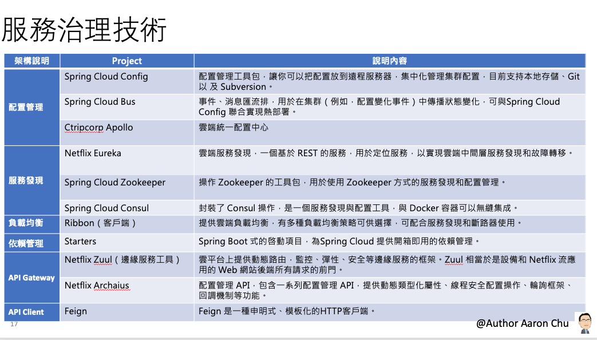

# Spring Cloud 服務治理技術架構

# 課程大綱

| 主題 | 框架  |日期  |
| --- | --- | --- |
| 分散式系統架構（一）| 服務註冊及發現 | 2019/11/21 |
| 分散式系統架構（二）| 客戶端附載均衡 | |
| 分散式系統架構（三）| 申明式服務調用 | |
| 分散式系統架構（四）| 熔斷/容錯管理 |  |
| 分散式系統架構（五）| 邊緣服務 |  |
| 分散式系統架構（六）| 配置管理 |  |
| 分散式系統架構（七）| 分布式追蹤 |  |
| 分散式系統架構（八）| 安全認證 |  |
| 分散式系統架構（九）| 監控與報警 |  |
| 分散式系統架構（十）| 快取 |  |
| 分散式系統架構（十一）| Elasticsearch |  |
| 分散式系統架構（十二）| Transaction |  |
| 分散式系統架構（十三）| Elastic-Job |  |
| 分散式系統架構（十四）| Sharding |  |

###### 個別服務皆為單一職責

