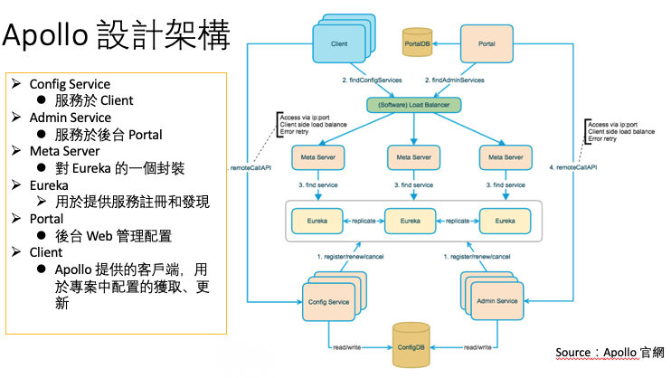
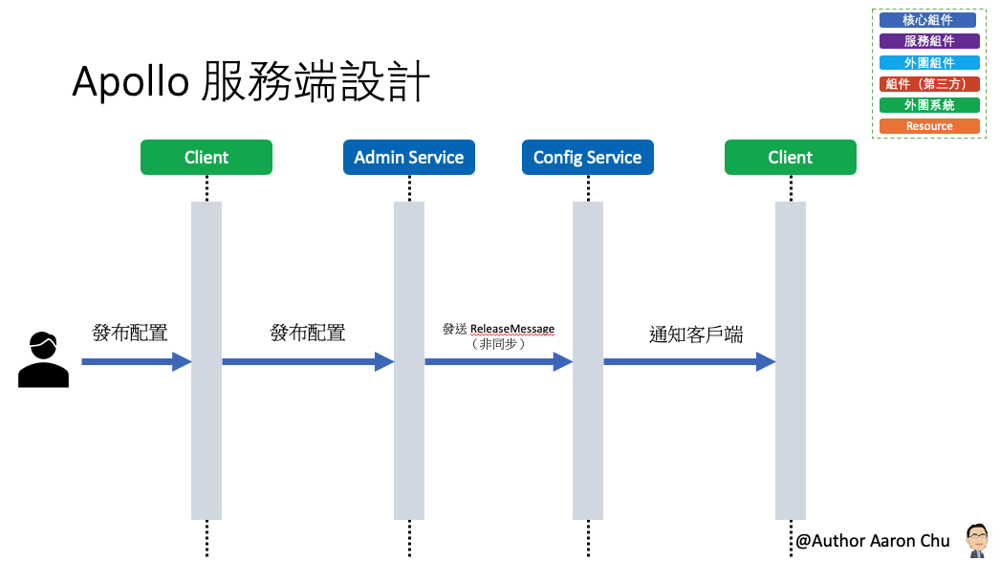
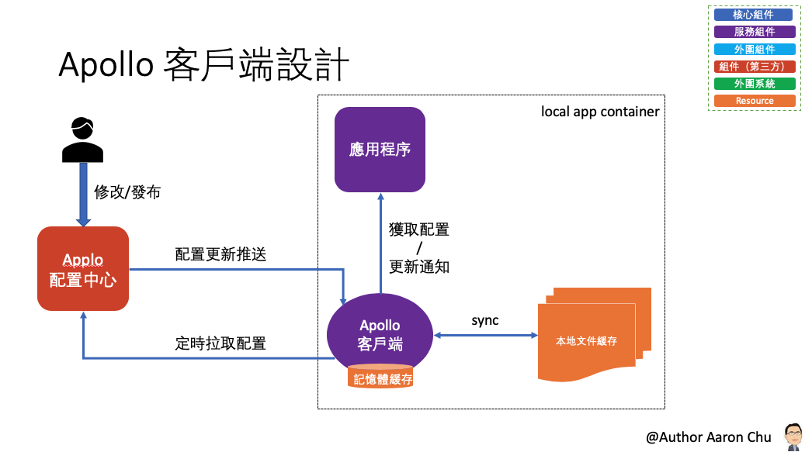
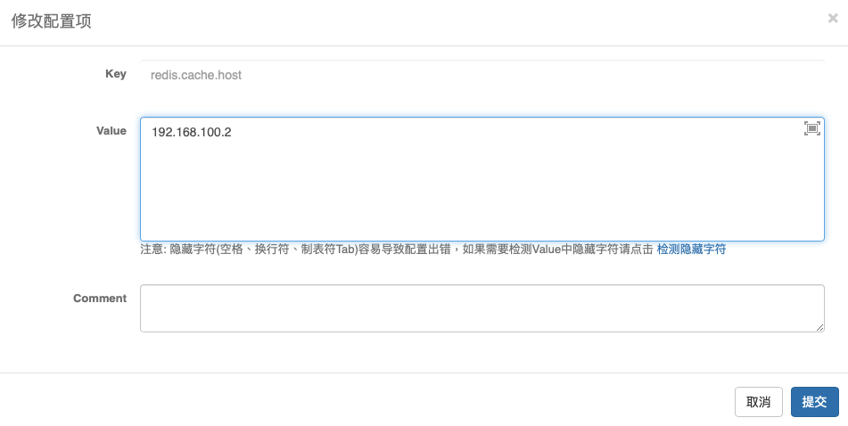

# Apollo：分布式配置中心

###### Apollo（阿波羅）
- Apollo（阿波羅）是攜程框架部門研發的分布式配置中心，能夠集中化管理應用不同環境、不同集群的配置，配置修改後能夠實時推送到應用端，並且具備規範的權限、流程治理等特性，適用於微服務配置管理場景。
- 服務端基於Spring Boot和Spring Cloud開發，打包後可以直接運行，不需要額外安裝Tomcat等應用容器。
- Java客戶端不依賴任何框架，能夠運行於所有Java運行時環境，同時對Spring/Spring Boot環境也有較好的支持。
- .Net客戶端不依賴任何框架，能夠運行於所有.Net運行時環境。

###### Features
- 統一管理不同環境、不同集群的配置
    - Apollo提供了一個統一界面集中式管理不同環境（environment）、不同集群（cluster）、不同命名空間（namespace）的配置。
    - 同一份代碼部署在不同的集群，可以有不同的配置，比如zk的地址等
    - 通過命名空間（namespace）可以很方便的支持多個不同應用共享同一份配置，同時還允許應用對共享的配置進行覆蓋
- 配置修改實時生效（熱發佈）
    - 用戶在Apollo修改完配置併發布後，客戶端能實時（1秒）接收到最新的配置，並通知到應用程序。
- 版本發佈管理
    - 所有的配置發佈都有版本概念，從而可以方便的支持配置的回滾。
- 灰度發佈
    - 支持配置的灰度發佈，比如點了發佈後，只對部分應用實例生效，等觀察一段時間沒問題後再推給所有應用實例。
- 權限管理、發佈審核、操作審計
    - 應用和配置的管理都有完善的權限管理機制，對配置的管理還分為了編輯和發佈兩個環節，從而減少人為的錯誤。
    - 所有的操作都有審計日誌，可以方便的追蹤問題。
- 客戶端配置資訊監控
    - 可以方便的看到配置在被哪些實例使用
- 提供Java和.Net原生客戶端
- 提供開放平台API
    - Apollo自身提供了比較完善的統一配置管理界面，支持多環境、多數據中心配置管理、權限、流程治理等特性。
    - 不過Apollo出於通用性考慮，對配置的修改不會做過多限制，只要符合基本的格式就能夠保存。
    - 在我們的調研中發現，對於有些使用方，它們的配置可能會有比較複雜的格式，如xml, json，需要對格式做校驗。
    - 還有一些使用方如DAL，不僅有特定的格式，而且對輸入的值也需要進行校驗後方可保存，如檢查數據庫、用戶名和密碼是否匹配。
    - 對於這類應用，Apollo支持應用方通過開放接口在Apollo進行配置的修改和發佈，並且具備完善的授權和權限控制
- 部署簡單
    - 配置中心作為基礎服務，可用性要求非常高，這就要求Apollo對外部依賴盡可能地少
    - 目前唯一的外部依賴是MySQL，所以部署非常簡單，只要安裝好Java和MySQL就可以讓Apollo跑起來
    - Apollo還提供了打包腳本，一鍵就可以生成所有需要的安裝包，並且支持自定義運行時參數

Apollo 設計架構

Apollo 服務端設計

Apollo 客戶端設計

Apollo 派送 ReleaseMesage 機制


## 參數
- Spring boot：2.0.6.RELEASE
- Spring cloud：Finchley.SR2
- Java：8
- 專案
    - app-apollo-java：普通 Java 專案使用 Apllo
        - Main：App
        - Group id：com.aaron
        - Artifact id：aaron-apollo-java
        - Version：0.0.1-SNAPSHOT
    - aaron-apollo-springboot：Spring boot 專案使用 Apllo
        - Main：App
        - Group id：com.aaron
        - Artifact id：aron-apollo-springboot
        - Version：0.0.1-SNAPSHOT
    - aaron-apollo-spring-customer：客戶端設計
        - Main：App
        - Group id：com.aaron
        - Artifact id：aaron-apollo-spring-customer
        - Version：0.0.1-SNAPSHOT
- 服務依賴
    - Apollo
        - [安裝 Apollo](../server/Apollo)
    - MySQL
        - [安裝 MySQL](../server/MySQL)


## app-apollo-java：普通 Java 專案使用 Apllo

### 開發
###### 使用 API 獲取配置
- App.java
```
public class App {
    public static void main(String[] args) {
        // 通過 ConfigService 得到 Config 物件
    	Config config = ConfigService.getAppConfig();
        // 指定環境
        System.setProperty("env", "DEV");
        getValue(config);
        addChangeListener(config);
        try {
            Thread.sleep(Integer.MAX_VALUE);
        } catch (InterruptedException e) {
            e.printStackTrace();
        }
    }
    
    private static void addChangeListener(Config config) {
        config.addChangeListener(new ConfigChangeListener() {
            public void onChange(ConfigChangeEvent changeEvent) {
                System.out.println("發生修改數據的命名空間是：" + changeEvent.getNamespace());
                for (String key : changeEvent.changedKeys()) {
                    ConfigChange change = changeEvent.getChange(key);
                    System.out.println(String.format("發現修改 - 配置key: %s, 原來的值: %s, 修改後的值: %s, 操作類型: %s", change.getPropertyName(), change.getOldValue(), change.getNewValue(), change.getChangeType()));
                }
            }
        });
    }
    
    private static void getValue(Config config) {
        String key = "username";
        String defaultValue = "朱郭隆";
        // key 一律小寫
        String username = config.getProperty(key, defaultValue);
        System.out.println("username=" + username);
    }
}
```

### 配置
- pom.xml
```
		<dependency>
			<groupId>com.ctrip.framework.apollo</groupId>
			<artifactId>apollo-client</artifactId>
			<version>1.1.0</version>
		</dependency>
```
- application.properties
```
# Meta Server(Config Service)
apollo.meta=http://localhost:8080
# 應用端身份資訓，是從服務端配置的一個重要資訊。
app.id=SampleApp
```
### 測試


### 維運


## aaron-apollo-springboot：Spring boot 專案使用 Apllo
 
### 開發
###### 啟動類中指定環境
- App.java
```
@SpringBootApplication
public class App {
	public static void main(String[] args) {
		// 指定環境
		System.setProperty("env", "DEV");
		SpringApplication.run(App.class, args);
	}
```
##### Apollo Config 各種配置方式
- pom.xml Apollo Maven 配置
```
		<dependency>
			<groupId>com.ctrip.framework.apollo</groupId>
			<artifactId>apollo-client</artifactId>
			<version>1.1.0</version>
		</dependency>
```

###### Placeholder 注入配置方式
- ConfigController.java
```
	/**
	 * Placeholder 注入配置方式
	 * 用戶名，默認值為 aaron
	 */
	@Value("${username:aaron}")
	private String username;
```

###### Java Config 配置注入方式
- UserConfig.java
```
// 自定義 Apollo 配置類
public class UserConfig {

	@Value("${username:aaron}")
	private String username;	
}
```
- ConfigController.java
```
	// Config 配置注入類
	@Autowired
	private UserConfig userConfig;
```
###### ConfigurationProperties 使用方式
- RedisConfig.java
```
@Data
@Configuration
// 使用 ConfigurationProperties 方式配置有個缺陷，當配置的值發生變化時不會自動更新，而需要手動執行更新邏輯。建議不要使用此種方式。
// 如果配置需要統一加前綴的方式可以用 Java Config 的方式代替。刷新邏輯。建議不要使用此種方式。
@ConfigurationProperties(prefix = "redis.cache")
public class RedisConfig {
    // 配置中心只需要增加 「redis.cache.host = 192.168.100.1」 即可實現注入
	private String host;	
}
```
###### Spring Annotaion 支持：@ApolloConfig、@ApolloConfigChangeListener、@ApolloJsonValue
- ConfigController.java
```
	// 用來自動注入 Apollo Cofig 對象
	@ApolloConfig
	private Config config;

    @GetMapping("/config/getUserName3")
	public String getUserName3() {
		return config.getProperty("username", "aaron");
	}
    
    @ApolloJsonValue("${stus:[]}")
	private List<Student> stus;
    
    // 用來自動註冊 ConfigChangeListener，以監聽監聽配置變化
	@ApolloConfigChangeListener
	private void someOnChange(ConfigChangeEvent changeEvent) {

        if(changeEvent.isChanged("username")) {
		    System.out.println("username 發生修改了");
		}
		if(changeEvent.isChanged("redis.cache.host")) {
		    System.out.println("redis.cache.host 發生修改了");
		}
	}
    
	/** 用來把配置的 JSON 字串自動注入為對象；須定義實體類 Student
     *  配置中心配置的內容如下：
     *  stus = [{"id":1,"name":"jason"}]
     */
	@ApolloJsonValue("${stus:[]}")
	private List<Student> stus;
```
- Student.java
```
// 定義的實體類
@Data
public class Student {
	private int id;
	private String name;
}
```

### 配置
- application.properties
```
server.port=8081
# 身份資訊
app.id=SampleApp
# Meta Server(Config Service)
apollo.meta=http://localhost:8080
# 專案啟動的 bootstrap 階段，項 Spring 容器注入配置資訊 
apollo.bootstrap.enabled=true
# 注入命名空間
apollo.bootstrap.namespaces=application
```
### 測試
###### ConfigurationProperties 使用方式
- 手動調用 REST API 以獲取更新值 `http://localhost:8081/config/getRedisConfig`

記得新增後要執行發布


### 維運


## aaron-apollo-spring-customer：Apollo 客戶端設計

### 開發
###### 啟動時初始化配置到 Spring

- PropertySourcesProcessor.java
```
// 配置初始化邏輯
@Component
public class PropertySourcesProcessor implements BeanFactoryPostProcessor, EnvironmentAware {

	String APOLLO_PROPERTY_SOURCE_NAME = "ApolloPropertySources";
	 
	private ConfigurableEnvironment environment;
	 
	@Override
	public void postProcessBeanFactory(ConfigurableListableBeanFactory beanFactory) throws BeansException {
		// 啓動時初始化配置到Spring PropertySource
		Config config = new Config();
		ConfigPropertySource configPropertySource = new ConfigPropertySource("application", config);
		
		CompositePropertySource composite = new CompositePropertySource(APOLLO_PROPERTY_SOURCE_NAME);
        composite.addPropertySource(configPropertySource);
        
        environment.getPropertySources().addFirst(composite);
	}

	@Override
	public void setEnvironment(Environment environment) {
		this.environment = (ConfigurableEnvironment) environment;
	}
}
```

- Config.java
```
// 配置獲取類
public class Config {
	
	public String getProperty(String key, String defaultValue) {
		if (key.equals("gordianknotName")) {
			return "戈迪安繩結";
		}
		return null;
	}

	public Set<String> getPropertyNames() {
		Set<String> names = new HashSet<>();
		names.add("gordianknotName");
		return names;
	}
}
```

- ConfigPropertySource.java
```
// 配置類轉換成 PropertySource
public class ConfigPropertySource extends EnumerablePropertySource<Config> {

	private static final String[] EMPTY_ARRAY = new String[0];

	ConfigPropertySource(String name, Config source) {
		super(name, source);
	}

	@Override
	public String[] getPropertyNames() {
		Set<String> propertyNames = this.source.getPropertyNames();
		if (propertyNames.isEmpty()) {
			return EMPTY_ARRAY;
		}
		return propertyNames.toArray(new String[propertyNames.size()]);
	}

	@Override
	public Object getProperty(String name) {
		return this.source.getProperty(name, null);
	}

}
```

- ConfigController.java
```
@RestController
public class ConfigController {

	// 在配置文件中增加對應的配置
	@Value("${gordianknotName:aaron}")
	private String name;

	// 在配置文件中增加對應的配置
	@Value("${gordianknotUrl}")
	private String gordianknotUrl;
}
```

- SpringValueProcessor.java
```
// 運行中修改配置資料更新
@Component
public class SpringValueProcessor implements BeanPostProcessor, BeanFactoryAware {
	
	private PlaceholderHelper placeholderHelper = new PlaceholderHelper() ;
	 
	private BeanFactory beanFactory;
	
	public SpringValueRegistry springValueRegistry = new SpringValueRegistry();
	 
	@Override
	public Object postProcessBeforeInitialization(Object bean, String beanName) throws BeansException {
		Class clazz = bean.getClass();
		for (Field field : findAllField(clazz)) {
			processField(bean, beanName, field);
		}
		return bean;
	}

	private void processField(Object bean, String beanName, Field field) {
		// register @Value on field
		Value value = field.getAnnotation(Value.class);
		if (value == null) {
			return;
		}
		Set<String> keys = placeholderHelper.extractPlaceholderKeys(value.value());

		if (keys.isEmpty()) {
			return;
		}

		for (String key : keys) {
			SpringValue springValue = new SpringValue(key, value.value(), bean, beanName, field, false);
			springValueRegistry.register(beanFactory, key, springValue);
		}
	}

	private List<Field> findAllField(Class clazz) {
		final List<Field> res = new LinkedList<>();
		ReflectionUtils.doWithFields(clazz, new ReflectionUtils.FieldCallback() {
			@Override
			public void doWith(Field field) throws IllegalArgumentException, IllegalAccessException {
				res.add(field);
			}
		});
		return res;
	}

	@Override
	public Object postProcessAfterInitialization(Object bean, String beanName) throws BeansException {
		return bean;
	}

	@Override
	public void setBeanFactory(BeanFactory beanFactory) throws BeansException {
		this.beanFactory = beanFactory;
	}
}
```

- SpringValue.java
```
// 將配置資料封裝成一個 SpringValue 存儲到 springValueRegistry 中
public class SpringValue {

  private MethodParameter methodParameter;
  private Field field;
  private Object bean;
  private String beanName;
  private String key;
  private String placeholder;
  private Class<?> targetType;
  private Type genericType;
  private boolean isJson;

  public SpringValue(String key, String placeholder, Object bean, String beanName, Field field, boolean isJson) {
    this.bean = bean;
    this.beanName = beanName;
    this.field = field;
    this.key = key;
    this.placeholder = placeholder;
    this.targetType = field.getType();
    this.isJson = isJson;
    if(isJson){
      this.genericType = field.getGenericType();
    }
  }

  public SpringValue(String key, String placeholder, Object bean, String beanName, Method method, boolean isJson) {
    this.bean = bean;
    this.beanName = beanName;
    this.methodParameter = new MethodParameter(method, 0);
    this.key = key;
    this.placeholder = placeholder;
    Class<?>[] paramTps = method.getParameterTypes();
    this.targetType = paramTps[0];
    this.isJson = isJson;
    if(isJson){
      this.genericType = method.getGenericParameterTypes()[0];
    }
  }

  public void update(Object newVal) throws IllegalAccessException, InvocationTargetException {
    if (isField()) {
      injectField(newVal);
    } else {
      injectMethod(newVal);
    }
  }

  private void injectField(Object newVal) throws IllegalAccessException {
    boolean accessible = field.isAccessible();
    field.setAccessible(true);
    field.set(bean, newVal);
    field.setAccessible(accessible);
  }

  private void injectMethod(Object newVal)
      throws InvocationTargetException, IllegalAccessException {
    methodParameter.getMethod().invoke(bean, newVal);
  }

  public String getBeanName() {
    return beanName;
  }

  public Class<?> getTargetType() {
    return targetType;
  }

  public String getPlaceholder() {
    return this.placeholder;
  }

  public MethodParameter getMethodParameter() {
    return methodParameter;
  }

  public boolean isField() {
    return this.field != null;
  }

  public Field getField() {
    return field;
  }

  public Type getGenericType() {
    return genericType;
  }

  public boolean isJson() {
    return isJson;
  }

  @Override
  public String toString() {
    if (isField()) {
      return String
          .format("key: %s, beanName: %s, field: %s.%s", key, beanName, bean.getClass().getName(), field.getName());
    }
    return String.format("key: %s, beanName: %s, method: %s.%s", key, beanName, bean.getClass().getName(),
        methodParameter.getMethod().getName());
  }
}
```

- SpringValueRegistry.java
```
// SpringValueRegister 利用 Map 來存儲
public class SpringValueRegistry {
	private final Map<BeanFactory, Multimap<String, SpringValue>> registry = Maps.newConcurrentMap();
	private final Object LOCK = new Object();

	public void register(BeanFactory beanFactory, String key, SpringValue springValue) {
		if (!registry.containsKey(beanFactory)) {
			synchronized (LOCK) {
				if (!registry.containsKey(beanFactory)) {
					registry.put(beanFactory, LinkedListMultimap.<String, SpringValue>create());
				}
			}
		}

		registry.get(beanFactory).put(key, springValue);
	}

	public Collection<SpringValue> get(BeanFactory beanFactory, String key) {
		Multimap<String, SpringValue> beanFactorySpringValues = registry.get(beanFactory);
		if (beanFactorySpringValues == null) {
			return null;
		}
		return beanFactorySpringValues.get(key);
	}
}
```

- ConfigController.java
```
// 模擬配置修改
@RestController
public class ConfigController {

	@GetMapping("/get")
	public String get() {
		return name + gordianknotUrl;
	}

	// 通過調用 「/update」 接口，然後在執行前面的 /get 接口，就可以看到內容已改為新的資料。此為動態修改
	@GetMapping("/update")
	public String update(String value) {
		Collection<SpringValue> targetValues = springValueProcessor.springValueRegistry.get(beanFactory,
				"gordianknotName");
		for (SpringValue val : targetValues) {
			try {
				val.update(value);
			} catch (IllegalAccessException | InvocationTargetException e) {
				e.printStackTrace();
			}
		}
		return name;
	}
}
```

### 配置
- application.properties
```
server.port=8081
gordianknotName=xxx
gordianknotUrl=https://agilego99.blogspot.com
```

### 測試

### 維運