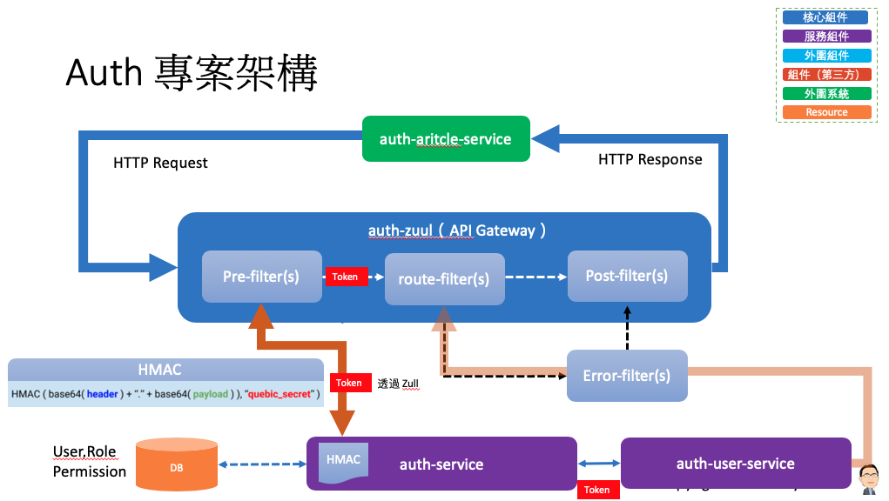
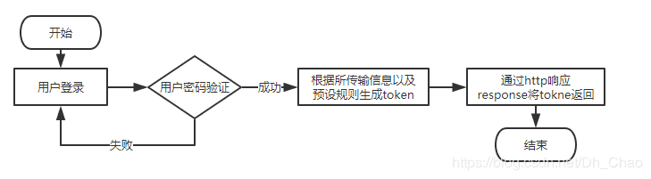
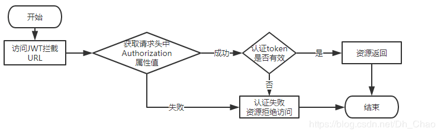
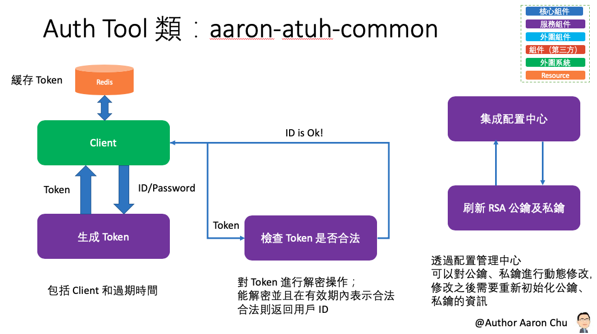
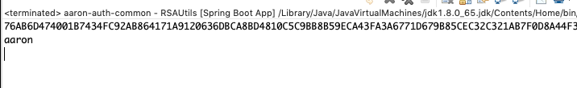
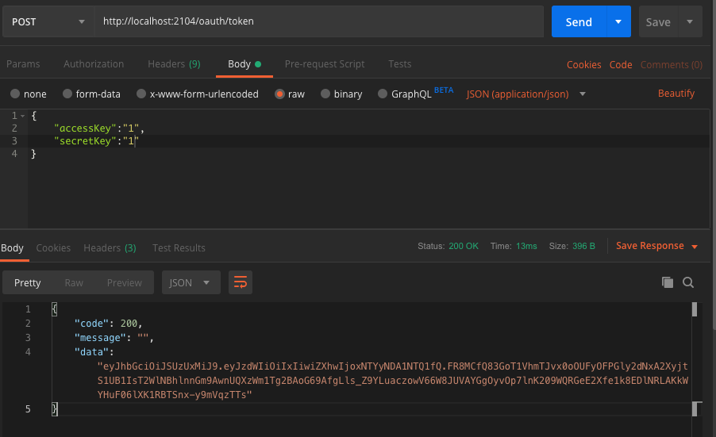
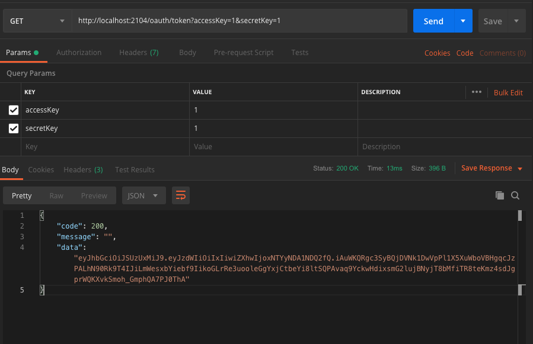

# Auth：微服務之間調用的安全認證


##### 在微服務架構下對服務之間的調用做安全認證；從 API 網關轉發過來的認證。
###### 本專案使用到的關鍵技術：
- Zull：API 網關，提供路由轉發、請求過濾等功能；簡化客戶端調用複雜度
- Feign：一種申明式的 REST 客戶端，讓 REST 調用更加簡單。
    - 調用前統一申請 Token 傳遞到調用的服務中
- JWT：用戶提供帳號/密碼給認證伺服器，服務器驗證用戶提交資料資料的合法性；如果驗證成功，會產生並返回一個 Token，用戶可以用這個 Token 訪問服務器上受保護的資源。

資料來源：https://www.jianshu.com/p/430cd44a2796?utm_campaign=hugo&utm_medium=reader_share&utm_content=note

資料來源：https://www.jianshu.com/p/430cd44a2796?utm_campaign=hugo&utm_medium=reader_share&utm_content=note

##### JWT 分成三部分組成：Header + Payload + Signature
- `token = encodeBase64(header) + '.' + encodeBase64(payload) + '.' + encodeBase64(signature)`

## 參數
- Spring boot：2.0.6.RELEASE
- Spring cloud：Finchley.SR2
- Java：8
- 專案
    - aaron-auth-common：認證服務工具類
        - Main：RSAUtils
        - Group id：com.aaron
        - Artifact id：aaron-auth-article-service
        - Version：1.0
    - aaron-auth-service：認證調用服務
        - Main：AuthApplication
        - Group id：com.aaron
        - Artifact id：aaron-auth-service
        - Version：1.0
    - aaron-auth-zull：認證轉發網關
        - Main：App
        - Group id：com.aaron
        - Artifact id：aaron-auth-zuul
        - Version：0.0.1-SNAPSHOT
    - aaron-auth-article-service：服務的消費者
        - Main：App
        - Group id：com.aaron
        - Artifact id：aaron-auth-article-service
        - Version：0.0.1-SNAPSHOT
    - aaron-auth-user-service：服務的提供者
        - Main：App
        - Group id：com.aaron
        - Artifact id：aaron-auth-service
        - Version：0.0.1-SNAPSHOT
- 服務依賴（啟動順序）
    - aaron-eureka-server
    - aaron-auth-service
    - aaron-auth-article-service
    - aaron-auth-user-service
    - aaron-auth-zull

## aaron-auth-common：認證服務工具類

###### 工具類進行認證主要有以下幾種方法：
- 生成 Token
- 檢查 Token 是否合法
- 刷新 RSA 公鑰及私鑰


### 開發

###### 獲取 Token
- JWTUtils.java
```
...
 	/**
 	* 獲取Token
 	* @param uid 用戶ID
 	* @param exp 失效時間，單位分鐘
 	* @return
 	*/
 	public static String getToken(String uid, int exp) {
 		long endTime = System.currentTimeMillis() + 1000 * 60 * exp;
 		return Jwts.builder().setSubject(uid).setExpiration(new Date(endTime))
 				.signWith(SignatureAlgorithm.RS512, priKey).compact();
 	}
...
```
###### 檢查 Token 是否合法
- JWTUtils.java
```
 	/**
 	* 檢查Token是否合法
 	* @param token
 	* @return JWTResult
 	*/
 	public JWTResult checkToken(String token) {
 		try {
 			Claims claims = Jwts.parser().setSigningKey(pubKey).parseClaimsJws(token).getBody();
 			String sub = claims.get("sub", String.class);
 			return new JWTResult(true, sub, "合法請求", ResponseCode.SUCCESS_CODE.getCode());
 		} catch (ExpiredJwtException e) {
 			// 在解析 JWT 字串時，如果‘過期時間字段’已經早於當前時間，將會拋出ExpiredJwtException異常，說明本次請求已經失效
 			return new JWTResult(false, null, "token已過期", ResponseCode.TOKEN_TIMEOUT_CODE.getCode());
 		} catch (SignatureException e) {
 			// 在解析 JWT 字串時，如果密鑰不正確，將會解析失敗，拋出SignatureException異常，說明該JWT字符串是偽造的
 			return new JWTResult(false, null, "非法請求", ResponseCode.NO_AUTH_CODE.getCode());
 		} catch (Exception e) {
 			return new JWTResult(false, null, "非法請求", ResponseCode.NO_AUTH_CODE.getCode());
 		}
 	}
```
###### 認證過濾器
- HttpBasicAuthorizeFilter.java
```
/**
 * 認證過濾器；下述的 Filter 類中對所有請求進行攔截，其調用之前的 JwtUtils 來檢查 Token 是否合法，合法則放行，不合法則攔截，並回應適當的資訊。
 * API 調用權限控制
 * @author aaron
 *
 */
public class HttpBasicAuthorizeFilter implements Filter {
 	JWTUtils jwtUtils = JWTUtils.getInstance();
 	@Override
 	public void init(FilterConfig filterConfig) throws ServletException {
 		
 	}
 	@Override
 	public void doFilter(ServletRequest request, ServletResponse response, FilterChain chain)
 			throws IOException, ServletException {
 		HttpServletRequest httpRequest = (HttpServletRequest)request;
 		HttpServletResponse httpResponse = (HttpServletResponse) response; 
        httpResponse.setCharacterEncoding("UTF-8");   
        httpResponse.setContentType("application/json; charset=utf-8");
        String auth = httpRequest.getHeader("Authorization");
        //驗證TOKEN
 		if (!StringUtils.hasText(auth)) {
 			PrintWriter print = httpResponse.getWriter();
 			print.write(JsonUtils.toJson(ResponseData.fail("非法請求【缺少Authorization信息】", ResponseCode.NO_AUTH_CODE.getCode())));
 			return;
 		}
 		JWTUtils.JWTResult jwt = jwtUtils.checkToken(auth);
 		if (!jwt.isStatus()) {
 			PrintWriter print = httpResponse.getWriter();
 			print.write(JsonUtils.toJson(ResponseData.fail(jwt.getMsg(), jwt.getCode())));
 			return;
 		}
 		chain.doFilter(httpRequest, response);
 	}
 	
 	@Override
 	public void destroy() {
 		
 	}
}
```

### 配置
- pom.xml
```
		<!-- JSON Web Token  -->
		<dependency>
			<groupId>io.jsonwebtoken</groupId>
			<artifactId>jjwt</artifactId>
			<version>0.7.0</version>
		</dependency>
```
- application.properties
```
spring.application.name=aaron-auth-service
server.port=2104
```
### 測試
###### 


### 維運


## aaron-auth-service：認證調用服務


### 開發
###### 認證接口
- AuthController.java
```
public class AuthController {
 	
 	@Autowired
 	private AuthService authService;
 	
 	/**
 	 * 認證接口；用於調用方式將行認證時，認證通過則返回一個加密的 Token 給對方，對方就可以用這個 Token 去請求別的服務。
 	 * Post 方法
 	 * @param query
 	 * @return
 	 * @throws Exception
 	 */
 	@PostMapping("/token")
 	public ResponseData auth(@RequestBody AuthQuery query) throws Exception {
 		if (StringUtils.isBlank(query.getAccessKey()) || StringUtils.isBlank(query.getSecretKey())) {
 			return ResponseData.failByParam("accessKey and secretKey not null");
 		}
 		
 		User user = authService.auth(query);
 		if (user == null) {
 			return ResponseData.failByParam("認證失敗");
 		}
 		
 		
 		JWTUtils jwt = JWTUtils.getInstance();
 		return ResponseData.ok(jwt.getToken(user.getId().toString()));
 	}
 	
 	/**
 	 * 認證接口；用於調用方式將行認證時，認證通過則返回一個加密的 Token 給對方，對方就可以用這個 Token 去請求別的服務。
 	 * Get 方法
 	 * @param query
 	 * @return
 	 * @throws Exception
 	 */
 	@GetMapping("/token")
 	public ResponseData oauth(AuthQuery query) throws Exception {
 		if (StringUtils.isBlank(query.getAccessKey()) || StringUtils.isBlank(query.getSecretKey())) {
 			return ResponseData.failByParam("accessKey and secretKey not null");
 		}
 		User user = authService.auth(query);
 		if (user == null) {
 			return ResponseData.failByParam("認證失敗");
 		}
 		JWTUtils jwt = JWTUtils.getInstance();
 		return ResponseData.ok(jwt.getToken(user.getId().toString()));
 	} 	
}
```

### 配置
- pom.xml
```
		<!-- JSON Web Token  -->
		<dependency>
			<groupId>io.jsonwebtoken</groupId>
			<artifactId>jjwt</artifactId>
			<version>0.7.0</version>
		</dependency>
```
- application.properties
```
spring.application.name=aaron-auth-service
server.port=2104
```
### 測試

### 維運
- 服務接口 
```
POST http://localhost:2104/oauth/token
GET http://localhost:2104/oauth/token
```


        
## aaron-auth-zull

### 開發
###### 服務消費方式申請 Token
- AuthRemoteClient.java 調用前獲取 Token
```
/** 
 * 認證服務API調用客戶端  
 * @author aaron 
 *
 **/
@FeignClient(value = "aaron-auth-service", path = "/oauth")
public interface AuthRemoteClient {
 	
  /**     
   * 調用認證,獲取token     
   * @param query     
   * @return    
   */
   @PostMapping("/token")
   ResponseData auth(@RequestBody AuthQuery query);
  
}
```
- TokenScheduledTask.java 定時刷新 Token；可搭配本地或者緩存至 Redis
```
public class TokenScheduledTask {
 	private static Logger logger = LoggerFactory.getLogger(TokenScheduledTask.class);
 	// 若 Token 有效期為 24h，則可以間隔 20h 刷新一次來確保調用的正確性
 	public final static long ONE_Minute = 60 * 1000 * 60 * 20;
 	@Autowired
 	private AuthRemoteClient authRemoteClient;
 	/**
 	* 刷新Token
 	*/
 	@Scheduled(fixedDelay = ONE_Minute)
 	public void reloadApiToken() {
 		String token = this.getToken();
 		while (StringUtils.isBlank(token)) {
 			try {
 				Thread.sleep(1000);
 				token = this.getToken();
 			} catch (InterruptedException e) {
 				logger.error("", e);
 			}
 		}
 		System.setProperty("fangjia.auth.token", token);
 		logger.info("申請token成功 :{}", token);
 	}
 	public String getToken() {
 		AuthQuery query = new AuthQuery();
 		query.setAccessKey("1");
 		query.setSecretKey("1");
 		ResponseData response = authRemoteClient.auth(query);
 		System.err.println("透過 TokenScheduledTask 取得 Token");
 		return response.getData() == null ? "" : response.getData().toString();
 	}
}
```

###### Zuul 中傳遞 Token 到路由的服務中：服務之間接口調用的安全認證是通過 Feign 的請求攔截器統一在請求頭中添加 Token 資訊，實現認證調用。還有一種調用方式也是需要進行認證，就是 API Gateway 轉發到具體的服務，這時候就無法採用 Feign。一種做法是在 Zuul pre 過濾器做這件事，在路由之前將 Token 資訊添加到請求表頭中，然後在將請求轉發到具體的服務上。
- AuthHeaderFilter.java
```
/**
 * 調用服務前添加認證請求頭過濾器
 * Zuul 中傳遞 Token 到路由的服務中
 *
 * @author aaron
 *
 **/
public class AuthHeaderFilter extends ZuulFilter {
 	public AuthHeaderFilter() {
 		super();
 	}
 	@Override
 	public boolean shouldFilter() {
 		RequestContext ctx = RequestContext.getCurrentContext();
 		Object success = ctx.get("isSuccess");
 		return success == null ? true : Boolean.parseBoolean(success.toString());
 	}
 	@Override
 	public String filterType() {
 		return "pre";
 	}
 	@Override
 	public int filterOrder() {
 		return 1;
 	}
 	@Override
 	public Object run() {
 		RequestContext ctx = RequestContext.getCurrentContext();
 		System.err.println("Zull 請求過濾器");
 		ctx.addZuulRequestHeader("Authorization", System.getProperty("fangjia.auth.token"));
 		return null;
 	}
}
```

### 配置
- application.properties
```
server.port=2103
```
### 測試

### 維運


## aaron-auth-article-service：服務的消費者

### 開發
###### 服務消費方式申請 Token
- AuthRemoteClient.java 調用前獲取 Token
```
/** 
 * 認證服務API調用客戶端  
 * @author aaron 
 *
 **/
@FeignClient(value = "aaron-auth-service", path = "/oauth")
public interface AuthRemoteClient {
 	
  /**     
   * 調用認證,獲取token     
   * @param query     
   * @return    
   */
   @PostMapping("/token")
   ResponseData auth(@RequestBody AuthQuery query);
  
}
```
- TokenScheduledTask.java 定時刷新 Token；可搭配本地或者緩存至 Redis
```
public class TokenScheduledTask {
 	private static Logger logger = LoggerFactory.getLogger(TokenScheduledTask.class);
 	// 若 Token 有效期為 24h，則可以間隔 20h 刷新一次來確保調用的正確性
 	public final static long ONE_Minute = 60 * 1000 * 60 * 20;
 	@Autowired
 	private AuthRemoteClient authRemoteClient;
 	/**
 	* 刷新Token
 	*/
 	@Scheduled(fixedDelay = ONE_Minute)
 	public void reloadApiToken() {
 		String token = this.getToken();
 		while (StringUtils.isBlank(token)) {
 			try {
 				Thread.sleep(1000);
 				token = this.getToken();
 			} catch (InterruptedException e) {
 				logger.error("", e);
 			}
 		}
 		System.setProperty("fangjia.auth.token", token);
 		logger.info("申請token成功 :{}", token);
 	}
 	public String getToken() {
 		AuthQuery query = new AuthQuery();
 		query.setAccessKey("1");
 		query.setSecretKey("1");
 		ResponseData response = authRemoteClient.auth(query);
 		System.err.println("透過 TokenScheduledTask 取得 Token");
 		return response.getData() == null ? "" : response.getData().toString();
 	}
}
```

###### Feign 調用前統一申請 Token 傳遞到調用的服務中
－ 當配置好一切，此後在調用業務接口之前先調用認證接口，然後將獲取到的 Token 設置到環境變數中，通過 System.getProperty("fangjia.auth.token") 獲取需要傳遞的 Token。
- FeignBasicAuthRequestInterceptor.java 定義攔截器
```
/**
 * Feign 請求攔截器
 *
 * @author aaron
 *
 **/
public class FeignBasicAuthRequestInterceptor implements RequestInterceptor {
 	public FeignBasicAuthRequestInterceptor() {
 		
 	}
 	@Override
 	public void apply(RequestTemplate template) {
 		System.err.println("Feign請求攔截器");
 		template.header("Authorization", System.getProperty("fangjia.auth.token"));
 	}
}
```
-  FeignBasicAuthRequestInterceptor.java 配置攔截器
```
	/**
	 * 日誌級別
	 */
	@Bean
	Logger.Level feignLoggerLevel(){
		return Logger.Level.FULL;
	}
	
	/**
     * 創建Feign請求攔截器，在發送請求前設置認證的token,各個微服務將token設置 到環境變量中來達到通用
     *
     * @return
     */
    @Bean
    public FeignBasicAuthRequestInterceptor basicAuthRequestInterceptor() {
        return new FeignBasicAuthRequestInterceptor();
    }
}
```
###### RestTemplate 調用前統一申請 Token 傳遞到調用的服務中
－ 如果專案中用的 RestTemplate 來調用服務提供的接口，可以利用 RestTemplate 的攔截器來傳遞 Token。
- TokenInterceptor.java 攔截器傳遞 Token
```
/**
 * RestTemplate攔截器，傳遞認證的Token
 * @author aaron
 *
 */
@Component
public class TokenInterceptor implements ClientHttpRequestInterceptor {
 	@Override
 	public ClientHttpResponse intercept(HttpRequest request, byte[] body, ClientHttpRequestExecution execution)
 			throws IOException {
 		System.err.println("進入RestTemplate攔截器");
 		HttpHeaders headers = request.getHeaders();
 	    headers.add("Authorization", System.getProperty("fangjia.auth.token"));
 	    return execution.execute(request, body);
 	}
}
```
- BeanConfiguration.java 配置 RestTemplate 攔截器
```
/**
 * 配置 RestTemplate 攔截器
 * @author Aaron
 *
 */
@Configuration
public class BeanConfiguration {

	@Autowired
	private TokenInterceptor tokenInterceptor;
	
	@Bean
	@LoadBalanced
	public RestTemplate getRestTemplate() {
		RestTemplate restTemplate = new RestTemplate();
		restTemplate.setInterceptors(Collections.singletonList(tokenInterceptor));
		return restTemplate;
	}
}
```

### 配置
- application.properties
```
spring.application.name=aaron-auth-article-service
server.port=8082
```
### 測試

### 維運
- 服務接口 
    - 內部方式為 RestTemplate `http://localhost:8082/article/callHello`
    - 內部方式為 Feign `http://localhost:8082/article/callHello2`   

## aaron-auth-user-service：服務的提供者

### 開發

### 配置
- application.properties
```
spring.application.name=aaron-auth-user-service
server.port=8083
```
### 測試


### 維運
- 服務接口 `http://localhost:8083/user/hello`