# Cache

##### 緩存有很多種，可以存在客戶端，也可以存在服務端。本章主要是以採服務端的方式並搭配實例來說明。
###### 在日常的開發中，獲取資料可能特別耗時，頻繁存取資料庫會導致 I/O 和 CPU 負載過高；緩解的方法就是將資料緩存在記憶體內。


## 參數
- Spring boot：2.0.6.RELEASE
- Spring cloud：Finchley.SR2
- Java：8
- 專案
    - aaron-cache-guava：客戶端緩存
        - Main：App
        - Group id：com.aaron
        - Artifact id：aaron-cache-data-redis
        - Version：0.0.1-SNAPSHOT
    - aaron-cache-data-redis：服務端緩存
        - Main：
            - App
            - MyBloomFilter （BloomFilter 過濾器）
        - Group id：com.aaron
        - Artifact id：aaron-cache-guava
        - Version：0.0.1-SNAPSHOT
    
- 服務依賴
    - Redis
        - [安裝 Redis](../server/Redis)
    - Redisson 

## aaron-cache-guava：客戶端緩存

##### Guava Cache 本地緩存模組
###### Guava Cache 是一個全記憶式本地緩存，是一個本地緩存的不二之選，因其簡單易用，性能好。
###### Guava Cache 優缺點：
| 優點 |缺點  |
| --- | --- |
| 本地緩存，讀取效率高，不受網路影響 | 不能持久化資料   |
| 擁有豐富的功能，操作簡單|單機緩存，受機器設備記憶體限制，系統重啟資料即丟失|
|執行緒安全|分散式部署時無法保證資料的一致性|

### 開發

##### Guava Cache 本地緩存
- App.java CacheBuilder 使用
```
public class App {
	public static void main(String[] args) {
		final PersonDao dao = new PersonDao();
		/**
		 * 建構緩存物件
		 * 設置寫入資料1秒後過期
		 */
		LoadingCache<String, Person> cahceBuilder = CacheBuilder.newBuilder().expireAfterWrite(1, TimeUnit.SECONDS)
				.build(new CacheLoader<String, Person>() {
					@Override
					/**
					 * 加載資料庫的資料
					 */
					public Person load(String key) throws Exception {
						return dao.findById(key);
					}
				});
		
		try {
			for(;;) {
				/**
				 * 通過 CacheBuilder 物件的 get 方法獲取資料。
				 * 如果緩存存在資料則以緩存的資料返回，如果緩存不存在對應的資料則執行 load 中的邏輯，從資料庫中查詢資料並緩存
				 */
				Person person = cahceBuilder.get("1");
				System.out.println(person.getName());
				Thread.sleep(200);
			}
		} catch (Exception e) {
			e.printStackTrace();
		}
	}
}
```
##### 回收策略
###### CacheBuilder 提供了顯示移除的三種方式：
| 方式 |效果|
| --- | --- |
| CacheBuilder.invalidate(key) |單個移除  |
| CacheBuilder.invalidateAll(key) | 批次移除 |
| CacheBuilder.invalidateAll() | 移除全部 |

- 回收策略
```
 CacheBuilder.newBuilder()
     .expireAfterWrite(1, TimeUnit.MINUTES)
     .expireAfterAccess(1, TimeUnit.MINUTES)
```
- 緩存容量
```
Cacheuilder.newBuilder().maximumSize(10)
```

### 配置
- pom.xml
```
	    <!-- Guava Maven 依賴 -->
		<dependency>
			<groupId>com.google.guava</groupId>
			<artifactId>guava</artifactId>
			<version>15.0</version>
		</dependency>
```

### 測試

##### Guava Cache 本地緩存
###### 啟動主程式
###### 因緩存失效時間設為1秒，即緩存失效後，重新至資料庫存取新值，並寫至緩存內供再次查詢時使用
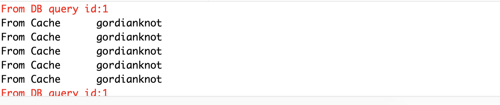

### 維運

## aaron-cache-data-redis：服務端緩存

##### Redis 是一個高性能的 Key-Value 資料庫，同時支持多種存儲類型，包括 String、List、Set、Zset（sortedset 有序集合）和 Hash。

### 開發
##### 用 Redistemplate 操作 Redis
###### 在 Java 中操作 Redis 可以用 Jedis，也可以用 Spring Data Redis。Spring Data Redis 也是基於 Jedis，他在 Jedis 上面封裝了一層，讓操作 Redis 更加簡單。
###### Redistemplate 是一個泛型類，可以指定 Key 和 Value 的類型。
- CacheController.java 注入 StringRedisTemplate
```
 	@Autowired
 	private StringRedisTemplate stringRedisTemplate;
```
- CacheController.java StringRedisTemplate 設置緩存
```
 		// 設置緩存
 		stringRedisTemplate.opsForValue().set("key", " Gordianknot ", 1, TimeUnit.HOURS);
```
- CacheController.java StringRedisTemplate 獲取緩存
```
 		// 獲取緩存
 		String value = stringRedisTemplate.opsForValue().get("key");

```
- CacheController.java StringRedisTemplate 刪除緩存
```
 		// 刪除緩存
 		stringRedisTemplate.delete("key");
```
- CacheController.java StringRedisTemplate 獲取 RedisConnection
```

 		// 除了使用封裝好的方法，也可以用底層的方法操作，通過 StrinngRedisTemplate 可以拿到 RedisConnection
 		RedisConnection connection = stringRedisTemplate.getConnectionFactory().getConnection();
```

##### 用 Repository 操作 Redis
###### 舉凡 Spring Data 系列框架，都是一種風格。可以讓我們用Repository 方式操作資料。
- Person.java 資料實體類定義
```
@Data
@RedisHash("persons")
public class Person {
	@Id
	String id;
	String firstname;
	String lastname;
}
```
- PersonRepository.java Repository 定義 
```
@Repository
public interface PersonRepository extends CrudRepository<Person, String> {

}
```
- CacheController.java 測試操作資料
```
    @Autowired
 	PersonRepository repo;

 	@GetMapping("/test2")
 	public void basicCrudOperations() {
 		Person person = new Person();
 		person.setFirstname("Aaron");
 		person.setLastname("Chu");
 		repo.save(person);
 		Optional<Person> personObj = repo.findById(person.getId());
 		System.err.println(personObj.get().getFirstname());
 		System.err.println(repo.count());
 		repo.delete(person); // 若需要在 Redis 工具上觀察，需註解本行程式碼
 	}
```

##### Spring Cache 緩存資料
###### 一般的緩存邏輯，結合業務邏輯；首先先判斷是否有資料，有就獲取資料返回，沒有就從資料庫中查詢。
###### 這種方式可透過 Sping Cache 解決這個問題。我們不需要關心緩存的邏輯，只需要關注從資料庫中查詢資料，將緩存的邏輯交給框架來實現。
###### Sping Cache 利用註解方式來實現資料的緩存，還具備相當的靈活性，能夠使用 SpEL（Sping Expression Language）來定義緩存的 Key，還能定義多種條件是判斷。

###### Sping Cache 常用的註解

|註解|說明|
| --- | --- |
| @Cacheable | 將主要針對方法配置，能夠根據方法的請求參數對其進行緩存  |
| @CachePut | 如保證方法被調用，又希望結果被緩存。與 @Cacheable 區別在於是否每次都調用方法，常用於更新 |
|@CacheEvict|清空緩存|
- RedisConfig.java Redistemplate 配置
```
@Configuration
@EnableCaching
public class RedisConfig {

	// RedisTemplate 配置
	@Bean
	public RedisTemplate<String, String> redisTemplate(RedisConnectionFactory factory) {
		RedisTemplate<String, String> redisTemplate = new RedisTemplate<String, String>();
		redisTemplate.setConnectionFactory(factory);
		redisTemplate.afterPropertiesSet();
		setSerializer(redisTemplate);
		return redisTemplate;
	}

    // 配置序列化方式
	private void setSerializer(RedisTemplate<String, String> template) {
		Jackson2JsonRedisSerializer jackson2JsonRedisSerializer = new Jackson2JsonRedisSerializer(Object.class);
		ObjectMapper om = new ObjectMapper();
		om.setVisibility(PropertyAccessor.ALL, JsonAutoDetect.Visibility.ANY);
		om.enableDefaultTyping(ObjectMapper.DefaultTyping.NON_FINAL);
		jackson2JsonRedisSerializer.setObjectMapper(om);
		// 設置序列化方式為 JSON
		template.setKeySerializer(new StringRedisSerializer());
		template.setValueSerializer(jackson2JsonRedisSerializer);
	}
}    
```
- RedisConfig.java CacheManager 配置
```
	// 設置緩存過期時間
	@Bean
	public CacheManager cacheManager(RedisConnectionFactory factory) {
		RedisCacheConfiguration cacheConfiguration = RedisCacheConfiguration.defaultCacheConfig()
				.entryTtl(Duration.ofDays(1)).disableCachingNullValues()
				.serializeValuesWith(RedisSerializationContext.SerializationPair
						.fromSerializer(new GenericJackson2JsonRedisSerializer()));
		return RedisCacheManager.builder(factory).cacheDefaults(cacheConfiguration).build();
	}
```
- RedisConfig.java KeyGenerator 配置
```
/**
	 *  配置 Key 自動產生方式，確保 Key 唯一性
	 *  規則為 類名＋方法＋參數來產生緩存的 Key
	 */
	
	@Bean
	public KeyGenerator keyGenerator() {
		return new KeyGenerator() {
			@Override
			public Object generate(Object target, Method method, Object... params) {
				StringBuilder sb = new StringBuilder();
				sb.append(target.getClass().getName());
				sb.append(":" + method.getName());
				for (Object obj : params) {
					sb.append(":" + obj.toString());
				}
				return sb.toString();
			}
		};
	}
```
- PersonServiceImpl.java 透過 SpEL 語法生成 Key
```

	// #id 是 SpEL 語法，通過參數名來定義緩存 Key
	@Cacheable(value = "get", key = "#id")
	public Person get(String id) {
		Person p = new Person();
		p.setFirstname("Aaron");
		p.setLastname("Chu");
		p.setId("111");
		return p;
	}
``` 
- PersonServiceImpl.java 透過 KeyGenerator 生成 Key
```
	// 透過 KeyGenerator 自動生成緩存的 Key，指定 keyGenerator 就不需要配置 Key
	@Cacheable(value = "get2", keyGenerator = "keyGenerator")
	public Person get2(String id) {
		Person p = new Person();
		p.setFirstname("Ray");
		p.setLastname("Chu");
		p.setId("222");
		return p;
	}
```

##### 緩存異常處理
###### 緩存只是一種輔助的手段，就算不可用，也不能影響正常的業務邏輯。因此，因應緩存發生異常時，透過異常捕捉來解決這個問題。
- CacheAutoConfiguration.java 緩存異常處理
```
@Configuration
public class CacheAutoConfiguration extends CachingConfigurerSupport {
 	private Logger logger = LoggerFactory.getLogger(CacheAutoConfiguration.class);
 	/**
    * 透過以下的處理，即使 Redis 發生異常，系統連接不上也會因此影影響業務功能，而是會繼續查詢資料庫相關操作。
 	* Redis 數據操作異常處理 這裡的處理：在日誌中打印出錯誤信息，但是放行
 	* 保證 Redis 服務器出現連接等問題的時候不影響程序的正常運行，使得能夠出問題時不用緩存,繼續執行業務邏輯去查詢DB 
 	*/
 	@Bean
 	public CacheErrorHandler errorHandler() {
 		CacheErrorHandler cacheErrorHandler = new CacheErrorHandler() {
 			@Override
 			public void handleCacheGetError(RuntimeException e, Cache cache, Object key) {
 				logger.error("redis異常：key=[{}]", key, e);
 			}
 			@Override
 			public void handleCachePutError(RuntimeException e, Cache cache, Object key, Object value) {
 				logger.error("redis異常：key=[{}]", key, e);
 			}
 			@Override
 			public void handleCacheEvictError(RuntimeException e, Cache cache, Object key) {
 				logger.error("redis異常：key=[{}]", key, e);
 			}
 			@Override
 			public void handleCacheClearError(RuntimeException e, Cache cache) {
 				logger.error("redis異常：", e);
 			}
 		};
 		return cacheErrorHandler;
 	}
```
##### 自定義緩存工具類
###### 以程式碼層面做緩存控制，取代 Sping Cache 常用的註解方式（如 @Cacheable ...）
- CacheService.java 緩存接口定義
```
/**
 *  自定義緩存工具類
 *  以程式碼層面做緩存控制，取代 Sping Cache 常用的註解方式（如 @Cacheable ...）
 * @author Aaron
 */
public interface CacheService {
 	/**
 	* 設置緩存
 	* @param key      緩存 KEY
 	* @param value    緩存值
 	* @param timeout  緩存過期時間
 	* @param timeUnit 緩存過期時間單位
 	*/
 	public void setCache(String key, String value, long timeout, TimeUnit timeUnit);
 	/**
 	* 獲取緩存
 	* @param key 緩 存 KEY
 	* @return
 	*/
 	public String getCache(String key);
 	public <V, K> String getCache(K key, Closure<V, K> closure);
 	public <V, K> String getCache(K key, Closure<V, K> closure, long timeout, TimeUnit timeUnit);
 	/**
 	* 刪除緩存
 	* @param key 緩 存 KEY
 	*/
 	public void deleteCache(String key);
}
```
- CacheServiceImpl.java 緩存接口實現
```
/**
 *  自定義緩存工具類
 *  以程式碼層面做緩存控制，取代 Sping Cache 常用的註解方式（如 @Cacheable ...）
 * @author Aaron
 */

@Service
public class CacheServiceImpl implements CacheService {
	private Logger logger = LoggerFactory.getLogger(CacheAutoConfiguration.class);
	@Autowired
	private StringRedisTemplate stringRedisTemplate;

	private long timeout = 1L;

	private TimeUnit timeUnit = TimeUnit.HOURS;

	@Override
	public void setCache(String key, String value, long timeout, TimeUnit timeUnit) {
		try {
			stringRedisTemplate.opsForValue().set(key, value, timeout, timeUnit);
		} catch (Exception e) {
			logger.error("",e);
		}
	}

	@Override
	public String getCache(String key) {
		try 
			return stringRedisTemplate.opsForValue().get(key);
		} catch (Exception e) {
			logger.error("",e);
			return null;
		}
	}

	@Override
	public void deleteCache(String key) {
		stringRedisTemplate.delete(key);
	}

	@Override
	public <V, K> String getCache(K key, Closure<V, K> closure) {
		return doGetCache(key, closure, this.timeout, this.timeUnit);
	}

	@Override
	public <V, K> String getCache(K key, Closure<V, K> closure, long timeout, TimeUnit timeUnit) {
		return doGetCache(key, closure, timeout, timeUnit);
	}

	private <K, V> String doGetCache(K key, Closure<V, K> closure, long timeout, TimeUnit timeUnit) {
		String ret = getCache(key.toString());
		if (ret == null) {
			Object r = closure.execute(key);
			setCache(key.toString(), r.toString(), timeout, timeUnit);
			return r.toString();
		}
		return ret;
	}
}
```
- Closure.java 方法回調接口
```
// 方法回調接口，用於執行回調的業務邏輯
public interface Closure<O, I> {
	public O execute(I input);
}
```
- CacheController.java 緩存回調使用
###### 通過這樣的封裝，就不用每個緩存的地方去判斷，當緩存中有值時 getCache 方法會根據 Key 去緩存中獲取值，然後返回，如果沒有則會執行 execute 中的邏輯來獲取資料。
```
 	// 注入緩存回調類，基於 Closure 接口來做
 	@Autowired
 	private CacheService cacheService;
    
    // 緩存回調接口
 	@GetMapping("/getCallback")
 	public String getCallback() {
 		String cacheKey = "1001";
 		return cacheService.getCache(cacheKey, new Closure<String, String>() {
 			@Override
 			public String execute(String id) {
 				// 執行你的業務邏輯
 				return id+"hello";
 			}
 		});
 	}
```

##### 防止緩存穿透方案：使用 BloomFilter
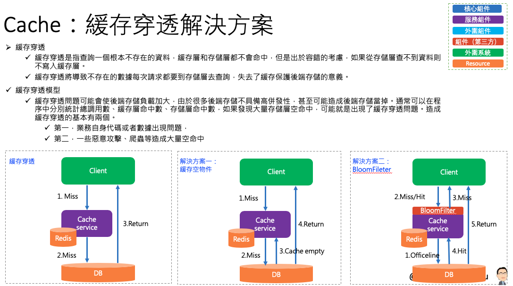
###### 何為緩存穿透
- 緩存穿透是指查詢一個一定不存在的數據，由於緩存是不命中時被動寫的，並且出於容錯考慮，如果從存儲層查不到數據則不寫入緩存，這將導致這個不存在的數據每次請求都要到存儲層去查詢，失去了緩存的意義。在流量大時，可能DB就掛掉了，要是有人利用不存在的key頻繁攻擊我們的應用，這就是漏洞。
###### 解決方法
- 有很多種方法可以有效地解決緩存穿透問題，最常見的則是採用布隆過濾器（Bloom Filter），將所有可能存在的數據哈希到一個足夠大的 bitmap 中，一個一定不存在的數據會被 這個 bitmap 攔截掉，從而避免了對底層存儲系統的查詢壓力。另外也有一個更為簡單粗暴的方法，如果一個查詢返回的數據為空（不管是資料存不存在，還是系統故障），我們仍然把這個空結果進行緩存，但它的過期時間會很短，最長不超過五分鐘。
###### 布隆過濾器
- 布隆過濾器實際上是由一個超長的二進制位數組和一系列的哈希函數組成。二進制位數組初始全部為0，當給定一個待查詢的元素時，這個元素會被一系列哈希函數計算映射出一系列的值，所有的值在位數組的偏移量處置為1。如下圖所示：
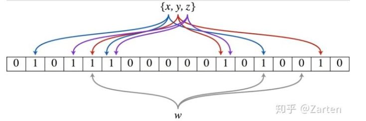
資料來源：https://zhuanlan.zhihu.com/p/50587308
###### 常應用於：
- chrome 用它來做釣魚網站監測
- 在比特幣中用來判斷是不是屬於錢包
- 垃圾郵件監測

###### 如何判斷某個元素是否在這個集合中呢？
- 同樣是這個元素經過哈希函數計算後得到所有的偏移位置，若這些位置全都為1，則判斷這個元素在這個集合中，若有一個不為1，則判斷這個元素不在這個集合中。就是這麼簡單！
- 優點：可以看到就是節省空間，採用位元組，2的32次方=4294967296 可以看到42億長度的位數組佔用 4294967296/8/1024/1024=512MB 只需佔用512MB的記憶體空間
- 缺點：有一定的誤判，有可能把不在這個集合中的誤判為在這個集合中，因為另一個元素經過哈希後各個位置也可能為1，其實把這個位數組的長度縮短為很小（比如10）就不難理解其中的道理。

###### 利用布隆過濾器我們可以預先將緩存的資料預先存在過濾器中，比如 ID。當根據 ID 來查詢資料時，即可知道這是一個非法請求。
- MyBloomFilter.java BloomFilter 使用
```
public class MyBloomFilter {
 	public static void main(String[] args) {
 		// 總數量
 		int total = 1000000;
 		
 		/** 
 		 * loomFilter 預設的錯誤率為 0.03
 		 */
// 		BloomFilter<CharSequence> bf = BloomFilter.create(Funnels.stringFunnel(Charsets.UTF_8), total);
// 		 指定錯誤率 0.0003
 		 BloomFilter<CharSequence> bf = BloomFilter.create(Funnels.stringFunnel(Charsets.UTF_8), total,0.0003);

 		/**
 		 * 初始化 1000000 資料條資料到過濾器中
 		 */
 		for (int i = 0; i < total; i++) {
 			bf.put("" + i);
 		}
 		/**
 		 * 在 1000000 的基礎上在增加 10000 條比對資料，確認是否在過濾器中
 		 */
 		int count = 0;
 		for (int i = 0; i < total + 10000; i++) {
 			if (bf.mightContain("" + i)) {
 				count++;
 			}
 		}
 		System.out.println("BloomFilter 匹配數量 " + count);
 	}
}
```

##### 防止緩存雪崩方案
###### 什麼是緩存雪崩
- 緩存雪崩是指在我們設置緩存時採用了相同的過期時間，導致緩存在某一時刻同時失效，請求全部轉發到 DB，DB 瞬時壓力過重雪崩。
###### 解決方案

| 方案 | 說明 |
| --- | --- |
| 存儲高可用 | 比如 Redis Cluster  |
| 緩存失效的時間要設計好 | 不同的資料有不同的有效期 |
| 熱門資料的持續存取 | 採取定時刷新，避免自動失效 |
| 服務限流和接口限流 |透過總量限流，在反應時間允許的範圍之內 |
| 資料庫獲取緩存需要的資料時加鎖控制 | Jvm 鎖或分布式鎖，不要讓所有的請求都到資料庫，確保存儲服務不至於受到影響 |
- CacheController.java Redis 分布式鎖使用
```
	@GetMapping("/lock")
 	public String lock() throws InterruptedException {
 		/**
 		 *  Redisson 是一個在 Redis 基礎上所實現的 Java 駐記憶體的數據網格（In-Memory Data Grid）
 		 *  與 Jedis 差不多，都是用來操作 Redis 的誇架
 		 *  Redisson 提供了多個封裝，有 BloomFilter 等
 		 */
 		RLock lock = redissonClient.getLock("anyLock");
 		/**
 		 * 最常見的使用方法 lock.lock();
 		 * 支持過期自動解鎖功能
 		 * 1.10秒後自動解鎖
 		 * 2.10秒後自動解鎖，並嘗試 100秒
 		 * 3.無需調用 uplock 方法手動解鎖，若需手動加入，可作為雙保險
 		 */
 		// 1.加鎖，10秒後自動解鎖
 		lock.lock(10, TimeUnit.SECONDS);
 		// 2. 嘗試加鎖，最多等待 100秒，上鎖之後 10秒自動解鎖
 	    boolean res = lock.tryLock(100,10,TimeUnit.SECONDS);
 	    // 3.加入手動解鎖，避免自動解鎖失敗
 	    lock.unlock();
 		return "success";
 	}
```

### 配置
- pom.xml
```
		<!-- Redis Maven 依賴  -->
		<dependency>
			<groupId>org.springframework.boot</groupId>
			<artifactId>spring-boot-starter-data-redis</artifactId>
		</dependency>
	    <!-- Jedis Maven 依賴  -->
	    <dependency>
		   <groupId>redis.clients</groupId>
		   <artifactId>jedis</artifactId>
		</dependency>
```
- application.properties
```
spring.application.name=aaron-cache-data-redis
server.port=8091
```


### 測試
##### 用 Repository 操作 Redis
###### 調用 API
`GET http://localhost:8091/test2`
###### 資料保存到 Redis 有兩部分，一部分是一個 set，裡面存儲是所有資料的 ID 值
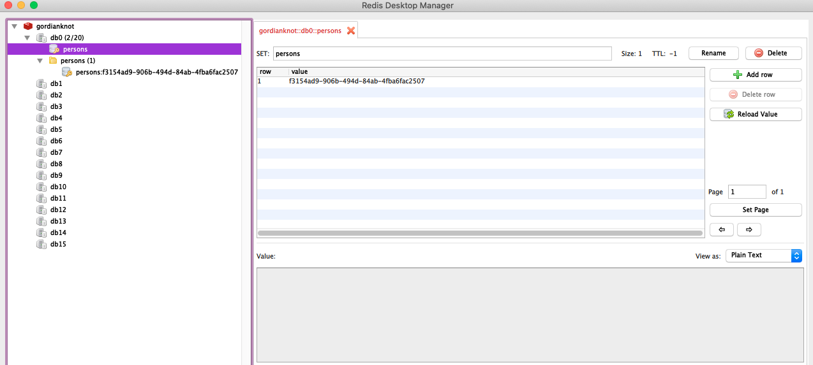
###### 另一部分是一個 Hash，存儲的是具體的每筆資料
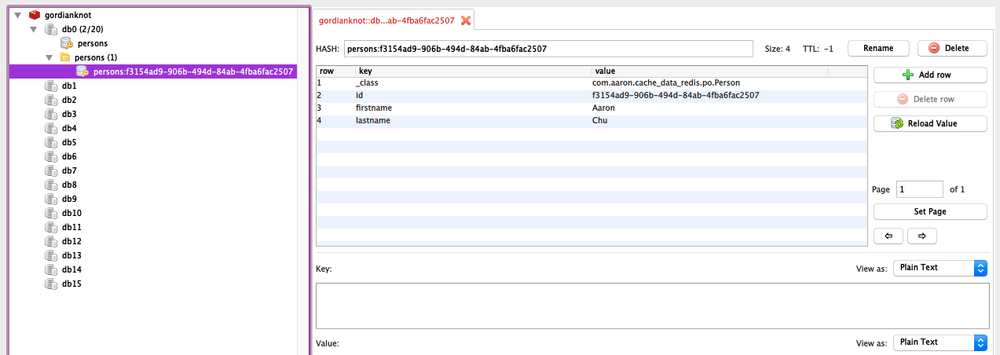
##### 印出的結果
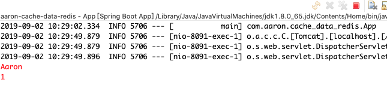

##### Spring Cache 緩存資料
###### key 採用 SpEL，即 key="'get'+#id" 的組合（採用 SpEL 語法）；key=get::1001 
`GET http://localhost:8091/get`
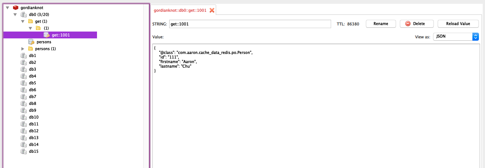
###### key 採用 keyGenerator 自動生成；Key=get2::com.aaron.cache_data_redis.service.PersonServiceImpl:get2:1002
`GET http://localhost:8091/get2`
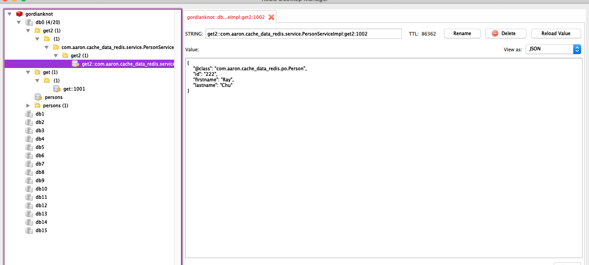

##### 緩存異常處理
###### 模擬 Redis 發生異常，將 gordianknot 關閉
##### 隨便調用與緩存相關的 API
`GET http://localhost:8091/get2`
###### 即時 Redis 出現連線錯誤，仍可正常透過資料庫操作取得資料
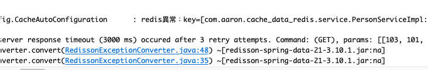
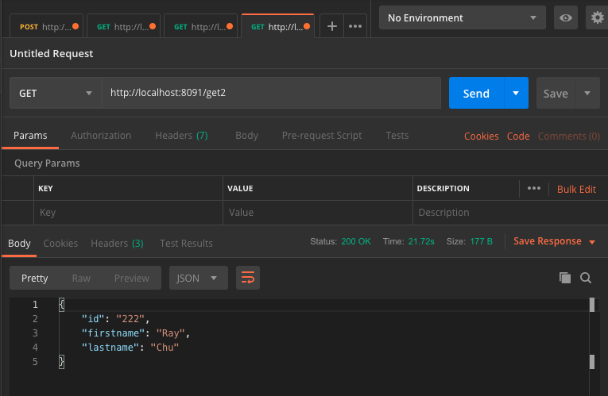

##### 自定義緩存工具類
###### 調用自定義緩存服務接口
`GET http://localhost:8091/getCallback`
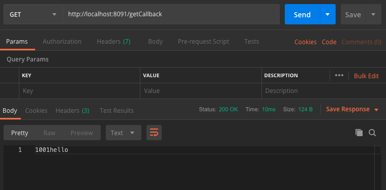
###### 資料不存在緩存內（需確認 Redis 不存在該筆 Key）

###### 緩存資料
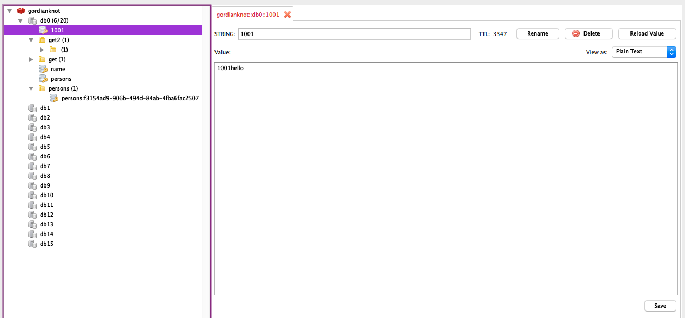

##### 防止緩存穿透方案：使用 BloomFilter
###### 執行主程式 MyBloomFilter
###### 採用預設錯誤率 0.03；錯誤率就是 1010000*(0.03/100)=303，大概會落在這個數值左右。
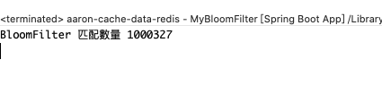
###### 採用錯誤率 0.0003；錯誤率就是 1010000*(0.0003/100)=3.03，大概會落在這個數值左右。
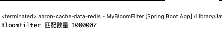

##### 防止緩存雪崩方案
###### 調用分佈式鎖
`GET http://localhost:8091/lock`
###### 10秒後自動解鎖
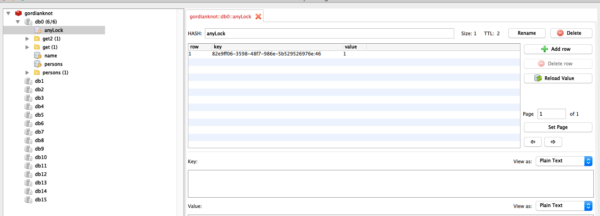


### 維運

