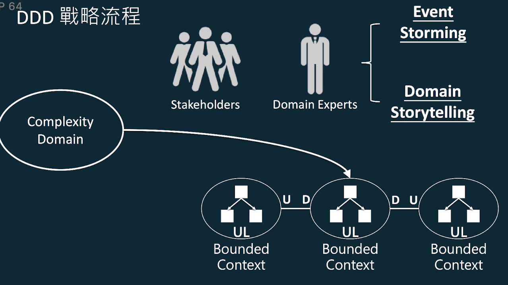
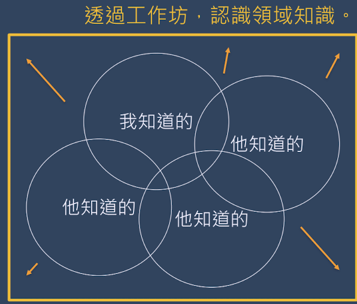
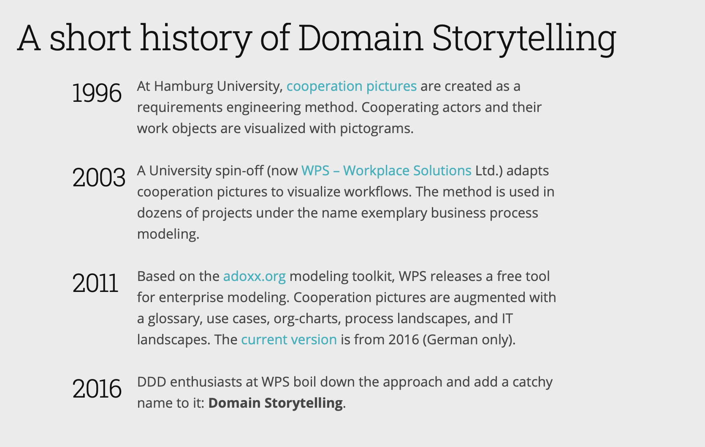
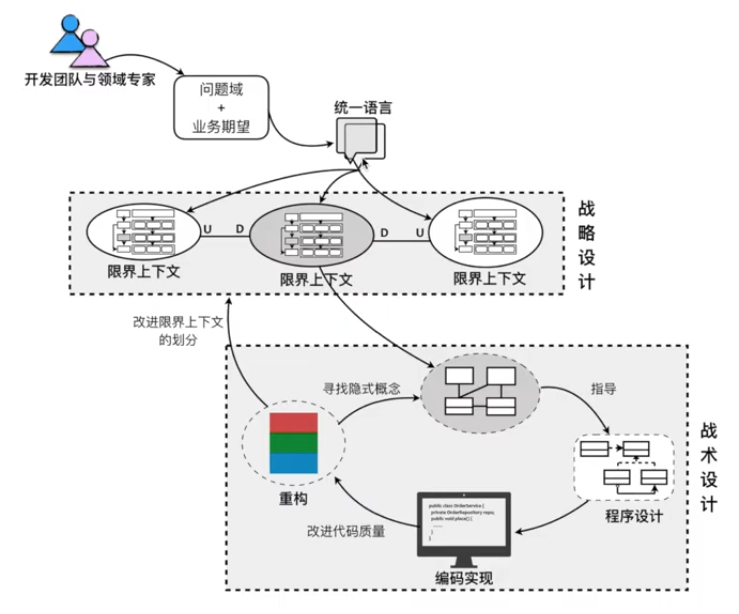
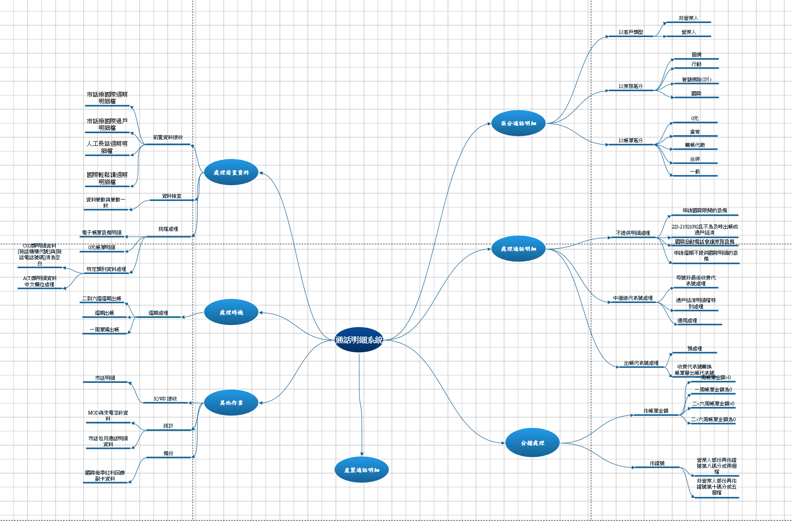
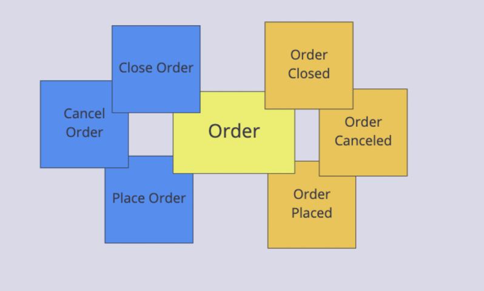
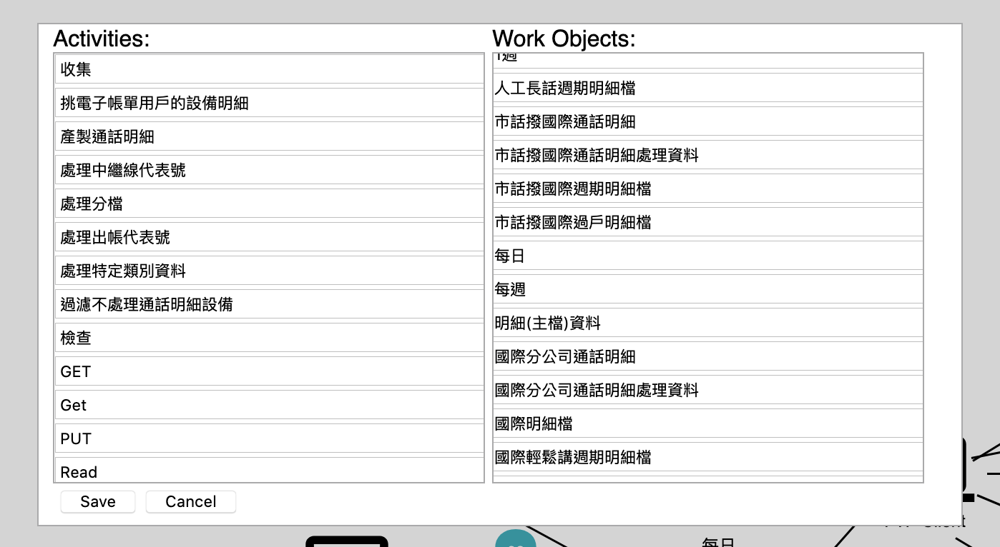
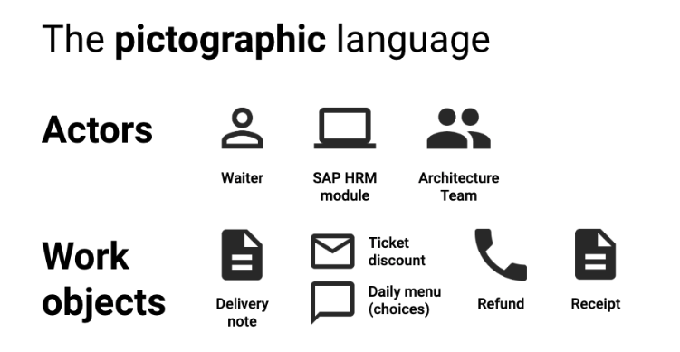
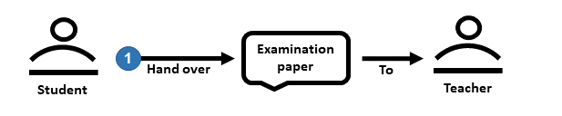
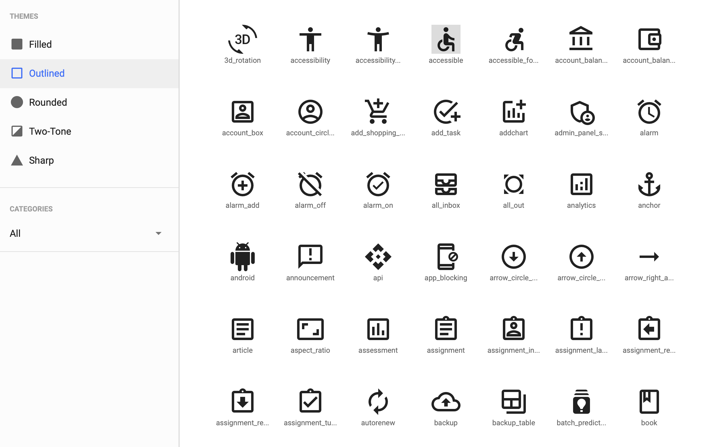

# OB 分析資料｜服務關聯｜採用 DDD 方法


### What's Doamin Driveen Design 簡介
領域驅動設計（Domain-driven design，縮寫 DDD）是一種通過將實現連接到持續進化的模型來滿足複雜需求的軟件開發方法。

領域驅動設計的前提是： 
* 把項目的主要重點放在核心領域（core domain）和域邏輯 
* 把複雜的設計放在有界域（bounded context）的模型上 
* 發起一個創造性的合作之間的技術和域界專家以迭代地完善的概念模式，解決特定領域的問題


### Domain Driven Design 價值
Eric Evan：
Tackling Complexity in the Heart of Software.
**『軟體核心複雜度的解決方案』**

The critical complexity of many software projects is in understanding the domain itself.
**『軟體開發過程，最為關鍵複雜根本的原因是目標領域本身就錯綜複
雜』**

**DDD 其重要價值就是有系統地解構複雜的問題**

### Domain Driven Design 解決領域複雜的作法
讓系統開發專家與領域專家協同合作

**戰略流程**


### Domain Driven Design 如何與領域專家協作
團隊 / 利害關係人透過工作坊形式與領域專家訪談：

1. EventStorming（事件風暴）
2. **Domain Storytelling（領域敘事）**


**A short history of Domain Storytelling**


[ADOxx] 是用於實現建模方法的元建模開發和配置平台。可以使用該平台來實現完整的建模方法，該平台不僅包括建模語言，還包括以機械和算法的形式進行的建模過程以及相應的功能。([adoxx.org Home](https://www.adoxx.org/live/home)、[ADOxx Hello World Video](https://www.youtube.com/watch?v=a6f52AZdp0o&feature=emb_rel_end))

### What is (Domain) Storytelling?
[An Introduction to Domain Storytelling](https://youtu.be/d9k9Szkdprk)

***Q&A 重點內容***
| 時間 | 重點 |
| --- | --- |
| 32m15s | 相較 ES，ST 更適合在團隊合作的時候使用，更具形象化的呈現方式，有助擬具大家共識 |
| 33m29s | 擁有一種以上分析方法(e.g. ES 與 ST)，對無法解決問題時，可以尋求其他方法，混合維度分析即是一個好例子。 |
| 34m18|工具本身非重點，背後目的是如何幫助用戶更好地完成工作|
| 38.44 |避免無謂假設(那個可能發生、這個也能發生...很多可能發生)，經過一個小時討論，最終可能仍無所獲，因為並沒有講到真正且實際情況。因此，最重要的規則為要從透到尾講一個的故事，細節沒有也無所謂， 因為不能為所有的事物建立完美的模型|
|39.49 | 開始 ST前，第一步要做的事收集不同的用例，作為決定解決哪些是最相關的問題|


領域敘事（Domain storytelling）是一種發現領域中人與系統如何共事的方式，可用於識別各個界限上下文，以及它們之間是如何互聯的。近期在阿姆斯特丹召開的DDD 2018 歐洲大會上，來自於 Workplace Solutions 的演講者 Stefan Hofer 和 Henning Schwentner 做了演講([ Domain-Driven Design Europe](https://youtu.be/Y1ykXnl6r7s))。兩位演講者在使用領域敘事方式與領域專家開展對話上具有多年的經驗。在他們看來，領域敘事是建模工具箱中額外添加的一種有用工具。


**通過講故事將領域知識轉換為商業軟體：**
Storytelling 是一種協作建模技術，可突出人們如何協同工作。其<font color=#0000FF>**主要目的是將領域知識轉換為商業軟體**</font>。通過將具有不同背景的人們聚在一起並<font color=#0000FF>**通過講故事和形象化的故事互相學習**</font>，可以實現此目的。

**克服誤解，增進共識：**
Storytelling 根據相關經驗，講故事可以幫助……

***Aaron 哪些大公司採用***
* …了解領域，
* …在領域專家和IT專家之間建立共享的語言，
* …談論軟件需求，
* …實施正確的軟件，
* …並設計可行的，軟體支持的業務流程。


### 開始 Storytelling...
#### 根據以下業務文件，開始動手...
##### 國際分公司
* OB_F_覃韵之_概念流程圖.vsdx    
* OB_F_覃韵之_JCL流程圖_FBMS.vsdx
* OB_V_覃韵之_市話撥國際_1070419.wmv
* OB_V_覃韵之_市話撥國際_1070430.wmv
* OB_覃韵之_A_國際明細處理.docx
##### 國際分公司
* OB_F_覃韵之_JCL流程圖_國際分公司.vsdx
* OB_V_覃韵之_國際分公司_1070806.wmv
* OB_覃韵之_A_國際分公司明細處理.docx
##### 電子處理
* OB_V_覃韵之_電子處理_1071001.wmv
* OB_F_覃韵之_JCL流程圖_電子處理.vsdx
* OB_覃韵之_A_電子明細處理.docx
* OB_覃韵之_C_電子帳單分檔與檔名規則.pdf

**經過「收集整理」、「吸收理解」、「分析歸納」後的產出物，然而似乎少了點什麼...**



#### 換個方式，用說故事的方式重新來過（from 錄音檔、流程圖）
經過一段時間，系統充斥著各種業務產製屬於 OB 的故事。會話期間會重新排列圖標和箭頭。最後，從頭開始重新講述這個故事。
[開始講故事](/dst/OB Subsystem_開始講故事.dst)


#### 探索與聚合（from 業務規則）
[近一步探索](/dst/OB Subsystem_持續探索.dst)
仔細研究了 OB 領域的一些故事之後，知道諸如"挑檔"、"處理中繼線代表號"、"過濾檢查"、"處理出帳代表號"之類的術語。對最重要的過程有初步的了解。

經過這一階段過程對流程進行概述有很大掌握，接下來進一步將所有故事放在一起(全局)為一個粗粒度的故事建模。
[再一步探索與聚合](/dst/OB Subsystem_再進一步探索與聚合.dst)

* 增加 Alarm 物件，說明某活動(Activities)與時間具有相依
* 增加 Info 物件，補充該工作物件(Work Object)短資訊
* 增加 textannotation 物件，補充該工作物件(Work Object)敘述性資訊

**Aggregate 將概念相近的地方收攏放在一起，以 SOLID 系統設計為原則**



**Dictionary**


* * * 
#### Domain Storytelling Explained



##### **Actors**
* 不同的圖標代表那些不同類型的角色。所有演員的共同點是，他們在“領域故事”中扮演著積極的角色。
* 例如一個人、一位客戶，或者是汽車、船舶這樣更技術化的事物。 
##### **Work objects**
* 實際的工作對象本身
* 工作對象的虛擬表示
* 交換有關工作對象的信息的媒介
* 例如文檔或消息，也可以是更抽象的事物，例如運輸路線。



##### **Activities**
* 用箭頭表示活動

在通常情況下，符號是為適應領域而定制的。符號為人們提供了一種不同於交付情況的象形圖。如有需要，可在圖中添加文字，描述符號所代表的意義。使用符號和文字，最終構成了一些盡可能接近於自然語言的語句。然後將這些語句加入到圖中，並使用數字標識順序。一般情況下，如果能避開決策門戶，那麼故事總是僅涵蓋某一個具體的例子。可視化繪圖使領域專家能盡快看到一個故事中是否存在誤解，並糾正其中的錯誤。

為了找出候選的界限上下文，Hofer 和 Schwentner 在故事中使用了指示符。具體的指示符例子包括： 
* 一個單向信息流。
* 語言中的差異。例如，使用同一名稱描述了不同的事物。
* 對不同的部分使用不同的觸發器。例如，部分工作需每日完成，而部分工作是按需完成的。

Hofer 認定，一旦發現了三種指示符，就找到了在兩個不同上下文間的一個有效界限。但 Hofer 強調指出，這種方法只表明瞭存在界限的跡象，而非確證。雖然在故事中，單向信息流是界限的一種指示符。但如果我們對領域做深入瞭解，就可能會發現該信息流在其它故事中表現出更複雜的特性。因此，這樣的信息流不能構成一種界限。


#### Run the Modeler(License GPLv3.0)
To run the modeler locally, download the latest release from GitHub([Source](https://github.com/WPS/domain-story-modeler)). Extract the zip file and open index.html in your browser.

[more icons](https://material.io/resources/icons/?style=outline)


**啟動 Modeler 工具**
```
$ npm install
$ npm run dev
```

[參考資料]

1. [Domain Storytelling 官網](https://domainstorytelling.org)
2. [Domain Storytelling 實用指南](https://leanpub.com/domainstorytelling/read_sample)
3. [Domain-Driven Design Europe](https://youtu.be/Y1ykXnl6r7s)
4. [domain-story-modeler 建模工具](https://github.com/WPS/domain-story-modeler)
5. [SOLID Sample Code](https://github.com/agilego99/spring-cloud-aaron/tree/master/design/aaron-design-pattern)
6. [ADOxx文檔](https://www.adoxx.org/live/introduction-to-adoxx)


[近一步思考...待續]

1. OB Domain Analysis...
    * 核心子域：業務成功的核心競爭力
    * 通用子域：不是核心，但被整個業務系統所使用 （可以直接購買的）
    * 支撐子域：不是核心，不被整個系統使用，完成業務的必要能力（可以外包出去的）
