# Elastic-Job
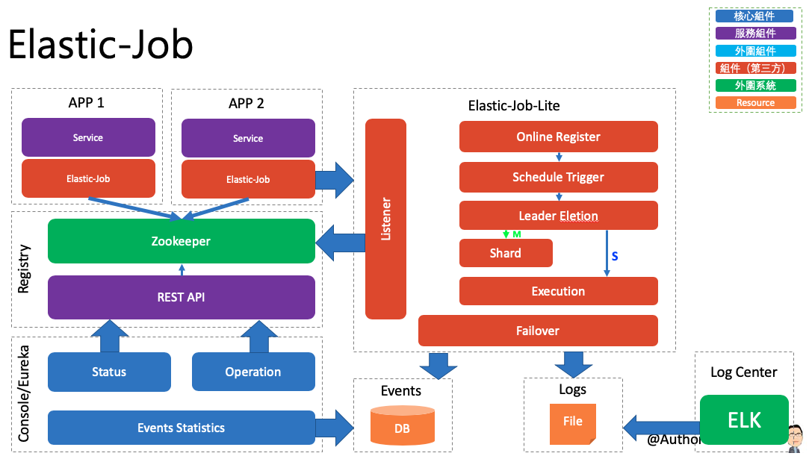

##### Elastic-Job 介紹
###### Elastic-Job 是一個分布式調度解決方案，由兩個相互獨立的子項目Elastic-Job-Lite 和 Elastic-Job-Cloud 組成。
###### Elastic-Job-Lite 定位為輕量級無中心化解決方案，使用jar包的形式提供分布式任務的協調服務。
###### Elastic-Job-Cloud 使用 Mesos + Docker 的解決方案，額外提供資源治理、應用分發以及進程隔離等服務。


##### 功能列表：
###### Elastic-Job-Lite
- 分布式調度協調
- 彈性擴容縮容
- 失效轉移
- 錯過執行作業重觸發
- 作業分片一致性，保證同一分片在分布式環境中僅一個執行實例
- 自診斷並修復分布式不穩定造成的問題
- 支持並行調度
- 支持作業生命週期操作
- 豐富的作業類型
- Spring整合以及命名空間提供
- 運維平台

###### Elastic-Job-Cloud
- 應用自動分發
- 基於 Fenzo 的彈性資源分配
- 分布式調度協調
- 彈性擴容縮容
- 失效轉移
- 錯過執行作業重觸發
- 作業分片一致性，保證同一分片在分布式環境中僅一個執行實例
- 支持並行調度
- 支持作業生命週期操作
- 豐富的作業類型
- Spring整合
- 運維平台
- 基於Docker的進程隔離(TBD)

##### Elastic-Job 官方配置手册
######  [Elastic-Job Java Code配置](http://elasticjob.io/docs/elastic-job-lite/02-guide/config-manual/)


## 參數
- Spring boot：2.0.6.RELEASE
- Spring cloud：Finchley.SR2
- Java：8
- 專案
    - 
        - Main：
            - DingDingMessageUtil
            - SimpleJobApplication
            - Datafl
        - Group id：com.aaron
        - Artifact id：aaron-elastic-job-demo
        - Version：1.0
    
- 服務依賴
    - MySQL
        - [安裝 MySQL](../server/MySQL)
    - Zookeeper
        - [安裝 Zookeeper](../server/Zookeeper)


## aaron-elastic-job-demo


### 開發
##### 快速集成
- pom.xml
```
<!-- Spring Boot Mavne 依賴 -->
	<parent>
		<groupId>org.springframework.boot</groupId>
		<artifactId>spring-boot-starter-parent</artifactId>
		<version>2.0.6.RELEASE</version>
	</parent>

	<!-- Spring Boot Web Mavne 依賴 -->
	<dependencies>
		<dependency>
			<groupId>org.springframework.boot</groupId>
			<artifactId>spring-boot-starter-web</artifactId>
		</dependency>

        <!-- Elastic-Job Mavne 依賴 -->
		<dependency>
			<groupId>com.dangdang</groupId>
			<artifactId>elastic-job-lite-core</artifactId>
			<version>2.1.5</version>
		</dependency>

        <!-- Elastic-Job Mavne 依賴 -->
		<dependency>
			<groupId>com.dangdang</groupId>
			<artifactId>elastic-job-lite-spring</artifactId>
			<version>2.1.5</version>
		</dependency>
	<dependencies>
```
###### 任務配置採用 .xml 方式配置任務，除 .xml 方式外．也可以用程式方式來配置任務。

- JobApplication.java Elastic-Job 啟動類
```
/**
 * Elastic Job XML配置示列
 * @author aaron
 * @date 
 */
@SpringBootApplication
/** 
 * 透過 @ImportResource 導入自定義的 xml 文件；此為 Spring Boot 中為了兼容性而特別保留的一個功能
 */
@ImportResource(locations = { "classpath:applicationContext.xml" })
public class JobApplication {
	
	public static void main(String[] args) {
		SpringApplication.run(JobApplication.class, args);
	}
}
```
- applicationContext.xml 配置 Zookeeper 註冊作業中心
```
      <!-- Zookeeper 配置作業註冊中心 -->
      <reg:zookeeper id="regCenter" server-lists="gordianknot:2181" namespace="gordianknot-job"
       base-sleep-time-milliseconds="1000" max-sleep-time-milliseconds="3000" max-retries="3" />
```

##### 任務使用
###### Elastic-Job 提供三種作業類型：

| 作業類型 |說明 |
| --- | --- |
|Simple  |意為簡單實現，未經任何封裝的類型。需實現SimpleJob接口。該接口僅提供單一方法用於覆蓋，此方法將定時執行。與Quartz原生接口相似，但提供了彈性擴縮容和分片等功能。  |
|Dataflow  | Dataflow類型用於處理數據流，需實現DataflowJob接口。該接口提供2個方法可供覆蓋，分別用於抓取(fetchData)和處理(processData)數據。 |
|Script  | 如果採用流式作業處理方式，建議processData處理數據後更新其狀態，避免fetchData再次抓取到，從而使得作業永不停止。 流式數據處理參照TbSchedule設計，適用於不間歇的數據處理。 |

##### Simple Job
- MySimpleJob.java Simple 任務使用
```
/**
 * @author Aaron
 * 配置檔：MySample.xml
 * 如啟動出現異常：
 * 1.需要使用 Zookeeper 客戶端連接到 ZK 服務器（透過 Zooinspector），刪除 Elastic-Job 在 Zookeeper 註冊的節點
 * 2.重新啓動 Elastic-Job
 */
public class MySimpleJob implements SimpleJob {
 	public void execute(ShardingContext context) {
 		String time = new SimpleDateFormat("HH:mm:ss").format(new Date());
 		System.out.println(time + ":開始執行簡單任務");
 	}
}
```
- applicationContext.xml 配置 Simple 任務
```
       <!-- Simple Job-->
    	<job:simple id="mySimpleJob-appContext" class="com.aaron.job.MySimpleJob" registry-center-ref="regCenter"
    	cron="0/10 * * * * ?" sharding-total-count="1" sharding-item-parameters=""
    	description="我的第一個簡單作業" overwrite="true"/>
```
##### Dataflow 任務
- MyDataflowJob.java Dataflow 任務使用
```
	/**
	 * Dataflow 適用於處理資料流，需要實現 Dataflow 介面，該介面提供兩個方法：
	 * 1.抓取資料（fetchData）
	 * 2.處理資料（processData）
	 */
	
	// 抓取資料
	public List<String> fetchData(ShardingContext context) {
		return Arrays.asList("1", "2", "3");
	}

	// 處理資料
	public void processData(ShardingContext context, List<String> data) {
		String time = new SimpleDateFormat("HH:mm:ss").format(new Date());
		System.out.println(time +":Dataflow 處理資料：" + data.toString());
	}
}
```
- applicationContext..xml 配置 Dataflow 任務
```
        <!-- 
        資料流服務 啟動程序後，該配置在每天固定時間執行，任務執行1次就結束了 可以通過 streaming-process="true" 來開啟流式作業 
		對於流式處理資料，只有在 fetchData 方法的返回值為 null 或集合長度為空時，作業才會停止抓取，否則將會一直運行下去 而非流式作業則只會在每次作業執行過程中執行一次 
		fetchData 方法和 processData 方法，隨即完成本次作業。 
	    -->
	    <job:dataflow id="myDataflowJob-appContext"
		class="com.aaron.job.MyDataflowJob" registry-center-ref="regCenter" sharding-total-count="1" 
		cron="0 42 12 * * ?" sharding-item-parameters="" description="我的第一個數據流作業" 
		streaming-process="false" overwrite="true"/>
		<!-- streaming-process="true" overwrite="true"/> -->
```

##### Script 任務
###### Script 任務支援 Shell、Python、Perl 等所有類型腳本。
只需通過控制台或程式碼配置 ScriptCommandLine 即可，無須撰寫程式。
- demo.sh 測試腳本任務
```
#!/bin/bash
echo Sharding Context: $*
```
- applicationContext.xml 配置腳本任務
```
        <!-- Script Job -->	
        <job:script id="myScriptJob-appContext" registry-center-ref="regCenter"
    	script-command-line="/Users/aaron/develop/workspace/eclipse/spring-cloud-aaron/elastic-job/aaron-elastic-job-demo/demo.sh"
    	sharding-total-count="1" 
    	cron="0 46 12 * * ?" sharding-item-parameters="" description="我的第一個腳本任務" overwrite="true"/>
```

##### 多節點任務調度
###### 分片概念
###### 數據分片的目的在於把一個任務分散到不同的機器上運行，既可以解決單機計算能力上限的問題，也能降低部分任務失敗對整體系統的影響。elastic-job 並不直接提供數據處理的功能，框架只會將分片項分配至各個運行中的作業服務器（其實是 Job 實例，部署在一台機器上的多個 Job 實例也能分片），開發者需要自行處理分片項與真實數據的對應關係。框架也預置了一些分片策略：平均分配算法策略，作業名哈希值奇偶數算法策略，輪轉分片策略。同時也提供了自定義分片策略的接口。

###### 任務節點分片策略

| 分片策略 | 概念 | 說明 |
| --- | --- | --- | 
| AverageAllocationJobShardingStrategy | 基於平均分配算法的分片策略 | 它是默認的分片策略。具體分片效果如下：<br>如果有3個 Job 實例, 分成9片, 則每個 Job 實例分到的分片是: 1=[0,1,2], 2=[3,4,5], 3=[6,7,8] <br>如果有3個 Job 實例, 分成8片, 則每個 Job 實例分到的分片是: 1=[0,1,6], 2=[2,3,7], 3=[4,5] <br>如果有3個 Job 實例, 分成10片, 則個 Job 實例分到的分片是: 1=[0,1,2,9], 2=[3,4,5], 3=[6,7,8] | 
| OdevitySortByNameJobShardingStrategy | 作業名的哈希值奇偶數決定 IP 升降序算法的分片策略 |它內部其實也是使用 AverageAllocationJobShardingStrategy 實現，只是在傳入的節點實例順序不一樣，也就是上面接口參數的List<JobInstance>。AverageAllocationJobShardingStrategy 的缺點是一旦分片數小於 Job 實例數，作業將永遠分配至 IP 地址靠前的 Job 實例上，導致 IP 地址靠後的 Job 實例空閒。而 OdevitySortByNameJobShardingStrategy 則可以根據作業名稱重新分配Job實例負載。如：<br>如果有3個 Job 實例，分成2片，作業名稱的哈希值為奇數，則每個 Job 實例分到的分片是：1=[0], 2=[1], 3=[] <br>如果有3個 Job 實例，分成2片，作業名稱的哈希值為偶數，則每個 Job 實例分到的分片是：3=[0], 2=[1], 1=[] | 
| RotateServerByNameJobShardingStrategy |根據作業名的哈希值對 Job 實例列表進行輪轉的分片策略 |和上面介紹的策略一樣，內部同樣是用 AverageAllocationJobShardingStrategy 實現，也是在傳入的 List<JobInstance> 列表順序上做文章。| 

##### 業務資料分片處理
- MySimpleShardingJob.java 分片處理
```
	/**
	 * 模擬 100萬條資料
	 */
 	public void execute(ShardingContext context) {
 		// 獲取當前節點分片參數
 		String shardParamter = context.getShardingParameter();
 		System.out.println("分片參數："+shardParamter);
 		int value = Integer.parseInt(shardParamter);
 		for (int i = 0; i < 1000000; i++) {
 			// 通過取模的方式跟分片的參數對比，對上了就處理這條資料
 			if (i % 2 == value) {
 				String time = new SimpleDateFormat("HH:mm:ss").format(new Date());
 				System.out.println(time + ":開始執行簡單任務" + i);
 			}
 		}
 	}
```
- applicationContext.xml 配置分片處理作業
```
       <!-- Simple Job：分片數 2 -->
       <job:simple id="mySimpleJobSharding-appContext" class="com.aaron.job.MySimpleShardingJob" registry-center-ref="regCenter"
    	cron="0 53 12 * * ?" sharding-total-count="2" sharding-item-parameters="0=0,1=1"
    	description="我的第一個簡單作業" overwrite="true"/> 
```

##### 事件追蹤
- applicationContext.xml 事件追蹤資料源配置
```
    <!-- 事件追蹤 -->	
    <bean id="elasticJobLog" class="org.apache.commons.dbcp.BasicDataSource" destroy-method="close">
        <property name="driverClassName" value="com.mysql.jdbc.Driver"/>
        <property name="url" value="jdbc:mysql://gordianknot:3306/batch_log?useSSL=false"/>
        <property name="username" value="root"/>
        <property name="password" value="999999"/>
    </bean>
```
- pom.xml mySQL Maven 依賴
```
        <!-- MySQL Maven 依賴 -->
		<dependency>
			<groupId>mysql</groupId>
			<artifactId>mysql-connector-java</artifactId>
		</dependency>

		<dependency>
			<groupId>commons-dbcp</groupId>
			<artifactId>commons-dbcp</artifactId>
			<version>1.4</version>
		</dependency>
```
- applicationContext.xml 事件追蹤任務配置 elasticJobLog
```
       <!-- 
           Simple Job：Sharding
           結合：
           事件追蹤任務 elasticJobLog
           自定義監聽器 MessageElasticJobListener
           自定義異常處理 CustomJobExceptionHandler
       -->
       <job:simple id="mySimpleJobEvent-appContext" class="com.aaron.job.MySimpleShardingJob" registry-center-ref="regCenter"
    	cron="0 3 13 * * ?" sharding-total-count="1" sharding-item-parameters="0=0,1=1"
    	description="我的第一個簡單作業" overwrite="true" event-trace-rdb-data-source="elasticJobLog"
    	job-exception-handler="com.aaron.job.CustomJobExceptionHandler">
    	<job:listener class="com.aaron.job.MessageElasticJobListener"></job:listener>
    	</job:simple>
```

##### 自定義監聽器
- MessageElasticJobListener.java 自定義監聽器
```
/**
 * 作業監聽器, 執行前後發送釘釘消息進行通知
 * @author aaron
 */
public class MessageElasticJobListener implements ElasticJobListener {
    @Override
    public void beforeJobExecuted(ShardingContexts shardingContexts) {
        String date = new SimpleDateFormat("yyyy-MM-dd HH:mm:ss").format(new Date());
        String msg = date + " 【Gordianknot-" + shardingContexts.getJobName() + "】任務開始執行====" + JsonUtils.toJson(shardingContexts);
        // 釘釘尚未配置
//        DingDingMessageUtil.sendTextMessage(msg);
    }
    @Override
    public void afterJobExecuted(ShardingContexts shardingContexts) {
    	String date = new SimpleDateFormat("yyyy-MM-dd HH:mm:ss").format(new Date());
        String msg = date + " 【Gordianknot-" + shardingContexts.getJobName() + "】任務執行結束====" + JsonUtils.toJson(shardingContexts);
//        釘釘尚未配置
//        DingDingMessageUtil.sendTextMessage(msg);
    }
}
```
- applicationContext.xml 使用自定義監聽器 MessageElasticJobListener
```
       <!-- 
           Simple Job：Sharding
           結合：
           事件追蹤任務 elasticJobLog
           自定義監聽器 MessageElasticJobListener
           自定義異常處理 CustomJobExceptionHandler
       -->
       <job:simple id="mySimpleJobEvent-appContext" class="com.aaron.job.MySimpleShardingJob" registry-center-ref="regCenter"
    	cron="0 3 13 * * ?" sharding-total-count="1" sharding-item-parameters="0=0,1=1"
    	description="我的第一個簡單作業" overwrite="true" event-trace-rdb-data-source="elasticJobLog"
    	job-exception-handler="com.aaron.job.CustomJobExceptionHandler">
    	<job:listener class="com.aaron.job.MessageElasticJobListener"></job:listener>
    	</job:simple>
```

##### 自定異常處理
-  CustomJobExceptionHandler.java 自定義異常處理
```
/**
 * 自定義異常處理，在任務異常時使用叮叮發送通知
 * @author aaron
 */
public class CustomJobExceptionHandler implements JobExceptionHandler {

    private Logger logger = LoggerFactory.getLogger(CustomJobExceptionHandler.class);

    @Override
    public void handleException(String jobName, Throwable cause) {
        logger.error(String.format("Job '%s' exception occur in job processing", jobName), cause);
        // 釘釘尚未配置
//        DingDingMessageUtil.sendTextMessage("【"+jobName+"】任務異常。" + cause.getMessage());
    }
}
```
- applicationContext.xml 使用自定義異常配置 CustomJobExceptionHandler
```
       <!-- 
           Simple Job：Sharding
           結合事件追蹤任務
       -->
       <job:simple id="mySimpleJobEvent-appContext" class="com.aaron.job.MySimpleShardingJob" registry-center-ref="regCenter"
    	cron="0 3 13 * * ?" sharding-total-count="1" sharding-item-parameters="0=0,1=1"
    	description="我的第一個簡單作業" overwrite="true" event-trace-rdb-data-source="elasticJobLog"
    	job-exception-handler="com.aaron.job.CustomJobExceptionHandler"/> 
```

### 配置

### 測試
##### Simple Job
###### 執行 JobApplication
###### 每 10 秒執行 Job 一次
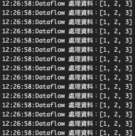
###### ZK 節點註冊資訊
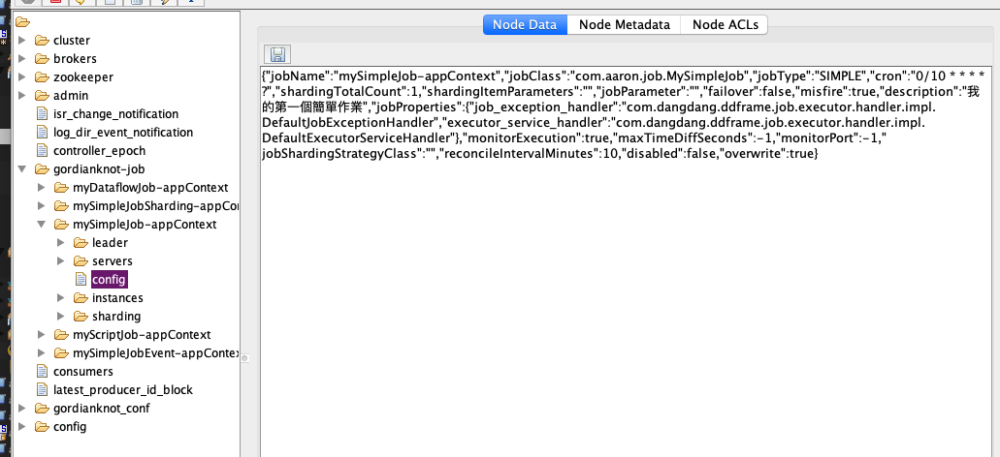

##### Dataflow Job
###### 執行 JobApplication
###### 資料流任務-停用流式作業（streaming-process="false" ；在排程條件符合下，只執行一次）
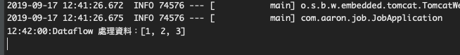
###### ZK 節點註冊資訊
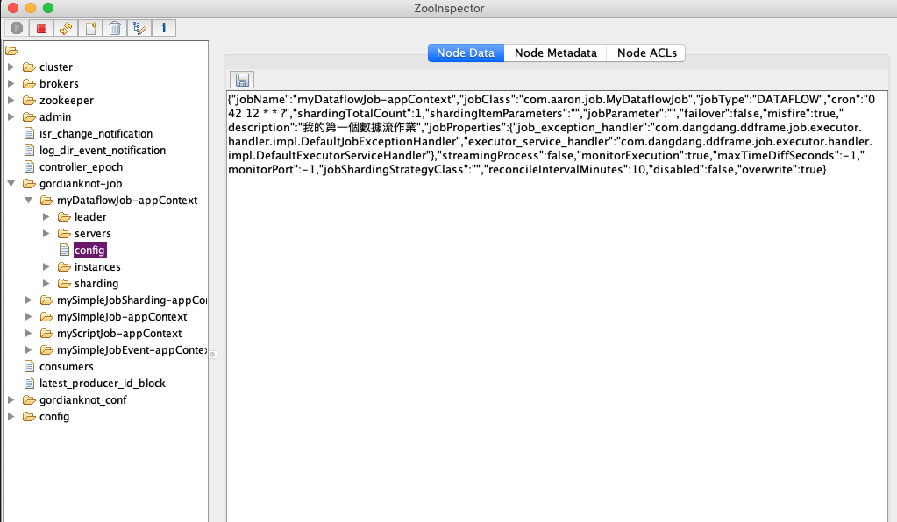
###### 資料流任務-啟用流式作業（streaming-process="ture" ；在排程條件符合下，只要有資料就會一直執行）
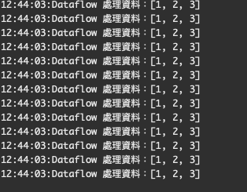
###### ZK 節點註冊資訊
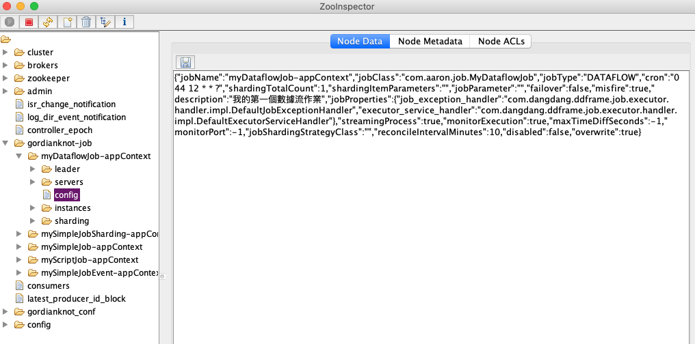

##### Script Job
###### 執行 JobApplication
###### 執行前先確認是否有執行權限，以避免執行失敗
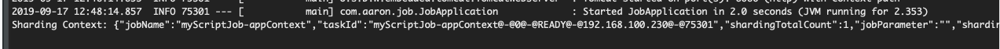
###### ZK 節點註冊資訊
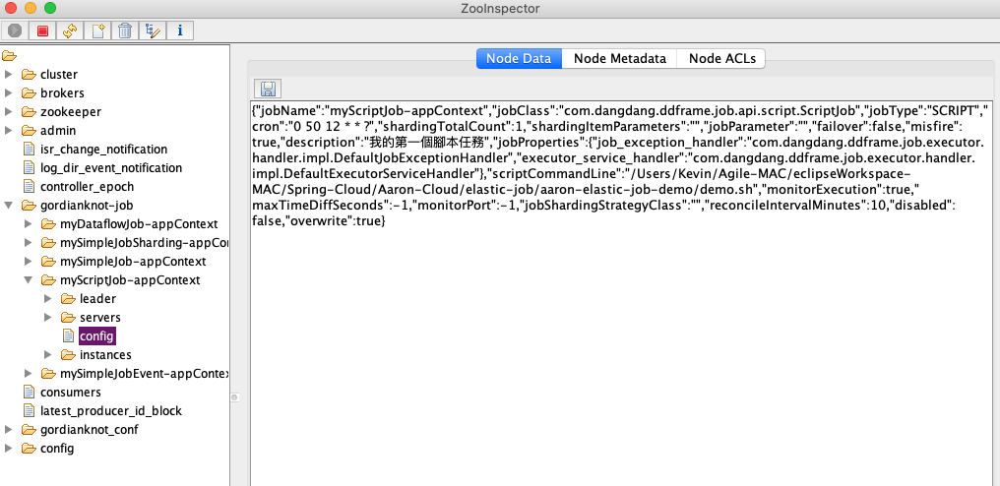


##### 業務資料分片處理（共2個分片）
###### 執行第一個 JobApplication 
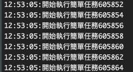
###### 執行第二個 JobApplication 
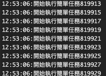
###### ZK 節點註冊資訊
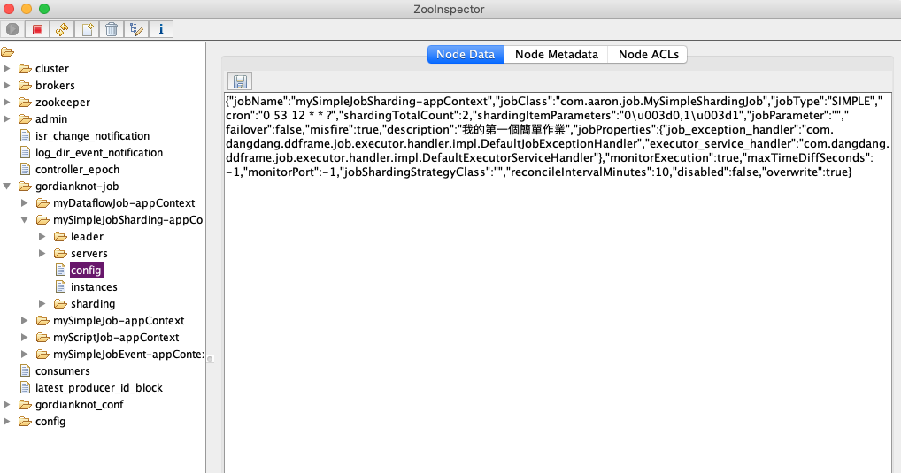
###### ZK 節點註冊分片資訊
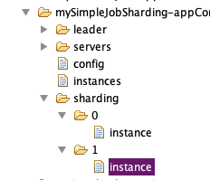

##### 事件追蹤
###### 執行 JobApplication
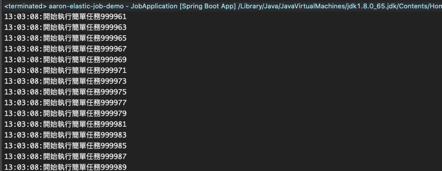
###### 資訊寫入資料庫 Table
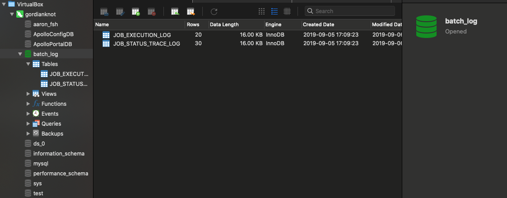
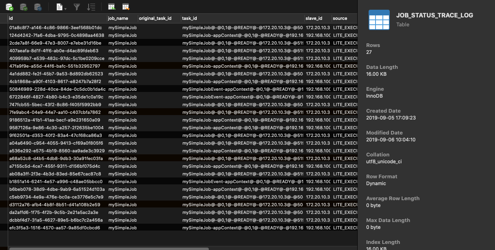
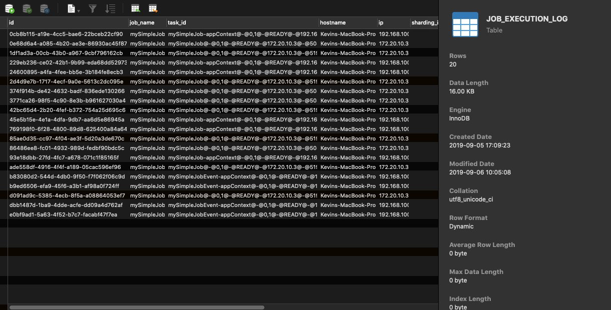
###### ZK 節點註冊資訊
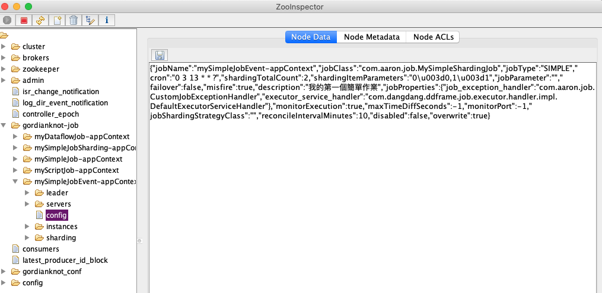

##### 發布作業（尚未驗證）
###### 打包作業
`$ tar -cvf yourJobs.tar.gz yourJobs`
###### 發布 Application
`$ curl -l -H "Content-type: application/json" -X POST -d '{"appName":"foo_app","appURL":"http://app_host:8080/yourJobs.gz","cpuCount":0.1,"memoryMB":64.0,"bootstrapScript":"bin/start.sh","appCacheEnable":true,"eventTraceSamplingCount":0}' http://elastic_job_cloud_host:8899/api/app`
###### 發布作業
`$ curl -l -H "Content-type: application/json" -X POST -d '{"jobName":"foo_job","jobClass":"yourJobClass","jobType":"SIMPLE","jobExecutionType":"TRANSIENT","cron":"0/5 * * * * ?","shardingTotalCount":5,"cpuCount":0.1,"memoryMB":64.0,"appName":"foo_app","failover":true,"misfire":true,"bootstrapScript":"bin/start.sh"}' http://elastic_job_cloud_host:8899/api/job/register`


##### 維運平台
###### 維運平台網站
`http://gordianknot:8899`
###### 帳密
```
root
999999
```
###### 註冊中心列表
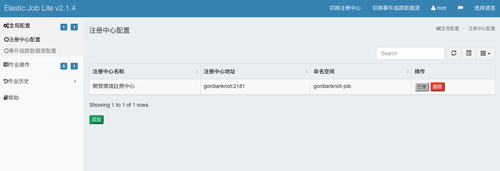
###### 作業維度：可對任務的配置資料進行修改
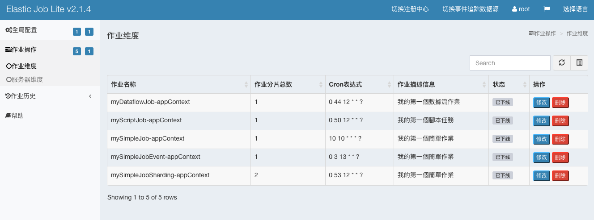
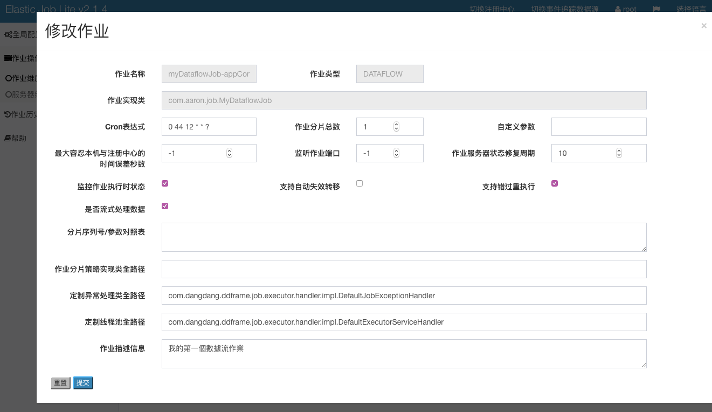
###### 事件追蹤：歷史軌跡
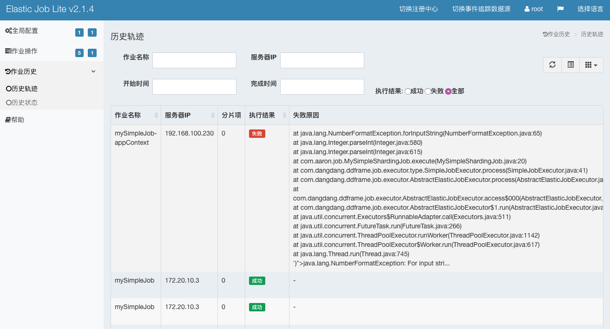
###### 事件追蹤：歷史狀態


### 維運


