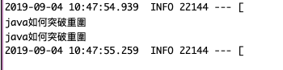
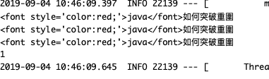

# Elasticsearch
##### 說明一
- 解釋

## 參數
- Ubuntu 18.04
- Elasticsearch 6.8.13
- Spring boot：2.0.6.RELEASE
- Spring cloud：Finchley.SR2
- Java：8
- 專案
    - 
        - Main：App
        - Group id：com.aaron
        - Artifact id：aaron-elasticsearch
        - Version：0.0.1-SNAPSHOT
    
- 服務依賴
    - ELK
        - [安裝 ELK](../server/ELK)

## 專案名稱


### 開發

###### 集成 Spring Data Elasticsearch
- pom.xml
```
		<!-- Elasticsearch Maven 依賴 -->
		<dependency>
			<groupId>org.springframework.boot</groupId>
			<artifactId>spring-boot-starter-data-elasticsearch</artifactId>
		</dependency>
```
##### Repository 操作
###### Repository 分為兩種方式，一種是 Repository，另一種是 ElasticsearchTemplate。
- .java Elasiticsearch 實體類定義
```
/**
 * Elasticsearch 實體類定義
 * @author Aaron
 */
@Data
@Document(indexName = "gordianknot", type = "article")
public class Article {
	
	@Id    
    @Field(type = FieldType.Integer)    
	private Integer id;
	
	@Field(type = FieldType.Keyword)   
	private String sid;
	
    // 將文本做最細粒度的拆分，比如會將「中華人民共和國人民大會堂」拆分為「中華人民共和國、中華人民、中華、華人、人民共和國、人民、共和國、大會堂、大會、會堂等詞語。
	@Field(type = FieldType.Keyword,  analyzer = "ik_max_word", searchAnalyzer = "ik_max_word") 
	private String title;
	
	@Field(type = FieldType.Keyword) 
	private String url;
	
	@Field(type = FieldType.Keyword) 
	private String content;
	
}
```

- ArticleRepository.java Elasticsearch CrudRepository
```
/**
 * extends CrudRepository 基礎功能
 * @author Aaron
 */
@Repository
public interface ArticleRepository extends CrudRepository<Article, Long> {
	List<Article> findByTitleContaining(String title);
	// ... 還有其它多種用法
} 
```

##### ElasticsearchTemplate 示例
- .java ElasticsearchTemplate ElasticsearchTemplate 查詢式例
```
@Repository
public class ArticleTemplate {
 	
 	@Autowired
 	private ElasticsearchTemplate elasticsearchTemplate;
 	/**
 	* 簡單的模糊查詢
 	* @param title
 	* @return
 	*/
 	public List<Article> queryByTitle(String title){
 		return elasticsearchTemplate.queryForList(
 				new CriteriaQuery(Criteria.where("title").contains(title)), Article.class);
 	}
 	
 	/**
 	* 全文檢索
 	* 根據標題全文檢索，高亮顯示分詞結果
 	* @param keyword
 	* @param pageble
 	* @return
 	*/
 	public List<Article> query(String keyword) {
 		NativeSearchQueryBuilder query = buildQuery(keyword);
 		return buildResult(query);
 	}
 	/**
 	* 分頁全文查詢
 	* 根據標題全文檢索，高亮顯示分詞結果,分頁查詢
 	* @param keyword
 	* @param pageble
 	* @return
 	*/
 	public List<Article> queryByPage(String keyword, int page, int limit) {
 		NativeSearchQueryBuilder query = buildQuery(keyword);
 		query.withPageable(PageRequest.of(page, limit));
 		return buildResult(query);
 	}
 	
 	/** 
 	 * 構造查詢條件
 	 */
 	private NativeSearchQueryBuilder buildQuery(String keyword) {
 		NativeSearchQueryBuilder query = new NativeSearchQueryBuilder();
 		query.withIndices("gordianknot");
 		query.withTypes("article");
 		query.withHighlightFields(new HighlightBuilder.Field("title").preTags("<font style='color:red;'>").postTags("</font>"));
 		query.withQuery(QueryBuilders.boolQuery().must(QueryBuilders.matchQuery("title",keyword)));
 		return query;
 	}
 	
 	/**
 	 * 建構查詢結果
 	 * @param query
 	 * @return
 	 */
 	private List<Article> buildResult(NativeSearchQueryBuilder query) {
 		return elasticsearchTemplate.query(query.build(), new ResultsExtractor<List<Article>>() {
 			@Override
 			public List<Article> extract(SearchResponse response) {
 				List<Article> list = new ArrayList<Article>();
 				for (SearchHit hit : response.getHits()) {
 					Article r = new Article();
 					r.setId(Integer.parseInt(hit.getId()));
 					r.setTitle(hit.getHighlightFields().get("title").fragments()[0].toString());
 					r.setUrl(hit.getSource().get("url").toString());
 					r.setContent(hit.getSource().get("content").toString());
 					list.add(r);
 				}
 				return list;
 			}
 		});
 	}
 	
 	
 	/**
 	* 標題檢索結果總數量
 	* @param keyword
 	* @return
 	*/
 	public Long queryTitleCount(String keyword) {
 		NativeSearchQueryBuilder query = buildQuery(keyword);
 		return elasticsearchTemplate.count(query.build());
 	}
 	
 	/**
 	* And 查詢
 	* 查詢 sid 下的標題信息，相當於 SQL 中的 select * from article where title like '%keyword%' and sid = sid
 	* @param keyword
 	* @param sid
 	* @return
 	*/
 	public List<Article> query(String keyword, String sid) {
 		NativeSearchQueryBuilder query = new NativeSearchQueryBuilder();
 		query.withIndices("gordianknot");
 		query.withTypes("article");
 		query.withHighlightFields(new HighlightBuilder.Field("title").preTags("<font style='color:red;'>").postTags("</font>"));
 		query.withQuery(
 				QueryBuilders.boolQuery()
 					.must(QueryBuilders.matchQuery("title",keyword))
 					.must(QueryBuilders.matchQuery("sid", sid))
 		);
 		return buildResult(query);
 	}
 	
 	/**
 	* OR 查詢 
 	* 查詢 sid 下的標題信息，相當於 SQL 中的 select * from article where title like '%keyword%' or sid = sid
 	* @param keyword
 	* @param sid
 	* @return
 	*/
 	public List<Article> queryByOr(String keyword, String sid) {
 		NativeSearchQueryBuilder query = new NativeSearchQueryBuilder();
 		query.withIndices("gordianknot");
 		query.withTypes("article");
 		query.withHighlightFields(new HighlightBuilder.Field("title").preTags("<font style='color:red;'>").postTags("</font>"));
 		query.withQuery(
 				QueryBuilders.boolQuery()
 					.must(QueryBuilders.matchQuery("title",keyword))
 					.should(QueryBuilders.matchQuery("sid", sid))
 		);
 		return buildResult(query);
 	}
 	
}
```
##### 索引建構方式（採用 elasticsearchTemplate bulkIndex 實現）
###### 當需要將資料庫的資料（如 MySQL、PostgreSQL、MongoDB、Redis、MQ...）導入到 Elasticsearch 中，建立同步索引資料，然後進行搜尋。關於索引的建構分成兩種：
###### 寫程式去同步資料到 Elasticsearch，可以用 elasticsearch-jdbc for MySQL `https://github.com/jprante/elasticsearch-jdbc`
###### 寫程式去同步資料到 Elasticsearch，可以用 elasticsearch-jdbc for MongoDB `https://github.com/mongo-labs/mongo-connector`
###### 另一種是用 transport client 實現。

### 配置
- application.properties
```
spring.application.name=aaron-elasticsearch
server.port=8083

spring.data.elasticsearch.cluster-name=docker-cluster
spring.data.elasticsearch.cluster-nodes=gordianknot2:9300
```

### 測試
##### Repository 操作
###### Elasticearch Repository 測試碼
- ArticleTest.java Elasticearch Repository 測試碼
```
@RunWith(SpringRunner.class)
@SpringBootTest(classes = App.class)
public class ArticleTest {
 	
    // 基於 Repository
 	@Autowired
 	ArticleRepository articleRepository;
 	
 	 // 基於 Repository 用法
 	@Test
 	public void testAdd() {
 		Article article = new Article();
 		article.setId(1);
 		article.setSid("dak219dksd");
 		article.setTitle("java如何突破重圍");
 		article.setUrl("http://baidu.com");
 		article.setContent("java 及的垃圾的 的垃圾大家導入大大大");
 		articleRepository.save(article);
 	}
 	
 	 // 基於 Repository 用法
 	@Test
 	public void testList() {
 		Iterable<Article> list = articleRepository.findAll();
 		for (Article article : list) {
 			System.out.println(article.getTitle());
 		}
 	}
 	
 	 // 基於 Repository 用法
 	@Test
 	public void testQuery() {
 		Iterable<Article> list = articleRepository.findByTitleContaining("java");
 		for (Article article : list) {
 			System.out.println(article.getTitle());
 		}
 	}
 	
}
```
###### 測試結果



##### ElasticsearchTemplate 示例
###### Elasticearch Repository 測試碼
- ArticleTest.java Elasticsearc Template 測試碼
```
@RunWith(SpringRunner.class)
@SpringBootTest(classes = App.class)
public class ArticleTest {
 	
 	
 	// 基於 Elasticsearc Template
 	@Autowired
 	ArticleTemplate articleTemplate;
 	 
 	
    // 基於 Elasticsearc Template 用法
 	@Test
 	public void testQueryByTitle() {
 		List<Article> list = articleTemplate.query("java");
 		for (Article article : list) {
 			System.out.println(article.getTitle());
 		}
 	}
 	
 	@Test
 	public void testQueryTitleCount() {
 		System.out.println(articleTemplate.queryTitleCount("java"));
 	}
 	
    // 基於 Elasticsearc Template 用法
 	@Test
 	public void testQueryBySid() {
 		List<Article> list = articleTemplate.query("java", "dak219dksd");
 		for (Article article : list) {
 			System.out.println(article.getTitle());
 		}
 	}
 	
    // 基於 Elasticsearc Template 用法
 	@Test
 	public void testQueryByOr() {
 		List<Article> list = articleTemplate.queryByOr("java", "dad");
 		for (Article article : list) {
 			System.out.println(article.getTitle());
 		}
 	}
}
```
###### 測試結果



### 維運

