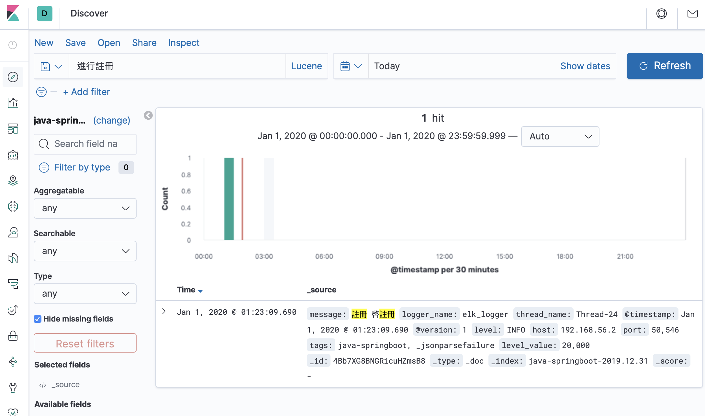

# ELK：透過 ELK 收集日誌

## 參數
- CentOS 7.5
- Spring boot：2.0.6.RELEASE
- Spring cloud：Finchley.SR2
- Java：8
- 專案
    - aaron-eureka-server-elk：日誌收集
        - Main：App
        - Group id：com.aaron
        - Artifact id：aaron-eureka-server-elk
        - Version：0.0.1-SNAPSHOT
- 服務依賴
  - ELK(Docker)
        - [安裝 ELK(Docker-compose)](../server/ELK(Docker-compose))
### 開發
- pom.xml 導入相關套件
```
		<dependency>
			<groupId>net.logstash.logback</groupId>
			<artifactId>logstash-logback-encoder</artifactId>
			<version>5.2</version>
		</dependency>

		<dependency>
			<groupId>net.logstash.log4j</groupId>
			<artifactId>jsonevent-layout</artifactId>
			<version>1.7</version>
		</dependency>

		<dependency>
			<groupId>org.projectlombok</groupId>
			<artifactId>lombok</artifactId>
		</dependency>
```
- logback.xml logstash 相關配置
```
<?xml version="1.0" encoding="UTF-8"?>
<configuration debug="false">
    <property resource="application.properties"></property>
    <!--定义日志文件的存储地址 勿在 LogBack 的配置中使用相对路径-->
    <property name="LOG_HOME" value="${logging.levelfile}" />
    <property name="LOG_LEVEL" value="${logging.all.level}" />
    <!-- 格式化輸出：%date表示日期，%thread表示線程名，%-5level：級別從左顯示5個字符寬度 %msg：日誌消息，%n是換行符-->    
    <property name="LOG_PATTERN" value="%d{yyyy-MM-dd HH:mm:ss.SSS} %-5level [%thread] %logger{15} - %msg%n"/>  
    <!-- 定義日誌存儲的路徑，不要配置相對路徑 -->  
    <property name="FILE_PATH" value=" logs/app-%d{yyyy-MM-dd}_%i.log"/>
    
    
  <!-- 控制台輸出日誌 -->  
  <appender name="console" class="ch.qos.logback.core.ConsoleAppender"> 
    <encoder> 
      <!-- 按照上面配置的LOG_PATTERN來打印日誌 -->  
      <pattern>${LOG_PATTERN}</pattern> 
    </encoder> 
  </appender>  
    
   <!--每天生成一個日誌文件，保存30天的日誌文件。rollingFile是用來切分文件的 -->  
  <appender name="rollingFile" class="ch.qos.logback.core.rolling.RollingFileAppender"> 
    <rollingPolicy class="ch.qos.logback.core.rolling.TimeBasedRollingPolicy"> 
      <fileNamePattern>${FILE_PATH}.zip</fileNamePattern>
      <!-- keep 30 days' worth of history -->  
      <maxHistory>30</maxHistory>  
      <timeBasedFileNamingAndTriggeringPolicy class="ch.qos.logback.core.rolling.SizeAndTimeBasedFNATP"> 
        <!-- 日誌文件的最大大小 -->  
        <maxFileSize>50MB</maxFileSize> 
      </timeBasedFileNamingAndTriggeringPolicy> 
    </rollingPolicy>  
    <encoder> 
      <pattern>${LOG_PATTERN}</pattern> 
    </encoder> 
  </appender>  
    
    
    <appender name="logstash" class="net.logstash.logback.appender.LogstashTcpSocketAppender">
        <destination>${logstash.ip_port}</destination>
        <encoder charset="UTF-8" class="net.logstash.logback.encoder.LogstashEncoder" />
        <queueSize>1048576</queueSize>
        <keepAliveDuration>5 minutes</keepAliveDuration>
    </appender>

    <logger name="elk_logger" level="INFO" additivity="false">
        <appender-ref ref="logstash"/>
    </logger>

    <!-- 日志输出级别 -->
    <root level="${LOG_LEVEL}">
        <appender-ref ref="console" />
        <appender-ref ref="rollingFile" />
        <!--<appender-ref ref="logstash" />-->
    </root>
</configuration>
```
- EurekaStateChangeListener 使用 elk 日誌物件
```
@Component
@Slf4j
public class EurekaStateChangeListener {
	
    // elk_logger 定義只須上傳的 log 
	Logger elkLogger = LoggerFactory.getLogger("elk_logger");
	
    ..............
}
```
- LogUtil.java 字串格式化
```
public class LogUtil {
	
	
	 LogUtil() {}

	public static String concat(String... ss) {
		
		StringBuilder sb = new StringBuilder();
		
		for (String s : ss) {
			sb.append(str(s) + " ");
		}
		return sb.toString();
	}
	
	public static String str(Object o) {
		return (o == null) ? "" : String.valueOf(o).trim();
	}

	public static String str(String s) {
		if (s == null)
			return "";
		return s.trim();
	}

}
```

### 測試


### 維運

  