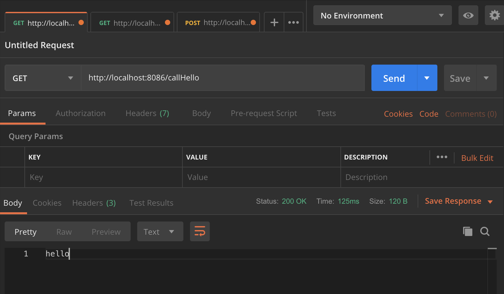
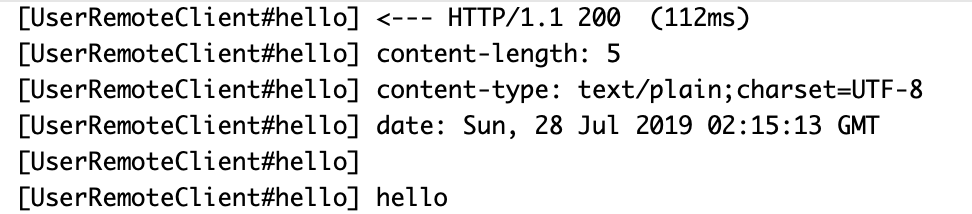
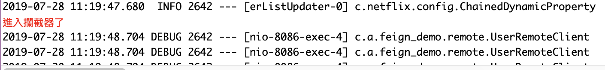
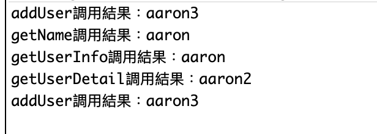

# Feign Web：服務客戶端，能夠簡化 HTTP 接口的調用方式
##### 是一個申明式的 REST 客戶端，讓 REST 調用更加簡單。
- Feign 是一個聲明式的 REST 客戶端，它的目的就是讓 REST 調用更加簡單。
- Feign 提供了 HTTP 請求的模板，通過編寫簡單的接口和插入註解，就可以定義好 HTTP 請求的參數、格式、地址等信息。
- 而 Feign 則會完全代理 HTTP 請求，我們只需要像調用方法一樣調用它就可以完成服務請求及相關處理。
- SpringCloud 對 Feign 進行了封裝，使其支持 SpringMVC 標準註解和HttpMessageConverters。
- Feign 可以與 Eureka 和 Ribbon 組合使用以支持負載均衡。

## 參數
- Spring boot：2.0.6.RELEASE
- Spring cloud：Finchley.SR2
- Java：8
- 專案
    - aaron-feign-demo：使用 Feign 調用服務接口
        - Main：App
        - Group id：com.aaron
        - Artifact id：aaron-feign-demo
        - Version：0.0.1-SNAPSHOT
    - aaron-feign-inherit-api：透過 Feign 繼承特性讓服務接口單獨抽出，作為公共依賴。
        - Main：無
        - Group id：com.aaron
        - Artifact id：aaron-feign-inherit-api
        - Version：0.0.1-SNAPSHOT
    - aaron-feign-inherit-provide：透過 Feign 繼承特性的服務提供者
        - Main：App
        - Group id：com.aaron
        - Artifact id：aron-feign-inherit-provide
        - Version：0.0.1-SNAPSHOT
    - aaron-feign-inherit-consume：透過 Feign 繼承特性的服務消費者
        - Main：App
        - Group id：com.aaron
        - Artifact id：aaronn-feign-inherit-consum
        - Version：0.0.1-SNAPSHOT
    - aaron-feign-native-demo：脫離 Spring Cloud 使用 Feign
        - Main：App
        - Group id：com.aaron
        - Artifact id：aaron-feign-native-demo
        - Version：0.0.1-SNAPSHOT
- 服務依賴
    - aaron-eureka-server 
    - aaronn-eureka-user-service

## aaron-feign-demo：使用 Feign 調用服務接口


### 開發

#### 使用 Feign 調用接口
- UserRemoteClient.java
```
// 定義 Feign 客戶端；調用 aaron-eureka-client-user-service
@FeignClient(value="aaron-eureka-client-user-service", configuration=FeignConfiguration.class)
public interface UserRemoteClient {

	@GetMapping("/user/hello") 
	String hello();
	
}
```

- DemoController.java
```
    // 採用 Feign 調用 /user/hello 接口
	@Autowired
	private UserRemoteClient userRemoteClient;

	@GetMapping("/callHello")
	public String callHello() {
		String result = userRemoteClient.hello();
		System.out.println(" 調用結果：" + result);
		return result;
	}
```

#### 自定義 Feign 配置
#####  Feign 日誌級別
- Spring cloud netfix 組件中，Feign 相關的日誌默認是不會輸出的，需要自定義配置才能輸出，並且 Feign 只對 Debug 基本的日誌做出響應， 實際業務需要輸出 Info 級別的日誌，所以需要做自定義配置，覆蓋相關配置Bean。
- FeignConfiguration.java
```
// 日誌級別主要有以下幾種：
// NONE，無記錄（DEFAULT）。 
// BASIC，只記錄請求方法和URL以及響應狀態代碼和執行時間。
// HEADERS，記錄基本信息以及請求和響應標頭。
// FULL，記錄請求和響應的頭文件，正文和元數據。
@Bean
	Logger.Level feignLoggerLevel() {
		return Logger.Level.FULL;
	}
```
- UserRemoteClient.java
```
# 使用配置 FeignConfiguration.class
@FeignClient(value="aaron-eureka-client-user-service", configuration=FeignConfiguration.class)
public interface UserRemoteClient {
 // ...	
}
```
- application.properties
```
# 需在在配置文件執行 Client 日誌級別才能正常輸出日誌
logging.level.com.aaron.feign_demo.remote.UserRemoteClient=DEBUG
```

#####  契約配置
- FeignConfiguration.java
```
    // 原生 Feign 是不支持 Spring MVC 註解。Spring Cloud 中默認的是 SprinngMvcContract。
    // 如果想在 Spring Cloud 中使用原生的註解方式來定義客戶端也是可以的，通過配置契約來改變這個配置。
    // 當配置為 Default 契約後，之前定義的 Client 就無法使用了；之前採用的註解是 SprinngMvcContract 的註解。
	@Bean
	public Contract feigncontract() {
		return new feign.Contract.Default();
	}
```

#####  Basic 認證配置

- FeignConfiguration.java
```
    // Feign Basic 認證配置
	@Bean
	public BasicAuthRequestInterceptor basicAuthRequestInterceptor() {
		return new BasicAuthRequestInterceptor("user", "password");
	}

```

#####  自定義攔截器實現認證

- FeignConfiguration.java
```
    // 丞上；將配置改成自定義
    // 自定義攔截器實現認證
	@Bean
	public FeignBasicAuthRequestInterceptor feignBasicAuthRequestInterceptor() {
		return new FeignBasicAuthRequestInterceptor();
	}
```

- FeignBasicAuthRequestInterceptor.java
```
public class FeignBasicAuthRequestInterceptor implements RequestInterceptor {
	
	public FeignBasicAuthRequestInterceptor() {}

	public void apply(RequestTemplate template) {
		// 業務邏輯
		System.err.println("進入攔截器了");
	}	
}
```

#####  超時間配置

- FeignConfiguration.java
```
@Bean
	public Request.Options options() {
		return new Request.Options(5000, 10000);
	}
```

#####  客戶端組建配置
###### Feign 默認使用 JDK 原生的 URLConnectin 發送 HTTP 請求，可以透過其他組件進行更換。
- 例如：
    - Apache HttpClient
    - OkHttp
- poxm.xml
```
		<dependency>
			<groupId>io.github.openfeign</groupId>
			<artifactId>feign-okhttp</artifactId>
		</dependency>
```
- application.properties
```
# feign 使用 okhttp
feign.httpclient.enabled=false 
feign.okhttp.enabled=true
```

##### GZIP 壓縮配置
- application.properties
```
# 節省網路資源；提升接口性能
feign.compression.request.enabled=true
feign.compression.response.enabled=true

# 配置壓縮類型；最小壓縮標準
feign.compression.request.mime-types=text/xml,application/xml,application/json
feign.compression.request.min-request-size=2048
```

#####  使用配置自定義 Feign 的配置
- 上述配置均可在 application.properties 上設置；相關詳情請自行查閱網路資源。


### 配置
- application.properties
```
spring.application.name=aaron-feign-demo
server.port=8086
```

### 測試





### 維運
- 服務接口
    - aaron-feign-demo
    `GET http://localhost:8086/callHello`

## aaron-feign-inherit-api：透過 Feign 繼承特性讓服務接口單獨抽出，作為公共依賴。

##### 通過將接口的定義單獨抽離出，服務提供供方去實現接口，服務消費方直接就可以引入定義好的接口進行調用。

### 開發
#### 繼承特性：定義接口
- pom.xml
```
        # 增加繼承特性
		<dependency>
			<groupId>org.springframework.cloud</groupId>
			<artifactId>spring-cloud-starter-openfeign</artifactId>
		</dependency>
```

- UserRemoteClient.java
```
// 定義接口；指定服務名稱
@FeignClient("aaron-feign-inherit-provide")
public interface UserRemoteClient {
	
	@GetMapping("/user/name")
	String getName();
	
	@GetMapping("/user/info")
	String getUserInfo(@RequestParam("name")String name);
	
	@GetMapping("/user/detail")
	String getUserDetail(@RequestParam Map<String, Object> param);
	
	@PostMapping("/user/add")
	String addUser(@RequestBody User user);
	
}
```

切換至  aaron-feign-inherit-provide 專案，接續完成繼承特性...

### 配置

### 測試

### 維運


## aaron-feign-inherit-provide：透過 Feign 繼承特性的服務提供者

 
### 開發
#### 繼承特性：服務提供者

- pom.xml
```
       # 引入 aaron-feign-inherit-api
		<dependency>
			<groupId>com.aaron</groupId>
			<artifactId>aaron-feign-inherit-api</artifactId>
			<version>0.0.1-SNAPSHOT</version>
		</dependency>
```

- DemoController.java
```
    // 實踐 UserRemoteClient 接口
@RestController
public class DemoController implements UserRemoteClient {

	@Override
	public String getName() {
		return "aaron";
	}

	@Override
	public String getUserInfo(@RequestParam("name")String name) {
		return name;
	}

	@Override
	public String getUserDetail(@RequestParam Map<String, Object> param) {
		System.err.println(param.toString());
		return param.get("name").toString();
	}

	@Override
	public String addUser(@RequestBody User user) {
		return user.getName();
	}

}
```

切換至  aaron-feign-inherit-consume 專案，接續完成繼承特性...

### 配置
- application.properties
```
spring.application.name=aaron-feign-inherit-provide
server.port=8087
```
### 測試

### 維運


## aaron-feign-inherit-consume：透過 Feign 繼承特性的服務消費者

### 開發
#### 繼承特性：服務消費者

DemoController.java
```
// 服務消費者
@Autowired
	private UserRemoteClient userRemoteClient;

	@GetMapping("/call")
	public String callHello() {
		String result = userRemoteClient.getName();
		System.out.println("getName調用結果：" + result);
		
		result = userRemoteClient.getUserInfo("aaron1");
		System.out.println("getUserInfo調用結果：" + result);
		
		Map<String, Object> param = new HashMap<String, Object>();
		param.put("name", "aaron2");
		result = userRemoteClient.getUserDetail(param);
		System.out.println("getUserDetail調用結果：" + result);
		
		User user = new User();
		user.setName("aaron3");
		result = userRemoteClient.addUser(user);
		System.out.println("addUser調用結果：" + result);
		return result;
	}
```

- App.java
```
# 依繼承接口 aaron-feign-inherit-api 設定 package path 
@EnableFeignClients(basePackages= {"com.aaron.feignapi"})
 // ....
```

### 配置
- application.properties
```
spring.application.name=aaron-feign-inherit-consume
server.port=8086
```
### 測試



### 維運
- 服務接口
`GET http://localhost:8086/call`


# aaron-feign-native-demo：脫離 Spring Cloud 使用 Feign

### 開發
#### 建構 Feign 對象
- pom.xml
```
		<dependency>
			<groupId>io.github.openfeign</groupId>
			<artifactId>feign-core</artifactId>
			<version>10.1.0</version>
		</dependency>
```

- RestApiCallUtils.java
```
// 建構 Feign 工具類
public static <T> T getRestClient(Class<T> apiType, String url) {
		return Feign.builder().target(apiType, url);
	}
```

- HelloRemote.java
```
public interface HelloRemote {
	// 原生註解定義客戶端
	@RequestLine("GET /user/hello") 
	String hello();
	
}
```
- App.java
```
// Feign 原生方式調用接口
HelloRemote helloRemote = RestApiCallUtils.getRestClient(HelloRemote.class,"http://localhost:8083");
```

### 配置
- application.properties
```
spring.application.name=aaronn-feign-demo
server.port=8086
```
### 測試


### 維運


