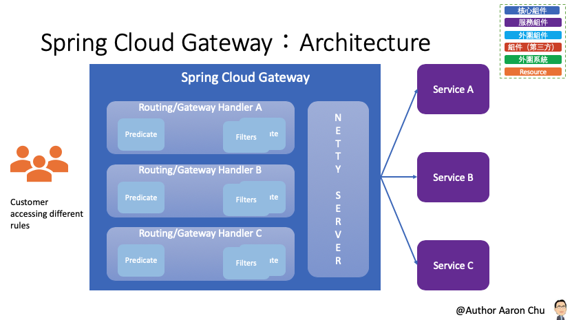
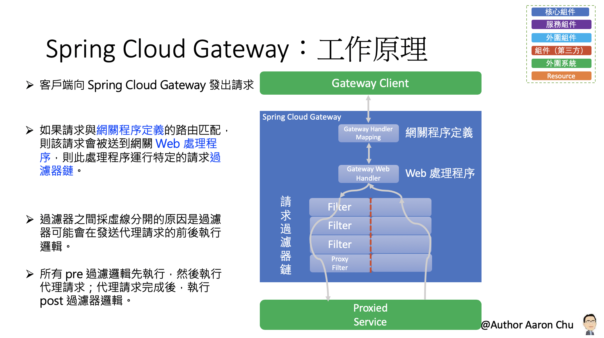
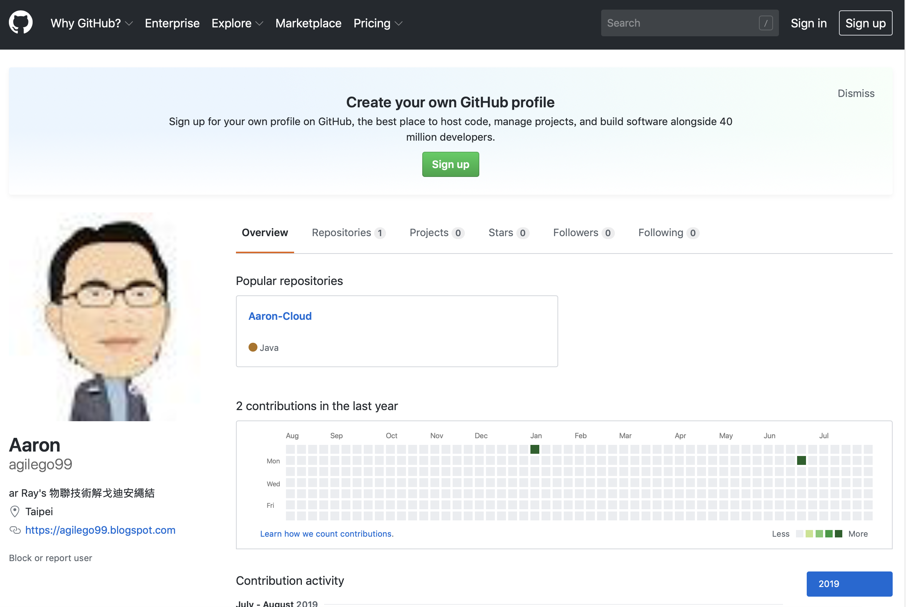
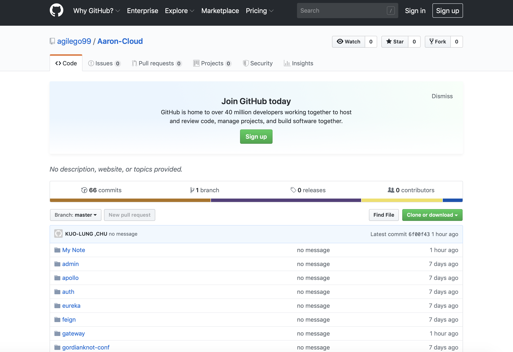
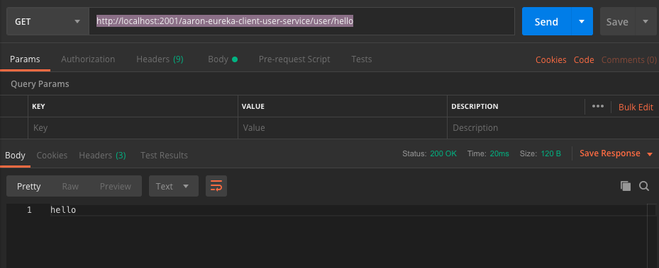
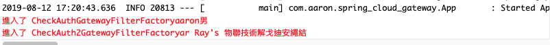
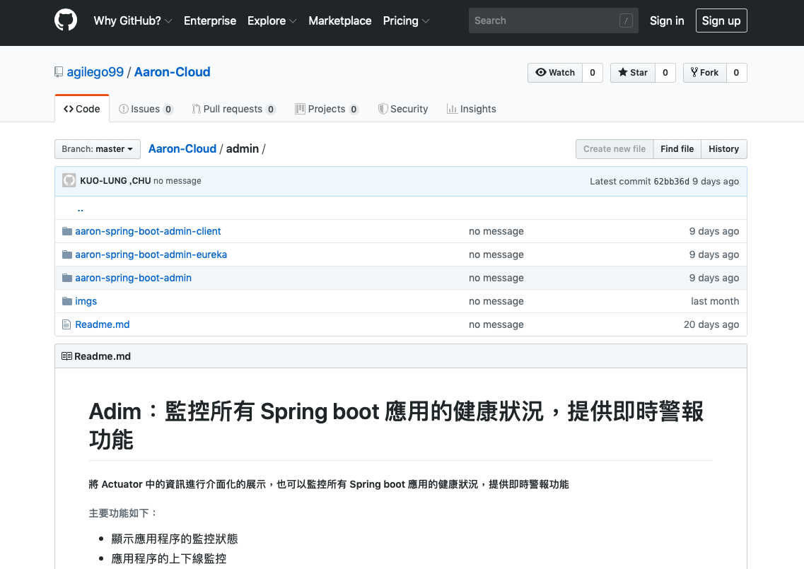
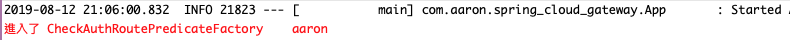

# Spring Cloud Gateway：一種簡單有效的統一的 API 路由管理方式
###### Spring Cloud Gateway 是 Spring Cloud 的一個全新項目
- Spring Cloud Gateway 是基於 Spring 5.0，Spring Boot 2.0 和 Project Reactor 等技術開發的網關；目的它在為微服務架構提供一種簡單有效的統一的 API 路由管理方式。
- Spring Cloud Gateway 作為 Spring Cloud 生態系統中的網關，目標是替代 Netflix Zuul，其不僅提供統一的路由方式，並且基於 Filter 鏈的方式提供了網關基本的功能；例如：安全，監控/指標，和限流。




## 參數
- Spring boot：2.0.6.RELEASE
- Spring cloud：Finchley.SR2
- Java：8
- 專案
    - aaron-spring-cloud-gateway
        - Main：App
        - Group id：com.aaron
        - Artifact id：aaron-spring-cloud-gateway
        - Version：0.0.1-SNAPSHOT
- 服務依賴
    - aaron-eureka-server
    - aaron-eureka-client-user-service
## aaron-spring-cloud-gateway

### 開發

###### 路由轉發
- applicaltion.yml
```
server:
  port: 2001
spring:
 cloud:
    gateway:
      routes:
      # 路由轉發：訪問 http://localhost:2001/agilego99 會轉發到 https://github.com/agilego99
      - id: path_route
        uri: https://agilego99.blogspot.com
        predicates:
        - Path=/agilego99
      #  路由轉發：支援多階層；訪問 http://localhost:2001/agilego99/Aaron-Cloud 會轉發到 https://github.com/agilego99/Aaron-Cloud/
      - id: path_route2
        uri: https://github.com
        predicates:
        # 支援多階層 Path，在後面加上兩個 **
        - Path=/agilego99/**  
```

###### 整合 Eureka 路由
- pom.xml
```
		<dependency>
	        <groupId>org.springframework.cloud</groupId>
	        <artifactId>spring-cloud-starter-netflix-eureka-client</artifactId>
		</dependency>
```
- applicaltion.yml（若採用「整合 Eureka 的默認路由」設計，可免去以下設定）
```
      # 整合 Eureka 路由
      - id: aaron-eureka-client-user-service
        # uri: lb://服務名稱 (lb 代表從註冊中心獲取服務）
        uri: lb://aaron-eureka-client-user-service
        predicates:
        - Path=/aaron-eureka-client-user-service/**
```

###### 整合 Eureka 的默認路由：為所有服務都進行轉發操作，透過以下方式不用為每個服務配置轉發規則，當新加入的服務的時候，不用配置路由規則和重啟網關。
- application.yml
```
Spring:
    cloud:
      discovery:
        locator:
          enabled: true
          # http://網關地址/服務名稱（小寫）/**；lowerCaseServiceId 默認值為 false（大寫）
          lowerCaseServiceId: true
```

###### Spring Cloud Gateway 路由斷言工廠：Spring Cloud Gateway 本身內置許多路由斷言工廠，可以通過配置的方式直接使用，也可以組合使用多個路由斷言工廠。

###### Path 路由斷言工廠：根據 Path 定義好的規則來判斷訪問的 URI 使否匹配。
- application.yml
```
      # Path 路由斷言工廠；如果請求路徑為 /agilego99/Aaron-Cloud/tree/master/xxx，則此路由匹配
      - id: host_route
        uri: https://github.com/agilego99
        predicates:
      - Path=/agilego99/Aaron-Cloud/tree/master/{segment}
        filters:
         - CheckAuth=aaron,男
         - name: CheckAuth2
           args:
             name: ar Ray's 物聯技術解戈迪安繩結
```

###### Query 路由斷言工廠：Query 路由斷言工廠接收兩個參數，一個必需的參數和一個可選的正則表達式
- application.yml
```
      - id: query_route
        uri: https://agilego99.blogspot.com
        predicates:
        # 請求參數包含 foo 屬性必且參數值是以 ba 開頭長度為三位的字串才會進行匹配路由
        - Query=foo, ba.
```

###### Header 路由斷言工廠：Header 路由斷言工廠接收兩個參數，分別是請求頭名稱和正規表達式
- application.yml
```
      - id: header_route
        uri: http://example.org
        predicates:
        - Header=X-Request-Id, \d+
```

###### 自定義路由斷言工廠：命名時需要以 RoutePredicateFactory 結尾；譬如：CheckAuthRoutePredicateFactory，在使用的時候 「CheckAuth」就是這個路由斷言工廠的名稱。
- CheckAuthRoutePredicateFactory.java
```
@Component
// 命名時需要以 RoutePredicateFactory 結尾，在使用的時候 「CheckAuth」就是這個路由斷言工廠的名稱
public class CheckAuthRoutePredicateFactory extends AbstractRoutePredicateFactory<CheckAuthRoutePredicateFactory.Config> {

	public CheckAuthRoutePredicateFactory() {
		super(Config.class);
	}

	@Override
	public Predicate<ServerWebExchange> apply(Config config) {
		return exchange -> {
			System.err.println("進入了 CheckAuthRoutePredicateFactory\t" + config.getName());
			if (config.getName().equals("yinjihuan")) {
				return true;
			}
			return false;
		};
	}

	public static class Config {
		
		private String name;
		
		public void setName(String name) {
			this.name = name;
		}
		
		public String getName() {
			return name;
		}
		
	}
```
- application.yml
```
      # 自定義路由斷言工廠；搭配 CheckAuthRoutePredicateFactory；在使用的時候 「CheckAuth」就是這個路由斷言工廠的名稱
      - id: customer_route
        uri: https://agilego99.blogspot.com
        predicates:
        - name: CheckAuth
          args:
            name: aaron
```

###### Spring Cloud Gateway 過濾器工廠：GatewayFilter Factory 是 Spring Cloud Gateway 中提供的過濾器工廠。

###### 自定義 Spring Cloud Gateway 過濾器工廠：CheckAuth2GatewayFilterFactory；在使用的時候 「CheckAuth2」就是這個路由斷言工廠的名稱

- CheckAuthGatewayFilterFactory.java
```
/**
 * 自定義 GatewayFilterFactory
 * @author aaron
 *
 */
@Component
public class CheckAuthGatewayFilterFactory extends AbstractNameValueGatewayFilterFactory {

	@Override
	public GatewayFilter apply(NameValueConfig config) {
		return (exchange, chain) -> {
			System.err.println("進入了 CheckAuthGatewayFilterFactory" + config.getName() + "\t" + config.getValue());
			ServerHttpRequest request = exchange.getRequest().mutate()
					.build();

			return chain.filter(exchange.mutate().request(request).build());
		};
	}

}
```

- CheckAuth2GatewayFilterFactory.java
```
@Component
public class CheckAuth2GatewayFilterFactory extends AbstractGatewayFilterFactory<CheckAuth2GatewayFilterFactory.Config>{
	public CheckAuth2GatewayFilterFactory() {
		super(Config.class);
	}
	
	@Override
	public GatewayFilter apply(Config config) {
		return (exchange, chain) -> {
			System.err.println("進入了 CheckAuth2GatewayFilterFactory" + config.getName());
			ServerHttpRequest request = exchange.getRequest().mutate()
					.build();

			return chain.filter(exchange.mutate().request(request).build());
		};
	}
	
	public static class Config {
		
		private String name;
		
		public void setName(String name) {
			this.name = name;
		}
		
		public String getName() {
			return name;
		}
		
	}
}
```
- application.yml
```
        filters:
         # 自定義過濾器因繼承 AbstractNameValueGatewayFilterFactory，可不用自己定義配置累，直接繼承使用即可
         - CheckAuth=aaron,男
         # 自定義過濾器因繼承  AbstractGatewayFilterFactory，需要定義一個 NameValueConfig
         - name: CheckAuth2
           args:
             name: ar Ray's 物聯技術解戈迪安繩結
```

###### 熔斷回退

- pom.xml
```
		<dependency>
			<groupId>org.springframework.cloud</groupId>
			<artifactId>spring-cloud-starter-netflix-hystrix</artifactId>
		</dependency>
```
- application.yml
```
        filters:
        - name: Hystrix
          args:
            name: fallbackcmd
            # 發生熔斷拾回退的 URI 地址，目前只支持 forward 模式的 URI。如果服務被降級，該請求會被轉發到該 URI 中。
            fallbackUri: forward:/fallback
```
- FallbackController.java
```
@RestController
public class FallbackController {
	
	@GetMapping("/fallback")
	public String fallback() {
		return "fallback";
	}
}
```

###### 跨域：Spring Cloud Gateway 中配置跨域有兩種方式，分別是代碼配置方式和配置文件方式
- CorsConfig.java
```
public class CorsConfig {

	@Bean
	public WebFilter corsFilter() {
		return (ServerWebExchange ctx, WebFilterChain chain) -> {
			ServerHttpRequest request = ctx.getRequest();
			if (CorsUtils.isCorsRequest(request)) {
				HttpHeaders requestHeaders = request.getHeaders();
				ServerHttpResponse response = ctx.getResponse();
				HttpMethod requestMethod = requestHeaders.getAccessControlRequestMethod();
				HttpHeaders headers = response.getHeaders();
				headers.add(HttpHeaders.ACCESS_CONTROL_ALLOW_ORIGIN, requestHeaders.getOrigin());
				headers.addAll(HttpHeaders.ACCESS_CONTROL_ALLOW_HEADERS, requestHeaders.getAccessControlRequestHeaders());
				if (requestMethod != null) {
					headers.add(HttpHeaders.ACCESS_CONTROL_ALLOW_METHODS, requestMethod.name());
				}
				headers.add(HttpHeaders.ACCESS_CONTROL_ALLOW_CREDENTIALS, "true");
				headers.add(HttpHeaders.ACCESS_CONTROL_EXPOSE_HEADERS, "*");
				if (request.getMethod() == HttpMethod.OPTIONS) {
					response.setStatusCode(HttpStatus.OK);
					return Mono.empty();
				}
			}
			return chain.filter(ctx);
		};
```
- application.yml
```
      globalcors:
        corsConfigurations:
          '[/**]':
            allowedOrigins: "*"
            exposedHeaders:
            - content-type
            allowedHeaders:
            - content-type
            allowCredentials: true
            allowedMethods:
            - GET
            - OPTIONS
            - PUT
            - DELETE
            - POST
```

###### 統一異常處理：自定義異常處理邏輯
- JsonExceptionHandler.java
```
public class JsonExceptionHandler extends DefaultErrorWebExceptionHandler {

	public JsonExceptionHandler(ErrorAttributes errorAttributes, ResourceProperties resourceProperties,
			ErrorProperties errorProperties, ApplicationContext applicationContext) {
		super(errorAttributes, resourceProperties, errorProperties, applicationContext);
	}

	/**
	 * 獲取異常屬性
	 */
	@Override
	protected Map<String, Object> getErrorAttributes(ServerRequest request, boolean includeStackTrace) {
		int code = 500;
		Throwable error = super.getError(request);
		if (error instanceof org.springframework.cloud.gateway.support.NotFoundException) {
			code = 404;
		}
		return response(code, this.buildMessage(request, error));
	}

	/**
	 * 指定響應處理方法為JSON處理的方法
	 * @param errorAttributes
	 */
	@Override
	protected RouterFunction<ServerResponse> getRoutingFunction(ErrorAttributes errorAttributes) {
		return RouterFunctions.route(RequestPredicates.all(), this::renderErrorResponse);
	}

	/**
	 * 根據code獲取對應的HttpStatus
	 * @param errorAttributes
	 */
	@Override
	protected HttpStatus getHttpStatus(Map<String, Object> errorAttributes) {
		int statusCode = (int) errorAttributes.get("code");
		return HttpStatus.valueOf(statusCode);
	}

	/**
	 * 構建異常信息
	 * @param request
	 * @param ex
	 * @return
	 */
	private String buildMessage(ServerRequest request, Throwable ex) {
		StringBuilder message = new StringBuilder("Failed to handle request [");
		message.append(request.methodName());
		message.append(" ");
		message.append(request.uri());
		message.append("]");
		if (ex != null) {
			message.append(": ");
			message.append(ex.getMessage());
		}
		return message.toString();
	}

	/**
	 * 構建返回的JSON數據格式
	 * @param status		狀態碼
	 * @param errorMessage  異常信息
	 * @return
	 */
	public static Map<String, Object> response(int status, String errorMessage) {
		Map<String, Object> map = new HashMap<>();
		map.put("code", status);
		map.put("message", errorMessage);
		map.put("data", null);
		return map;
	}
}
```

###### 重試機制
- application.yml
```
        filters:
        - name: Retry
          args:
            retries: 3
            # 狀態碼配置（分段），符合某段狀態馬才會進行重試邏輯，默認值是 SERVER_ERROR，值是 5。
            series: SERVER_ERROR
```

### 配置
- pom.xml
```
# Spring Cloud Gateway 相關依賴
	<parent>
		<groupId>org.springframework.boot</groupId>
		<artifactId>spring-boot-starter-parent</artifactId>
		<version>2.0.6.RELEASE</version>
		<relativePath />
	</parent>
	<dependencyManagement>
		<dependencies>
			<dependency>
				<groupId>org.springframework.cloud</groupId>
				<artifactId>spring-cloud-dependencies</artifactId>
				<version>Finchley.SR2</version>
				<type>pom</type>
				<scope>import</scope>
			</dependency>
		</dependencies>
	</dependencyManagement>
		<dependency>
			<groupId>org.springframework.cloud</groupId>
			<artifactId>spring-cloud-starter-gateway</artifactId>
		</dependency>
```


### 測試
###### 路由轉發
- 路由轉發：`http://localhost:2001/agilego99`

- 路由轉發：支持多級 Path `http://localhost:2001/agilego99/Aaron-Cloud`

整合 Eureka 路由

###### 整合 Eureka 路由 `http://localhost:2001/aaron-eureka-client-user-service/user/hello`



##### Spring Cloud Gateway 路由斷言工廠
###### Path 路由斷言工廠
- Path 路由斷言工廠 `http://localhost:2001/agilego99/Aaron-Cloud/tree/master/admin` 對應 `https://github.com/agilego99/Aaron-Cloud/tree/master/admin`


###### Query 路由斷言工廠
- Query 路由斷言工廠 `http://localhost:2001/?foo=baz` 對應 `https://agilego99.blogspot.com`
###### 自定義路由斷言工廠 `http://localhost:2001/CheckAuth`


### 維運

