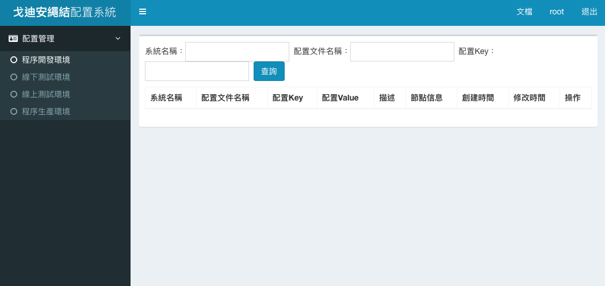
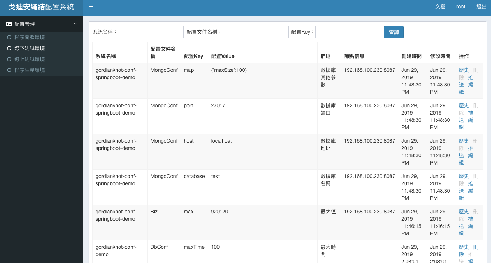

# Gordianknot-conf（Smconf）：分佈式配置管理；集中化專案配置的管理，達到統一修改，即時生效。

###### 系統架構
- 客戶端在啟動時將自身的資訊註冊到 Zookeeper 中，為每一個配置文件註冊一個節點，添加 Watcher 監聽，同時獲取 Server 的節點資訊，然後在 Smconf Server 初始化配置數據或著拉取最新的配置到本地。
- 配置資訊在配置中心不存在才會初始化配置，若存在則拉取配置中心的配至覆蓋本地配置。
###### 框架特色
- 整合下列系統
    - Java
    - Zookeeper
    - MongoDB
    - Eureka
- 提供配置的統一管理
- 多個環境
    - prod：正式環境
    - online：線上測試環境
    - test：線下測試環境
    - dev：開發環境
- web 後台配置管理
- 配置修改後即時同步到使用的客戶端（較 Spring Cloud Config 刷新速度快）
- 無縫集成 spring 和 spring boot 項目
- 非 spring 項目中也可以使用；以 REST 方式調用
- web 後台支持不同賬號管理不同環境的配置
- 支持水平擴容，負載，部署多個 server，client 自動發現
- 支持用戶自定義配置修改回調接口做擴展
- 支持手動觸發推送配置到指定的節點
- 修改配置可以選擇推送的節點，可用於做灰度發佈測試
- 配置的歷史修改記錄

## 參數
- Spring boot：2.0.6.RELEASE
- Spring cloud：Finchley.SR2
- Java：8
- 專案
    - gordianknot-conf-web：Smconf 配置管理中心 GUI
        - Main：App
        - Group id：
        - Artifact id：gordianknot-conf-web
        - Version：1.0
    - gordianknot-conf-client：Smconf 客戶端導入套件
        - Main：
        - Group id：
        - Artifact id：
        - Version：
    - gordianknot-conf-demo：Smconf 集成一般 Java 專案
        - Main：App、NoSpringEnvDemo
        - Group id：org.gordianknot
        - Artifact id：gordianknot-spring-demo
        - Version：0.0.1-SNAPSHOT
    - gordianknot-springboot-demo：Smconf 集成 Spring boot 專案
        - Main：
        - Group id：
        - Artifact id：gordianknot-conf-springboot-demo
        - Version：
    - ...
- 服務依賴
    - Zookeeper
        - [Zookeeper 安裝](../server/Zookeeper)
    - MongoDB
        - [MongoDB 安裝](../server/MongoDB)
    - aaron-eureka-server

## gordianknot-conf-web：Smconf 配置管理中心 GUI
###### 服務端運作原理
- 配置資訊是存儲在 MongoDB 中，MongoDB 可以做 Cluster，也可以啟動多 Smconf Server，並且不需要做負載平衡，在啟動的時候配置中心會將自身的資訊註冊到 Zookeeper 中。當配置發生修改的時候，通過觸發 Zookeeper 的 watcher 事件來通知 Smconf Client 有修改，需要除新裝配配置資訊。
- Smconf 提供了友好的 Web 頁面對配置資訊進行管理，通過不同的帳號、不同的權限控制，確保配置不被隨便修改。

### 開發
###### REST API
- Conf.java
```
@Getter
@Setter
@Document(collection="conf")
@CompoundIndexes({
    @CompoundIndex(name = "conf_index", def = "{env:1, s_name:1, c_fname:1, key:1}", unique = true, background = true)
})
// REST API 數據結構實體類
public class Conf {
    @Id
    private String id;
    
    /**
     * 環境
     */
    @Field("env")
    private String env;
    
    /**
     * 系統名稱
     */
    @Field("s_name")
    private String systemName;
    
    /**
     * 配置文件名稱
     */
    @Field("c_fname")
    private String confFileName;
    
    /**
     * 配置Key
     */
    @Field("key")
    private String key;
    
    /**
     * 配置Value
     */
    @Field("value")
    private String value;
    
    /**
     * 描述
     */
    @Field("desc")
    private String desc;
    
    /**
     * 創建時間
     */
    @Field("c_date")
    private Date createDate;
    
    /**
     * 修改時間
     */
    @Field("m_date")
    private Date modifyDate;
    
}
```

### 配置
- pom.xml
```
		<dependency>
			<groupId>org.gordianknot</groupId>
			<artifactId>gordianknot-conf-client</artifactId>
			<version>1.0</version>
			<exclusions>
			  <exclusion> 
			    <groupId>org.slf4j</groupId>
			    <artifactId>slf4j-log4j12</artifactId>
			  </exclusion>
			  <exclusion> 
			    <groupId>log4j</groupId>
			    <artifactId>log4j</artifactId>
			  </exclusion>
			</exclusions> 
		</dependency>
```
- application.properties
```
#tomcat port
server.port=8080
# 認證資料庫；採用帳密登入時必須要加入
spring.data.mongodb.authentication-database=admin
spring.data.mongodb.database=gordianknot_conf
spring.data.mongodb.host=gordianknot
spring.data.mongodb.port=27017
spring.data.mongodb.username=admin
spring.data.mongodb.password=999999

zookeeper.url=gordianknot:2181

# Web 後台管理頁面顯示名稱，不輸入此值則默認為「戈迪安繩結」
smconf.projectName=戈迪安繩結
# Web 後台頁面的配置歷史操作記錄數量，不輸入此值默認最新顯示200條修改紀錄
smconf.log.limit:200 

```
### 測試
- 啟動專案 `java -jar gordianknot-conf-web-1.0.jar `
``` 
# 登入 http://localhost:8080
# 帳號：root
# 密碼：999999
```



### 維運

## gordianknot-conf-client：Smconf 客戶端導入套件
###### 客戶端運作原理
- 客戶端啟動的時候會將自身的資訊註冊到 Zookeeper 中，為每一個配置文件註冊一個節點，增添 watcher 監聽，同時獲取 Server 節點資訊，然後連結 Smconf server 初始化配置資料或者拉取最新的配置到本地。
- 配置資訊只有在配置中心不存在時才會初始化配置，如存在，則拉取配置中心的配置覆蓋本地的配置。

### 開發

### 配置

### 測試

### 維運


## gordianknot-conf-demo：Smconf 集成一般 Java 專案

### 開發
##### 啟動 Smconf 客戶端
###### 非 Spring 專案的手動調用初始化方式
- App.java
```
	// 抑制與使用 Closeable 類型的資源相關的警告
 	@SuppressWarnings("resource")
 	public static void main(String[] args) {
 		
 		//可以通過環境變量設置 zk 和 env 的值
 		System.setProperty("zookeeper.url", "gordianknot:2181");
 		System.setProperty("spring.profiles.active", "test");
 		 		
 		new ClassPathXmlApplicationContext("spring.xml").start();
 		System.out.println(ConfApplication.getBean(DbConf.class).getMaxTime());
 		
 		//測試有前綴的並且要設置到環境變量中的值
 		System.out.println(System.getProperty("org.gordianknot.max"));
 		
 		Biz biz = ConfApplication.getBean(Biz.class);
 		String max = biz.getMax();
 		System.out.println(max);
 		try {
 			Thread.sleep(1000 * 60);
 		} catch (InterruptedException e) {
 			e.printStackTrace();
 		}
 		String max2 = biz.getMax();
 		System.out.println(max2);
 	}
```
- NoSpringEnvDemo.java
```
    public static void main(String[] args) {
    	/* 
    	  非 Spring環境中使用： 
          手動調用初始化的方法；在還沒初始化之前加載配置資訊，可以在啟動類中通過設置全局
          以本專案為例會以 org.gordianknot.conf.demo.conf 下的 Biz 及 DbConf 的內容為初始化
          需不需要初始化取決於是否要在初始化之前使用配置資訊，如果不需要就不用配置，比如資料庫連線資訊在啟動時就需要。
        */
    	SmconfInit.init("org.gordianknot.conf.demo.conf");
        System.out.println(ConfApplication.getBean(DbConf.class).getMaxTime());
    }
```
###### Spring 專案的手動調用初始化方式
- gordianknot-conf-springboot-demo:App.java
```
public class App {
 	
 	//可以使用Bean的創建方式來初始化配置客戶端
 	@Bean
 	public ConfInit confInit() {
 		return new ConfInit();
 	}
 	
 	public static void main(String[] args) {
    	// 起動時配置初始化資訊 
    	System.setProperty("smconf.conf.package","org.gordianknot.conf.demo.conf");
 		SpringApplication.run(App.class, args);
 	}
}
```
###### 自定義配置
- Biz.java
```
/* @GordianknotConf 用來標示這是一個 Smconf 配置類
 * system 表示當前是哪一個系統在使用
 * env=true 表是當前類下的配置資訊突過 System.setProperty 將值存儲在系統變量中，在程式碼中可以通過 System.getProperty 來獲取，在屬性文件中可以通過 ${key} 來獲取。
 * prefix 為配置類的字串加前綴，若字串名為「max」，prefix「org.gordianknot」則配置的整個 key 就是「org.gordianknot.max」 
 */
@GordianknotConf(system="gordianknot-conf-demo", env=true, prefix="org.gordianknot")
public class Biz {
	@ConfField("最大值")
	private String max = "920120";

	public String getMax() {
		return max;
	}

	public void setMax(String max) {
		this.max = max;
	}
```

###### 配置更新回調
- Biz.java
```
	/**
	 * 當配置修改後，若需要執行某些操作；譬如併發高了，則可以根據併發量去調整 Connection Pool 參數。
	 * 在 Smconf Client 可以實現回調接口來監聽修改事件 
	 */
	@Override
	public void reload(Conf conf) {
		// 執行執回調業務邏輯
	}
```

### 配置
- pom.xml
```
		<dependency>
			<groupId>org.gordianknot</groupId>
			<artifactId>gordianknot-conf-client</artifactId>
			<version>1.0</version>
		</dependency>
```
- application.properties
```
zookeeper.url=localhost:2181
spring.profiles.active=test
server.port=8085
``` 
### 測試


### 維運


## ordianknot-springboot-demo：Smconf 集成 Spring boot 專案

### 開發
###### 配置資料庫連線資訊
- MongoConf.java
```
	// 認證資料庫；採用帳密登入時必須要加入
    @ConfField("認證資料庫名稱")
    private String authentication = "admin";
	
	@ConfField("資料庫名稱")
    private String database = "test";
    
    @ConfField("資料庫地址")
    private String host = "gordianknot";
    
    @ConfField("資料庫端口")
    private int port = 27017;
    
    // 使用認證時需要
    @ConfField("資料庫帳號") 
    private String username = "admin";
    
    // 使用認證時需要
    @ConfField("資料庫密碼") 
    private String password = "999999";
    
    @ConfField("資料庫其他參數")
    private Map<String, Object> map = new HashMap<String, Object>(){{
        put("maxSize", 100);
    }};
```

### 配置
- pom.xml
```
		<dependency>
			<groupId>org.gordianknot</groupId>
			<artifactId>gordianknot-conf-client</artifactId>
			<version>1.0</version>
		</dependency>
```
- application.properties
```
# 認證資料庫；採用帳密登入時必須要加入
spring.data.mongodb.authentication-database=${spring.data.mongodb.authentication}
spring.data.mongodb.database=${spring.data.mongodb.database}
spring.data.mongodb.host=${spring.data.mongodb.host}
spring.data.mongodb.port=${spring.data.mongodb.port}
spring.data.mongodb.username=${spring.data.mongodb.username}
spring.data.mongodb.password=${spring.data.mongodb.password}

server.port=8087
zookeeper.url=gordianknot:2181
spring.profiles.active=test
#多個包用逗號隔開org.conf,org.conf2
smconf.conf.package=org.gordianknot.conf.springboot.demo.conf
``` 
### 測試


### 維運 

