# Hystrix：服務容錯框架，能夠防止服務的雪崩效應
- 通過 HystrixCommand 對調用進行隔離，以阻止故障的連鎖效應，能夠讓接口調用快速失敗並迅速恢復正常
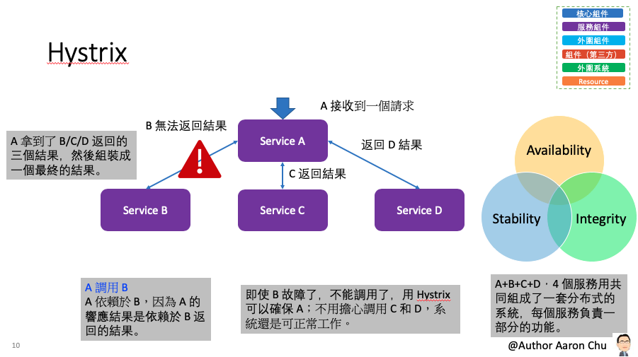
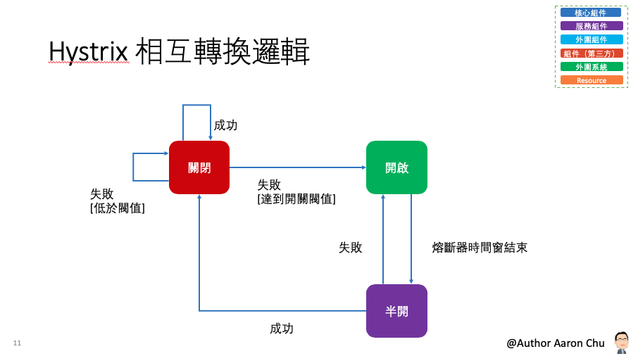
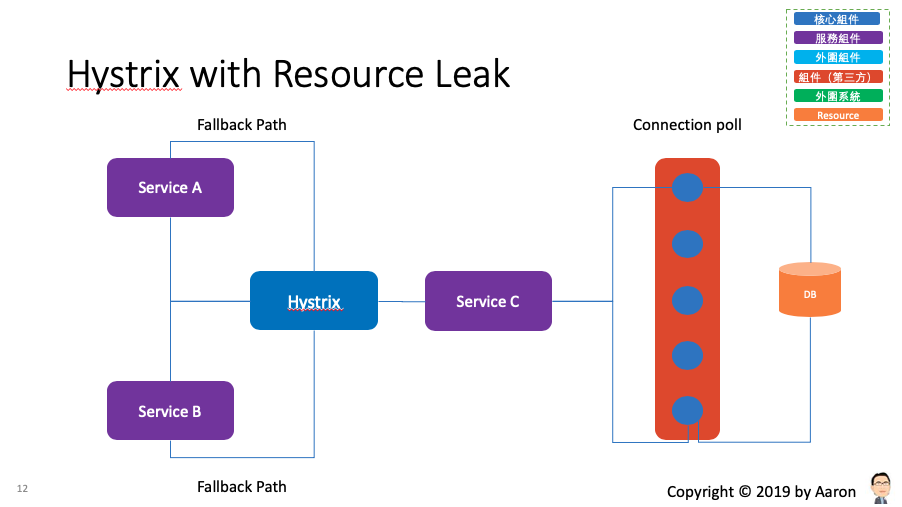

##### 高可用性設計原則：
- 對依賴服務調用時出現的調用延遲和調用失敗進行控制和容錯保護。
- 在複雜的分布式系統中，阻止某一個依賴服務的故障在整個系統中蔓延，A->B->C，C 故障了，B也故障了，A 故障了，整套分布式系統全部故障，造成整體當機。
- 提供 fail-fast（快速失敗）和快速恢復的支持。
- 提供 fallback 優雅降級的支持。
- 支持近實時的監控、報警以及運維操作。
##### 細部設計原則：
- 阻止任何一個依賴服務耗盡所有的資源，比如 tomcat 中的所有線程資源。
- 避免請求排隊和積壓，採用限流和 fail fast來控制故障。
- 提供 fallback 降級機制來應對故障。
- 使用資源隔離技術，比如 bulkhead（艙壁隔離技術），swimlane（泳道技術），circuit breaker（短路技術），來限制任何一個依賴服務的故障的影響。
- 通過近實時的統計/監控/報警功能，來提高故障發現的速度。
- 通過近實時的屬性和配置熱修改功能，來提高故障處理和恢復的速度。
- 保護依賴服務調用的所有故障情況，而不僅僅只是網絡故障情況。

## 參數
- Spring boot：2.0.6.RELEASE
- Spring cloud：Finchley.SR2
- Java：8
- 專案
     - aaron-hystrix-native-demo：Hystrix 簡單使用；使用 native Java
        - Main
            - demo1：基本應用
                - App
            - demo2：清除緩存
                - CacheClaeanApp
            - demo3：合併請求
                - CollapserApp
        - Group id：com.aaron
        - Artifact id：aaron-hystrix-native-demo
        - Version：0.0.1-SNAPSHOT
    - aaron-hystrix-springcloud-demo：在 Spring Cloud 使用 Hystrix
        - Main：App
        - Group id：com.aaron
        - Artifact id：aaron-hystrix-springcloud-demo
        - Version：0.0.1-SNAPSHOT
    - aaron-hystrix-fegin-demo：Feig 整合 Hystrix 容錯
        - Main：App
        - Group id：com.aaron
        - Artifact id：aaron-hystrix-fegin-demo
        - Version：0.0.1-SNAPSHOT
    - aaron-hystrix-dashboard-demo：Hystrix 服務監控
        - Main：DashboardApplication
        - Group id：com.aaron
        - Artifact id：aaron-hystrix-dashboard-demo
        - Version：0.0.1-SNAPSHOT
- 服務依賴
    - aaron-eureka-server
    - aaron-eureka-client-user-service


## aaron-hystrix-native-demo：Hystrix Hystrix 簡單使用；使用 native Java 方式
### 開發

##### 同步或非同步調用
- demo1.App.java
```
        // 同步調用；透過構造函數設置名稱
		String result = new MyHystrixCommand("aaron").execute(); 

        // 非同步調用；透過構造函數設置名稱
        Future<String> future = new MyHystrixCommand("aaron").queue();
```

##### Fallback
- demo1.HystrixCommand.java
```
// 回退機制 Fallback
public MyHystrixCommand(String name) {	
		 super(HystrixCommand.Setter.withGroupKey(
		           HystrixCommandGroupKey.Factory.asKey("MyGroup"));                 
		this.name = name;
	}
    
@Override
	protected String run() {

        // 透過增加執行時間模擬調用超時失敗的情況；測試時可將此註解解除，重新再執行程式一次
        /*try {
			Thread.sleep(1000 * 10);
		} catch (InterruptedException e) {
			e.printStackTrace();
		}*/
    
		System.err.println("get data");   
		return this.name + ":" + Thread.currentThread().getName();
	}

	@Override
	protected String getFallback() {
		return "失敗了";
	}

	@Override     
	protected String getCacheKey() {         
	  return String.valueOf(this.name); 
	}
```

##### 信號量策略配置
- demo1.HystrixCommand.java
```
public MyHystrixCommand(String name) {		
        // 通過信號量配置策略，當前是 Thread 隔離還是訊號量隔離 
		super(HystrixCommand.Setter                 
				.withGroupKey(HystrixCommandGroupKey.Factory.asKey("MyGroup"))                 
				.andCommandPropertiesDefaults(                 		
					HystrixCommandProperties.Setter()             
			    		.withExecutionIsolationStrategy(                	 
                              // 訊號隔離 
			    				HystrixCommandProperties.ExecutionIsolationStrategy.SEMAPHORE
			             )                 
			        )        
			  ); 
        ....
```

##### Thread 策略配置
- demo1.HystrixCommand.java
```
		 super(HystrixCommand.Setter.withGroupKey(
		           HystrixCommandGroupKey.Factory.asKey("MyGroup"))                 
		         .andCommandPropertiesDefaults(     
		             HystrixCommandProperties.Setter()     
		             .withExecutionIsolationStrategy(      
                       // Thread 隔離
		               HystrixCommandProperties.ExecutionIsolationStrategy.THREAD 
		             )                 
		         ).andThreadPoolPropertiesDefaults(    
		             HystrixThreadPoolProperties.Setter()      
		               .withCoreSize(10)                
		 	       .withMaxQueueSize(100)          
		       	       .withMaximumSize(100)               
		         )         
		);   
```

##### 結果緩存
- demo1.HystrixCommand.java
```
// Hystrix 提供方法級別的緩存．通過重寫 getCacheKey 來判斷是否返回緩存的數據。
@Override     
	protected String getCacheKey() {         
	  return String.valueOf(this.name); 
	}
    
// 增加輸出    
@Override
	protected String run() {
		System.err.println("get data");   
		return this.name + ":" + Thread.currentThread().getName();
	}
```

##### 緩存清除
- demo2.ClearCacheHystrixCommand.java
```
public class ClearCacheHystrixCommand extends HystrixCommand<String> {
	private final String name;
	private static final HystrixCommandKey GETTER_KEY = HystrixCommandKey.Factory.asKey("MyKey");

	public ClearCacheHystrixCommand(String name) {
		super(HystrixCommand.Setter.withGroupKey(HystrixCommandGroupKey.Factory.asKey("MyGroup"))
				.andCommandKey(GETTER_KEY));
		this.name = name;
	}
    // 清除緩存
 	public static void flushCache(String name) {
		HystrixRequestCache.getInstance(GETTER_KEY, HystrixConcurrencyStrategyDefault.getInstance()).clear(name);
	}

	@Override
	protected String getCacheKey() {
		return String.valueOf(this.name);
	}

	@Override
	protected String run() {
		System.err.println("get data");
		return this.name + ":" + Thread.currentThread().getName();
	}

	@Override
	protected String getFallback() {
		return "失敗了";
	}

}
```

##### 合併請求
-demo3.MyHystrixCollapser
```
public class MyHystrixCollapser extends HystrixCollapser<List<String>, String, String> {
	private final String name;

	public MyHystrixCollapser(String name) {
		this.name = name;
	}

	@Override
	public String getRequestArgument() {
		return name;
	}

	@Override
	protected HystrixCommand<List<String>> createCommand(final Collection<CollapsedRequest<String, String>> requests) {
		return new BatchCommand(requests);
	}

	@Override
	protected void mapResponseToRequests(List<String> batchResponse,
			Collection<CollapsedRequest<String, String>> requests) {
		int count = 0;
		for (CollapsedRequest<String, String> request : requests) {
			request.setResponse(batchResponse.get(count++));
		}
	}

	private static final class BatchCommand extends HystrixCommand<List<String>> {

		private final Collection<CollapsedRequest<String, String>> requests;

		private BatchCommand(Collection<CollapsedRequest<String, String>> requests) {
			super(Setter.withGroupKey(HystrixCommandGroupKey.Factory.asKey("ExampleGroup"))
					.andCommandKey(HystrixCommandKey.Factory.asKey("GetValueForKey")));
			this.requests = requests;
		}

		@Override
		protected List<String> run() {
			System.out.println("真正執行請求.......");
			ArrayList<String> response = new ArrayList<String>();
			for (CollapsedRequest<String, String> request : requests) {
				response.add("返回结果: " + request.getArgument());
			}
			return response;
		}
	}
}
```

### 配置
- pom.xml
```
		<dependency>
			<groupId>com.netflix.hystrix</groupId>
			<artifactId>hystrix-core</artifactId>
			<version>1.5.18</version>
		</dependency>
```

### 測試
- demo1.App.java
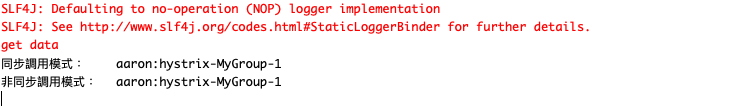

- deme2.CacheCleanApp.java
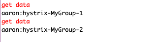
- deme3.CollapserApp.java

### 維運


## aaron-hystrix-springcloud-demo：在 Spring Cloud 使用 Hystrix

### 開發

##### 簡單使用
- app.java
```
// 增加 @EnableHystrix 註解；此註解包含 @EnableCircuitBreaker
@EnableHystrix
@SpringBootApplication
public class App {
	public static void main(String[] args) {
		SpringApplication.run(App.class, args);
	}
}
```
- HellController.java
```
	@GetMapping("/callHello")
	/* 
	 用於指定依賴服務調用延遲或失敗調用的方法
     測試；可於第二次執行時將 @HystrixCommand 取消，然後在執行一次將出現 500 錯誤
    */
	@HystrixCommand(fallbackMethod = "defaultCallHello", commandProperties = {                  
			@HystrixProperty(
					name="execution.isolation.strategy",      
					value = "THREAD")    
			} 
	)
	public String callHello() {
		String result = restTemplate.getForObject("http://localhost:8088/house/hello", String.class);
		return result;
	}
    // 回退方法定義
	public String defaultCallHello() {
		return "fail";
	}
```

### 配置
- pom.xml
```
		<dependency>
			<groupId>org.springframework.cloud</groupId>
			<artifactId>spring-cloud-starter-netflix-hystrix</artifactId>
		</dependency>
```
### 測試
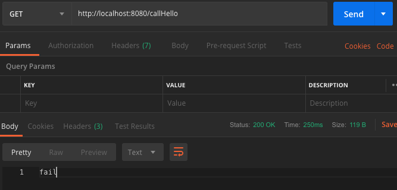
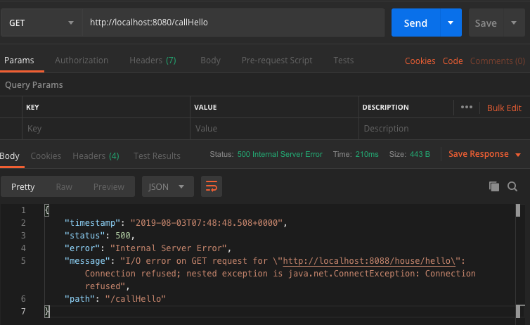

### 維運
- 服務接口
`http://localhost:8080/callHello`


## aaron-hystrix-fegin-demo：Feig 整合 Hystrix 容錯

### 開發
##### Fallback 方式：可以實現服務不可用時回退
-UserRemoteClient.java
```
@FeignClient(value="aaron-eureka-client-user-service", fallbackFactory=UserRemoteClientFallbackFactory.class)
public interface UserRemoteClient {

	@GetMapping("/user/hello") 
	String hello();
	
}
```
- UserRemoteClientFallback.java
```
// 實作 UserRemoteClient 介面
@Component
public class UserRemoteClientFallback implements UserRemoteClient {

	@Override
	public String hello() {
		return "fail";
	}
```
##### FallbackFactory 方式：瞭解觸發回退的原因，可以使用使方式
- UserRemoteClientFallbackFactory.java
```
@Component
public class UserRemoteClientFallbackFactory implements FallbackFactory<UserRemoteClient> {

	private Logger logger = LoggerFactory.getLogger(UserRemoteClientFallbackFactory.class);
	
	@Override
	public UserRemoteClient create(Throwable cause) {
		logger.error("UserRemoteClient 回退：", cause);
		return new UserRemoteClient() {
			
			@Override
			public String hello() {
				return "fail";
			}
		};
	}

}
```

### 配置
- application.properties
```
spring.application.name=aaron-hystrix-feign-demo
server.port=8086

# 若要 hystrix 禁用，可將此定值改為 false
feign.hystrix.enabled=true
    ...
```
### 測試
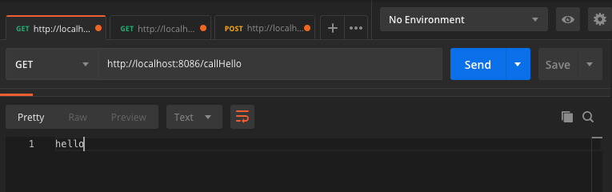
- 停止 aaron-eureka-client-user-service
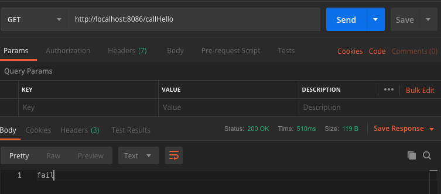
- UserRemoteClientFallbackFactory.java 實現 FallbackFactory 測試結果
```
2019-08-03 16:16:39.267 ERROR 48894 --- [-user-service-3] c.a.f.r.UserRemoteClientFallbackFactory  : UserRemoteClient 回退：

feign.RetryableException: Connection refused executing GET http://aaron-eureka-client-user-service/user/hello
	at feign.FeignException.errorExecuting(FeignException.java:65) ~[feign-core-9.7.0.jar:na]
	at feign.SynchronousMethodHandler.executeAndDecode(SynchronousMethodHandler.java:105) ~[feign-core-9.7.0.jar:na]
	at feign.SynchronousMethodHandler.invoke(SynchronousMethodHandler.java:77) ~[feign-core-9.7.0.jar:na]
	at feign.hystrix.HystrixInvocationHandler$1.run(HystrixInvocationHandler.java:107) ~[feign-hystrix-9.7.0.jar:na]
	... 
    
 調用結果：fail
```
### 維運
- 服務接口
`http://localhost:8086/callHello`

## aaron-hystrix-dashboard-demo：Hystrix 服務監控
##### Hystrix 監控
- Hystrix dashboard 實時監控 Hystrix 的運行情況。但是 Hystrix dashboard 只能對單台進行監控。
- Hystrix 除了容錯外，還提供了即時監控功能。在調用服務時 Hystrix 會即時累積有關於 HystrixCommand 的執行資訊，比如：
    - 每秒請求數
    - 成功數
    - ...(其他監控參數可至：https://github.com/Netflix/Hystrix/wiki/Metrics-and-Monitoring)

### 開發
##### Turbine 聚合集群服務：透過 Eureka 來發現 Hystrix 服務；Turbine 會透過 Eureka 中查找服務的 homePageUrl 加上 hystrix.stream 或獲得監控資料
- DashboardApplication.java
```
@EnableDiscoveryClient
@EnableTurbine
```
- application.properties
```
# appConfig 用來設定要聚合的監控點，多個監控點的話，可以用逗號區隔。
turbine.appConfig=aaron-hystrix-feign-demo
# clusterConfig 表示要聚合的叢集，default 的意義，就是 Dashboard 範例中指出的，表示直接透過 turbine.stream，可以設定多個叢集名稱，以逗號區隔。
turbine.aggregator.clusterConfig=default
turbine.clusterNameExpression=new String("default")
```

### 配置
- pom.xml(aaron-hystrix-feign-demo)
```
		# 將 actuator 中的端點暴露出來
        <dependency>
            <groupId>org.springframework.boot</groupId>
            <artifactId>spring-boot-starter-actuator</artifactId>
        </dependency>
        <dependency>
			<groupId>org.springframework.cloud</groupId>
			<artifactId>spring-cloud-starter-netflix-hystrix</artifactId>
		</dependency>
```
- pom.xml
```
		<dependency>
			<groupId>org.springframework.cloud</groupId>
			<artifactId>spring-cloud-starter-netflix-hystrix-dashboard</artifactId>
		</dependency>
        # 透過 Eureka 來發現 Hystrix 服務，產生 Turbine 聚合集群服務效果
        <dependency>
		   <groupId>org.springframework.cloud</groupId>
		   <artifactId>spring-cloud-starter-netflix-turbine</artifactId>
		</dependency>
```
- application.properties
```
server.port=9011
spring.application.name=aaron-hystrix-dashboard-demo
# appConfig 用來設定要聚合的監控點，多個監控點的話，可以用逗號區隔。
turbine.appConfig=aaron-hystrix-feign-demo
# clusterConfig 表示要聚合的叢集，default 的意義，就是 Dashboard 範例中指出的，表示直接透過 turbine.stream，可以設定多個叢集名稱，以逗號區隔。
turbine.aggregator.clusterConfig=default
turbine.clusterNameExpression=new String("default")
...
```
### 測試
- 訪問 `http://localhost:8086/actuator/hystrix.stream`；調用 `http://localhost:8086/callHello`
    - 調用前 
    
    - 調用後
    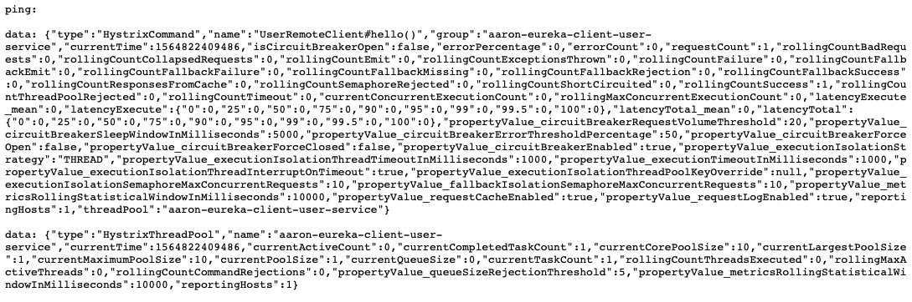
- 進入 Hystrix 管理介面
`http://localhost:9011/hystrix`
    - 輸入以下內容
```
# 監控的 stream 地址
http://localhost:8086/actuator/hystrix.stream
# Delay 時間
2000
# Title 服務名稱（Opertional）
aaron-hystrix-feign-demo
```
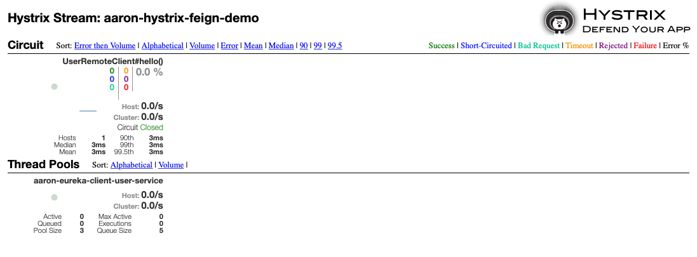

##### 測試 Turbine 集群功能
- 進入 Hystrix 管理介面
`http://localhost:9011/hystrix`
    - 輸入以下內容
```
# 監控的 stream 地址；已由 http://localhost:8086/actuator/hystrix.stream 改為從集式監控
# Delay 時間
2000
# Title 服務名稱（Opertional）
default
```
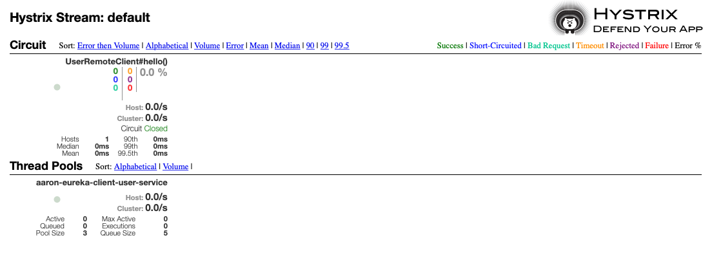

### 維運


