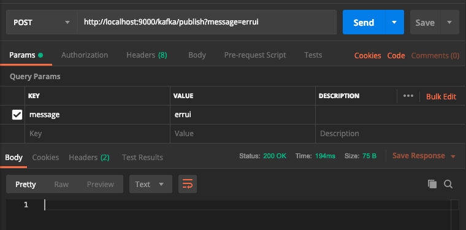
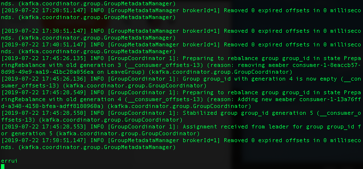
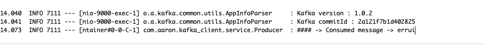

# Kafka：

### 參數
- Spring boot：2.0.6.RELEASE
- Spring cloud：Finchley.SR2
- Java：8
- 專案
    - aaron-kafka-client-demo
        - Main：KafkaApplication
        - Group id：com.aaron
        - Artifact id：aaron-kafka-client-demo
        - Version：0.0.1-SNAPSHOT

- 服務依賴
    - Kafka
        - [安裝 Kafka](../server/Kafka)

## aaron-kafka-client-demo：REST 發佈消息

### 開發

### 配置
- application.properties
```
server.port=9000
spring.kafka.consumer.bootstrap-servers=gordianknot:9092
spring.kafka.producer.bootstrap-servers=gordianknot:9092

# 偏移量策略設置
# earliest(當各分區下有已提交的offset時，從提交的offset開始消費；無提交的offset時，從頭開始消費)
# latest(當各分區下有已提交的offset時，從提交的offset開始消費；無提交的offset時，消費新產生的該分區下的數據)
# none(topic各分區都存在已提交的offset時，從offset後開始消費；只要有一個分區不存在已提交的offset，則拋出異常)
spring.kafka.consumer.auto-offset-reset=earliest
```
 
### 測試

- 消費消息
`$ bin/kafka-console-consumer.sh --bootstrap-server gordianknot:9092 --topic test --from-beginning
`



### 維運
- 服務接口
`POST http://localhost:9000/kafka/publish`