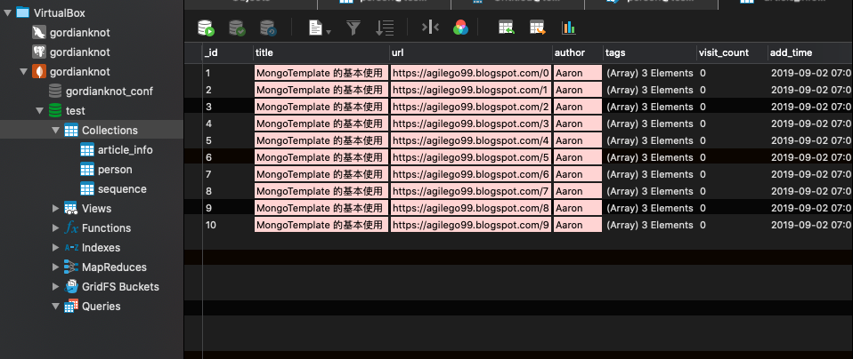
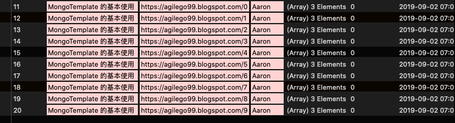
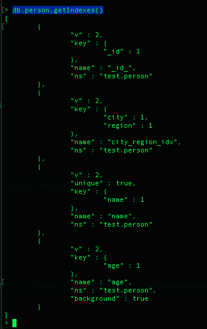

# MongoDB

## 參數
- Spring boot：2.0.6.RELEASE
- Spring cloud：Finchley.SR2
- Java：8
- 專案
    - aaron-mongodb
        - Main：App
        - Group id：com.aaron
        - Artifact id：aaron-mongodb
        - Version：0.0.1-SNAPSHOT
    
- 服務依賴
    - Redis
        - [安裝 MongoDB](../server/MongoDB)

## aaron-mongodb

### 開發
##### 集成 Sping Data MongoDB
- pom.xml
```
		<!-- MongoDB Maven 依賴 -->
		<dependency>
			<groupId>org.springframework.boot</groupId>
			<artifactId>spring-boot-starter-data-mongodb</artifactId>
		</dependency>
```

##### 添加資料操作
- Article.java 定義 MongoDB 集合對應實體類
```
@Data
@Document(collection = "article_info")
public class Article {
	@Id
	@GeneratedValue
	private Long id;

	@Field("title")
	private String title;

	@Field("url")
	private String url;

	@Field("author")
	private String author;

	@Field("tags")
	private List<String> tags;

	@Field("visit_count")
	private Long visitCount;

	@Field("add_time")
	private Date addTime;

}
```
- ArticleController.java 單條資料添加
```
@GetMapping("/save")
	public String save() {
		// 循環添加
		for (int i = 0; i < 10; i++) {
			Article article = new Article();
			article.setTitle("MongoTemplate 的基本使用 ");
			article.setAuthor("Aaron");
			article.setUrl("https://agilego99.blogspot.com/" + i);
			article.setTags(Arrays.asList("java", "mongodb", "spring"));
			article.setVisitCount(0L);
			article.setAddTime(new Date());
			mongoTemplate.save(article);
		}
		return "success";
	}
```

- ArticleController.java 批次添加
```
	// 批次添加
	@GetMapping("/batchSave")
	public String batchSave() {
		// 批次添加
		List<Article> articles = new ArrayList<>(10);
		for (int i = 0; i < 10; i++) {
			Article article = new Article();
			article.setTitle("MongoTemplate 的基本使用 ");
			article.setAuthor("Aaron");
			article.setUrl("https://agilego99.blogspot.com/" + i);
			article.setTags(Arrays.asList("java", "mongodb", "spring"));
			article.setVisitCount(0L);
			article.setAddTime(new Date());
			articles.add(article);
		}
		mongoTemplate.insert(articles, Article.class);
		return "success";
	}
```

- Person.java 索引定義
```
// 索引定義
@Data
@Document
@CompoundIndexes({ @CompoundIndex(name = "city_region_idx", def = "{'city': 1, 'region': 1}") })
public class Person {
	private String id;

	@Indexed(unique = true)
	private String name;

	@Indexed(background = true)
	private int age;

	private String city;

	private String region;
}
```

##### 修改資料庫操作
- ArticleController.java 修改資料庫操作
```
	// 修改資料
	@GetMapping("/update")
	public String update() {
		
		Query query = Query.query(Criteria.where("author").is("Aaron")); 
		Update update = Update.update("title", "MongoTemplate")
				.set("visitCount", 10); 
		// 根據條件修改
		mongoTemplate.updateFirst(query, update, Article.class);
		
		query = Query.query(Criteria.where("author").is("Aaron"));
		update = Update.update("title", "MongoTemplate").set("visitCount", 10); 
		// 修改所有符合條件的資料
		mongoTemplate.updateMulti(query, update, Article.class);
		

		query = Query.query(Criteria.where("author").is("jason"));
		update = Update.update("title", "MongoTemplate").set("visitCount", 10); 
		// 特殊更新，有則修改資料，無責添加一條資料
		mongoTemplate.upsert(query, update, Article.class);
		
		query = Query.query(Criteria.where("author").is("jason"));
		update = Update.update("title", "MongoTemplate").set("money", 100); 
		mongoTemplate.updateMulti(query, update, Article.class);
		
		query = Query.query(Criteria.where("author").is("jason"));
		// 數字界加操作
		update = Update.update("title", "MongoTemplate").inc("money", 100); 
		mongoTemplate.updateMulti(query, update, Article.class);
		
		query = Query.query(Criteria.where("author").is("jason")); 
		// 修改字串名稱
		update = Update.update("title", "MongoTemplate")
				.rename("visitCount", "vc"); 
		mongoTemplate.updateMulti(query, update, Article.class);
		
		
		query = Query.query(Criteria.where("author").is("jason"));
		// 刪除字串
		update = Update.update("title", "MongoTemplate").unset("vc"); 
		mongoTemplate.updateMulti(query, update, Article.class);
		
		query = Query.query(Criteria.where("author").is("Aaron"));
		// 刪除 Array 中的值
		update = Update.update("title", "MongoTemplate").pull("tags", "java"); 
		mongoTemplate.updateMulti(query, update, Article.class);
		return "success";
	}
```

##### 刪除資料庫操作
- ArticleController.java 刪除資料庫操作
```
    // 刪除資料庫操作
	@GetMapping("/delete")
	public String delete() {

		Query query = Query.query(Criteria.where("author").is("Aaron")); 
        // 按條件刪除資料庫
		mongoTemplate.remove(query, Article.class);
		
		query = Query.query(Criteria.where("author").is("Aaron"));
        // 按條件刪除資料庫並制定集合名稱
		mongoTemplate.remove(query, "article_info");
		
		query = Query.query(Criteria.where("author").is("Aaron")); 
        // 按條件刪除符合條件的第一條資料
		Article article = mongoTemplate.findAndRemove(query, Article.class);
		
		query = Query.query(Criteria.where("author").is("Aaron")); 
		// 按條件刪除符合條件的全部資料
		List<Article> articles =
				mongoTemplate.findAllAndRemove(query, Article.class);
		
		// 刪除整個集合
		mongoTemplate.dropCollection(Article.class); 

		// 刪除資料庫
		mongoTemplate.dropCollection("article_info");
		
		mongoTemplate.getDb().drop();
		return "success";
	}
```
###### 查詢資料庫操作
- ArticleController.java  查詢資料庫操作
```
// 查詢資料庫操作
	@GetMapping("/query")
	public String query() {
		
		
		Query query = Query.query(Criteria.where("author").is("Aaron")); 
		// 查詢所有符合條件的資料
		List<Article> articles = mongoTemplate.find(query, Article.class);
		
		query = Query.query(Criteria.where("author").is("Aaron")); 
		// 查詢符合條件的第一條資料
		Article article = mongoTemplate.findOne(query, Article.class);
		
		// 查詢集合中的所有資料
		articles = mongoTemplate.findAll(Article.class);
		
		query = Query.query(Criteria.where("author").is("Aaron"));
        // 查詢符合條件的數量
		long count = mongoTemplate.count(query, Article.class);
		
		// 根據主鍵 ID 查詢
		article = mongoTemplate.findById(new ObjectId("57c6e1601e4735b2c306cdb7"), Article.class);
		
		List<String> authors = Arrays.asList("Aaron", "jason"); 
		// in 查詢
		query = Query.query(Criteria.where("author").in(authors));
		articles = mongoTemplate.find(query, Article.class);
		
		// 不等於查詢
		query = Query.query(Criteria.where("author").ne("Aaron"));
		articles = mongoTemplate.find(query, Article.class);
		
		// 小於查詢
		query = Query.query(Criteria.where("visitCount").lt(10)); 
		articles = mongoTemplate.find(query, Article.class);
		
		// 範圍查詢
		query = Query.query(Criteria.where("visitCount").gt(5).lt(10)); 
		articles = mongoTemplate.find(query, Article.class);
		
        // 模糊查詢
		query = Query.query(Criteria.where("author").regex("a")); 
		articles = mongoTemplate.find(query, Article.class);
		
		// Array 查詢
		query = Query.query(Criteria.where("tags").size(3)); 
		articles = mongoTemplate.find(query, Article.class);
		
		// or 查詢
		query = Query.query(Criteria.where("").orOperator( Criteria.where("author").is("jason"), Criteria.where("visitCount").is(0)));
		articles = mongoTemplate.find(query, Article.class);
		return "success";
	}
```

##### GridFS 操作
###### MongoDB 除了能夠存儲大量的資料外，還內置一個非常好用的文件系統。基於 MongoDB 集群的優勢。GridFS 同樣也是分佈式。
###### Controller 若要訪問存儲文件也很容易，直接通過文件 ID 查詢該文件，然後直接輸出到 response 就可以。記得要設置 ContentType
- GridFsController.java 上傳文件
```
/**
 	* 上傳文件
 	*
 	* @author Aaron
 	* @throws Exception
 	*/
 	@GetMapping("/image/upload")
 	public String uploadFile() throws Exception {
 		File file = new File("/Users/Kevin/Downloads/logo.png");
 		InputStream content = new FileInputStream(file);
 		// 存儲文件的額外信息，比如用戶ID,後面要查詢某個用戶的所有文件時就可以直接查詢
 		DBObject metadata = new BasicDBObject("userId", "1001");
 		ObjectId fileId = gridFsTemplate.store(content, file.getName(), "image/png", metadata);
 		System.out.println(fileId.toString());
 		return "success";
 	}
```

- GridFsController.java 根據 ID 查詢文件
```

 	/**
 	* 根據文件ID查詢文件
 	*
 	* @author Aaron
 	* @param fileId
 	* @return
 	* @throws Exception
 	*/
 	@GetMapping("/image/get")
 	public String getFile(String fileId) throws Exception {
 		GridFSFile file = gridFsTemplate.findOne(Query.query(Criteria.where("_id").is(fileId)));
 		System.err.println(file.getFilename());
 		return "success";
 	}
```
- GridFsController.java 根據 ID 刪除文件
```
	/**
 	* 根據文件ID刪除文件
 	*
 	* @author Aaron
 	* @param fileId
 	* @throws Exception
 	*/
 	@GetMapping("/image/remove")
 	public String removeFile(String fileId) throws Exception {
 		gridFsTemplate.delete(Query.query(Criteria.where("_id").is(fileId)));
 		return "success";
 	}
```
- GridFsController.java 下載文件
```
/**
 	* 下載文件
 	* @param fileId
 	* @param response
 	*/
 	@GetMapping("/image/{fileId}")
 	public void getImage(@PathVariable String fileId, HttpServletResponse response) {
 		try {
 			GridFSFile gridfs = gridFsTemplate.findOne(Query.query(Criteria.where("_id").is(fileId)));
 			response.setHeader("Content-Disposition", "attachment;filename=\"" + gridfs.getFilename() + "\"");
 			GridFSBucket gridFSBucket = GridFSBuckets.create(mongoTemplate.getDb());
 			GridFSDownloadStream gridFSDownloadStream = gridFSBucket.openDownloadStream(gridfs.getObjectId());
 			GridFsResource resource = new GridFsResource(gridfs, gridFSDownloadStream);
 			InputStream inp = resource.getInputStream();
 			OutputStream out = response.getOutputStream();
 			IOUtils.copy(inp, out);
 		} catch (Exception e) {
 			e.printStackTrace();
 		}
 	}
```

###### 用 Repository 方式操作資料
- ArticleRepositor.java Repository 操作資料
```
@Repository("ArticleRepositor")
public interface ArticleRepositor extends PagingAndSortingRepository<Article, String> {
 	// 分頁查詢
 	public Page<Article> findAll(Pageable pageable);
 	// 根據 author 查詢
 	public List<Article> findByAuthor(String author);
 	// 根據作者和標題查詢
 	public List<Article> findByAuthorAndTitle(String author, String title);
 	// 忽略參數大小寫
 	public List<Article> findByAuthorIgnoreCase(String author);
 	// 忽略所有參數大小寫
 	public List<Article> findByAuthorAndTitleAllIgnoreCase(String author, String title);
 	// 排序
 	public List<Article> findByAuthorOrderByVisitCountDesc(String author);
 	public List<Article> findByAuthorOrderByVisitCountAsc(String author);
 	// 自帶排序條件
 	public List<Article> findByAuthor(String author, Sort sort);
}
```
- ArticleController.java 根據 author 查詢
```
	@GetMapping("/findAll")
	public Object findAll() {
		return articleRepositor.findByAuthor("Aaron");
	}
```

###### 自增 ID 實現
- SequenceId.java 自增序列存儲集合
```
// 自增序列存儲集合
@Data
@Document(collection = "sequence")
public class SequenceId {

	@Id
	private String id;

	@Field("seq_id")
	private long seqId;
	
	@Field("coll_name")
	private String collName;

}
```
- GeneratedValue.java 自增註解使用
```
// 自增註解定義
@Retention(RetentionPolicy.RUNTIME)
@Target({ ElementType.FIELD })
public @interface GeneratedValue {
	
}
```
- .java 自增註解使用
```
@Data
@Document(collection = "article_info")
public class Article {
	@Id
	@GeneratedValue
	private Long id;

	@Field("title")
	private String title;

	@Field("url")
	private String url;

	@Field("author")
	private String author;

	@Field("tags")
	private List<String> tags;

	@Field("visit_count")
	private Long visitCount;

	@Field("add_time")
	private Date addTime;

}
```
- SaveMongoEventListener.java 自增序列生成邏輯
```
@Component
public class SaveMongoEventListener extends AbstractMongoEventListener<Object> {
    
    @Resource
    private MongoTemplate mongoTemplate;
    @Override
    public void onBeforeConvert(BeforeConvertEvent<Object> event) {
        Object source = event.getSource();
        if(source != null) {
            ReflectionUtils.doWithFields(source.getClass(), new ReflectionUtils.FieldCallback() {
                public void doWith(Field field) throws IllegalArgumentException, IllegalAccessException {
                    ReflectionUtils.makeAccessible(field);
                    if (field.isAnnotationPresent(GeneratedValue.class)) {
                        //設置自增ID
                        field.set(source, getNextId(source.getClass().getSimpleName()));
                    }
                }
            });
        }
    }
    
    /**
     * 獲取下一個自增ID
     * @author Aaron
     * @param collName  集合名
     * @return
     */
    private Long getNextId(String collName) {
        Query query = new Query(Criteria.where("collName").is(collName));
        Update update = new Update();
        update.inc("seqId", 1);
        FindAndModifyOptions options = new FindAndModifyOptions();
        options.upsert(true);
        options.returnNew(true);
        SequenceId seqId = mongoTemplate.findAndModify(query, update, options, SequenceId.class);
        return seqId.getSeqId();
    }
}
```
###### 批量更新擴展
- BatchUpdateOptions.java 批量更新
```	
	public BathUpdateOptions() {
		super();
	}
	
	public BathUpdateOptions(Query query, Update update) {
		super();
		this.query = query;
		this.update = update;
	}
	
	public BathUpdateOptions(Query query, Update update, boolean upsert,
			boolean multi) {
		super();
		this.query = query;
		this.update = update;
		this.upsert = upsert;
		this.multi = multi;
	}
```
- ArticleController.java 批量更新使用方法
```
	@GetMapping("/batchUpdate")
	public Object batchUpdate() {
		List<BathUpdateOptions> list = new ArrayList<BathUpdateOptions>();
		list.add(new BathUpdateOptions(Query.query(Criteria.where("author").is("Aaron")),Update.update("title", "批量更新"), true, true));
		list.add(new BathUpdateOptions(Query.query(Criteria.where("author").is("jason")),Update.update("title", "批量更新"), true, true));
		int n = MongoBaseDao.bathUpdate(mongoTemplate, "article_info", list, true);
		System.out.println("受影響的行数："+n);
		return n;
	}
```

### 配置
- application.properties
```
spring.application.name=aaron-mongodb
server.port=8083
```

### 測試
##### 添加資料操作
###### 單筆資料添加（循環添加，一次添加1筆，共執行10筆添加）
`GET http://localhost:8083/save`

###### 批次資料添加（一次添加10筆）
`GET http://localhost:8083/batchSave`

```
$ mongo --host localhost --port 27017 -u "admin" -p "999999" --authenticationDatabase "admin"
# 查詢集合中的索引
db.person.getIndexes()
```



### 維運

