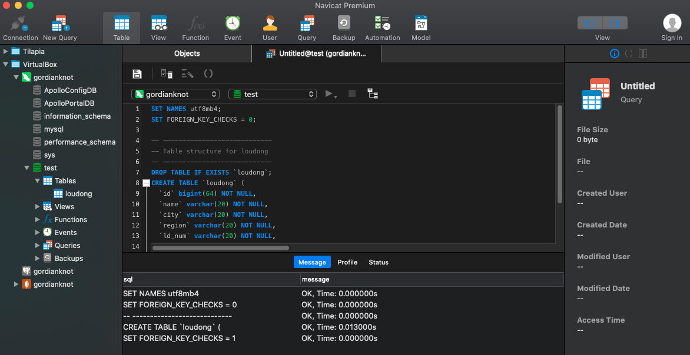
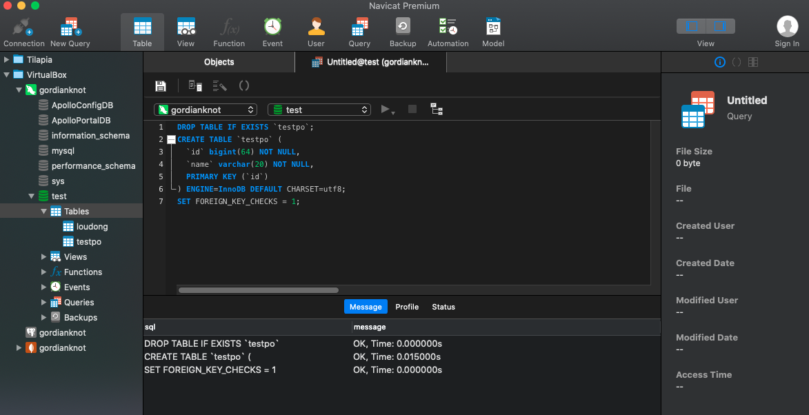
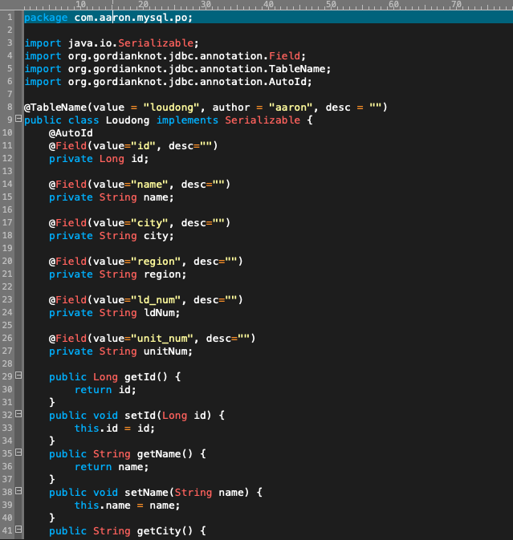
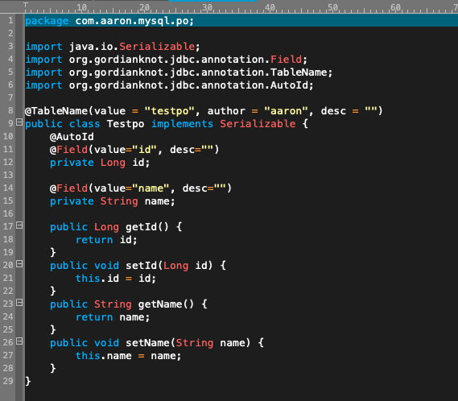

# MySQL

## 參數
- Spring boot：2.0.6.RELEASE
- Spring cloud：Finchley.SR2
- Java：8
- 專案
    - 
        - Main：App
        - Group id：com.aaron
        - Artifact id：aaron-mysql
        - Version：0.0.1-SNAPSHOT
    
- 服務依賴
    - MySQL
        - [安裝 MySQL](../server/MySQL)
    - gordianknot-jdbc
        - [使用 Gordianknot-jdbc](../gordianknot-jdbc)

## 專案名稱


### 開發

##### 擴展 JdbcTemplate 使用方式
- pom.xml
```
        <!-- JDBC ORM -->		
       <dependency>
			<groupId>org.gordianknot</groupId>
			<artifactId>gordianknot-jdbc</artifactId>
			<version>1.0.3</version>
		</dependency>
```
- LouDong.java 擴展 JdbcTemplate
```
/**
 * 定義資料對應的 PO 類、表、欄位等名稱，以註解中的 value 為準
 * @author Aaron
 */
@Data
@TableName(value = "loudong", desc = " 樓棟表 ", author = "aaron")
public class LouDong implements Serializable {

	private static final long serialVersionUID = -6690784263770712827L;
	@Field(value = "id", desc = " 主鍵 ID")
	private String id;
	@Field(value = "name", desc = " 社區名稱 ")
	private String name;
	@Field(value = "city", desc = " 城市 ")
	private String city;
	@Field(value = "region", desc = " 區域 ")
	private String region;
	@Field(value = "ld_num", desc = " 樓棟號 ")
	private String ldNum;
	@Field(value = "unit_num", desc = " 單元號 ")
	private String unitNum;
	public final static String[] SHOW_FIELDS = new String[] { "city", "region", "name", "ld_num" };
	public final static String[] QUERRY_FIELDS = new String[] { "city", "region", "name" };
	public final static Orders[] ORDER_FIELDS = new Orders[] { new Orders("id", Orders.OrderyType.ASC) };
}
```
- LdServiceImpl.java Service 類定義
```
@Service
public class LdServiceImpl extends EntityService<LouDong> implements LdService {

	// 查詢總數量
	public long count() {
		return super.count();
	}

	// 查詢所有資料並排序
	public List<LouDong> findAll() {
		return super.list(LouDong.ORDER_FIELDS);
	}

    // 根據城市區域查詢
	public List<LouDong> find(String city) {
		return super.list("city", city);
	}

	// 根據城市區域查詢
	public List<LouDong> find(String city, String region) {
		return super.list(new String[] { "city", "region" }, new Object[] { city, region });
	}

	// 根據程式區域名稱查詢、顯示指定欄位
	public List<LouDong> find(String city, String region, String name) {
		return super.list(LouDong.SHOW_FIELDS, LouDong.QUERRY_FIELDS, new Object[] { city, region, name });
	}

	// 分頁排序查詢所有
	public List<LouDong> findAll(PageQueryParam page) {
		return super.listForPage(page.getStart(), page.getLimit(), LouDong.ORDER_FIELDS);
	}

	// 根據程式判斷是否存在資料
	public boolean exists(String city) {
		return super.exists("city", city);
	}

	// 根據名稱 in 查詢
	public List<LouDong> in(String[] names) {
		return super.in(new String[] { "city", "region" }, "name", names);
	}

	// 根據 ID 獲得資料
	public LouDong get(String id) {
		return super.getById("id", id);
	}

	// 根據名稱刪除資料
	@Transactional
	public void delete(String name) {
		super.deleteById("name", name);
	}

	// 保存資料
	public void save(LouDong louDong) {
		super.save(louDong);
	}
	
    // 批次保留資料
	public void saveList(List<LouDong> list) {
		super.batchSave(list);
	}

	// 更新資料
	public void update(LouDong louDong) {
		super.update(louDong, "id");
	}

	// 批次更新資料
	public void updateList(List<LouDong> list) {
		super.batchUpdateByContainsFields(list, "id", "city");
	}
    
    // 生成 PO 類
	public void generatePo(String pack,String author,String savePath) {
		super.getJdbcTemplate().generatePoClass(pack, author, savePath);
	}
}
```
##### 快速生成對應的 PO 類
- LdServiceImpl.java 生成 PO 類 Service 定義
``` 
    // 生成 PO 類
	public void generatePo(String pack,String author,String savePath) {
		super.getJdbcTemplate().generatePoClass(pack, author, savePath);
	}
```
- LdController.java 生成 PO 調用接口
```
	@GetMapping("/test1")
	public String test1() {
		ldService.generatePo("com.aaron.mysql.po","aaron", "/Users/Kevin/Downloads/aaron-mysql");
		return "success";
	}
```


### 配置
- application.properties
```
spring.application.name=aaron-mysql
server.port=8083
```

### 測試
##### 擴展 JdbcTemplate 使用方式
###### 使用 loudong.sql 在 test 資料庫下建立相關表格
- loudong.sql 新增 loudong 表格 DDL
```
/*
 Navicat Premium Data Transfer

 Source Server         : gordianknot
 Source Server Type    : MySQL
 Source Server Version : 50727
 Source Host           : 192.168.56.101:3306
 Source Schema         : test

 Target Server Type    : MySQL
 Target Server Version : 50727
 File Encoding         : 65001

 Date: 03/09/2019 13:02:56
*/

SET NAMES utf8mb4;
SET FOREIGN_KEY_CHECKS = 0;

-- ----------------------------
-- Table structure for loudong
-- ----------------------------
DROP TABLE IF EXISTS `loudong`;
CREATE TABLE `loudong` (
  `id` bigint(64) NOT NULL,
  `name` varchar(20) NOT NULL,
  `city` varchar(20) NOT NULL,
  `region` varchar(20) NOT NULL,
  `ld_num` varchar(20) NOT NULL,
  `unit_num` varchar(20) NOT NULL,
  PRIMARY KEY (`id`)
) ENGINE=InnoDB DEFAULT CHARSET=utf8;

SET FOREIGN_KEY_CHECKS = 1;
```

###### 調用查詢總數量 API
`GET http://localhost:8083/test`


##### 快速生成對應的 PO 類
###### 新建 testpo 資料表
```
DROP TABLE IF EXISTS `testpo`;
CREATE TABLE `testpo` (
  `id` bigint(64) NOT NULL,
  `name` varchar(20) NOT NULL,
  PRIMARY KEY (`id`)
) ENGINE=InnoDB DEFAULT CHARSET=utf8;
SET FOREIGN_KEY_CHECKS = 1;
```
###### 建立成功

###### 調用生成 PO 類 API
`GET http://localhost:8083/test1`
###### 生成的 Java code；Loudong.java 

###### 生成的 Java code；Testpo.java


### 維運

