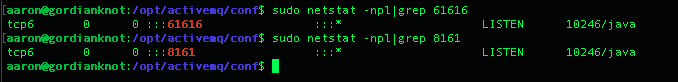
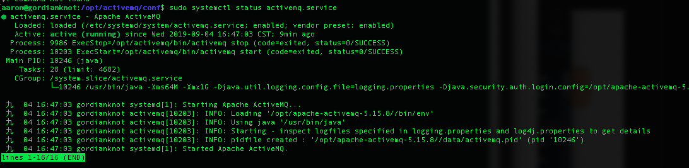
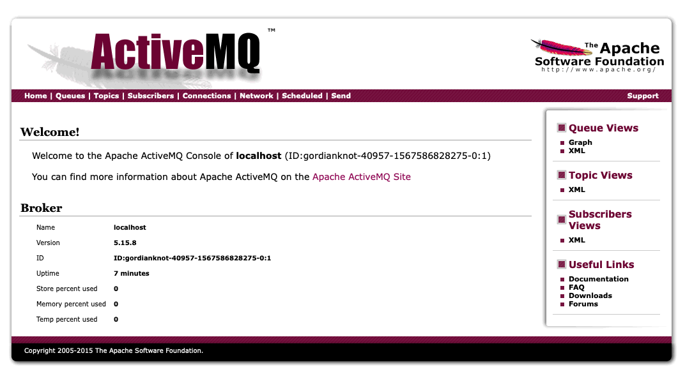

# ActiveMQ
## 參數
- Ubuntu 18.04
- ActiveMQ 5.15.8
    - ActiveMQ 5.10.x 以上版本必須使用 JDK1.8 才能正常使用。
    - ActiveMQ 5.9.x 及以下版本使用 JDK1.7 即可正常使用。
## 開始

### 準備
```
$ wget -P ~/gordianknot/resource "http://archive.apache.org/dist/activemq/5.15.8/apache-activemq-5.15.8-bin.tar.gz"
$ sudo mkdir -p /opt/apache-activemq-5.15.8
```

### 安裝
`$ sudo tar -xvzf ~/gordianknot/resource/apache-activemq-5.15.8-bin.tar.gz --strip 1 -C /opt/apache-activemq-5.15.8
`

### 配置
##### Create a symbolic link
```
$ cd /opt
$ sudo ln -s apache-activemq-5.15.8 activemq
```

##### Create a new user for ActiveMQ
```
$ sudo useradd activemq
$ sudo chown -RH activemq: /opt/activemq
```

##### Create a systemd service 
```
$ sudo nano /etc/systemd/system/activemq.service
[Unit]
Description=Apache ActiveMQ
After=network.target

[Service]
Type=forking

User=activemq
Group=activemq

ExecStart=/opt/activemq/bin/activemq start
ExecStop=/opt/activemq/bin/activemq stop

[Install]
WantedBy=multi-user.target

$ sudo systemctl daemon-reload
$ sudo systemctl enable activemq.service
```

##### 配置 ActiveMQ
```
$ sudo nano /opt/activemq/conf/activemq.xml
  <transportConnectors>
            <!-- DOS protection, limit concurrent connections to 1000 and frame size to 100MB -->
            <transportConnector name="openwire" uri="tcp://0.0.0.0:61616?maximumConnections=1000&amp;wireFormat.maxFrameSize=104857600"/>
        <!-- 註解本段內容
            <transportConnector name="amqp" uri="amqp://0.0.0.0:5672?maximumConnections=1000&amp;wireFormat.maxFrameSize=104857600"/>
            <transportConnector name="stomp" uri="stomp://0.0.0.0:61613?maximumConnections=1000&amp;wireFormat.maxFrameSize=104857600"/>
            <transportConnector name="mqtt" uri="mqtt://0.0.0.0:1883?maximumConnections=1000&amp;wireFormat.maxFrameSize=104857600"/>
            <transportConnector name="ws" uri="ws://0.0.0.0:61614?maximumConnections=1000&amp;wireFormat.maxFrameSize=104857600"/> 
        --> 本段註解結束
         </transportConnectors>
```


## 測試
##### 啟動 ActiveMQ
`$ sudo systemctl start activemq.service`

`sudo systemctl status activemq.service`



##### 連接 ActiveMQ
###### 管理主頁
```
http://gordianknot:8161/admin
帳號：admin
密碼：admin
```



## 維運
```
$ sudo systemctl start activemq.service
$ sudo systemctl status activemq.service
$ sudo systemctl stop activemq.service
$ sudo systemctl enable activemq.service

$ sudo netstat -npl|grep 61616
$ sudo netstat -npl|grep 8161
$ sudo ps aux|grep activemq
```


 

