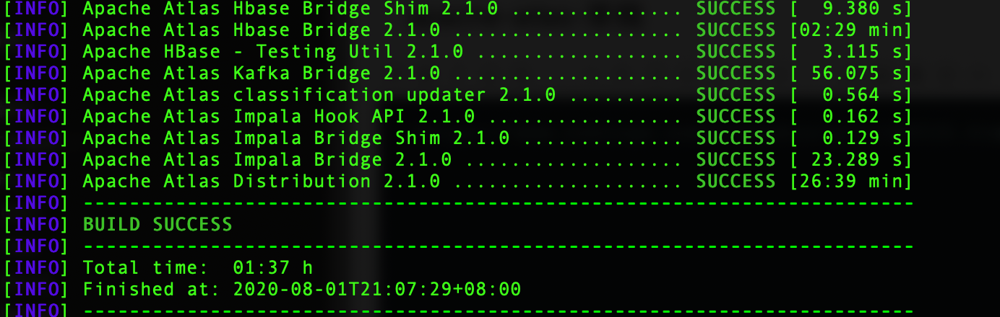
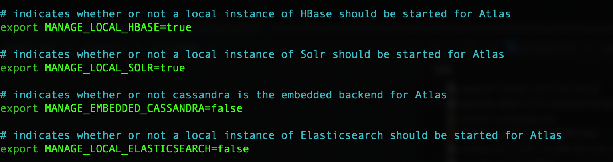
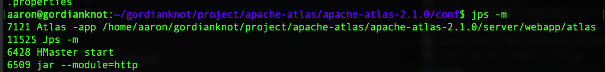
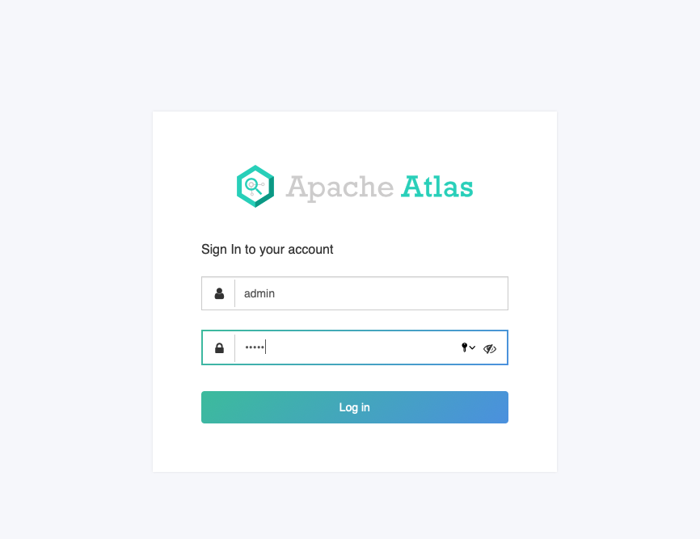
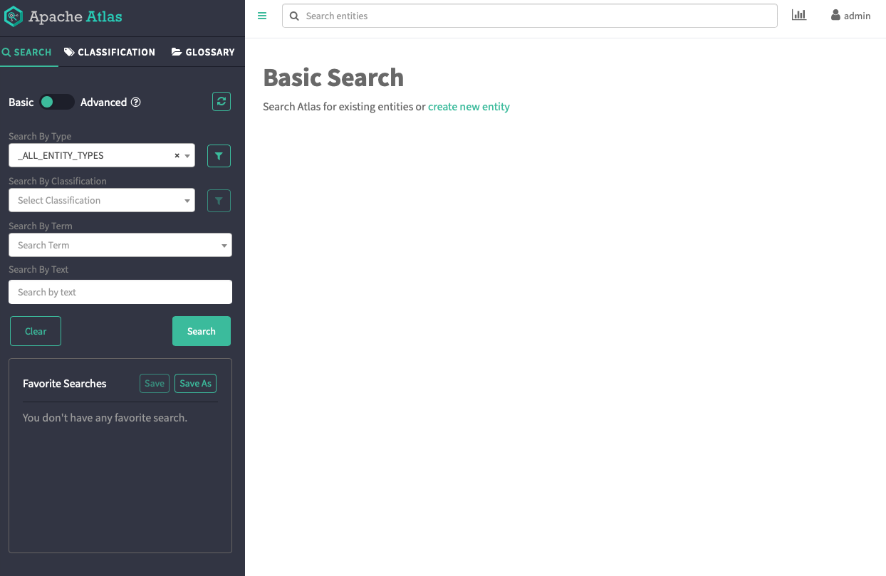

# apache-atlas＠
##### Apache Atlas 是 Hadoop 社區為解決 Hadoop生態系統的元數據治理問題而產生的開源項目，它為 Hadoop集群提供了包括數據分類、集中策略引擎、數據血緣、安全和生命週期管理在內的元數據治理核心能力。

## 參數
- Ubuntu 18.04
- apache-atlas-2.1.0
- Hbase
- Solr
- Zookeeper
- Kafka
- 服務依賴
    - Python 2
        - [研究｜應用｜Python＠Ubuntu 18.04]
    - Maven
        - [研究｜應用｜Maven]
    - JDK   
    - Hbase
    - Solr

## 開始

### 準備
```
$ mkdir -p ~/gordianknot/project/apache-atlas/apache-atlas-2.1.0
```

#### 下載
```
$ wget -P ~/gordianknot/resource
"https://www.apache.org/dyn/closer.cgi/atlas/2.1.0/apache-atlas-2.1.0-sources.tar.gz"
```

### 安裝
#### 解壓縮至指定目錄
```
$ tar -zxf apache-atlas-2.1.0-sources.tar.gz -C ~/gordianknot/project/apache-atlas
```

#### 編譯（兩種方式；本例採用第二種方式）
```
$ cd ~/gordianknot/project/apache-atlas/apache-atlas-sources-2.1.0
```
##### 一、編譯不會內嵌 HBase 和 Solr 
```
$ export MAVEN_OPTS="-Xms2g -Xmx2g"
$ mvn clean -DskipTests package -Pdist
```
##### 二、編譯方式會內嵌 HBase 和 Solr（測試用這種方式)
```
$ export MAVEN_OPTS="-Xms2g -Xmx2g"
$ mvn clean -DskipTests package -Pdist,embedded-hbase-solr 
```

編譯完成


#### 部署
```
# 切換至 distro/target 目錄
$ cd ~/gordianknot/project/apache-atlas/apache-atlas-sources-2.1.0/distro/target

# 編譯完成後，產生 apache-atlas-2.1.0-bin.tar.gz 檔案
# 解壓縮至指定目錄
$ tar -zxvf apache-atlas-2.1.0-bin.tar.gz -C ~/gordianknot/project/apache-atlas/apache-atlas-2.1.0
```

### 配置

- 修改配置文件
```
$ cd ~/gordianknot/project/apache-atlas/apache-atlas-2.1.0
$ nano conf/atlas-env.sh
export MANAGE_LOCAL_HBASE=true  (如果要使用外部的zk和hbase，則改為false)
export MANAGE_LOCAL_SOLR=true  （如果要是用外部的solr，則改為false）
export MANAGE_LOCAL_ELASTICSEARCH=false
export MANAGE_EMBEDDED_CASSANDRA=false
```


- 修改 atlas-application.properties（安裝後保留預設值）
```
# Hbase地址（對應的zk地址）配置（自帶hbase會根據此端口啓動一個zk實例）
atlas.graph.storage.hostname=localhost:2181 # 如果使用外部hbase，則填寫外部zookeeper地址

# Solr地址配置
atlas.graph.index.search.solr.http-urls=http://localhost:8984/solr（solr服務地址）

# Kafka相關配置
atlas.notification.embedded=true # 如果要使用外部的kafka，則改為false
# 內嵌kafka會根據此端口啓動一個zk實例
atlas.kafka.zookeeper.connect=localhost:9026 # 如果使用外部kafka，則填寫外部zookeeper地址
atlas.kafka.bootstrap.servers=localhost:9027 # 如果使用外部kafka，則填寫外部broker server地址
```

## 測試


## 維運
```
$ cd ~/gordianknot/project/apache-atlas/apache-atlas-2.1.0
# 啟動
$ bin/atlas_start.py 

#檢查啟動結果
$ jps -m

# 停止
$ bin/atlas_stop.py 

# 登入
http://gordianknot:21000
名稱：admin 
密碼：admin

# 監聽端口
$ netstat -nltp
# Hbase 61530
# atlas.kafka.zookeeper.connect=localhost:9026
# atlas.kafka.bootstrap.servers=localhost:9027
# atlas web 21000
```



