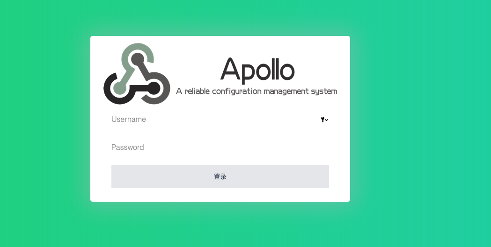
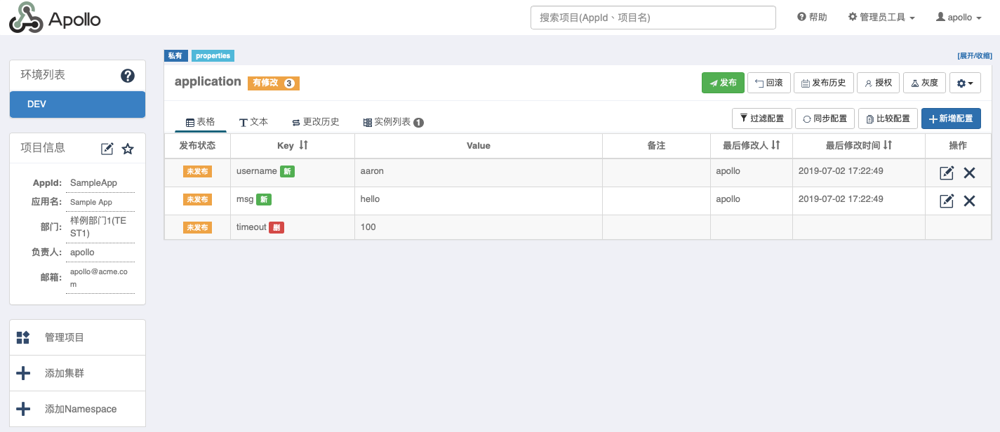
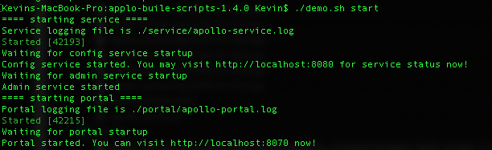

# Apollo：分布式配置中心

##### Apollo（阿波羅）是攜程框架部門研發的分布式配置中心，能夠集中化管理應用不同環境、不同集群的配置，配置修改後能夠實時推送到應用端，並且具備規範的權限、流程治理等特性，適用於微服務配置管理場景。

### 參數
- applo-buile-scripts-1.4.0
- 專案路徑
`/Users/aaron/develop/workspace/eclipse/spring-cloud-aaron/server/applo-buile-scripts-1.4.0 `

### 準備
- Git 專案下載
`https://github.com/nobodyiam/apollo-build-scripts`
- 官方網站
`https://github.com/ctripcorp/apollo/wiki/Apollo开放平台`


### 安裝
#### 建立資料庫服務端資料庫
```
# Apollo 服務端共需要兩個數據庫：ApolloPortalDB 和 ApolloConfigDB，根據對對應的 sql文件，導入到數資料即可。

# 建立 ApolloPortalDB；透過工具執行以下 SQL
# your_local_path/sql/apolloportaldb.sql

# 建立 ApolloConfigDB；透過工具執行以下 SQL
#your_local_path/sql/apolloconfigdb.sql
```
### 配置
#### 配置資料庫連接資訊
```
# Apollo 服務端需要知道如何連接到剛剛創建的數據庫，所以需要編輯 demo.sh，修改ApolloPortalDB 和ApolloConfigDB 相關的數據庫連接串信息。
# 需確認以下配置的帳號需具備對 ApolloPortalDB 和 ApolloConfigDB 有讀取的權限。

# apollo config db info
apollo_config_db_url=jdbc:mysql://gordianknot:3306/ApolloConfigDB?characterEncoding=utf8
apollo_config_db_username=root
apollo_config_db_password=999999

# apollo portal db info
apollo_portal_db_url=jdbc:mysql://gordianknot:3306/ApolloPortalDB?characterEncoding=utf8
apollo_portal_db_username=root
apollo_portal_db_password=999999
\wq
```

### 測試
- 網址 
`http://localhost:8070`
```
帳號：apollo
密碼：admin
```



### 維運
```
$ ./demo.sh start
$ ./demo.sh stop
```

#### 確保端口未被使用
```
# Quick Start 腳本會在本地啓動3個服務，分別使用8070, 8080, 8090端口，請確保這3個端口當前沒有被使用。
$ lsof -i:8070 for web
$ lsof -i:8080 for eureka
$ lsof -i:8090 for 
```
#### 啟動
```
$ cd /Users/aaron/develop/workspace/eclipse/spring-cloud-aaron/server/applo-buile-scripts-1.4.0
$  ./demo.sh start
# 管理頁面 http://localhost:8070
```

