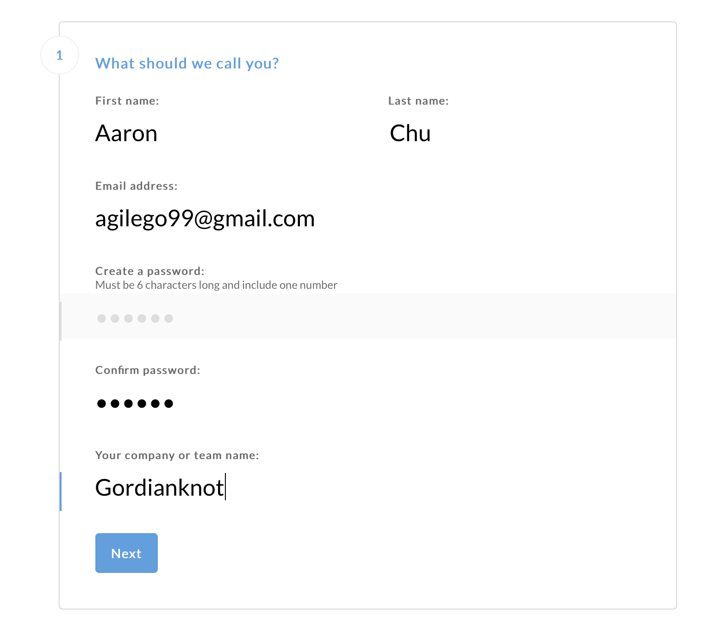
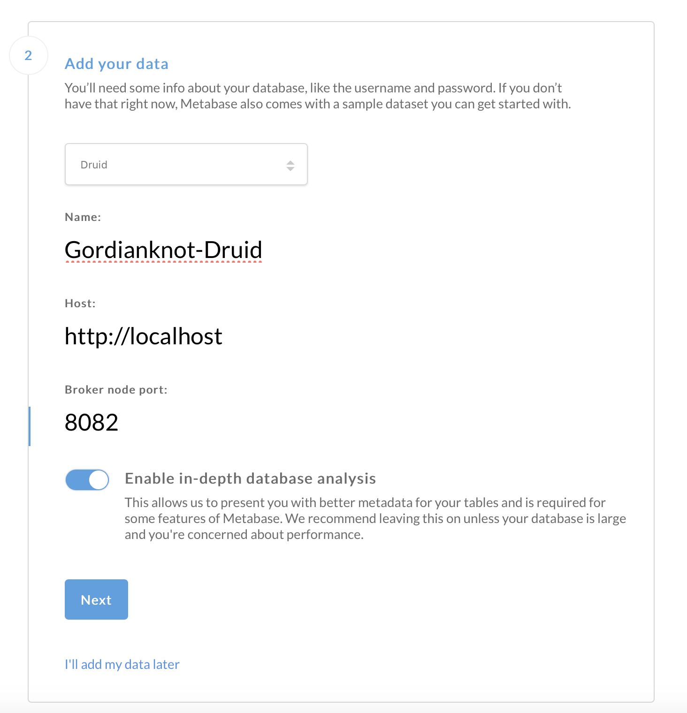
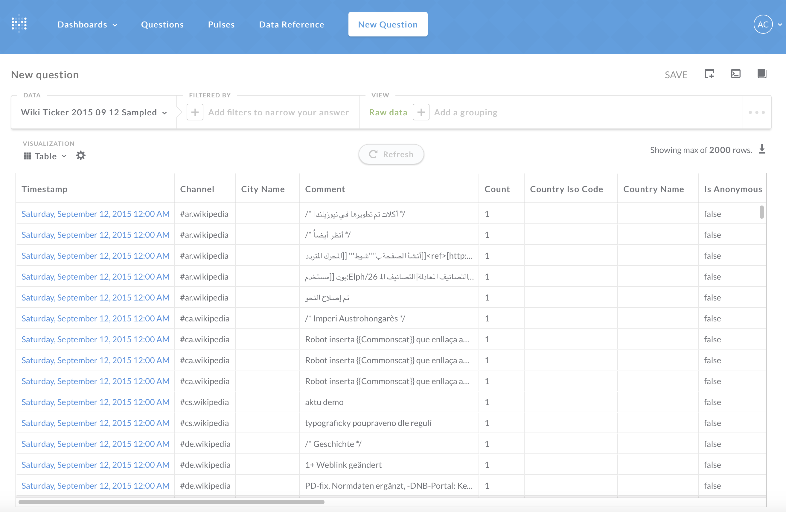

# Druid-Metabase：支持資料庫種類多，啓動方便，支持 JSON 查詢。圖形化查詢，只能有一個聚合字段，兩個維度。

##### 支援多種類型資料庫
- 

### 參數
- Ubuntu 18.04
- Metabase v.19.3
    - 限制
        - 需要 jdk1.6 以上環境

## 開始


### 準備

#### 新增 metabase 工作目錄
```
$ mkdir -p ~/gordianknot/project/metabase
```

#### 下載 Metabase
`$ wget ~/gordianknot/resource "http://downloads.metabase.com/v0.19.3/metabase.jar"
`

### 安裝


##### Metabase
`$ cp ~/gordianknot/resource/metabase.jar ~/gordianknot/project/metabase`


### 配置

##### Druid 連線配置
```
http://gordianknot:3000
```
###### 輸入基本資訊



###### 查詢結果



## 測試


## 維運

##### 啟動
```
$ java -jar /home/aaron/gordianknot/project/metabase/metabase.jar
```

###### 管理頁面
`http://gordianknot:3000`

