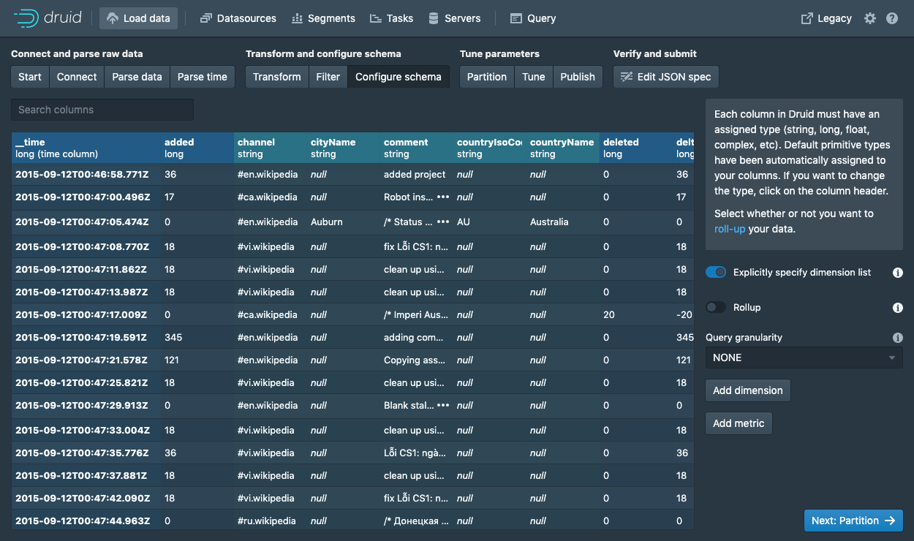

# Druid：專為海量資料、高性能 OLAP 而設計的資料存儲和分析系統。

##### 2011年，美國廣告技術公司 MetaMarkets 於創建了 Druid 項目（MetaMarkets 的核心數據處理平台，99%的數據查詢在1秒內返回結果）

##### 技術特性
- 分散式時序數據庫
- 為分析而生，在處理數據的規模、數據處理實時性方面，比傳統的OLAP系統有了顯著的性能改進
- 擁抱主流的開源生態，包括Hadoop等
- JAVA編寫（jdk1.7+）
- 支持Linux、Mac OS

##### 主要角色

| 角色 | 簡述 |
| --- | --- |
| Coordinator | 負責監控 Historical 程序，它負責將 segment 分配到指定的 Historical 服務上，確保所有Historical 節點的資料均衡|
| MiddleManager | 負責將新的資料攝入到集群中，將外部資料源的內容轉換為 Druid 所識別的 segment
| Broker| 負責接受 Client 的查詢請求，並將查詢轉發到 Historical 和 MiddleManager 中；Broker 會接受所有的子查詢的結果，並將數據進行合併然後返回給 Client |
| Historical| Historical 是用於處理存儲和查詢歷史數據的程序，它會從 Deep Storage 中下載查詢區間資料，然後響應該段資料的查詢 |
| Router| Router 進程是一個可選的程序，它為 Broker、Overload 和Coordinator 提供統一的 API 網關服務。如果不啓動該程序，也可以直接連接 Broker、Overload 和 Coordinator 服務 |


### 參數
- Ubuntu 18.04
- Druid-0.16.0
- 服務依賴
    - JDK 8+
    - zookeeper-3.5.5

## 開始


### 準備

#### 新增 druid & zookeeper 工作目錄
```
$ mkdir -p ~/gordianknot/project/druid/zk
```

#### 下載 druid
```
$ wget -P ~/gordianknot/resource "http://apache.stu.edu.tw/incubator/druid/0.16.0-incubating/apache-druid-0.16.0-incubating-bin.tar.gz"
```

#### 下載 Zookeeper
```
$ wget ~/gordianknot/resource "http://mirror.bit.edu.cn/apache/zookeeper/zookeeper-3.5.5/apache-zookeeper-3.5.5-bin.tar.gz"
```

### 安裝

#### Druid
```
$ tar -zxvf apache-druid-0.16.0-incubating-bin.tar.gz --strip 1 -C ~/gordianknot/project/druid
```
#### Zookeeper
```
$  cp metabase.jar 
```

### 配置

##### druid's log 存放位置
`$ cd /home/aaron/gordianknot/project/druid/var/sv`


## 測試

##### 訪問 WebUI
`http://gordianknot:8888`


##### Native batch ingestion：LocalFirehose 本地資料匯入

###### 開啟網頁 `http://gordianknot:8888`


###### 透過本地磁碟上傳文件；下列內容一一輸入至對應欄位後，按下 Preview ，可以正確看到相關資料。
```
Firehose type：local
Base directory：quickstart/tutorial/
File filter：wikiticker-2015-09-12-sampled.json.gz
```


###### 點擊 Next:Parse data，系統會自動選擇正確的解析器（e.g. json）；若不正確可自由選擇正確的解析器。


###### 點擊 Next:Parse time；Druid 的體系結構需要一個主時間戳列（內部存儲在名為的列中__time）。如果資料中沒有時間戳，請選擇 Constant value。


###### 連續點擊 Transform、Filter 步驟。由於此範例的資料集非常小，因此請繼續並 Rollup（若開啟，資料會先預聚合；如此，可節省磁碟空間） 通過單擊開關並確認更改將其關閉。點擊 Next 以轉到 Partition 可微調資料將如何劃分為 Segment 的步驟。在這裡，可以調整如何在 Druid 中將數據拆分為多個 Segment。由於這是一個很小的資料集，因此在此步驟中無需進行任何調整。



###### 在此 Publish 步驟中，可以指定 Druid 中的資料源名稱。在此資料源命名採預設 wikiticker-2015-09-12-sampled。最後，單擊 Next 以查看規格。


###### 這是構建的規範。可返回並在之前的步驟中進行更改，以查看更改將如何更新規範。同樣，也可以直接編輯規範，並在前面的步驟中看到它。此時，若對規格滿意後，請點擊 Submit 創建 Task。


###### 一旦看到綠色（完全可用；大約一分鐘可完成此 Task）圓圈，就可以查詢資料源.


###### 轉到 Query 選單以對資料源運行 SQL 查詢


## 維運

```
$ cd /home/aaron/gordianknot/project/druid
$ ./bin/start-micro-quickstart
```

## Note
#### 後續之系統改善
- 整合既有之 Zookeeper
- 開放外部網路連線操作 WebUI http://gordianknot:8888

#### 加載文件時遇到記憶體不足
- 加大 VM's memory 至 8GB