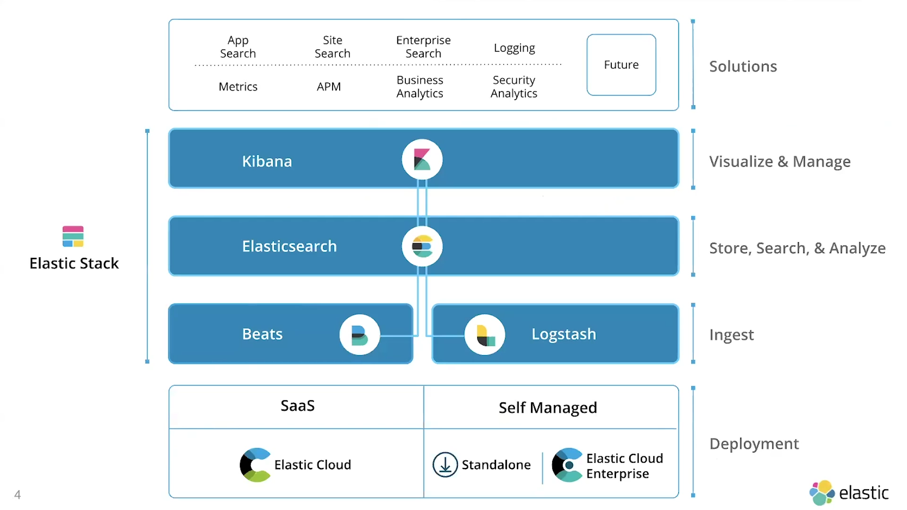
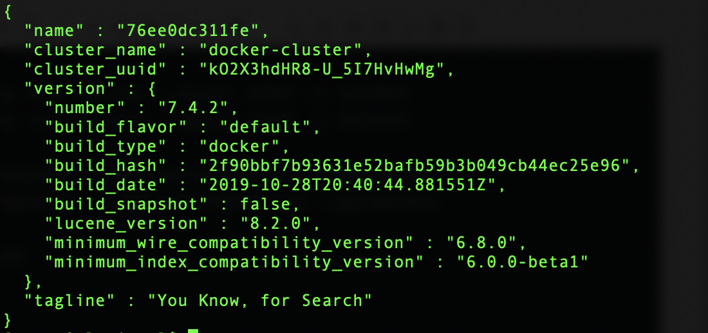
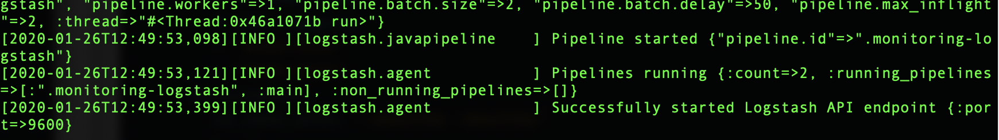

# ELK(Docker)：
##### Elastic static 架構


### 參數imgs
- CentOS 7.5
- Elasticsearch 7.4.2
- Kibana 7.4.2
- Logstash 7.4.2

### 安裝

#### Elasticsearch：docker pull
```
$ docker pull docker.elastic.co/elasticsearch/elasticsearch:7.4.2
```
#### Kibana：docker pull
```
$ docker pull docker.elastic.co/kibana/kibana:7.4.2
```
#### Logstash：docker pull
```
$ docker pull docker.elastic.co/logstash/logstash:7.4.2
```

### 建立工作目錄
#### 主機1（Elasticsearch）

##### data 目錄
```bash=
$ mkdir -p $(pwd)/elasticsearch/data
$ mkdir -p $(pwd)/elasticsearch/config

$ chmod 777 $(pwd)/elasticsearch/data
$ chmod 777 $(pwd)/elasticsearch/config
```

#### 主機2（Logstash、Kibana）
##### data 目錄
```bash=
# Logstash
$ mkdir -p $(pwd)/logstash/data
$ chmod 777 $(pwd)/logstash/data

# Kibana
$ mkdir -p $(pwd)/kibana/data
$ chmod 777 $(pwd)/kibana/data
```

### 配置（前置工作）

#### Elasticsearch：設定內容
##### 建立 elasticsearch.yml 
```bash=
$ nano $(pwd)/elasticsearch/config/elasticsearch.yml
# 複製以下內容
cluster.name: "docker-cluster"
network.host: 0.0.0.0

\wq
# 修改檔案權限
$ chmod 777 $(pwd)/elasticsearch/config/elasticsearch.yml
```

#### Logstash：設定內容
##### 建立 logstash.conf（將 192.168.56.107 修改為實際 IP）
```bash=
$ mkdir -p $(pwd)/logstash
$ nano $(pwd)/logstash/logstash.conf
# 複製以下內容：
input{
      	tcp {
             	mode => "server"
                port => 5000
                codec => json_lines
                tags => ["java-springboot"]
        }
}
filter{
    json{
	source => "message"
        remove_field => ["message"]
    }
}
output{
    if "java-springboot" in [tags]{
        elasticsearch{
                hosts=> ["192.168.56.107:9200"] 
                index => "java-springboot-%{+YYYY.MM.dd}"
                }
        stdout{codec => rubydebug}
    }
}

\wq
$ chmod 777 $(pwd)/logstash/logstash.conf
```
##### 建立 logstash.yml（將 192.168.56.107 修改為實際 IP）
```bash=
$ nano $(pwd)/logstash/config/logstash.yml
# 複製以下內容
http.host: "0.0.0.0"
xpack.monitoring.elasticsearch.hosts: [ "http://192.168.56.107:9200" ]

\wq

$ chmod 777 $(pwd)/logstash/config/logstash.yml
```

#### Kibana：設定內容
##### 建立 kibana.yml（將 192.168.56.107 修改為實際 IP）
```bash=
$ mkdir -p $(pwd)/kibana/config
$ nano $(pwd)/kibana/config/kibana.yml
# 複製以下內容
#
## ** THIS IS AN AUTO-GENERATED FILE **
##
#
## Default Kibana configuration for docker target
server.name: kibana
server.host: "0"
elasticsearch.hosts: [ "http://192.168.56.107:9200" ]
xpack.monitoring.ui.container.elasticsearch.enabled: true

\wq
$ chmod 777 $(pwd)/kibana/config/kibana.yml
```


### 維運

#### 防火牆開通 9200、8089、8088 port（Centos 需要 Port mapping 在執行）
```bash=

# 主機一：Elasticsearch
$ sudo iptables -A INPUT -p tcp -m tcp --dport 9200 -j ACCEPT
$ sudo firewall-cmd --zone=public --add-port=9200/tcp --permanent
$ sudo firewall-cmd --reload

# 主機二：Logstash、Kibana
$ sudo iptables -A INPUT -p tcp -m tcp --dport 8089 -j ACCEPT
$ sudo iptables -A INPUT -p tcp -m tcp --dport 8088 -j ACCEPT

$ sudo firewall-cmd --zone=public --add-port=8089/tcp --permanent
$ sudo firewall-cmd --zone=public --add-port=8088/tcp --permanent

$ sudo firewall-cmd --reload
```

#### Elasticsearch：docker run
```bash=
# Volume 要放在 run 後面，否則會 Exit(2) 錯誤
$ docker run -v $(pwd)/elasticsearch/data:/usr/share/elasticsearch/data \
-v $(pwd)/elasticsearch/config/elasticsearch.yml:/usr/share/elasticsearch/config/elasticsearch.yml \
-d --name elasticsearch -p 9200:9200 -p 9300:9300 \
-e "discovery.type=single-node" docker.elastic.co/elasticsearch/elasticsearch:7.4.2
```

##### 測試是否成功運行
```bash=
$ curl -X GET "ip:9200"
$ http://ip:9200
# 查詢 log
$ docker logs -f elasticsearch 
```


#### Logstash：docker run
```bash=
$ docker run -d -p 8088:5000 --name logstash \
-v $(pwd)/logstash/logstash.conf:/usr/share/logstash/pipeline/logstash.conf \
-v $(pwd)/logstash/config/logstash.yml:/usr/share/logstash/config/logstash.yml \
-v $(pwd)/logstash/data/:/usr/share/logstash/data/ \
docker.elastic.co/logstash/logstash:7.4.2
```

##### 測試是否成功運行
```bash=
$ docker logs -f logstash
# 出現 “Successfully started Logstash API endpoint” 內容
[2020-01-13T09:54:57,081][INFO ][logstash.agent           ] Successfully started Logstash API endpoint {:port=>9600}
```


#### Kibana：docker run
```bash=
$ docker run -d --name kibana -p 8089:5601 \
-v $(pwd)/kibana/config/kibana.yml:/usr/share/kibana/config/kibana.yml \
-v $(pwd)/kibana/data/:/usr/share/kibana/data/ \
docker.elastic.co/kibana/kibana:7.4.2

```
##### 測試是否成功運行
```bash=
$ http://ip:8089
$ curl -X GET "ip:8089"
$ docker logs -f kibana
```

##### docke 指令
```
# 顯示 docker network inspect 虛擬網路
$ docker network inspect elastic_stack [虛擬私有網路名稱]

# 顯示 docker 的 images 清單
docker images 

# 透過 iamge 執行並產生一個新的 container
$ docker run [Image 名稱]:[Image 版本] [執行指令]

# 查看正在執行的 containers
$ docker ps

# 查看所有的 containers
$ docker ps -a

# 查詢正在執行的 container
$ docker ps
$ docker exec -i -t [Container ID] bash
$ exit

# 移除這個「tomcat8080」容器
$ docker rm containner-id

#將所有 Container 殺掉
$ docker kill $(docker ps -q)

# 將所有 Container 移除
$ docker rm $(docker ps -a -q)

# 删除所有的镜像
$ docker rmi $(docker images -q)

# 删除所有的镜像（強制）
$ docker rmi $(docker images -q) --force
```
