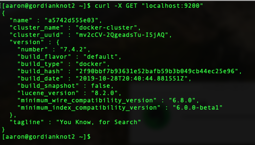
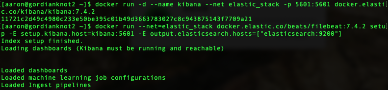

2019/12/31 
# ELK：
##### Elastic static 架構


### 參數
- CentOS 7.5
- Elasticsearch 7.4.2
- Kibana 7.4.2
- Logstash 7.4.2
- Filebeat 7.4.2


### 安裝

#### Elasticsearch：docker pull
```
$ docker pull docker.elastic.co/elasticsearch/elasticsearch:7.4.2
```
#### Kibana：docker pull
```
$ docker pull docker.elastic.co/kibana/kibana:7.4.2
```
#### Filebeat：docker pull
```
$ docker pull docker.elastic.co/beats/filebeat:7.4.2
```
#### Logstash：docker pull
```
$ docker pull docker.elastic.co/logstash/logstash:7.4.2
```

### 配置（前置工作）

#### 建立虛擬網路
```
$ docker network create elastic_stack
# 查詢私有網路配置情況
$ docker network inspect elastic_stack
```

#### ELK：設定內容
##### 設定 Filebeat 讀取的Log路徑
##### 建立 filebeat/filebeat.yml
```
$ nano $(pwd)/elk/filebeat/filebeat.yml
# 內容如下：
filebeat.config:
  modules:
    path: ${path.config}/modules.d/*.yml
    reload.enabled: false

filebeat.inputs:
  - type: log
    paths:
      - /var/log/elk-sample.log

output.logstash:
  hosts: ["logstash:5044"]
```

#### Logstash：設定內容
##### 建立工作目錄
```
$ mkdir -p $(pwd)/elk/logstash/pipline
```
##### 設定 Logstash 的 Input/Filter/Output
##### 建立 logstash.conf
```
$ nano $(pwd)/elk/logstash/pipline/logstash.conf
# 內容如下：
input {
  beats {
    port => 5044
  }
}

filter {
  grok {
    match => {
      "message" => "%{GREEDYDATA:result}"
    }
  }
  json {
    source => "result"
  }
  mutate {
    remove_tag => ["_jsonparsefailure"]
  }
}

output {
  elasticsearch {
    hosts => "elasticsearch:9200"
    index => "%{[@metadata][beat]}-%{[@metadata][version]}-%{+YYYY.MM.dd}"
  }
}
```


### 維運

#### Elasticsearch：docker run
```
$ docker run -d --name elasticsearch --net elastic_stack -p 9200:9200 -p 9300:9300 -e "discovery.type=single-node" docker.elastic.co/elasticsearch/elasticsearch:7.4.2
```
##### 測試是否成功運行
```
$ curl -X GET "localhost:9200"
```


#### Kibana：docker run
```
$ docker run -d --name kibana --net elastic_stack -p 5601:5601 docker.elastic.co/kibana/kibana:7.4.2
```
##### 測試是否成功運行
`http://ip:5601`

#### Filebeat：docker run
##### 在 Kibbana 建立 index pattern 及一些基本的圖型
```
# 將 Filebeat 相關的一些 Index Pattern 及 Visualization 建到 Kibana，之後資料進到 Elasticsearch 的時候就可以直接匯整。
$ docker run --net=elastic_stack docker.elastic.co/beats/filebeat:7.4.2 setup -E setup.kibana.host=kibana:5601 -E output.elasticsearch.hosts=["elasticsearch:9200"]
```
###### 執行結果


##### docker run（包含設定 volume mount）
```
$ docker run -d --net=elastic_stack --name=filebeat --user=root --volume="$(pwd)/elk/filebeat/filebeat.yml:/usr/share/filebeat/filebeat.yml:ro" --volume="/var/lib/docker/containers:/var/lib/docker/containers:ro" --volume="/var/run/docker.sock:/var/run/docker.sock:ro" --volume="/var/log:/var/log" docker.elastic.co/beats/filebeat:7.4.2 filebeat -e -strict.perms=false
```

#### Logstash
##### docker run（包含設定 volume mount）
```
$ docker run -d -p 5044:5044 -p 9600:9600 --name logstash --net elastic_stack -v $(pwd)/elk/pipeline/:/usr/share/logstash/pipeline/ docker.elastic.co/logstash/logstash:7.4.2
```


### 測試
#### 將測試檔案置放在以下目錄，在至 Kibana 看結果
```
＄/var/log/
```


##### docke 指令

```
# 顯示 docker network inspect 虛擬網路
$ docker network inspect elastic_stack [虛擬私有網路名稱]

# 顯示 docker 的 images 清單
docker images 

# 透過 iamge 執行並產生一個新的 container
$ docker run [Image 名稱]:[Image 版本] [執行指令]

# 查看正在執行的 containers
$ docker ps

# 查看所有的 containers
$ docker ps -a

# 查詢正在執行的 container
$ docker ps
$ docker exec -i -t [Container ID] bash
$ exit

# 移除這個「tomcat8080」容器
$ docker rm containner-id
```
