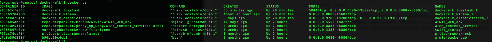
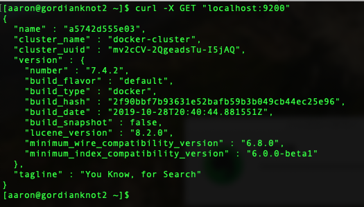
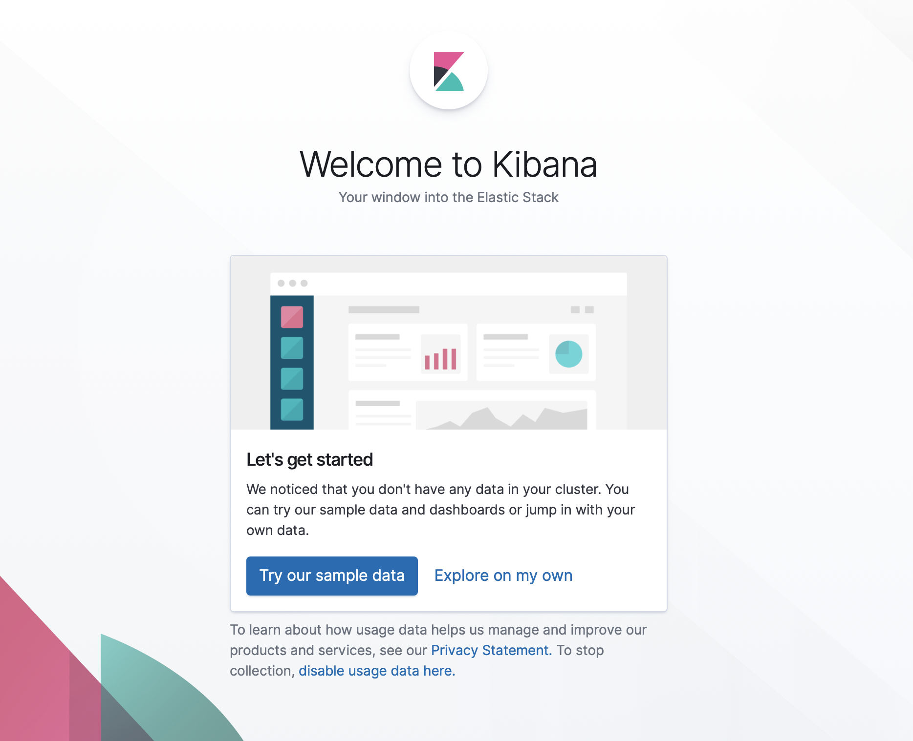

# ELK(docker-compose)

### 參數
- CentOS 7.5
- Elasticsearch 6.5.4
- Kibana 7.5.0
- Logstash 7.5.0
- Filebeat 7.5.0

### 安裝

#### 安裝 docker-compos
```bash=
# 測試安裝
$ sudo docker-compose --version
# 如果出現 "docker-compose version ..." 既表示安裝過，若無，請執行以下安裝指令
# 安裝
$ sudo yum install docker-compose
```

#### 安裝 git
```bash=
# 測試安裝
$ sudo git --versio
# 如果出現 "git version ..." 既表示安裝過;若無，請執行以下安裝指令
# 安裝
$ sudo yum install git-all
```

#### 安裝 nano
```bash=
# 測試安裝
# 如果出現 ”GNU nano version ..." 既表示安裝過;若無，請執行以下安裝指令
# 安裝
$ sudo yum -y install nano

```
#### 建立工作目錄
```bash=
$ cd ~
$ mkdir -p $(pwd)/elk/docker-elk
```

#### 安裝 ELK
```bash=
$ cd ~
# 下載 ELK
$ git clone https://github.com/deviantony/docker-elk.git $(pwd)/elk/docker-elk
$ cd $(pwd)/elk/docker-elk
# 建立容器並啟動容器（建立容器時間取決網路頻寬）
$ sudo docker-compose up -d
```

### 配置 ELK

#### 修改 logstash.conf
```bash=
$ cd ~
$ nano $(pwd)/elk/docker-elk/logstash/pipeline/logstash.conf
# 修改成以下內容：
input{
      	tcp {
             	mode => "server"
                port => 5000
                codec => json_lines
                tags => ["java-springboot"]
        }
}
filter{
    json{
	source => "message"
        remove_field => ["message"]
    }
}
output{
    if "java-springboot" in [tags]{
        elasticsearch{
                hosts=> ["elasticsearch:9200"] 
                index => "java-springboot-%{+YYYY.MM.dd}"
                }
        stdout{codec => rubydebug}
    }
}

```

#### 關閉 xpack，將以下設定檔，有關 xpack 都設為 false
```bash=
$ cd ~

$ nano $(pwd)/elk/docker-elk/elasticsearch/config/elasticsearch.yml
# 修改如下
xpack.security.enabled: false
xpack.monitoring.collection.enabled: false

$ nano $(pwd)/elk/docker-elk/kibana/config/kibana.yml
# 修改如下
xpack.monitoring.ui.container.elasticsearch.enabled: false

$ nano $(pwd)/elk/docker-elk/logstash/config/logstash.yml
# 修改如下
xpack.monitoring.enabled: false
```

#### 重啟 ELK
```bash=
# 修改後需要重啟
$ cd ~
$ cd $(pwd)/elk/docker-elk
$ docker-compose restart
```


#### 防火牆開通 8089、8088 port（需要 Port mapping 在執行）
```bash=
$ sudo iptables -A INPUT -p tcp -m tcp --dport 8089 -j ACCEPT
$ sudo iptables -A INPUT -p tcp -m tcp --dport 8088 -j ACCEPT

$ sudo firewall-cmd --zone=public --add-port=8089/tcp --permanent
$ sudo firewall-cmd --zone=public --add-port=8088/tcp --permanent

$ sudo firewall-cmd --reload
```

#### 配合指定 Port：修改 docker-compose.yml（restart: always、port：8088:5000、port：8088:5000）
```bash=
$ cd ~
$ nano $(pwd)/elk/docker-elk/docker-compose.yml
```
##### docker-compose.yml：修改成以下內容
```yaml=
version: '3.2'

services:
  elasticsearch:
    # 開機自動啟動
    restart: always  
    build:
      context: elasticsearch/
      args:
	ELK_VERSION: $ELK_VERSION
    volumes:
      - type: bind
        source: ./elasticsearch/config/elasticsearch.yml
        target: /usr/share/elasticsearch/config/elasticsearch.yml
        read_only: true
      - type: volume
        source: elasticsearch
        target: /usr/share/elasticsearch/data
    ports:
      - "9200:9200"
      - "9300:9300"
    environment:
      ES_JAVA_OPTS: "-Xmx256m -Xms256m"
      ELASTIC_PASSWORD: changeme
      # Use single node discovery in order to disable production mode and avoid bootstrap checks
      # see https://www.elastic.co/guide/en/elasticsearch/reference/current/bootstrap-checks.html
      discovery.type: single-node
    networks:
      - elk

  logstash:
    # 開機自動啟動  
    restart: always    
    build:
      context: logstash/
      args:
        ELK_VERSION: $ELK_VERSION
    volumes:
      - type: bind
        source: ./logstash/config/logstash.yml
        target: /usr/share/logstash/config/logstash.yml
        read_only: true
      - type: bind
        source: ./logstash/pipeline
        target: /usr/share/logstash/pipeline
        read_only: true
    ports:
      # - "5000:5000"
      # port mapping      
      - "8088:5000"      
      - "9600:9600"
    environment:
      LS_JAVA_OPTS: "-Xmx256m -Xms256m"
    networks:
      - elk
    depends_on:
      - elasticsearch

  kibana:
    # 開機自動啟動  
    restart: always    
    build:
      context: kibana/
      args:
        ELK_VERSION: $ELK_VERSION
    volumes:
      - type: bind
        source: ./kibana/config/kibana.yml
        target: /usr/share/kibana/config/kibana.yml
        read_only: true
    ports:
      # - "5601:5601"
      # port mapping
      - "8089:5601"      
    networks:
      - elk
    depends_on:
      - elasticsearch

networks:
  elk:
    driver: bridge

volumes:
  elasticsearch:
```

#### 當 docker-compose.yml，相應的 container 被創建之後，再次執行 stop/start/restart 都與 docker-compose.yml 的內容無關了；基於上述原因須於修改 docker-compose.yml 內容後執行以下指令
```bash=
& cd ~
$ cd $(pwd)/elk/docker-elk
$ docker-compose build
$ docker-compose up -d
# 檢查修改後是否生效
$ docker ps
# 根據 NAMES、PORTS 確認是否為以下內容：
# dockerelk_logstash_1  為 5044/tcp, 0.0.0.0:9600->9600/tcp, 0.0.0.0:8088->5000/tcp
# dockerelk_kibana_1   為 0.0.0.0:8089->5601/tcp  
```



### 維運

#### Elasticsearch
##### 測試是否成功運行
```json=
$ curl -X GET "localhost:9200"
# 類似以下內容
{
  "name" : "51e7f896f641",
  "cluster_name" : "docker-cluster",
  "cluster_uuid" : "x90Fc963RBWfSBhm26xnmQ",
  "version" : {
    "number" : "7.5.0",
    "build_flavor" : "default",
    "build_type" : "docker",
    "build_hash" : "e9ccaed468e2fac2275a3761849cbee64b39519f",
    "build_date" : "2019-11-26T01:06:52.518245Z",
    "build_snapshot" : false,
    "lucene_version" : "8.3.0",
    "minimum_wire_compatibility_version" : "6.8.0",
    "minimum_index_compatibility_version" : "6.0.0-beta1"
  },
  "tagline" : "You Know, for Search"
}
```


#### Logstash
##### 測試是否成功運行
```bash=
# 等相關服務重啟後，可透過指令確認與 Elasticsearch是否連線正常
$ docker logs -f dockerelk_logstash_1
# 出現 “Successfully started Logstash API endpoint” 內容
[2020-01-13T09:54:57,081][INFO ][logstash.agent           ] Successfully started Logstash API endpoint {:port=>9600}
```

#### Kibana
##### 測試是否成功運行
```bash=
# 有做 Port mapping
透過瀏覽器 http://ip:8089 或於終端機執行以下指令
$ curl -X GET "ip:8089"
# 沒有做 Port mapping
透過瀏覽器 http://ip:5601 或於終端機執行以下指令
$ curl -X GET "ip:5601"
```



#### docke 指令
```
# 顯示 docker network inspect 虛擬網路
$ docker network inspect elastic_stack [虛擬私有網路名稱]

# 顯示 docker 的 images 清單
docker images 

# 透過 iamge 執行並產生一個新的 container
$ docker run [Image 名稱]:[Image 版本] [執行指令]

# 查看正在執行的 containers
$ docker ps

# 查看所有的 containers
$ docker ps -a

# 查詢正在執行的 container
$ docker ps
$ docker exec -i -t [Container ID] bash
$ exit

# 移除這個「tomcat8080」容器
$ docker rm containner-id

##將所有 Container 殺掉
$ docker kill $(docker ps -q)

# 將所有 Container 移除
$ docker rm $(docker ps -a -q)

# 删除所有的镜像
$ docker rmi $(docker images -q)
```


#### 定義日誌種類
```
account：Account issues
connection：Communication connection
```
