# ELK：是由 Elasticsearch、Logstash 及 Kibana 三個系統所組成的 Log 蒐集、分析、查詢系統．可以在不改變原系統架構的情況下，架設 ELK 蒐集、分析、查詢 Log，簡化過去繁鎖又沒效率的查找 Log 工作。
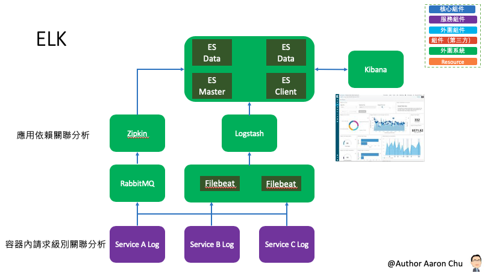
##### Elastic Stack 有四個主要組件
- Elasticsearch：一個分布式 RESTful 搜索引擎，用於存儲所有收集的數據。
- Logstash：Elastic Stack的數據處理組件，用於將傳入數據發送到 Elasticsearch。
- Kibana：用於搜索和可視化日誌的Web界面。
- Beats：輕量級，單一用途的數據發佈者，可以將數百或數千台計算機中的數據發送到 Logstash或 Elasticsearch。

### 參數
- Ubuntu 18.04
- Elasticsearch 6.4.3
- Kibana 6.4.3
- Logstash 6.4.3
- Filebeat 6.4.3

### 準備
###### Elasticsearch
```
# 將 Elasticsearch 公開 GPG 密鑰導入 APT
$ wget -qO - https://artifacts.elastic.co/GPG-KEY-elasticsearch | sudo apt-key add -
# 將 Elastic 資源列表添加到 sources.list.d 目錄，其中 APT 將查找新的資源
$ echo "deb https://artifacts.elastic.co/packages/6.x/apt stable main" | sudo tee -a /etc/apt/sources.list.d/elastic-6.x.list
$ sudo apt update
```

### 安裝
###### Elasticsearch
```
$ sudo apt install elasticsearch
```
###### Kibana：根據官方文件安裝順序為 Elasticsearch -> Kibana
```
$ sudo apt install kibana
```
###### Logstash
```
$ sudo apt install logstash
```

###### Filebeat
```
$ sudo apt install filebeat
```

### 配置
###### Elasticsearch
- 外網訪問限制配置
```
# Elasticsearch 監聽來自端口9200上各處的流量。 若有需要限制對 Elasticsearch 實例的外部訪問，以防止外人通過REST API 讀取您的資料或關閉您的 Elasticsearch 集群。 找到指定network.host的行，取消注釋，並將其值替換為localhost。
$ sudo nano /etc/elasticsearch/elasticsearch.yml
# 只允許本機訪問
# network.host: localhost
# 允許外網訪問 （本例為測試環境，故採開放外網方式）
network.host: 0.0.0.0
\wq

$ sudo systemctl start elasticsearch
```
###### Kibana：須先配置 Nginx
- 由於 Kibana 配置為僅監聽 localhost ，因此必須設置反向代理以允許對其進行外部訪問。本例將使用 Nginx 來實現此目的。首先，使用 openssl 命令創建一個管理 Kibana 用戶，您將使用該用戶訪問 Kibana Web 界面。 這次我們將此帳戶設為「kibanaadmin」但為了確保更高的安全性，建議為此用戶選擇難以猜測的非標準名稱。
```
# 配置 kibanaadmin 密碼
$ echo "kibanaadmin:`openssl passwd -apr1`" | sudo tee -a /etc/nginx/htpasswd.users
# passord：999999
```
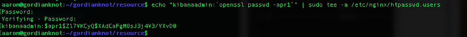

- 建立 Nginx 應用文件，供 Kibana 使用
```
sudo nano /etc/nginx/sites-available/gordianknot
server {
    listen 80;

    server_name gordianknot;

    auth_basic "Restricted Access";
    auth_basic_user_file /etc/nginx/htpasswd.users;

    location / {
        proxy_pass http://gordianknot:5601;
        proxy_http_version 1.1;
        proxy_set_header Upgrade $http_upgrade;
        proxy_set_header Connection 'upgrade';
        proxy_set_header Host $host;
        proxy_cache_bypass $http_upgrade;
    }
}
\wq
```
- 通過指向 sites-enabled 目錄的符號鏈接來啓用新配置
```
$ sudo ln -s /etc/nginx/sites-available/gordianknot /etc/nginx/sites-enabled/gordianknot
# 測試以上述內容的語法是否有誤
$ sudo nginx -t
$ sudo systemctl restart nginx
```
- Kibana 配置外網訪問 
```
$ sudo nano /etc/kibana/kibana.yml
# 預設綁定在 127.0.0.1，因此如果想要透過外部 ip 連線至此服務，就需要更改 kibana 的 config 
server.host: "0.0.0.0"
```

###### Kibana 配置中文化
```
# 下載路徑至 /usr/share/kibana/node_modules/x-pack/plugins/translations
$ sudo wget https://raw.githubusercontent.com/jerrywang1974/kibana_zh-TW/master/zh-TW.json -O /usr/share/kibana/node_modules/x-pack/plugins/translations/translations/zh-TW.json
$ sudo nano /etc/kibana/kibana.yml
i18n.locale: "zh-TW"
\wq
```

###### 配置 Logstash：# 配置文件以 JSON 格式編寫，於 /etc/logstash/conf.d 目錄下
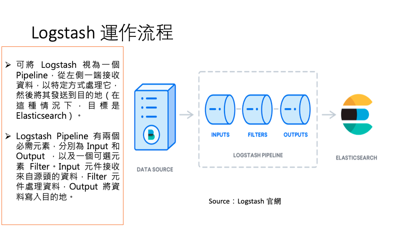
- 配置 Input 內容
```
$ sudo nano /etc/logstash/conf.d/02-beats-input.conf
# 插入以下 Input 配置。 這指定將在 TCP 端口5044上監聽的 beats 輸入
input {
  beats {
    port => 5044
  }
}
\wq
```
- 配置 Filter 內容
```
$ sudo nano /etc/logstash/conf.d/10-syslog-filter.conf
# 插入以下 syslog 過濾器配置。 此示例系統日誌配置取自官方 Elastic 文件。此過濾器用於解析傳入的系統日誌，使其由預定義的 Kibana 儀表板構建和使用
filter {
  if [fileset][module] == "system" {
    if [fileset][name] == "auth" {
      grok {
        match => { "message" => ["%{SYSLOGTIMESTAMP:[system][auth][timestamp]} %{SYSLOGHOST:[system][auth][hostname]} sshd(?:\[%{POSINT:[system][auth][pid]}\])?: %{DATA:[system][auth][ssh][event]} %{DATA:[system][auth][ssh][method]} for (invalid user )?%{DATA:[system][auth][user]} from %{IPORHOST:[system][auth][ssh][ip]} port %{NUMBER:[system][auth][ssh][port]} ssh2(: %{GREEDYDATA:[system][auth][ssh][signature]})?",
                  "%{SYSLOGTIMESTAMP:[system][auth][timestamp]} %{SYSLOGHOST:[system][auth][hostname]} sshd(?:\[%{POSINT:[system][auth][pid]}\])?: %{DATA:[system][auth][ssh][event]} user %{DATA:[system][auth][user]} from %{IPORHOST:[system][auth][ssh][ip]}",
                  "%{SYSLOGTIMESTAMP:[system][auth][timestamp]} %{SYSLOGHOST:[system][auth][hostname]} sshd(?:\[%{POSINT:[system][auth][pid]}\])?: Did not receive identification string from %{IPORHOST:[system][auth][ssh][dropped_ip]}",
                  "%{SYSLOGTIMESTAMP:[system][auth][timestamp]} %{SYSLOGHOST:[system][auth][hostname]} sudo(?:\[%{POSINT:[system][auth][pid]}\])?: \s*%{DATA:[system][auth][user]} :( %{DATA:[system][auth][sudo][error]} ;)? TTY=%{DATA:[system][auth][sudo][tty]} ; PWD=%{DATA:[system][auth][sudo][pwd]} ; USER=%{DATA:[system][auth][sudo][user]} ; COMMAND=%{GREEDYDATA:[system][auth][sudo][command]}",
                  "%{SYSLOGTIMESTAMP:[system][auth][timestamp]} %{SYSLOGHOST:[system][auth][hostname]} groupadd(?:\[%{POSINT:[system][auth][pid]}\])?: new group: name=%{DATA:system.auth.groupadd.name}, GID=%{NUMBER:system.auth.groupadd.gid}",
                  "%{SYSLOGTIMESTAMP:[system][auth][timestamp]} %{SYSLOGHOST:[system][auth][hostname]} useradd(?:\[%{POSINT:[system][auth][pid]}\])?: new user: name=%{DATA:[system][auth][user][add][name]}, UID=%{NUMBER:[system][auth][user][add][uid]}, GID=%{NUMBER:[system][auth][user][add][gid]}, home=%{DATA:[system][auth][user][add][home]}, shell=%{DATA:[system][auth][user][add][shell]}$",
                  "%{SYSLOGTIMESTAMP:[system][auth][timestamp]} %{SYSLOGHOST:[system][auth][hostname]} %{DATA:[system][auth][program]}(?:\[%{POSINT:[system][auth][pid]}\])?: %{GREEDYMULTILINE:[system][auth][message]}"] }
        pattern_definitions => {
          "GREEDYMULTILINE"=> "(.|\n)*"
        }
        remove_field => "message"
      }
      date {
        match => [ "[system][auth][timestamp]", "MMM  d HH:mm:ss", "MMM dd HH:mm:ss" ]
      }
      geoip {
        source => "[system][auth][ssh][ip]"
        target => "[system][auth][ssh][geoip]"
      }
    }
    else if [fileset][name] == "syslog" {
      grok {
        match => { "message" => ["%{SYSLOGTIMESTAMP:[system][syslog][timestamp]} %{SYSLOGHOST:[system][syslog][hostname]} %{DATA:[system][syslog][program]}(?:\[%{POSINT:[system][syslog][pid]}\])?: %{GREEDYMULTILINE:[system][syslog][message]}"] }
        pattern_definitions => { "GREEDYMULTILINE" => "(.|\n)*" }
        remove_field => "message"
      }
      date {
        match => [ "[system][syslog][timestamp]", "MMM  d HH:mm:ss", "MMM dd HH:mm:ss" ]
      }
    }
  }
}
\wq
```
- 配置 Output 內容
```
$ sudo nano /etc/logstash/conf.d/30-elasticsearch-output.conf
# 插入以下 output 配置。 本質上，此輸出將 Logstash 配置為將 Beats 資料存儲在 Elasticsearch 中，該數據在 gordianknot:9200 運行，位於以 Beat 使用的名稱命名的索引中。本例使用的 Beat 是 Filebeat
output {
  elasticsearch {
    hosts => ["gordianknot:9200"]
    manage_template => false
    index => "%{[@metadata][beat]}-%{[@metadata][version]}-%{+YYYY.MM.dd}"
  }
}
```
- 測試上述內容的語法是否正確
```
$ sudo -u logstash /usr/share/logstash/bin/logstash --path.settings /etc/logstash -t
# 若測試正確，則會出現 「Configuration OK」的內容
```
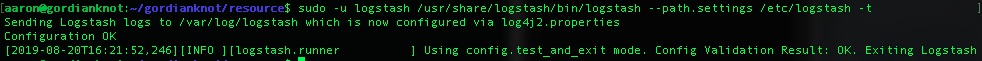


###### Filebeat：配置與 Logstash 連線
```
# 默認情況下，Filebeat 配置為使用 syslog 和授權日誌的默認路徑
$ sudo nano /etc/filebeat/filebeat.yml
output.elasticsearch:
  # Array of hosts to connect to.
  # hosts: ["localhost:9200"]
  hosts: ["gordianknot:9200"]
\wq

# 啟用
$ sudo filebeat modules enable system
# 透過指令查詢啟用和禁用的模組，查詢結果如下圖：
$ sudo filebeat modules list
```
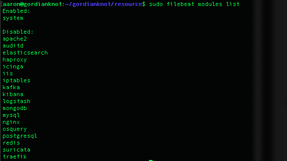
- 將索引模板加載到 Elasticsearch
```
# 接下來，將索引模板加載到 Elasticsearch 中。 Elasticsearch 索引是具有類似特徵的文件集合。索引用名稱標識，用於在其中執行各種操作時引用索引。創建新索引時，將自動應用索引模板。
sudo filebeat setup --template -E output.logstash.enabled=false -E 'output.elasticsearch.hosts=["gordianknot:9200"]'
```
- Logstash 啟用時加載 Kibana
```
# 儀表板加載時 Filebeat 會連接到 Elasticsearch 檢查版本信息。要在啓用 Logstash 時加載儀表板，需要禁用 Logstash 輸出並啓用 Elasticsearch輸出
$ sudo filebeat setup -e -E output.logstash.enabled=false -E output.elasticsearch.hosts=['gordianknot:9200'] -E setup.kibana.host=gordianknot:5601
```

### 測試
###### Elasticsearch 連接測試 `http://gordianknot:9200`
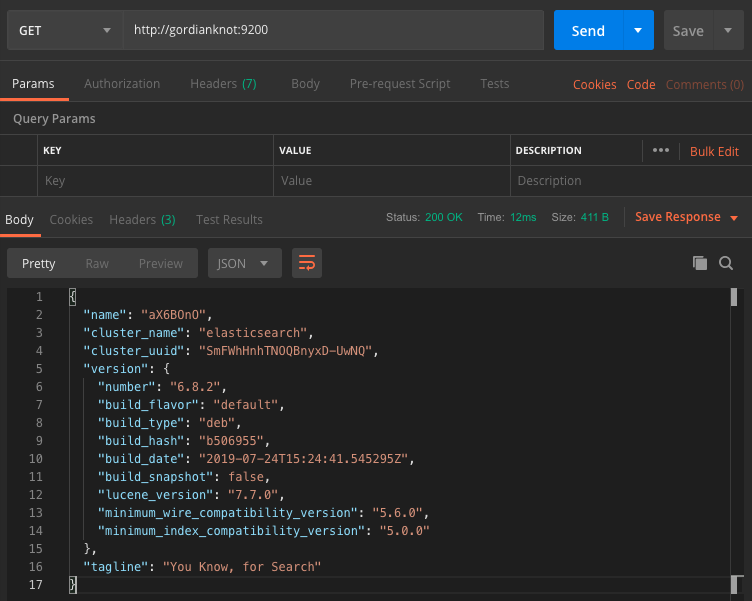
###### Kibana 連接測試 `http://gordianknot/status`
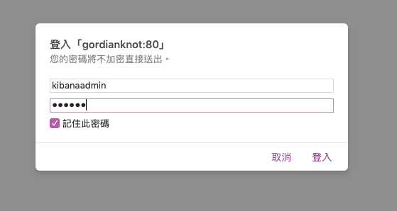
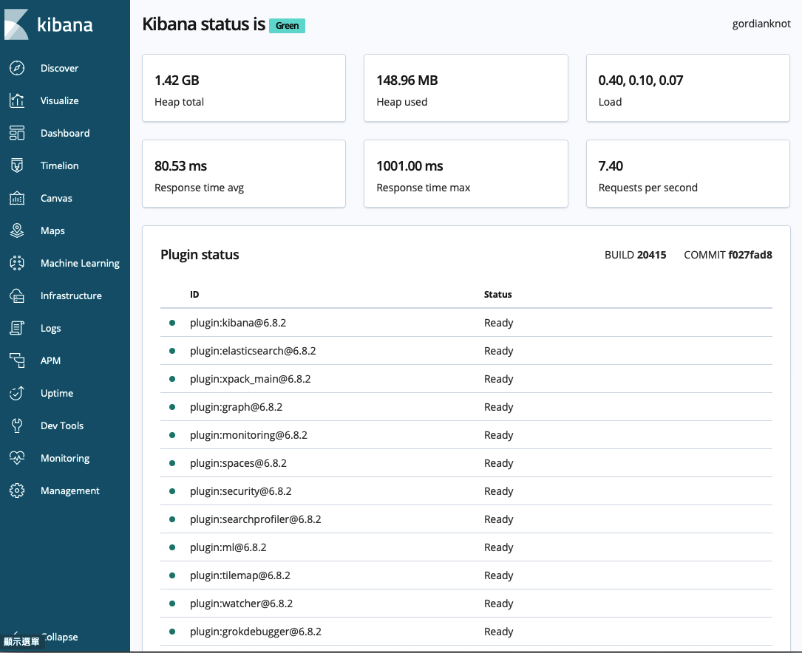
###### Elasticsearch 是否正確接收到資料 `http://gordianknot:9200/filebeat-*/_search?pretty`
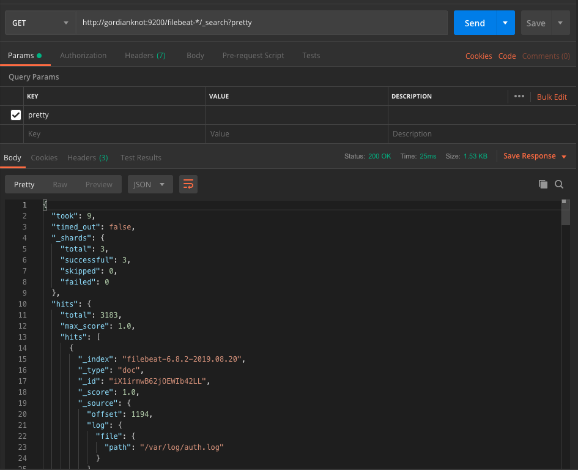
###### 探索 Kibana `http://gordianknot`
```
# 單擊左側導航欄中的「Discover」，選擇預定義的「filebeat- *」 索引模式以查看 Filebeat 資料。如下圖：
```
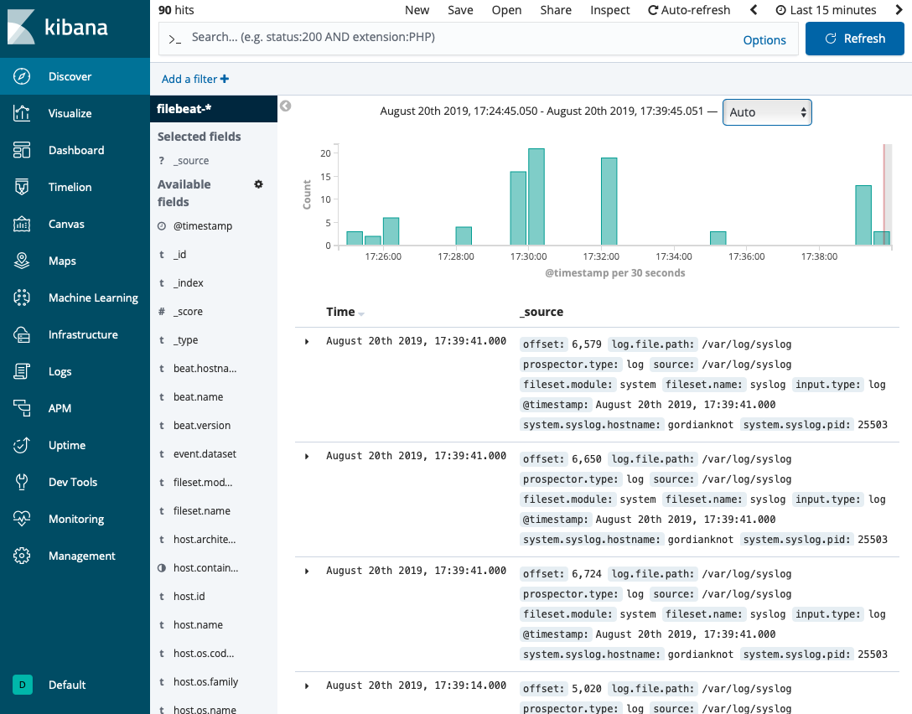

###### Kibana 配置中文化 `http://gordianknot`
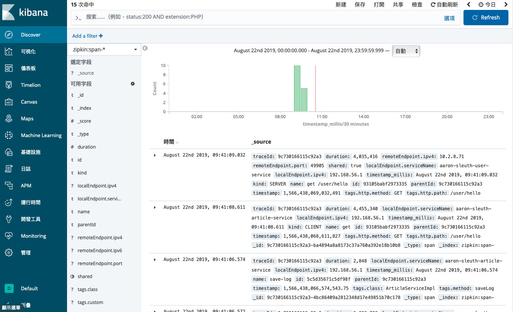

### 維運
###### Elasticsearch
```
$ sudo systemctl start elasticsearch
$ sudo systemctl enable elasticsearc
```
###### Kibana
```
$ sudo systemctl enable kibana
$ sudo systemctl start kibana
$ sudo systemctl stop kibana
$ sudo systemctl restart kibana
```
###### Logstash
```
$ sudo systemctl start logstash
$ sudo systemctl enable logstash
```

###### Filebeat
```
$ sudo filebeat modules enable system
$ sudo filebeat modules list
$ sudo systemctl start filebeat
$ sudo systemctl enable filebeat
```

