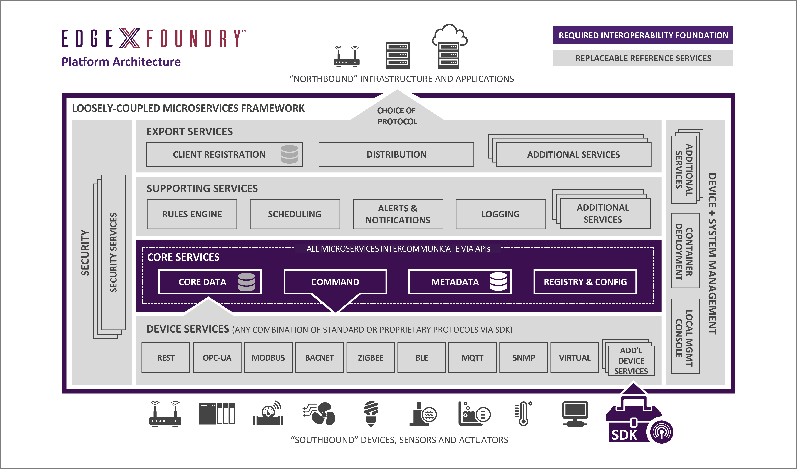
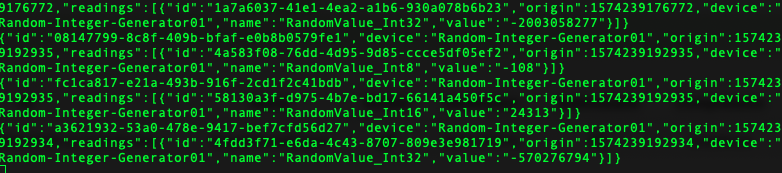
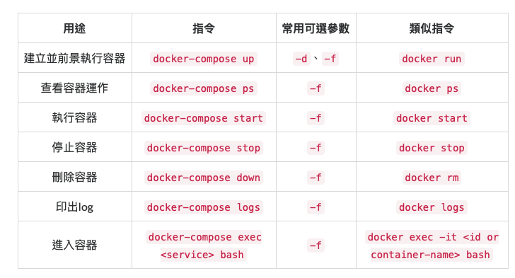

# EdgeX Foundry：邊緣計算框架



### 參數
- Ubuntu 18.04
- EdgeX Foundry edinburgh-1.0.1
    - 服務依賴
        - Docker
            - [安裝 Docker](../server/Docker)
        - Docker Compose
            - [安裝 Docker-compose](../server/Docker-compose)

## 開始

### 準備

#### 建立 EdgeX 工作目錄
```
$ mkdir -p  ~/gordianknot/project/edgex
```

#### 下載

##### docker-compose.yml（透過瀏覽器下載）
``` 
https://github.com/edgexfoundry/developer-scripts/blob/master/releases/edinburgh/compose-files/docker-compose-edinburgh-1.0.1.yml 
```
##### 修改 docker-compose.yml 並上傳至 gordianknot/home/aaron/gordianknot/resource
```
$ cp docker-compose.yml ~/gordianknot/project/edgex/
```

### 安裝

##### 資源鏡像
```
$ sudo docker-compose pull
```

##### 安裝 | jq
```
sudo apt install jq 
```


### 配置

### 確認影響服務已關閉（MongoDB、PostgreSQL）
```
# 確認 MongoDB 已關閉
$  sudo systemctl stop mongod
# 確認 PostgreSQL 已關閉
$ sudo service postgresql stop
```

## 測試

### 連接設備
#### 開啓虛擬設備微服務
```
# EdgeX Foundry 提供了虛擬設備供測試使用，默認為關閉
# 修改 docker-compose.yml，將以下內容的注釋去掉

  device-random:
    image: edgexfoundry/docker-device-random-go:1.0.0
 ...省略
    - command

device-mqtt:
    image: edgexfoundry/docker-device-mqtt-go:1.0.0
    ...省略
    - command
```

#### 啓動虛擬設備微服務、MQTT 微服務
```
$ sudo docker-compose up -d device-random
$ sudo docker-compose up -d device-mqtt
或全啟動
sudo docker-compose up -d
```

### 連接應用：EdgeX North-bound 可連接不同的雲服務與應用，可通過 MQTT broker 驗證 EdgeX 的 North-bound 資料
#### 註冊客戶端服務
```
$ curl -X POST -d '{
"name":"QuickStartExport",
"addressable":{
"name":"HiveMQBroker",
"protocol":"tcp",
"address":"broker.hivemq.com",
"port":1883,
"publisher":"EdgeXExportPublisher",
"topic":"EdgeXQuickStartGuide"
},
"format":"JSON",
"filter":{
"deviceIdentifiers":["Random-Integer-Generator01"]
},
"enable":true,
"destination":"MQTT_TOPIC"
}' http://localhost:48071/api/v1/registration
```
#### 訂閱 MQTT Topic：透過 broker.hivemq.com Broker
```
$ mosquitto_sub -h broker.hivemq.com -p 1883 -t EdgeXQuickStartGuide
```


#### 查詢設備 Random-Integer-Generator01 可用指令
```
$ curl http://localhost:48082/api/v1/device/name/Random-Integer-Generator01 | jq

# 返回資訊
{
  "id": "68a69883-cf81-4d4e-83d4-cc0b082a67b5",
  "name": "Random-Integer-Generator01",
  "adminState": "UNLOCKED",
  "operatingState": "ENABLED",
  "lastConnected": 0,
  "lastReported": 0,
  "labels": [
    "device-random-example"
  ],
  "location": null,
  "commands": [
    {
      "created": 1574229416650,
      "modified": 1574229416650,
      "id": "c6231dcc-193e-4438-a3d0-e7dae5007793",
      "name": "GenerateRandomValue_Int8",
      "get": {
        "path": "/api/v1/device/{deviceId}/GenerateRandomValue_Int8",
        "responses": [
          {
            "code": "503",
            "description": "service unavailable"
          }
        ],
        "url": "http://edgex-core-command:48082/api/v1/device/68a69883-cf81-4d4e-83d4-cc0b082a67b5/command/c6231dcc-193e-4438-a3d0-e7dae5007793"
      },
      "put": {
        "path": "/api/v1/device/{deviceId}/GenerateRandomValue_Int8",
        "parameterNames": [
          "Min_Int8",
          "Max_Int8"
        ],
        "url": "http://edgex-core-command:48082/api/v1/device/68a69883-cf81-4d4e-83d4-cc0b082a67b5/command/c6231dcc-193e-4438-a3d0-e7dae5007793"
      }
    },
    {
      "created": 1574229416677,
      "modified": 1574229416677,
      "id": "560b8749-db4a-42e9-8c4a-10091832e458",
      "name": "GenerateRandomValue_Int16",
      "get": {
        "path": "/api/v1/device/{deviceId}/GenerateRandomValue_Int16",
        "responses": [
          {
            "code": "503",
            "description": "service unavailable"
          }
        ],
        "url": "http://edgex-core-command:48082/api/v1/device/68a69883-cf81-4d4e-83d4-cc0b082a67b5/command/560b8749-db4a-42e9-8c4a-10091832e458"
      },
      "put": {
        "path": "/api/v1/device/{deviceId}/GenerateRandomValue_Int16",
        "parameterNames": [
          "Min_Int16",
          "Max_Int16"
        ],
        "url": "http://edgex-core-command:48082/api/v1/device/68a69883-cf81-4d4e-83d4-cc0b082a67b5/command/560b8749-db4a-42e9-8c4a-10091832e458"
      }
    },
    {
      "created": 1574229416678,
      "modified": 1574229416678,
      "id": "88fd6ed0-6799-47ee-ae44-71517aaea297",
      "name": "GenerateRandomValue_Int32",
      "get": {
        "path": "/api/v1/device/{deviceId}/GenerateRandomValue_Int32",
        "responses": [
          {
            "code": "503",
            "description": "service unavailable"
          }
        ],
        "url": "http://edgex-core-command:48082/api/v1/device/68a69883-cf81-4d4e-83d4-cc0b082a67b5/command/88fd6ed0-6799-47ee-ae44-71517aaea297"
      },
      "put": {
        "path": "/api/v1/device/{deviceId}/GenerateRandomValue_Int32",
        "parameterNames": [
          "Min_Int32",
          "Max_Int32"
        ],
        "url": "http://edgex-core-command:48082/api/v1/device/68a69883-cf81-4d4e-83d4-cc0b082a67b5/command/88fd6ed0-6799-47ee-ae44-71517aaea297"
      }
    }
  ]
}
```
#### 手動獲取設備發送數據
```
$ curl http://localhost:48082/api/v1/device/68a69883-cf81-4d4e-83d4-cc0b082a67b5/command/88fd6ed0-6799-47ee-ae44-71517aaea297 | jq

# 返回資訊
{
  "device": "Random-Integer-Generator01",
  "origin": 1574235000654,
  "readings": [
    {
      "origin": 1574235000654,
      "device": "Random-Integer-Generator01",
      "name": "RandomValue_Int32",
      "value": "703480879"
    }
  ]
}
```
#### 手動控制設備產生的數據範圍
```
$ curl -X PUT -d '[ {"Min_Int32": "0", "Max_Int32": "100"} ]' http://127.0.0.1:48082/api/v1/device/68a69883-cf81-4d4e-83d4-cc0b082a67b5/command/88fd6ed0-6799-47ee-ae44-71517aaea297
# 返回資訊
{
  "Min_Int32": "0",
  "Max_Int32": "100"
}
```
#### 手動查看設備上報的結果
```
$ curl http://127.0.0.1:48082/api/v1/device/68a69883-cf81-4d4e-83d4-cc0b082a67b5/command/88fd6ed0-6799-47ee-ae44-71517aaea297 | jq

# 返回資訊
{
  "device": "Random-Integer-Generator01",
  "origin": 1574235266995,
  "readings": [
    {
      "origin": 1574235266995,
      "device": "Random-Integer-Generator01",
      "name": "RandomValue_Int32",
      "value": "-2143592352"
    }
  ]
}
```


## 維運

### edgex ui
```
http://gordianknot:4000
帳號：admin
密碼：admin
```

### consul 服務對外提供 web 服務，可通過訪問管理服務
```
http://gordianknot:8500/ui/dc1/nodes/edgex-core-consul
```


### 啟動微服務
```
$ sudo docker-compose up -d
```

### 刪除 Docker 容器
```
$ docker rm $(docker ps -a -q)
```

### 驗證容器已啟動
```
$ sudo docker-compose ps
```

### Docker-compose 常見指令
```
用途	指令	常用可選參數	類似指令
建立並前景執行容器	docker-compose up	-d、-f	docker run
查看容器運作	docker-compose ps	-f	docker ps
執行容器	docker-compose start	-f	docker start
停止容器	docker-compose stop	-f	docker stop
刪除容器	docker-compose down	-f	docker rm
印出log	docker-compose logs	-f	docker logs
進入容器	docker-compose exec <service> bash	-f	docker exec -it <id or container-name> bash
```
