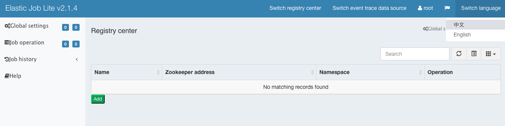
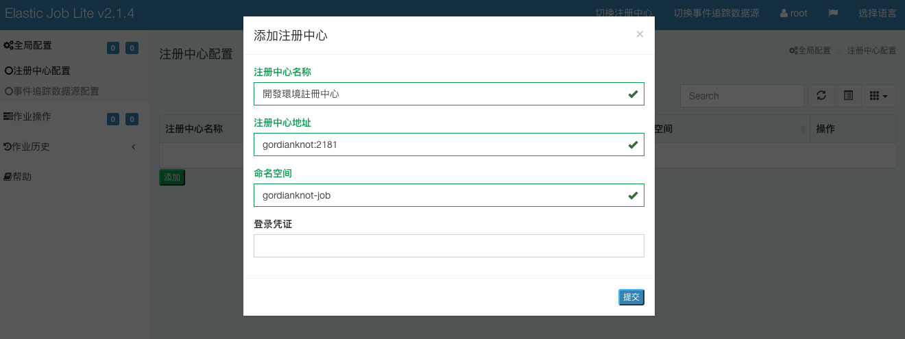
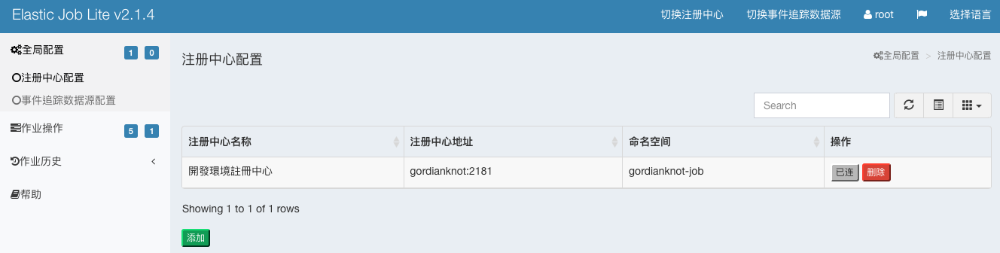
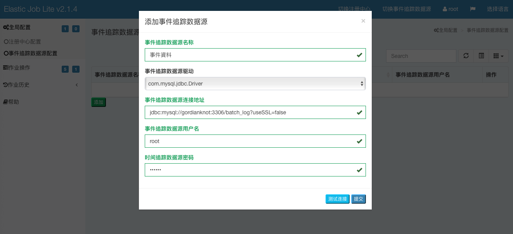
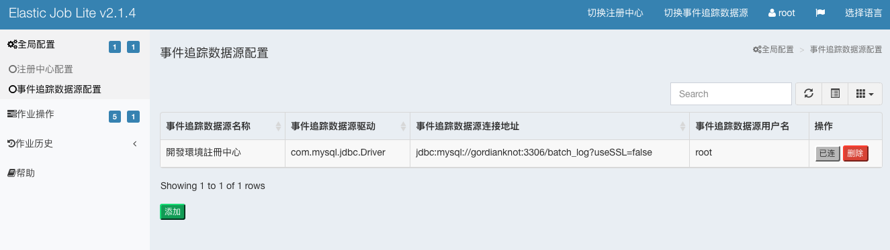
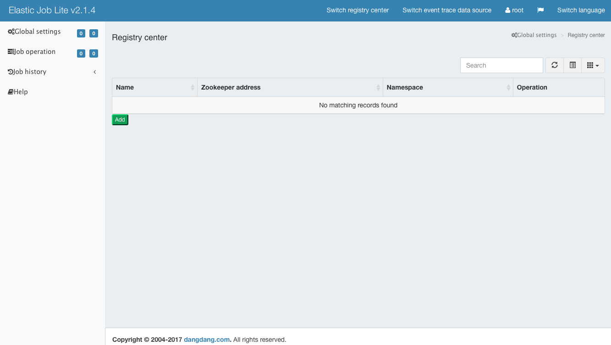

# Elastic-Job-Lite-Console：定位為輕量級無中心化解決方案，使用 jar 包的形式提供分布式任務的協調服務

##### 主要功能：
- 查看作業以及服務器狀態
- 快捷的修改以及刪除作業設置
- 啓用和禁用作業
- 跨註冊中心查看作業
- 查看作業運行軌跡和運行狀態

### 參數
- Ubuntu 18.04
- elastic-job-lite-console 2.1.4

### 準備
###### Elasticsearch
```
# Download  elastic-job-lite-console
$ wget -P ~/gordianknot/resource "https://github.com/miguangying/elastic-job-lite-console/raw/master/elastic-job-lite-console-2.1.4.tar.gz"

# Create directory
$ mkdir -p /home/aaron/gordianknot/project/elastic-job-lite-console-2.1.4

# Unzip
$ tar -xvzf ~/gordianknot/resource/elastic-job-lite-console-2.1.4.tar.gz --strip 1 -C /home/aaron/gordianknot/project/elastic-job-lite-console-2.1.4
```


### 安裝


### 配置
###### 修改預設帳密
- auth.properties 用戶名稱及密碼組態
```
$ nano /home/aaron/gordianknot/project/elastic-job-lite-console-2.1.4/conf/auth.properties
# 改為自己密碼
root.password=999999
\wq
```

##### 中文化


#####  註冊中心配置
###### 配置前需確認 ZK 已啟動
###### 註冊中心名稱：開發環境註冊中心
###### 註冊中心地址：gordianknot:2181
###### 命名空間：gordianknot-job



#####  事件追蹤數據源配置
###### 配置前需確認 MySQL 已啟動
###### 事件追蹤數據源名稱：事件資料
###### 事件追蹤數據源驅動：com.mysql.jdbc.Driver
###### 事件追蹤數據源地址：dbc:mysql://gordianknot:3306/batch_log?useSSL=false
###### 事件追蹤數據源用戶名：root
###### 時間追蹤數據源密碼：999999




### 測試

##### 啟動
```
$ cd /home/aaron/gordianknot/project/elastic-job-lite-console-2.1.4
$ ./bin/start.sh
```



### 維運
```
# 前景執行
$ ./bin/start.sh

# 背景執行
$ nohup ./bin/start.sh &
```