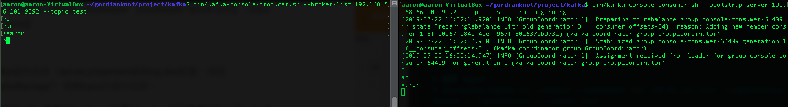
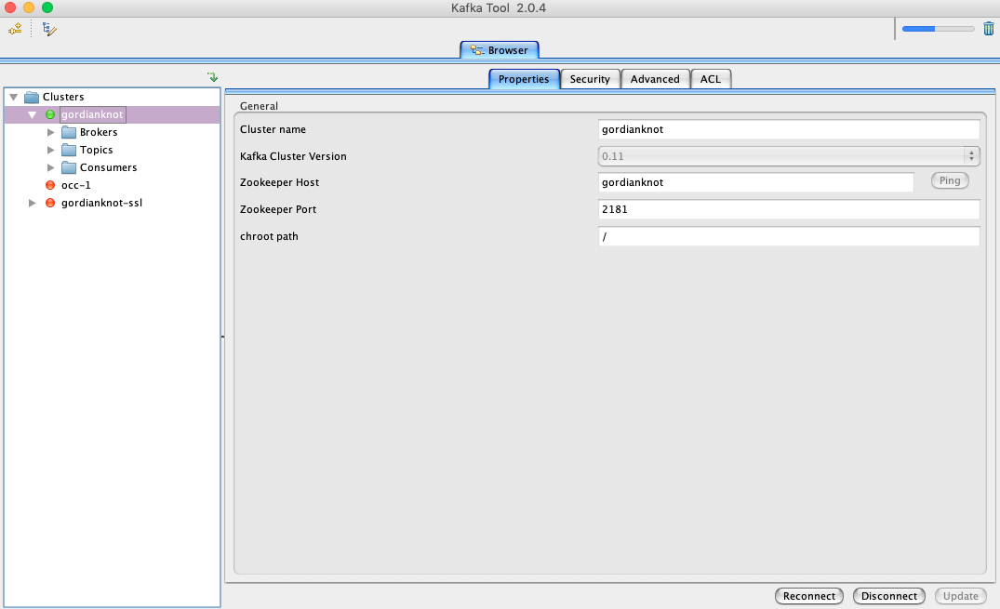
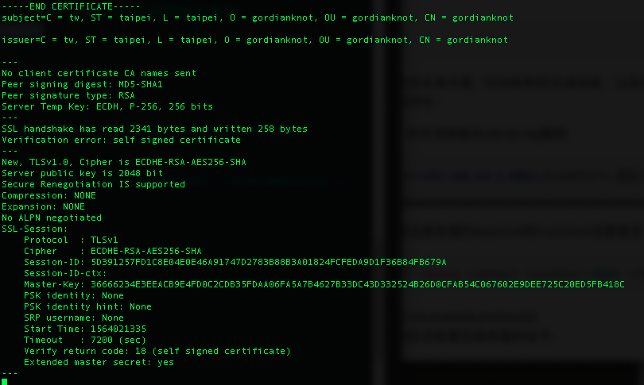
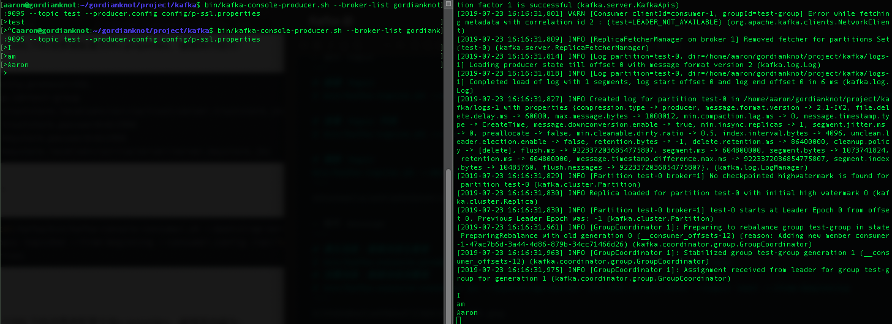
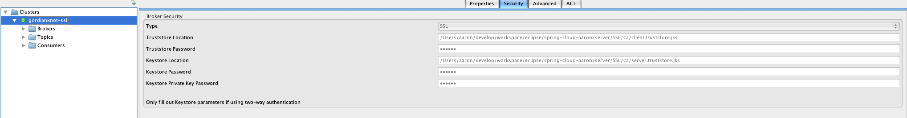
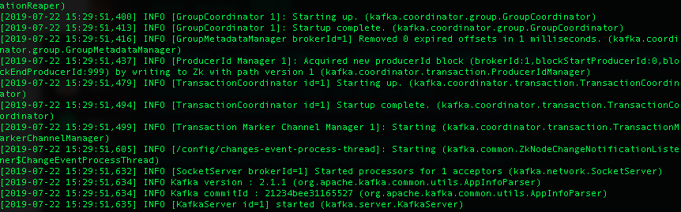

# Kafka：分布式消息代理
##### Apache Kafka是一種流行的分布式消息代理，旨在有效處理大量實時數據。 Kafka集群不僅具有高度可擴展性和容錯性，而且與其他消息代理（如ActiveMQ和RabbitMQ）相比，它還具有更高的吞吐量。 雖然它通常用作發佈/訂閱消息傳遞系統，但許多組織也將其用於日誌聚合，因為它為已發佈的消息提供持久存儲。

## 參數
- Ubuntu 18.04
- kafka 2.1.1
    - 服務依賴
        - Zookeeper
            - [安裝 Zookeeper](../server/Zookeeper)
        - Java
- Kafka Tool 2.0.4 

## 開始

### 準備
```
$ mkdir ~/gordianknot/project/kafka
$ mkdir ~/gordianknot/project/kafka/logs-1
```

### 安裝
```
$ wget -P ~/gordianknot/resource "https://www.apache.org/dist/kafka/2.1.1/kafka_2.11-2.1.1.tgz"
$ tar -xvzf kafka_2.11-2.1.1.tgz --strip 1 -C ~/gordianknot/project/kafka
```

### 配置

#### Kafka 服務器
```
$ nano ~/gordianknot/project/kafka/config/server.properties
broker.id=1
# 默認情況 Kafka 不允許刪除Kafka主題的設置。 要能夠刪除主題，需將以下內容添加到文件內
delete.topic.enable=true
listeners=PLAINTEXT://192.168.56.101:9092
advertised.listeners=PLAINTEXT://192.168.56.101:9092
zookeeper.connect=192.168.56.101:2181
zookeeper.connection.timeout.ms=15000
log.dirs=/home/aaron/gordianknot/project/kafka/logs-1
\wq
```

#### 配置 SSL
```
# SSL 開始配置前準備工作
# 拷貝 server.properties 並命名為 server-ssl.properties
$ cp ~/gordianknot/project/kafka/config/server.properties ~/gordianknot/project/kafka/config/server-ssl.properties
```

```
# 編輯 server-ssl.properties
$ nano ~/gordianknot/project/kafka/config/server-ssl.properties

# 註解 advertised.listeners=PLAINTEXT://192.168.56.101:9092
# 註解listeners=PLAINTEXT://192.168.56.101:9092
# 如果broker之間通訊未啓用SSL（參照下面，啓動它），PLAINTEXT和SSL端口是必須要配置
# listeners=PLAINTEXT://host.name:port,SSL://host.name:port
# SSL認證配置
listeners=SSL://192.168.56.101:9095
advertised.listeners=SSL://192.168.56.101:9095
# 如果不需要驗證主機名，那麼可以這麼設置 ssl.endpoint.identification.algorithm=即可 
# ssl.endpoint.identification.algorithm=HTTPS
# 使用以下設定必須不能填寫主機名，要填寫真實 IP 或留空
ssl.endpoint.identification.algorithm=
ssl.keystore.location=/home/aaron/gordianknot/project/ca/server.keystore.jks
ssl.keystore.password=999999
ssl.key.password=999999
ssl.truststore.location=/home/aaron/gordianknot/project/ca/server.truststore.jks
ssl.truststore.password=999999
ssl.enabled.protocols=TLSv1.2,TLSv1.1,TLSv1
ssl.keystore.type=JKS
ssl.truststore.type=JKS
# kafka2.0.x 開始，將ssl.endpoint.identification.algorithm 設置為了 HTTPS，即:需要驗證主機名

# 設置內部訪問也用SSL，默認值為 security.inter.broker.protocol=PLAINTEXT
security.inter.broker.protocol=SSL
# SSL 結束配置
```

#### 配置消費者/生產者 SSL 文件
- 配置消費者 SSL 文件
```
$ nano /home/aaron/gordianknot/project/kafka/config/c-ssl.properties

security.protocol=SSL
group.id=test-group
ssl.truststore.location=/home/aaron/gordianknot/project/ca/client.truststore.jks
ssl.truststore.password=999999
ssl.keystore.location=/home/aaron/gordianknot/project/ca/server.keystore.jks
ssl.keystore.password=999999
ssl.key.password=999999
ssl.truststore.type=JKS
ssl.keystore.type=JKS


```
- 配置生產者 SSL 文件
```
$ nano /home/aaron/gordianknot/project/kafka/config/p-ssl.properties

bootstrap.servers=gordianknot:9095
security.protocol=SSL
ssl.truststore.location=/home/aaron/gordianknot/project/ca/server.truststore.jks
ssl.truststore.password=999999   
ssl.keystore.location=/home/aaron/gordianknot/project/ca/server.keystore.jks
ssl.keystore.password=999999
ssl.truststore.type=JKS
ssl.keystore.type=JKS
```

## 測試
- 操作 Topic 
```
# 創建 Topic
$ bin/kafka-topics.sh --create --zookeeper 192.168.56.101:2181 --replication-factor 1 --partitions 1 --topic test

# 查看 Topic 列表
$ bin/kafka-topics.sh --list --zookeeper 192.168.56.101:2181

# 刪除 Topic
bin/kafka-topics.sh --delete --zookeeper 192.168.56.101:2181 --topic test
```


- 操作 message
```
# 產生消息，創建消息生產者
$ bin/kafka-console-producer.sh --broker-list 192.168.56.101:9092 --topic test
# 消費消息，創建消息消費者
$ bin/kafka-console-consumer.sh --bootstrap-server 192.168.56.101:9092 --topic test --from-beginning
```


- 以 Kafka tool 工具建立連線



### SSL 驗證 
#### 使用 Linux 內建的 openssl 驗證配置的 ssl 有效（出現以下內容即表示成功）
`openssl s_client -debug -connect gordianknot:9095 -tls1`


- 操作 message
```
# 產生消息，創建消息生產者
$ bin/kafka-console-producer.sh --broker-list gordianknot:9095 --topic test --producer.config config/p-ssl.properties

# 消費消息，創建消息消費者
$ bin/kafka-console-consumer.sh --bootstrap-server gordianknot:9095 --topic test --from-beginning --consumer.config config/c-ssl.properties 
```


- 以 Kafka tool 工具建立連線


## 維運
```
$ cd /home/aaron/gordianknot/project/kafka

# 啟動 Zookeeper
zkServer.sh start

# 啟動
$ bin/kafka-server-start.sh config/server.properties &

# 啟動 for SSL
$ bin/kafka-server-start.sh config/server-ssl.properties &

# 關閉
$ bin/kafka-server-stop.sh

$ netstat -apn | grep 9092
$ netstat -apn | grep 9095
```


