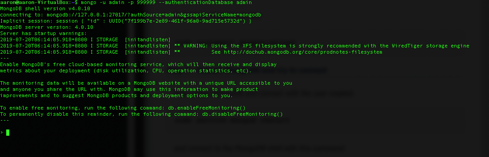
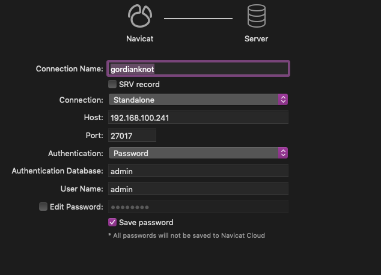

# MongoDB：No-SQL Database
##### 一個著名的NoSQL數據庫，提供高性能，高可用性和自動擴展是MongoDB。它不同於RDBMS，如MySQL，PostgreSQL和SQLite，因為它不使用SQL來設置和檢索數據。 MongoDB將數據存儲在名為BSON的文檔中（JSON的二進制表示以及其他類型的信息）。 MongoDB僅適用於64位長期支持Ubuntu版本。

### 參數
- Ubuntu 18.04
- MongoDB server version: 4.0.10

## 開始

### 準備
```
$ sudo apt-key adv --keyserver hkp://keyserver.ubuntu.com:80 --recv 68818C72E52529D4
$ sudo echo "deb http://repo.mongodb.org/apt/ubuntu bionic/mongodb-org/4.0 multiverse" | sudo tee /etc/apt/sources.list.d/mongodb-org-4.0.list
$ sudo apt-get update
```

### 安裝
`$ sudo apt-get install -y mongodb-org`

### 配置

#### 新增 admin 用戶
```
$ mongo
use admin
db.createUser({user:"admin", pwd:"999999", roles:[{role:"root", db:"admin"}]})
exit
```

#### 啟用 mongodb 身份驗證
```
$ sudo nano /lib/systemd/system/mongod.service
ExecStart=/usr/bin/mongod --auth --config /etc/mongod.conf
\wq

$ sudo systemctl daemon-reload
$ sudo service mongod restart
$ mongo -u admin -p 999999 --authenticationDatabase admin
```


#### 啟用外部 IP 登入
```
$ sudo nano /etc/mongod.conf
net:
    port: 27017
    
    bindIp: 0.0.0.0  # Listen to all interfaces
    #  bindIp: 127.0.0.1 Listen to local interface only, comment to listen on all interfaces.
\wq

$ systemctl restart mongod

```


## 維運
```
$ sudo systemctl start mongod
$ sudo systemctl enable mongod
```