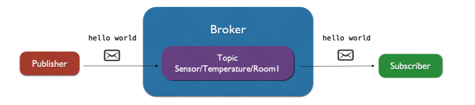
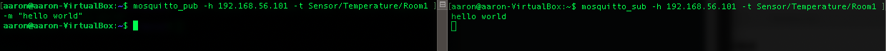

# Mosquitto MQTT：

## 參數
- Ubuntu 18.04
- mosquitto version 1.4.15

## 開始

### 準備
```
$ sudo apt update
$ sudo apt-get upgrade
```

### 安裝
```
$ sudo apt install -y mosquitto
$ sudo apt install -y mosquitto-clients
```

### 配置


## 測試

```
$ mosquitto_sub -h 192.168.56.101 -t Sensor/Temperature/Room1
$ mosquitto_pub -h 192.168.56.101 -t Sensor/Temperature/Room1 -m "hello world"
```


## 維運


