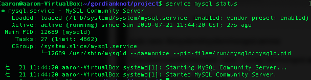

# MySQL：關聯是資料庫

## 參數
- Ubuntu 18.04
    - MySQL 14.14 Distrib 5.7.26
- Centos 7.4
    - MySQL 14.14 Distrib 5.7.31

## 開始

### 準備
```
# Ubuntu
$ sudo apt update
$ sudo apt-get upgrade

# Centos 
# 安裝MySQL Yum repository
$ wget https://repo.mysql.com//mysql57-community-release-el7-11.noarch.rpm
$ yum localinstall mysql57-community-release-el7-11.noarch.rpm
```

### 安裝
```
# Ubuntu
$ sudo apt install mysql-server-5.7 mysql-client-5.7

# Centos
$ yum install mysql-community-server
```


### 配置

#### 設置 root 密碼
##### Ubutntu
```
$ sudo nano /etc/mysql/debian.cnf
# 記住以下的密碼
password = xxx
\q

$ mysql -u debian-sys-maint -p
# 輸入上方的密碼
use mysql;
UPDATE user SET plugin='mysql_native_password' WHERE User='root';
UPDATE mysql.user SET authentication_string=PASSWORD('999999') WHERE USER='root';
FLUSH PRIVILEGES;
\q

# 測試使用新的 root 密碼登入
$ mysql -u root -p
# 輸入新密碼
```

##### CenOS
```
# 了資料庫的安全性，MySQL在安裝後會為root產生一組隨機密碼放在/var/loh/mysqld.log中。查看臨時生成的帳號密碼的方式
$ grep 'temporary password' /var/log/mysqld.log

# 修改隨機密碼可用下列SQL語法修改為自定義密碼
#注意: 密碼須包含一個大寫字母、一個小寫字母、一個數字和一個特殊符號，且長度至少為8字元
$ mysql -uroot -p -> 輸入臨時密碼
$ ALTER USER 'root'@'localhost' IDENTIFIED BY '大小大';
```


#### 設置系統
##### 主要設置內容
##### Ubuntu
- 安裝密碼強度驗證插件 Plugin：No
- 設置密碼強度安全等級：No
- 修改 root 訪問權限：No
- 移除匿名用戶：No
- 移除測試數據庫：No
- 設置完成重新載入安全表：Yes

`$ mysql_secure_installation`

#### 允許外部設備連入
##### Ubutnu
```
$ sudo nano /etc/mysql/mysql-conf.d/mysqld.cnf
bind-address           = 0.0.0.0
\wq

$ mysql -u root -p
GRANT ALL PRIVILEGES ON *.* TO 'root'@'%' IDENTIFIED BY '999999' WITH GRANT OPTION;
FLUSH PRIVILEGES;
\q

# 重啟 mySQL 生效
```


##### CentOS
```
# 檢視3306 Port是否開啟
$ firewall-cmd --query-port=3306/tcp
# no 未開啟
$ firewall-cmd --zone=public --add-port=3306/tcp --permanent -> 開啟指令
$ firewall-cmd --zone=public --remove-port=3306/tcp --permanent -> 關閉指令
# 設定好後重啟防火牆
$ firewall-cmd --reload

# 修改root用戶可任意IP登入
$ mysql -uroot -p
$ update mysql.user set host = '%' where user = 'root';
# 生效修改命令
$ flush privileges; 
```

## 測試

## 維運

```
# Ubumntu
$ service mysql restart
$ service mysql status

# CentOS
$ systemctl start mysqld
$ systemctl status mysqld
```



