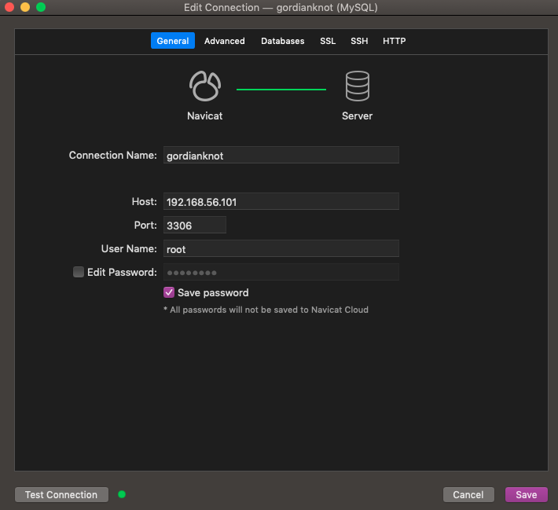
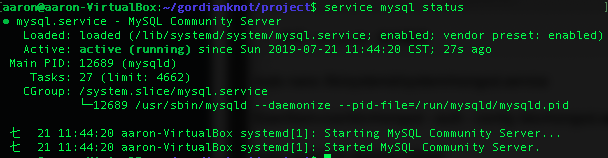

# MySQL：關聯是資料庫

## 參數
- Ubuntu 18.04
- MySQL 14.14 Distrib 5.7.26

## 開始

### 準備
```
$ sudo apt update
$ sudo apt-get upgrade
```

### 安裝
`$ sudo apt install mysql-server-5.7 mysql-client-5.7`

### 配置

#### 設置 root 密碼
```
$ sudo nano /etc/mysql/debian.cnf
# 記住以下的密碼
password = xxx
\q

$ mysql -u debian-sys-maint -p
# 輸入上方的密碼
use mysql;
UPDATE user SET plugin='mysql_native_password' WHERE User='root';
UPDATE mysql.user SET authentication_string=PASSWORD('999999') WHERE USER='root';
FLUSH PRIVILEGES;
\q

# 測試使用新的 root 密碼登入
$ mysql -u root -p
# 輸入新密碼
```

#### 設置系統
##### 主要設置內容
- 安裝密碼強度驗證插件 Plugin：No
- 設置密碼強度安全等級：No
- 修改 root 訪問權限：No
- 移除匿名用戶：No
- 移除測試數據庫：No
- 設置完成重新載入安全表：Yes

`$ mysql_secure_installation`

#### 允許外部設備連入
```
$ sudo nano /etc/mysql/mysql-conf.d/mysqld.cnf
bind-address           = 0.0.0.0
\wq

$ mysql -u root -p
GRANT ALL PRIVILEGES ON *.* TO 'root'@'%' IDENTIFIED BY '999999' WITH GRANT OPTION;
FLUSH PRIVILEGES;
\q

# 重啟 mySQL 生效
```


## 測試

## 維運
```
$ service mysql restart
$ service mysql status
```



