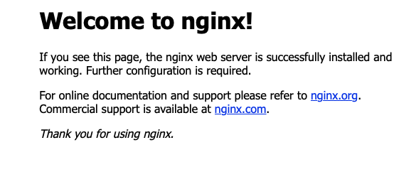

# Nginx：最流行的 Web 服務器之一

### 參數
- Ubuntu 18.04
- Nginx 1.14.0

### 準備
```
$ sudo apt update
```

### 安裝
```
$ sudo apt install nginx
```

### 配置
######
- Nginx在安裝時將自己註冊為 ufw 服務，這使得Nginx可以直接訪問Nginx。
```
# 查詢如何使用 Nginx 配置
$ sudo ufw app list
# Nginx有三个配置文件可用：
# Nginx Full：此配置文件打開端口80（正常，未加密的網絡流量）和端口443（TLS/SSL加密流量）
# Nginx HTTP：此配置文件僅打開端口80（正常，未加密的網絡流量）
# Nginx HTTPS：此配置文件僅打開端口443（TLS/SSL加密流量）
```
- 建議啓用最嚴格的配置文件，該配置文件仍將允許您配置的流量；本例因為測試機，故採較寬鬆的 Nginx HTTP 配置
```
$ sudo ufw allow 'Nginx HTTP'
```

### 測試
- 連接 Nginx 網頁 `http://gordianknot`



### 維運

```
$ sudo systemctl stop nginx
$ sudo systemctl start nginx
$ sudo systemctl restart nginx
$ sudo systemctl reload nginx
$ sudo systemctl disable nginx
$ sudo systemctl enable nginx
```
