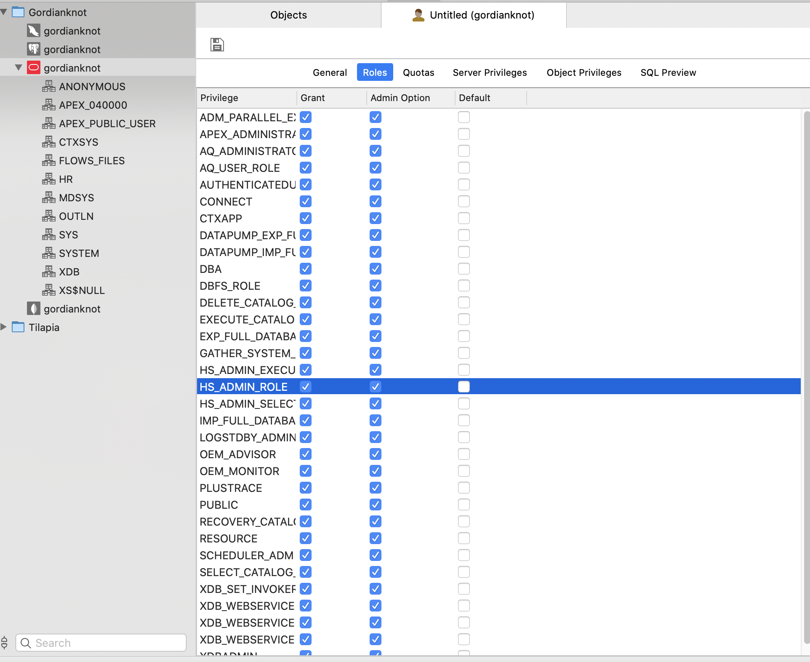

# Oracle：

#### 安裝要求


#### Oracle 11g Express Edition：資料庫的免費版本，支援標準版的大部分功能，使用限制如下：
- 最大資料庫大小為 11 GB
- 可使用的最大記憶體是 1G
- 一台主機上只能安裝一個 XE 例項
- Express Edition只能使用單 CPU，無法在多 CPU 上進行分佈處理

### 參數
- Ubuntu 18.04
- Oracle 11g Express Edition 

## 開始


### 準備

#### 安裝 alien，用於將 rpm 轉為 deb
```
$ sudo apt-get install alien libaio1 unixodbc vim
```

#### 從 Oracle 官網下載 Oracle 11g express edition 安裝檔案
```
https://www.oracle.com/technetwork/cn/database/database-technologies/express-edition/downloads/index.html
```

##### 使用 Zip 工具，將 oracle-xe-11.2.0-1.0.x86_64.rpm.zip 解壓縮
```
oracle-xe-11.2.0-1.0.x86_64.rpm.zip
```

#### 將 rpm 安裝檔案轉為 deb 檔案，以供 Ubuntu 安裝
```
$ sudo alien --scripts -d ~/gordianknot/resource/
```

### 安裝

#### 安裝 Oracle 11gR2 XE
```
$ sudo dpkg --install oracle-xe_11.2.0-2_amd64.deb 
```

### 配置

#### 資料庫組態設定（修改到的內容；HTTP port：7070；SYS/SYSTEM password：999999；be started on boot：y）
```
$ sudo /etc/init.d/oracle-xe configure

Oracle Database 11g Express Edition Configuration
-------------------------------------------------
This will configure on-boot properties of Oracle Database 11g Express 
Edition.  The following questions will determine whether the database should 
be starting upon system boot, the ports it will use, and the passwords that 
will be used for database accounts.  Press <Enter> to accept the defaults. 
Ctrl-C will abort.

Specify the HTTP port that will be used for Oracle Application Express [8080]:7070

Specify a port that will be used for the database listener [1521]:

Specify a password to be used for database accounts.  Note that the same
password will be used for SYS and SYSTEM.  Oracle recommends the use of 
different passwords for each database account.  This can be done after 
initial configuration:
Password can't be null. Enter password:
Confirm the password:

Do you want Oracle Database 11g Express Edition to be started on boot (y/n) [y]:y

Starting Oracle Net Listener...Done
Configuring database...

```
#### 環境變數 /etc/profile（永久生效）
```
$ sudo cd /u01/app/oracle/product/11.2.0/xe/bin/ 
$ sudo cp oracle_env.csh /etc/profile.d/ 
$ sudo cp oracle_env.sh /etc/profile.d/ 
$ source /etc/profile  
```


#### 資料庫遠端連線
```
$ sqlplus /nolog
sys/999999 as sysdba;
EXEC DBMS_XDB.SETLISTENERLOCALACCESS(FALSE);
```


#### 修改 oracle 密碼
```
$ su
$ sudo passwd oracle
999999
```

## 測試

#### 移除已安裝 Oracle 系統
```
$ sudo su
$ /etc/init.d/oracle-xe stop
$ dpkg --purge oracle-xe
$ rm -r /u01/app
$ rm /etc/default/oracle-xe
$ update-rc.d -f oracle-xe remove
$ update-rc.d -f oracle-mount remove
$ update-rc.d -f oracle-shm remove
```

#### 新建表空間（gordianknot）
```
$ sqlplus /nolog 
SQL> conn system as sysdba
SQL> create tablespace gordianknot logging datafile '/u01/app/oracle/oradata/XE/gordianknot.dbf'                            
  2  size 50M autoextend on next 50M maxsize 2048M                        
  3  extent management local;   
```

#### 新建使用者（gordianknot）




#### 使用 Navicat 工具連線


#### Java JDBC 連線
```
# XE 為 instance name，若不清楚的話，可以用以下的指令進行查詢
$ sqlplus sys as sysdba
select instance_name from v$instance;
```


## 維運

#### 啓動監聽與數據庫（皆需啟動）
```
# 啟動/關閉監聽
$ su - oracle 
$ lsnrctl start
$ lsnrctl stop

# 啟動/關密資料庫
$ sqlplus /nolog  
conn gordianknot as sysdba
# 啟動資料庫
startup
# 關閉資料庫  
shutdown immediate
```

##### 執行以下命令，進入SQL提示窗
```
# 以 sys 或 system 帳號
$ sqlplus sys as sysdba
```

##### 管理介面
```
http://localhost:7070/
```


