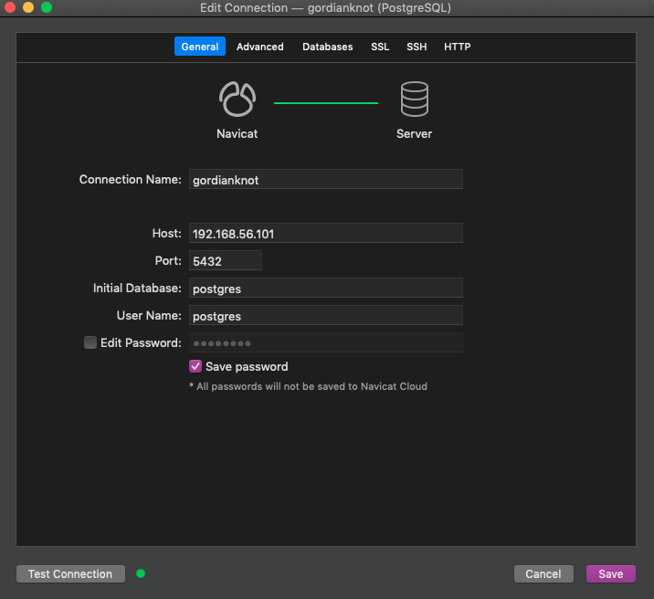
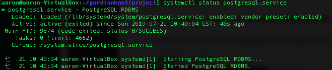

# PostgreSQL：關聯式資料庫

## 參數
- Ubuntu 18.04
- PostgreSQL 10.9

## 開始

### 準備
`$ sudo apt update`

### 安裝
`$ sudo apt install postgresql postgresql-contrib`

### 配置
#### 修改自己的密碼
```
$ sudo -i -u postgres psql
\password
\q
```

#### 修改別人的密碼
```
$ sudo -i -u postgres psql
\password gtwang
\q
```

#### 允許外部設備連入
```
$ sudo nano /etc/postgresql/10/main/postgresql.conf 
listen_addresses = '*'
password_encryption = md5
\wq

$ sudo nano /etc/postgresql/10/main/pg_hba.conf 
host    all             all             0.0.0.0/0               md5
\wq
# 重啟 postgresql 生效
```


## 測試
```
# 使用 psql 管理介面
$ sudo -i -u postgres psql
\q
```

## 維運
```
$ sudo service postgresql start
$ sudo service postgresql stop
$ sudo service postgresql restart
$ netstat -apn | grep 5432
```



