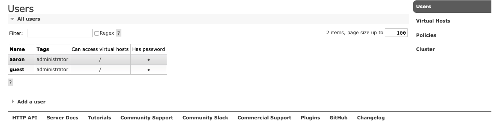

# RabbitMQ：實現了進階訊息佇列協定（AMQP）
## 參數
- Ubuntu 18.04
- RabbitMQ 3.6.15Erlang

## 開始

### 準備
```
$ echo 'deb http://www.rabbitmq.com/debian/ testing main' | sudo tee /etc/apt/sources.list.d/rabbitmq.list
$ wget -O- https://www.rabbitmq.com/rabbitmq-release-signing-key.asc | sudo apt-key add -
$ sudo apt-get update
```

### 安裝
`$ sudo apt-get install rabbitmq-server`

### 配置
```
$ sudo rabbitmqctl add_user aaron 999999
$ sudo rabbitmqctl set_user_tags aaron administrator
$ sudo rabbitmqctl set_permissions -p / aaron ".*" ".*" ".*"
```

#### RabbitMQ Web Management Console
`$ sudo rabbitmq-plugins enable rabbitmq_management`

## 測試
#### 連接 RabbitMQ
```
http://192.168.56.101:15672
帳號：aaron
密碼:999999
```


## 維運
```
$ sudo systemctl enable rabbitmq-server
$ sudo systemctl start rabbitmq-server
$ sudo systemctl stop rabbitmq-server
```