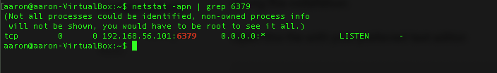

# Redis：記憶體資料庫

## 參數
- Ubuntu 18.04
- redis-cli 4.0.9

## 開始

### 準備
```
$ sudo apt update
$ sudo apt-get upgrade
```

### 安裝
`$ sudo apt install redis-server`

### 配置

```
$ sudo nano /etc/redis/redis.conf
bind 192.168.56.101
protected-mode no
daemonize yes
requirepass 999999
supervised systemdimgs
\wq

# 重啟
```

## 測試
`$ redis-cli -a 999999`

## 維運
```
$ sudo systemctl stop redis
$ sudo systemctl start redis
$ sudo systemctl restart redis
$ sudo systemctl status redis
$ sudo systemctl disable redis
$ netstat -apn | grep 6379
```




