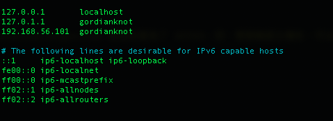

# SSL：


## 參數
- Ubuntu 18.04
- 其他
    - Kafka
        - kafka2.0.x 開始，將 ssl.endpoint.identification.algorithm 默認設置為了 HTTPS，即：需要驗證主機名，可以先配置一個主機名。追注：不論是否需要主機名驗證，都推薦配置一下 hosts，比較方便。
        
        
## 開始

### 準備
```
# 分別存放根證書、服務端證書、客戶端正式、受信任的證書
$ mkdir -p ~/gordianknot/project/ca
```

### 安裝
```
$ cd ~/gordianknot/project/ca

# Step 1 為每個 Kafka broker 生成 SSL 密鑰和證書
$ keytool -keystore server.keystore.jks -alias gordianknot -validity 365 -genkey -keypass 999999 -keyalg RSA -dname "CN=gordianknot,OU=gordianknot,O=gordianknot,L=taipei,S=taipei,C=tw" -storepass 999999 -ext SAN=DNS:gordianknot

# Step 2 創建自己的 CA
$ openssl req -new -x509 -keyout ca-key -out ca-cert -days 365 -passout pass:999999 -subj "/C=tw/ST=taipei/L=taipei/O=gordianknot/OU=gordianknot/CN=gordianknot"

$ keytool -keystore server.truststore.jks -alias CARoot -import -file ca-cert 
$ keytool -keystore client.truststore.jks -alias CARoot -import -file ca-cert

# Step 3 簽名證書
$ keytool -keystore server.keystore.jks -alias gordianknot -certreq -file cert-file
$ openssl x509 -req -CA ca-cert -CAkey ca-key -in cert-file -out cert-signed -days 365 -CAcreateserial -passin pass:999999
$ keytool -keystore server.keystore.jks -alias CARoot -import -file ca-cert
$ keytool -keystore server.keystore.jks -alias gordianknot -import -file cert-signed
```

### 配置

## 測試

## 維運