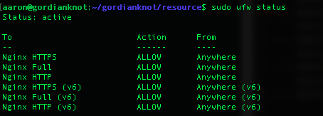

# UFW：Ubuntu based GNU/Linux 上的防火牆 (ufw)

### 參數
- Ubuntu 18.04

### 準備
```
$ sudo apt update
```

### 安裝
```
$ sudo apt-get install ufw
```

### 配置
- ufw 預設是停用的，要啟用 ufw 的話命令如下，關鍵字分別是 enable 和 disable，也就是啟用和停用
```
$ sudo ufw enable
```
- 允入所有的連線通過
```
$ sudo ufw default allow
```

### 測試
- 確認 ufw 已經啟用，可以查看 ufw 的 status
```
$ sudo ufw status
# 因之前安裝過 Nginx，並且 Nginx 自動向 ufw 註冊；並且 ufw 採允入所有連線通過，故可從以下資訊當中看到所有 Nginx 配置皆為允許連線。
```


### 維運
```
# ufw 基本語法為
$ ufw allow / deny from / to ip [port number]
# $ sudo ufw allow from 10.0.0.0/8
# $ sudo ufw allow from 172.16.0.0/12
# $ sudo ufw allow from 192.168.0.0/16
# $ sudo ufw deny from 192.168.1.1 port 22
# $ sudo ufw deny from 192.168.1.1 to any port 80
```