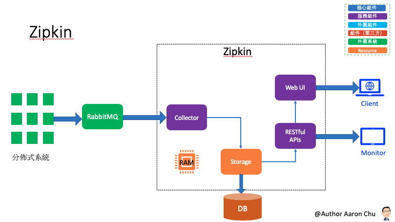
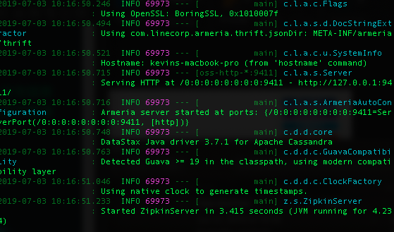
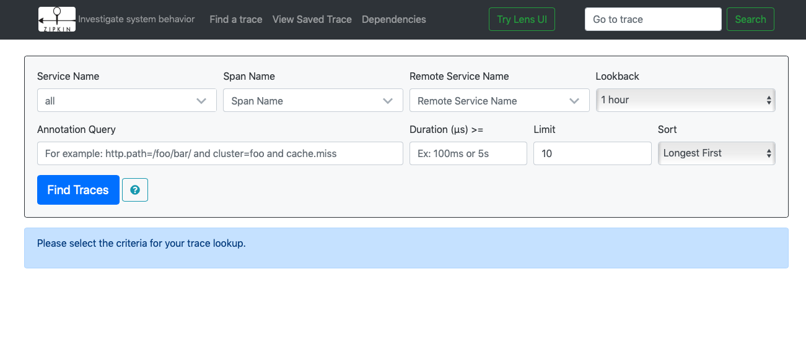

# Zipkin：監控數據的分佈式與跟蹤系統

###### Zipkin 是 Twitter 的開源專案，專注在收集所有服務的監控數據的分佈式與跟蹤系統。主要提供了收集數據和查詢數據兩大 API 介面。

## 參數

## 開始

### 安裝
- 下載 Zipkin `curl -ssl https://zipkin.io/quickstart.sh | bash -s`

## 配置
###### 安裝路徑 `/Users/Kevin/Agile-MAC/eclipseWorkspace-MAC/Spring-Cloud/server/zipkin`

## 測試
- 訪問 Zipkin `http://localhost:9411/zipkin/`



## 維運
- 啟動 Zipkin
```
$ cd /Users/Kevin/Agile-MAC/eclipseWorkspace-MAC/Spring-Cloud/server/zipkin

# 使用 RabbitMQ 作為調用鏈數據
$ java -DRABBIT_ADDRESSES=gordianknot:5672 -DRABBIT_USER=aaron -DRABBIT_PASSWORD=999999 -jar zipkin.jar

# 使用 Elasticsearch 作為調用鏈數據
$ java -DSTORAGE_TYPE=elasticsearch -DES_HOSTS=http://gordianknot:9200  -DRABBIT_ADDRESSES=gordianknot:5672 -DRABBIT_USER=aaron -DRABBIT_PASSWORD=999999 -jar zipkin.jar

$ lsof -i:9411 |grep LISTSEN
```

