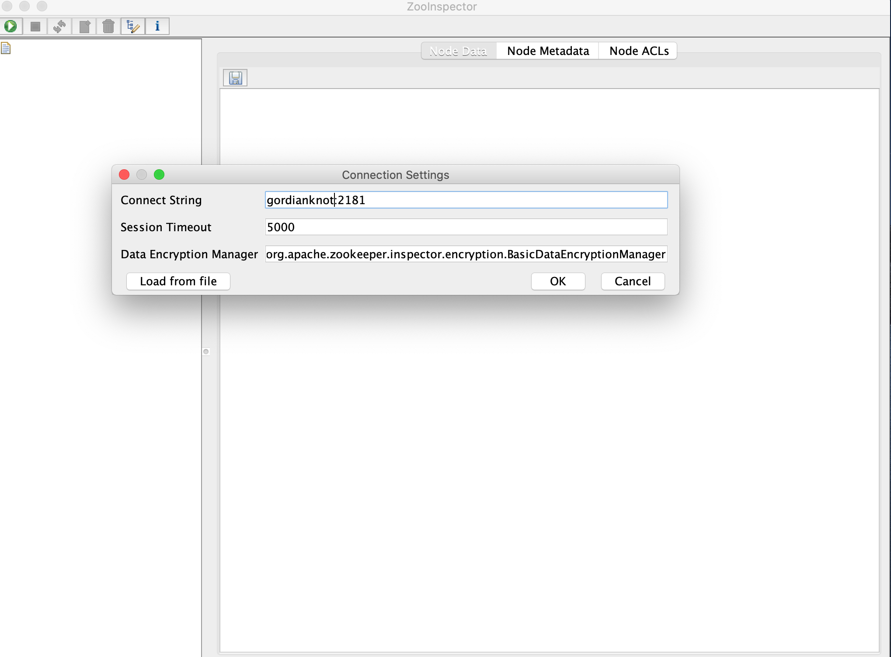
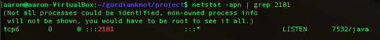
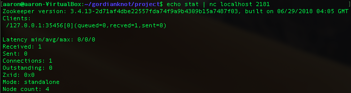

2019/10/11 
# Zookeeper：分散式協調服務
##### Zookeeper是開源分散式協調服務，一種集中式服務架構，用於維護分散式系統的配置資訊，命名，提供分散式同步和組服務功能。 所有這些型別的服務都以分散式應用程式的某種形式使用。
- 功能包括：配置維護、域名服務、分布式同步、組服務。

### 參數
- Ubuntu 18.04
- zookeeper-3.4.13
- JDK Open JDK 1.8

### 準備
```
$ sudo add-apt-repository ppa:openjdk-r/ppa
$ sudo apt-get update
```

### 安裝 Open JDK
```
$ sudo apt-get install openjdk-8-jdk
$ sudo update-alternatives #config java
$ sudo update-alternatives --config java
$ sudo update-alternatives --config javac
```

### 配置 Java 
```
$ sudo nano /etc/profile
export JAVA_HOME=/usr/lib/jvm/java-8-openjdk-amd64
export JRE_HOME=${JAVA_HOME}/jre
export CLASSPATH=.:$JAVA_HOME/lib:$JAVA_HOME/jre/lib:$CLASSPATH
export PATH=$PATH:$JAVA_HOME/bin
\wq

$ source /etc/profile
```


### 安裝 
##### Zookeeper
```
$ cd /home/aaron/gordianknot/resource
$ wget https://archive.apache.org/dist/zookeeper/zookeeper-3.4.13/zookeeper-3.4.13.tar.gz
$ tar -xzf zookeeper-3.4.13.tar.gz -C ../project/
```

##### 圖形化的客戶端工具 ZooInspector
```
$ wget https://issues.apache.org/jira/secure/attachment/12436620/ZooInspector.zip
# 解壓縮至 /Users/aaron/develop/workspace/eclipse/spring-cloud-aaron/server/Zookeeper/ZooInspector
```

### 配置 zookeeper

```
$ sudo nano /etc/profile
export ZOOKEEPER_INSTALL=/home/aaron/gordianknot/project/zookeeper-3.4.13
export PATH=$PATH:$JAVA_HOME/bin:$ZOOKEEPER_HOME/bin
\wq

$ cd /home/aaron/gordianknot/project/zookeeper-3.4.13/conf
$ cp zoo_sample.cfg zoo.cfg

$ sudo nano zoo.cfg
#編輯 zoo.cfg 內容
dataDir=/home/aaron/gordianknot/project/zookeeper-data
\wq
```

### 測試
##### 連接 zookeeper
`zkCli`

#### 啟動圖形化的客戶端工具 ZooInspector
###### 本軟體有 bug 必需切至 jar 檔所在目錄才可正常執行
```
$ cd /Users/aaron/develop/workspace/eclipse/spring-cloud-aaron/server/Zookeeper/ZooInspector/build
$ java -jar zookeeper-dev-ZooInspector.jar
```


### 維運
```
$ zkServer.sh start
$ zkServer.sh stop
$ netstat -apn | grep 2181
#檢視 Zookeeper 系統狀態
$ echo stat | nc localhost 2181

```



### 操作
- 連接 zookeeper
`$ zkCli`
   