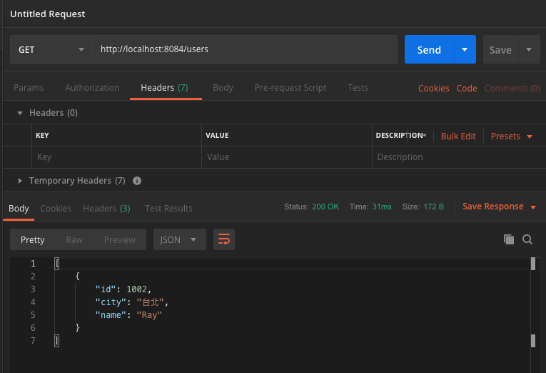
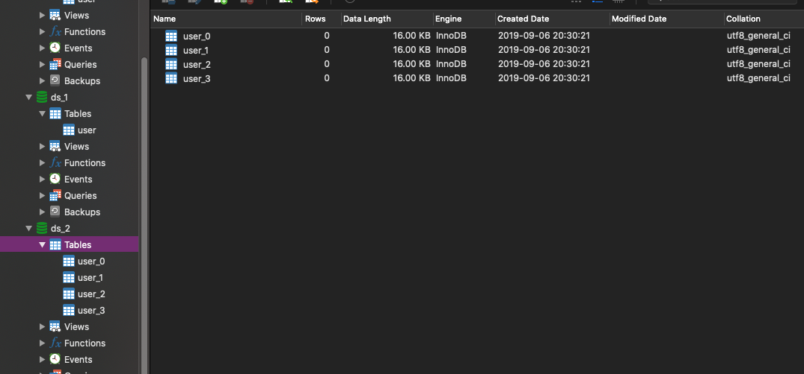

# Sharding-JDBC：一個開源的適用於微服務的分布式數據訪問的資料庫水平切分框架


##### Sharding-JDBC 介紹
###### Sharding-JDBC 是當當應用框架 ddframe 中，從關聯式資料庫 dd-rdb 中分離出來的資料庫水平切分框架，實現透明化資料庫分庫分表訪問。Sharding-JDBC 是繼 dubbox 和 elastic-job 之後，ddframe 系列開源的第三個項目。

##### Sharding-JDBC 直接封裝 JDBC-API，可以理解為增強版的 JDBC驅動，舊代碼遷移成本幾乎為零：
###### 可適用於任何基於 Java 的 ORM 框架，如 JPA、Hibernate、MyBatis、Spring JDBC Template 或直接使用 JDBC。
###### 可基於任何第三方的數據庫連接池，如 DBCP、C3P0、BoneCP、Druid 等。
###### 理論上可支持任意實現 JDBC 規範的數據庫。目前支持 MySQL，Oracle，SQLServer 和 PostgreSQL。

##### Sharding-JDBC功能列表：
- 分庫分表
- 讀寫分離
- 柔性事務
- 分布式主鍵
- 分布式治理能力（2.0新功能）
    - 配置集中化與動態化，可支持數據源、表與分片策略的動態切換(2.0.0.M1)
    - 客戶端的數據庫治理，數據源失效自動切換(2.0.0.M2)
    - 基於Open Tracing協議的APM信息輸出(2.0.0.M3)

###### Sharding-JDBC 定位為輕量 Java 框架，使用客戶端直連數據庫，以 jar 包形式提供服務，無 proxy 代理層，無需額外部署，無其他依賴，DBA也無需改變原有的運維方式。
###### Sharding-JDBC 分片策略靈活，可支持等號、between、in等多維度分片，也可支持多分片鍵。
###### SQL 解析功能完善，支持聚合、分組、排序、limit、or 等查詢，並支持 Binding Table 以及笛卡爾積表查詢。

## 參數
- Spring boot：2.0.6.RELEASE
- Spring cloud：Finchley.SR2
- Java：8
- 專案
    - aaron-sjdbc-read-write
        - Main：ShardingDbAndTableApplication
        - Group id：com.aaron
        - Artifact id：aaron-sjdbc-read-write
        - Version：0.0.1-SNAPSHOT
    - aaron-sjdbc-sharding-table
        - Main：ShardingTableApplication
        - Group id：com.aaron
        - Artifact id：aaron-sjdbc-sharding-table
        - Version：0.0.1-SNAPSHOT
    - aaron-sjdbc-sharding-db-table
        - Main：ShardingDbAndTableApplication
        - Group id：com.aaron
        - Artifact id：aaron-sjdbc-sharding-db-table
        - Version：1.0.0
    
- 服務依賴
    - MySQL
        - [安裝 MySQL](../server/MySQL)

## aaron-sjdbc-read-write


### 開發
##### 快速集成
- pom.xml
```
	<dependencies>
		<dependency>
			<groupId>org.springframework.boot</groupId>
			<artifactId>spring-boot-starter-web</artifactId>
		</dependency>
		<dependency>
			<groupId>org.springframework.boot</groupId>
			<artifactId>spring-boot-starter-jdbc</artifactId>
		</dependency>
		<dependency>
			<groupId>org.gordianknot</groupId>
			<artifactId>gordianknot-jdbc</artifactId>
			<version>1.0.3</version>
		</dependency>
		<dependency>
			<groupId>mysql</groupId>
			<artifactId>mysql-connector-java</artifactId>
		</dependency>

		<dependency>
			<groupId>com.alibaba</groupId>
			<artifactId>druid-spring-boot-starter</artifactId>
			<version>1.1.10</version>
		</dependency>
		<dependency>
			<groupId>com.dangdang</groupId>
			<artifactId>sharding-jdbc-config-spring</artifactId>
			<version>1.5.4.1</version>
		</dependency>
  </dependencies>
```
- ShardingDbAndTableApplication.java Sharding Jdbc 啟動類
```
/**
 * 分庫又分表示列
 * @author  aaron
 *
 */
@SpringBootApplication
@ImportResource(locations = { "classpath:sharding.xml" })
public class ShardingDbAndTableApplication {
 	public static void main(String[] args) {
 		SpringApplication.run(ShardingDbAndTableApplication.class, args);
 	}
}
```

##### 讀寫分離

###### 配置讀寫分離
- sahrding.xml 讀寫分離配置
```
 <!-- Master 資料 -->
    <bean id="ds_0" class="com.alibaba.druid.pool.DruidDataSource" destroy-method="close" primary="true">
        <property name="driverClassName" value="com.mysql.jdbc.Driver" />
        <property name="url" value="jdbc:mysql://gordianknot:3306/ds_0?characterEncoding=utf-8&amp;useInformationSchema=true&amp;useSSL=false" />
        <property name="username" value="root" />
        <property name="password" value="999999" />
    </bean>
    
    <!-- Slave 資料 -->
    <bean id="ds_1" class="com.alibaba.druid.pool.DruidDataSource" destroy-method="close">
        <property name="driverClassName" value="com.mysql.jdbc.Driver" />
        <property name="url" value="jdbc:mysql://gordianknot:3306/ds_1?characterEncoding=utf-8&amp;useSSL=false" />
        <property name="username" value="root" />
        <property name="password" value="999999" />
    </bean>
    
    <!-- 讀寫分離資料源 -->
    <rdb:master-slave-data-source id="dataSource" master-data-source-ref="ds_0" slave-data-sources-ref="ds_1"/>
     
    <!-- 增强版JdbcTemplate -->
    <bean id="gordianknotJdbcTemplate" class="org.gordianknot.jdbc.GordianknotJdbcTemplate">
    	<property name="dataSource" ref="dataSource"/>
    	<constructor-arg>
    		<value>com.aaron.sjdbc.po</value>
    	</constructor-arg>
    </bean>
```

##### 驗證讀從資料庫 
- User.java PO 類
```
@TableName(value = "user", author = "aaron", desc = "用户表")
public class User implements Serializable {

	private static final long serialVersionUID = -1205226416664488559L;
	
	@AutoId
	@Field(value="id", desc="ID")
	private Long id;

	@Field(value="city", desc="城市")
	private String city = "";
	
	@Field(value="name", desc="姓名")
	private String name = "";

	public Long getId() {
		return id;
	}

	public void setId(Long id) {
		this.id = id;
	}

	public String getCity() {
		return city;
	}

	public void setCity(String city) {
		this.city = city;
	}

	public String getName() {
		return name;
	}

	public void setName(String name) {
		this.name = name;
	}
```
- UserService.java Service 類
```
public interface UserService {
	List<User> list();
}    
```
- UserServiceImpl.java Service 實現類
```
@Service
public class UserServiceImpl extends EntityService<User> implements UserService {
	public List<User> list() {
		// 强制路由主資庫
		HintManager.getInstance().setMasterRouteOnly();
		return super.list();
	}
}    
```
- UserController.java 控制器
```
@RestController
public class UserController {
	@Autowired
	private UserService userService;
	
	@GetMapping("/users")
	public Object list() {
		return userService.list();
	}
}    
```

##### 驗證寫主資料庫
- UserService.java 增加 add 方法
```
public interface UserService {

	List<User> list();
    
	Long add(User user);

}
```
- UserServiceImpl.java Service 實現類增加 add 方法
```
@Service
public class UserServiceImpl extends EntityService<User> implements UserService {
	
	public List<User> list() {
    
		return super.list();
	}

	public Long add(User user) {
		return (Long) super.save(user);
	}

}
```
- UserController.java Controller 增加 add 方法
```
@RestController
public class UserController {
	
	@Autowired
	private UserService userService;
	
	@GetMapping("/users")
	public Object list() {
		return userService.list();
	}
	
	@GetMapping("/add")
	public Object add() {
		User user = new User();
		user.setCity("屏東");
		user.setName("Reann");
		return userService.add(user);
	}
	
}
```

#####  Hint 強制路由主庫
###### 在讀寫分離的模式下，常見一個問題剛寫完一筆資料，然後馬上查卻沒有查到資料。這是因為寫的是主庫，查的是從庫，而資料庫同步也需要時間。
###### Sharding-JDBC 提供基於 Hint 強制路由主庫功能，將查詢操作強制轉發到主庫，這樣就可以改善上述問題。
- UserServiceImpl.java 強制路由主庫
```
@Service
public class UserServiceImpl extends EntityService<User> implements UserService {
	
	public List<User> list() {
        // 强制路由主資庫
		HintManager.getInstance().setMasterRouteOnly();
		return super.list();
	}
```

### 配置
- application.properties
```
server.port=8084
```

### 測試

##### 驗證讀從資料庫 
###### 分別建立兩個資料庫
```
CREATE DATABASE `ds_0` CHARACTER SET 'utf8' COLLATE 'utf8_general_ci';
CREATE DATABASE `ds_1` CHARACTER SET 'utf8' COLLATE 'utf8_general_ci';
```


###### 分別在這兩個資料庫中新增用戶表
```
CREATE TABLE `user`(
	id bigint(64) not null,
	city varchar(20) not null,
	name varchar(20) not null,
	PRIMARY KEY (`id`)
) ENGINE=InnoDB DEFAULT CHARSET=utf8;
```
###### 插入資料至資料表
```
ds_0
insert into user values(1001,'新北','Aaron');
ds_1
insert into user values(1002,'台北','Ray');
```

###### 啟動
###### 返回 ds_0 主資料庫的資料
###### 調用資料查詢接口
`http://localhost:8084/users`


##### 驗證寫主資料庫
###### 啟動
###### 調用資料查詢接口
`http://localhost:8084/add`
###### 返回資料表自動生成 ID


#####  Hint 強制路由主庫
###### 啟動
###### 調用資料查詢接口
`http://localhost:8084/users`


### 維運


## aaron-sjdbc-sharding-table


### 開發

##### 不分庫只分表
###### 單庫分表資料源配置
- sharding.xml 單庫分表資料源配置
```
   <!-- inline表達式報錯 -->
   <context:property-placeholder  ignore-unresolvable="true"/>
                      
    <!-- 主數據 -->
    <bean id="ds_2" class="com.alibaba.druid.pool.DruidDataSource" destroy-method="close" primary="true">
        <property name="driverClassName" value="com.mysql.jdbc.Driver" />
        <property name="url" value="jdbc:mysql://gordianknot:3306/ds_2?characterEncoding=utf-8&amp;useSSL=false" />
        <property name="username" value="root" />
        <property name="password" value="999999" />
    </bean>
```
- sharding.xml 分表規則配置
```
    <!-- algorithm-class="com.fangjia.sharding.UserSingleKeyTableShardingAlgorithm" -->
     <!-- user_0,user_1,user_2,user_3 -->
    <rdb:strategy id="userTableStrategy" sharding-columns="id" algorithm-expression="user_${id.longValue() % 4}"/>
    <rdb:data-source id="dataSource">
        <rdb:sharding-rule data-sources="ds_2">
            <rdb:table-rules>
                <rdb:table-rule logic-table="user" actual-tables="user_${0..3}" table-strategy="userTableStrategy"/>
            </rdb:table-rules>
            <rdb:default-database-strategy sharding-columns="none" algorithm-class="com.dangdang.ddframe.rdb.sharding.api.strategy.database.NoneDatabaseShardingAlgorithm"/>
        </rdb:sharding-rule>
    </rdb:data-source>
```

- UserController.java 測試程式碼
```
@GetMapping("/add")
	public Object add() {
		for (long i = 0; i < 100; i++) {
			User user = new User();
			user.setId(i);
			user.setCity("屏東");
			user.setName("Reann");
			userService.add(user);
		}
		return "success";
	}
```


### 配置
- application.properties
```
server.port=8084
```


### 測試

##### 不分庫只分表
###### 新增資料庫
`CREATE DATABASE `ds_2` CHARACTER SET 'utf8' COLLATE 'utf8_general_ci';`
###### 新增四張資料表
```
CREATE TABLE `user_0`(
	id bigint(64) not null,
	city varchar(20) not null,
	name varchar(20) not null,
	PRIMARY KEY (`id`)
) ENGINE=InnoDB DEFAULT CHARSET=utf8;

CREATE TABLE `user_1`(
	id bigint(64) not null,
	city varchar(20) not null,
	name varchar(20) not null,
	PRIMARY KEY (`id`)
) ENGINE=InnoDB DEFAULT CHARSET=utf8;

CREATE TABLE `user_2`(
	id bigint(64) not null,
	city varchar(20) not null,
	name varchar(20) not null,
	PRIMARY KEY (`id`)
) ENGINE=InnoDB DEFAULT CHARSET=utf8;

CREATE TABLE `user_3`(
	id bigint(64) not null,
	city varchar(20) not null,
	name varchar(20) not null,
	PRIMARY KEY (`id`)
) ENGINE=InnoDB DEFAULT CHARSET=utf8;
```

###### 執行
###### 調用服務接口
`http://localhost:8084/add`
###### 資料庫的4張表平均每張表有25條資料，資料平均4張表中


### 維運

## aaron-sjdbc-sharding-db-table


### 開發
##### 分庫又分表
- sharding.xml 分庫分表資料源配置
```
    <!-- Master 資料庫 -->
    <bean id="ds_0" class="com.alibaba.druid.pool.DruidDataSource" destroy-method="close" primary="true">
        <property name="driverClassName" value="com.mysql.jdbc.Driver" />
        <property name="url" value="jdbc:mysql://gordianknot:3306/gordianknot_0?characterEncoding=utf-8&amp;useSSL=false" />
        <property name="username" value="root" />
        <property name="password" value="999999" />
    </bean>
    
    <!--Slave 資料庫 -->
 	<bean id="ds_1" class="com.alibaba.druid.pool.DruidDataSource" destroy-method="close">
        <property name="driverClassName" value="com.mysql.jdbc.Driver" />
        <property name="url" value="jdbc:mysql://gordianknot:3306/gordianknot_1?characterEncoding=utf-8&amp;useSSL=false" />
        <property name="username" value="root" />
        <property name="password" value="999999" />
    </bean>
```
- sharding.xml 配置分庫規則
```
<rdb:strategy id="databaseShardingStrategyHouseLouDong" sharding-columns="city" algorithm-class="com.aaron.sjdbc.SingleKeyDbShardingAlgorithm"/>
```
- sharding.xml 配置分表規則
```
<rdb:strategy id="tableShardingStrategyHouseLouDong" sharding-columns="id" algorithm-class="com.aaron.sjdbc.UserSingleKeyTableShardingAlgorithm"/>
```
- sharding.xml 配置分片資料源
```
    <!-- 分片資料源 -->
    <rdb:data-source id="dataSource">
        <rdb:sharding-rule data-sources="ds_0, ds_1">
            <rdb:table-rules>
                <rdb:table-rule logic-table="user" actual-tables="user_${0..1}" database-strategy="databaseShardingStrategyHouseLouDong" table-strategy="tableShardingStrategyHouseLouDong">
                	<rdb:generate-key-column column-name="id"/>
                </rdb:table-rule>
            </rdb:table-rules>
        </rdb:sharding-rule>
    </rdb:data-source>
```
- .java 自定義分庫演算法
```
public class SingleKeyDbShardingAlgorithm implements SingleKeyDatabaseShardingAlgorithm<String>  {

	 private static Map<String, List<String>> shardingMap = new ConcurrentHashMap<>();
	    
	    static {
	    	shardingMap.put("ds_0", Arrays.asList("台北"));
	    	shardingMap.put("ds_1", Arrays.asList("新北"));
	    }
	    
	    @Override
	    public String doEqualSharding(final Collection<String> availableTargetNames, final ShardingValue<String> shardingValue) {
	        for (String each : availableTargetNames) {
	        	if (shardingMap.get(each).contains(shardingValue.getValue())) {
	        		 return each;
	        	}
	        }
	        return "ds_0";
	    }
	    
	    @Override
	    public Collection<String> doInSharding(final Collection<String> availableTargetNames, final ShardingValue<String> shardingValue) {
	    	Collection<String> result = new LinkedHashSet<>(availableTargetNames.size());
	    	for (String each : availableTargetNames) {
	         	if (shardingMap.get(each).contains(shardingValue.getValue())) {
	         		result.add(each);
	         	} else {
	         		result.add("ds_0");
	         	}
	        }
	        return result;
	    }
	    
	    @Override
	    public Collection<String> doBetweenSharding(final Collection<String> availableTargetNames, final ShardingValue<String> shardingValue) {
	    	Collection<String> result = new LinkedHashSet<>(availableTargetNames.size());
	    	for (String each : availableTargetNames) {
	         	if (shardingMap.get(each).contains(shardingValue.getValue())) {
	         		result.add(each);
	         	} else {
	         		result.add("ds_0");
	         	}
	        }
	        return result;
	    }

}
```
- UserController.java 測試程式碼
```
	@GetMapping("/add")
	public Object add() {
		for (long i = 0; i < 100; i++) {
			User user = new User();
			//user.setId(i);
			int random = new Random().nextInt(100);
			if (random % 2 == 0) {
				user.setCity("台北");
			} else {
				user.setCity("新北");
			}
			user.setName("Reann"+i);
			userService.add(user);
		}
		return "success";
	}
```

##### 分散式主鍵
- User.java 自增 id 使用
```
  @Field(value="id", desc="ID")
    private Long id;
```

- sharding.xml table-rule 配置自增 ID
```
            <rdb:table-rules>
                <rdb:table-rule logic-table="user" actual-tables="user_${0..1}" database-strategy="databaseShardingStrategyHouseLouDong" table-strategy="tableShardingStrategyHouseLouDong">
                	<rdb:generate-key-column column-name="id"/>
                </rdb:table-rule>
            </rdb:table-rules>
```

### 配置
- application.properties
```
server.port=8084
```

### 測試
##### 分庫又分表
###### 建立資料庫
```
CREATE DATABASE `gordianknot_0` CHARACTER SET 'utf8' COLLATE 'utf8_general_ci';
CREATE DATABASE `gordianknot_1` CHARACTER SET 'utf8' COLLATE 'utf8_general_ci';
```
###### 於2個資料庫新增資料表
```
CREATE TABLE `user_0`(
	id bigint(64) not null,
	city varchar(20) not null,
	name varchar(20) not null,
	PRIMARY KEY (`id`)
) ENGINE=InnoDB DEFAULT CHARSET=utf8;

CREATE TABLE `user_1`(
	id bigint(64) not null,
	city varchar(20) not null,
	name varchar(20) not null,
	PRIMARY KEY (`id`)
) ENGINE=InnoDB DEFAULT CHARSET=utf8;
```


##### 分庫又分表（僅測試成功分庫，分表未成功）
###### 執行
###### 調用服務接口
`http://localhost:8084/add`
###### 資料平均散落在2個資料庫裡的4張表（分表未成功）


### 維運