# Sleuth：分佈式服務鏈路跟蹤功能
- 隨著業務發展，系統拆分導致系統調用鏈路愈發複雜一個前端請求可能最終需要調用很多次後端服務才能完成，當整個請求變慢或不可用時，是無法得知該請求是由某個或某些後端服務引起的，這時就需要解決如何快素定位服務故障點，以對症下藥。
- 一個分布式服務跟蹤系統主要由三部分構成：
    - 資料收集
    - 資料存儲
    - 資訊展示 
- 通過 Sleuth 可以很清楚的瞭解到一個服務請求經過了哪些服務，每個服務處理花費多長。從而理清各微服務間的調用關係；概括來說有以下幾點功能：
    - 耗時分析: 通過 Sleuth 可以很方便的瞭解到每個採樣請求的耗時，從而分析出哪些服務調用比較耗時
    - 可視化錯誤: 對於程序未捕捉的異常，可以通過整合 Zipkin 服務界面上看到
    - 鏈路優化: 對於調用比較頻繁的服務，可以針對這些服務實施一些優化措施
Sleuth 概念
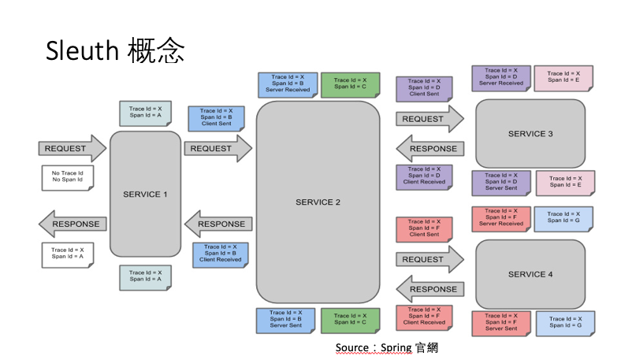
Sleuth 使用 MQ 整合 Zipkin
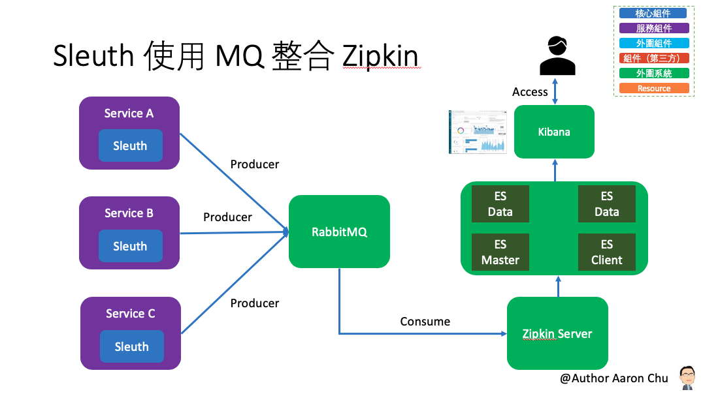

## 參數
- Spring boot：2.0.6.RELEASE
- Spring cloud：Finchley.SR2
- Java：8
- 專案
    - sleuth-article-service
        - Main：App
        - Group id：com.aaron
        - Artifact id：aaron-sleuth-article-service
        - Version：0.0.1-SNAPSHOT
    - sleuth-user-service
        - Main：App
        - Group id：com.aaron
        - Artifact id：aaron-sleuth-user-service
        - Version：0.0.1-SNAPSHOT
- 服務依賴
    - aaron-eureka-server
    - Zipkin
        - [安裝 Zipkin](../server/Zipkin)
    - RabbitMQ
        - [安裝 RabbitMQ](../server/RabitMQ)
    - ELK
        - [安裝 ELK](../server/ELK)
    - Nginx
        - [安裝 Nginx](../server/Nginx)
    - UFW
        - [安裝 UFW](../server/UFW)

## aaron-sleuth-article-service：

### 開發
###### Spring Cloud 集成 Sleuth
- 從 Spring Cloud 集成 Sleuth 測試的結果中，，發現在日誌的最前面加了一部分的內容，這部分內容就是 Sleuth 替服務之接提供的鏈路資訊。
```
# appname：服務名稱，也就是 spring.application.name 的值 [aaron-sleuth-article-service]
# traceId：整個請求唯一的 ID，作為標示整個請求的鏈路 [37d88b0c11f7feed]
# spanId：基本工作單元，發起一次遠程調用就是一個 span [37d88b0c11f7feed]
# exportable：決定是否導入到資料到 Zipkin 中 [true]
2019-08-20 13:17:27.892  INFO [aaron-sleuth-article-service,37d88b0c11f7feed,37d88b0c11f7feed,true] 5322 --- [nio-8082-exec-3] c.a.e.controller.ArticleController       : 我是/article/callHello
```

###### 非同步任務執行序定義
- CustomExecutorConfig.java
```
/** 
 * Sleuth 支持非同步任務，除了可以用 @Async 開啟一個非同步任務，Sleuth 會為這個調用新創建一個 Span；
 * @author Aaron
 *
 */
@Configuration
@EnableAutoConfiguration
public class CustomExecutorConfig extends AsyncConfigurerSupport {

	@Autowired BeanFactory beanFactory;

	@Override 
	public Executor getAsyncExecutor() {
		ThreadPoolTaskExecutor executor = new ThreadPoolTaskExecutor();
		executor.setCorePoolSize(7);
		executor.setMaxPoolSize(42);
		executor.setQueueCapacity(11);
		executor.setThreadNamePrefix("aaron-");
		executor.initialize();
		/* 
		 * 如果自訂義非同步任務執行序池，會導致無法新創一個 Span，這時候需要使用 Sleuth 提供的 LazyTraceExecutor 來包裝。
		 * 如果直接 return executor 則不會新建 Span，也就不會有 save-log 這個 Span
		 */
		return new LazyTraceExecutor(this.beanFactory, executor);        
		return new LazyTraceExecutor(this.beanFactory, executor);
	}
}
```
###### TracingFilter：負責請求和回應的模組
- MyFilter.java
```
/**
 * 負責處理請求集回應的模組
 * 透過註冊自定義的 TracingFilter 實例來實現擴展性的需求
 * 本例為添加自定義的「標記」以及將「請求 ID」添加到回應頭返回給客戶端
 * @author Aaron
 *
 */
@Component
@Order(TraceWebServletAutoConfiguration.TRACING_FILTER_ORDER + 1)
class MyFilter extends GenericFilterBean {

	private final Tracer tracer;

	MyFilter(Tracer tracer) {
		this.tracer = tracer;
	}

	@Override 
	public void doFilter(ServletRequest request, ServletResponse response,
			FilterChain chain) throws IOException, ServletException {
		Span currentSpan = this.tracer.currentSpan();
		if (currentSpan == null) {
			chain.doFilter(request, response);
			return;
		}
		// 請求 ID
		((HttpServletResponse) response).addHeader("ZIPKIN-TRACE-ID",
						currentSpan.context().traceIdString());
		// 標記
		currentSpan.tag("custom", "tag");
		chain.doFilter(request, response);
	}
}
```
###### 監控本地方法
- ArticleServiceImpl.java
```
/**
	 * 異步執行和遠程調用都會新開啟一個 Span，如果要監控本地方法所耗費的時間，可以採用埋點的方式監控本地方法；
	 * 也就是開啟一個新的 Span
	 * 手動埋點
	 */
	@NewSpan(name = "saveLog2")
	@Override
	public void saveLog2(String log) {
		//ScopedSpan span = tracer.startScopedSpan("saveLog2");
		try {
			Thread.sleep(2000);
		} catch (Exception | Error e) {
			//span.error(e);
		} finally {
			//span.finish(); 
		}
```

###### 過濾不想跟蹤的請求
- BeanConfiguration.java
```
	/**
	 * 對於某些請求不想開啟跟蹤，可以透過 HttpSampler 來過濾掉，比如 Swagger 這些請求等。
	 * @param provider
	 * @return
	 */
	@Bean(name = ServerSampler.NAME)
	HttpSampler myHttpSampler(SkipPatternProvider provider) {
		Pattern pattern = provider.skipPattern();
		return new HttpSampler() {

            // 過濾器核心方法
			@Override
			public <Req> Boolean trySample(HttpAdapter<Req, ?> adapter, Req request) {
				String url = adapter.path(request);
				boolean shouldSkip = pattern.matcher(url).matches();
				if (shouldSkip) {
					return false;
				}
				return null;
			}
		};
	}
```

### 配置
- pom.xml
```
		<dependency>
			<groupId>org.springframework.cloud</groupId>
			<artifactId>spring-cloud-starter-sleuth</artifactId>
		</dependency>
```
- application.properties
```
spring.application.name=aaron-sleuth-article-service
server.port=8082
```
### 測試
###### Spring Cloud 集成 Sleuth
```
# aaron-sleuth-article-service 服務中調用 aaron-sleuth-user-service 服務的接口，分別在兩個服務的接口中輸出日誌 
# 調用 aaron-sleuth-article-service 服務接口 http://localhost:8082/article/callHello
# 查看 aaron-sleuth-article-service 輸出的日誌資訊
# 查看 aaron-sleuth-user-service 輸出的日誌資訊
```
aaron-sleuth-article-service 日誌資訊
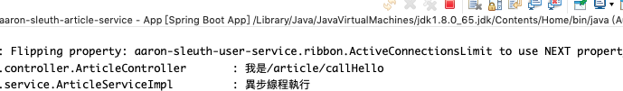
aaron-sleuth-user-service 日誌資訊
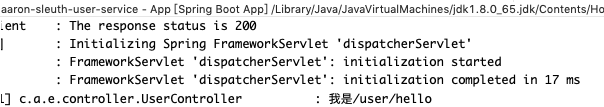

###### TracingFilter：負責請求和回應的模組
```
# 從 Postman 來觀察請求 ID「ZIPKIN-TRACE-ID」回應的資料驗證是否設置成功
# 從 Zipkin 來觀察自定義標記「tag」資料是否設置成功 http://localhost:9411/zipkin/traces/d6e9d30b2fbaf454
```
請求 ID「ZIPKIN-TRACE-ID」
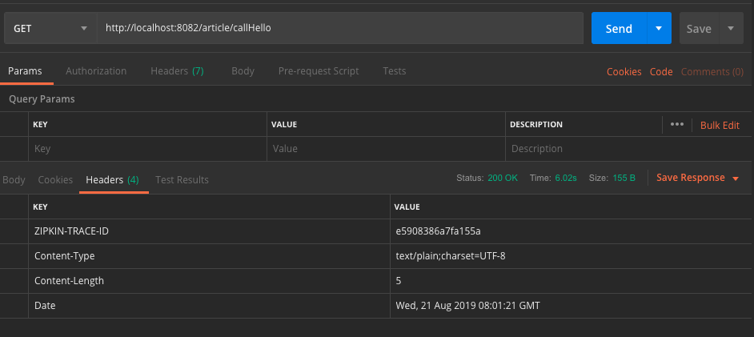
標記
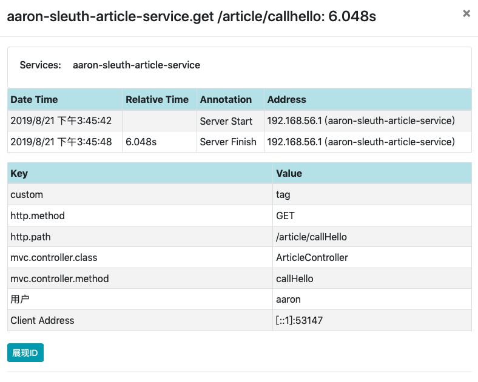

###### 監控本地方法 `http://localhost:9411/zipkin/traces/d6e9d30b2fbaf454` 
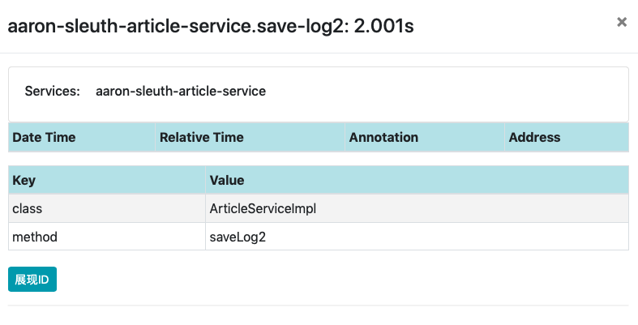

### 維運
- 服務接口 `GET http://localhost:8082/article/callHello`
- 查看日誌，檔名如下：
    - aaron-sleuth-user-service.log

## aaron-sleuth-user-service

### 開發

###### 整合 Logstash（ELK）：整合日誌分析系統，快速定位問題。
- pom.xml
```
		<!-- Logstash JSON Maven 配置，以輸出 JSON 格式日誌 -->
		<dependency>
			<groupId>net.logstash.logback</groupId>
			<artifactId>logstash-logback-encoder</artifactId>
			<version>5.2</version>
		</dependency>
```
- logback-spring.xml
```
......
 # 配置 logback-spring.xml 文件；需要收集的資料格式如下定義
 <!-- Appender to log to file in a JSON format-->
    <appender name="logstash" class="ch.qos.logback.core.rolling.RollingFileAppender">
        <file>${LOG_FILE}.json</file>
        <rollingPolicy class="ch.qos.logback.core.rolling.TimeBasedRollingPolicy">
            <fileNamePattern>${LOG_FILE}.json.%d{yyyy-MM-dd}.gz</fileNamePattern>
            <maxHistory>7</maxHistory>
        </rollingPolicy>
        <encoder class="net.logstash.logback.encoder.LoggingEventCompositeJsonEncoder">
            <providers>
                 <timestamp>
                 <timeZone>UTC</timeZone>
                </timestamp> 
                <pattern>
                    <pattern>
                        {
                        <!-- "timestamp": "%d{yyyy-MM-dd HH:mm:ss.SSS}", -->
                        "severity": "%level",
                        "service": "${springAppName:-}",
                        "trace": "%X{X-B3-TraceId:-}",
                        "span": "%X{X-B3-SpanId:-}",
                        "parent": "%X{X-B3-ParentSpanId:-}",
                        "exportable": "%X{X-Span-Export:-}",
                        "pid": "${PID:-}",
                        "thread": "%thread",
                        "class": "%logger{40}",
                        "rest": "%message"
                        }
                    </pattern>
                </pattern>
            </providers>
        </encoder>
    </appender>
......    
```

###### 整合 Zipkin 發送調用鏈資料
- pom.xml
```
        # Zipkin Maven 依賴 
		<dependency>
			<groupId>org.springframework.cloud</groupId>
			<artifactId>spring-cloud-starter-zipkin</artifactId>
		</dependency>
```
- application.properties
```
# 配置 Zipkin 地址
spring.zipkin.base-url=http://localhost:9411
```
###### 抽樣採集資料
- application.properties
```
# Zipkin 抽樣比例；默認為 0.1（既調用 10次接口，Zipkin 只有一條資料）
spring.sleuth.sampler.probability=1.0
```

###### 用 RabbitMQ 代替 Http 發送調用鏈資料
- pom.xml
```
		<dependency>
			<groupId>org.springframework.amqp</groupId>
			<artifactId>spring-rabbit</artifactId>
		</dependency>
```
- application.properties
```
# RabbitMQ 配置
spring.zipkin.sender.type=RABBIT
spring.rabbitmq.addresses=amqp://gordianknot:5672
spring.rabbitmq.username=aaron
spring.rabbitmq.password=999999
```

### 配置
- pom.xml
```
		<dependency>
			<groupId>org.springframework.cloud</groupId>
			<artifactId>spring-cloud-starter-sleuth</artifactId>
		</dependency>
```
- application.properties
```
spring.application.name=aaron-sleuth-user-service
server.port=8083
```

###### 增加 Elasticsearch 存儲調用鏈資料
- 配置訪問 Kibana 一個 index pattern http://gordianknot 
名稱為：zipkin:span-*
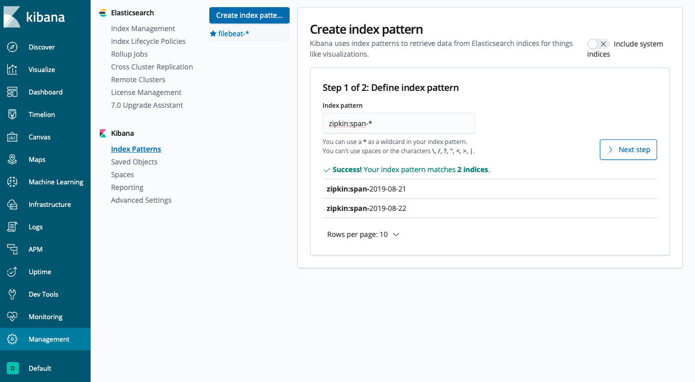
修改默認時間格式
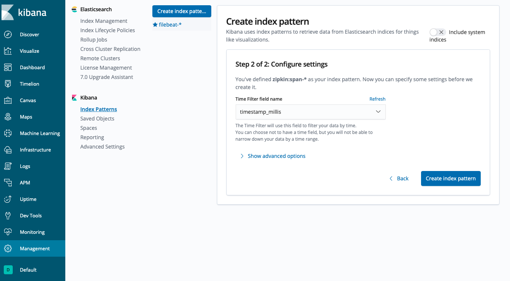

### 測試

###### 整合 Zipkin 發送調用鏈資料
```
# 啟動 Zipkin
# 連接 http://localhost:9411
# 調用 Get http://localhost:8082/article/callHello
# 查詢 Zipkin 觀察各項指標
```
鏈路列表
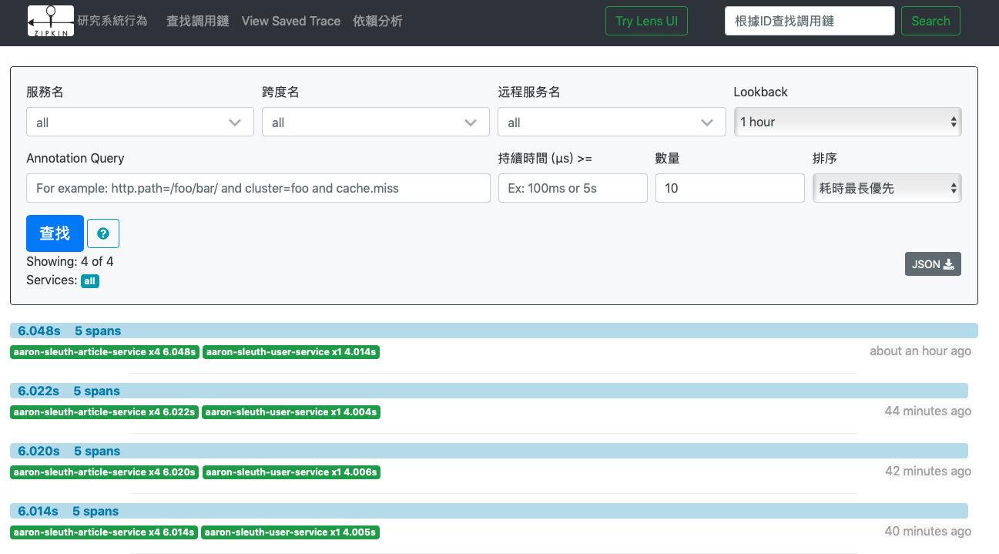
鏈路詳情
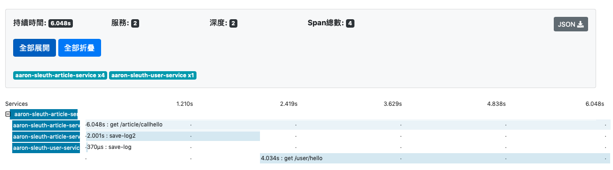
鏈路資訊
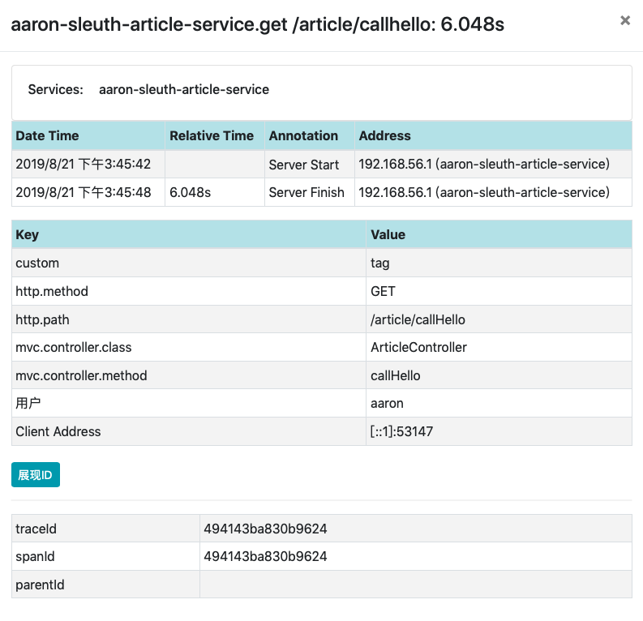

###### 用 RabbitMQ 代替 Http 發送調用鏈資料
```
# 啟動 Zip
$ java -DRABBIT_ADDRESSES=gordianknot:5672 -DRABBIT_USER=aaron -DRABBIT_PASSWORD=999999 -jar zipkin.jar
# 透過 Postman 工具來調用服務 http://localhost:8082/article/callHello
# 觀察 RabbitMQ 管理網站確認是否有接收到 message http://gordianknot:15672
```
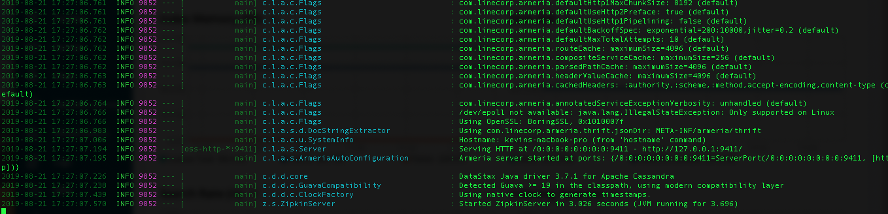
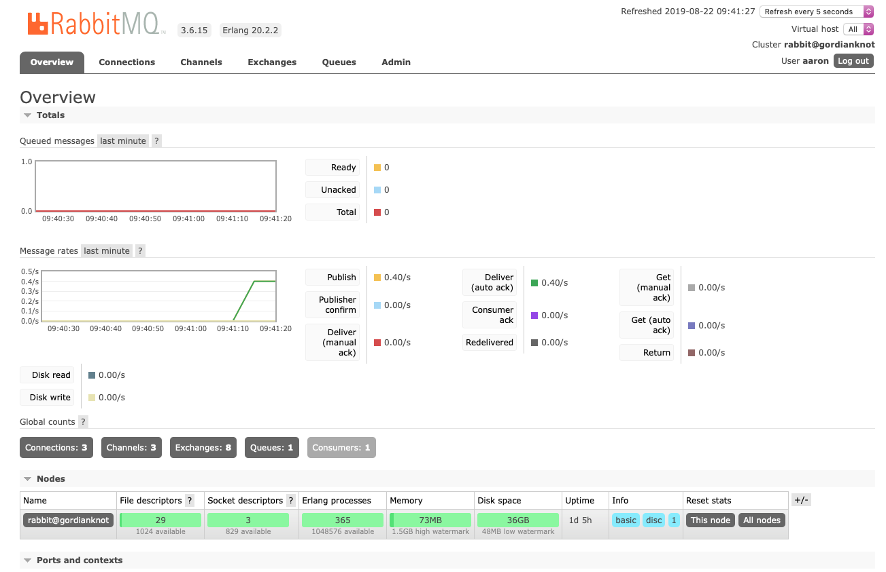


###### 增加 Elasticsearch 存儲調用鏈資料
`$ java -DSTORAGE_TYPE=elasticsearch -DES_HOSTS=http://gordianknot:9200  -DRABBIT_ADDRESSES=gordianknot:5672 -DRABBIT_USER=aaron -DRABBIT_PASSWORD=999999 -jar zipkin.jar`
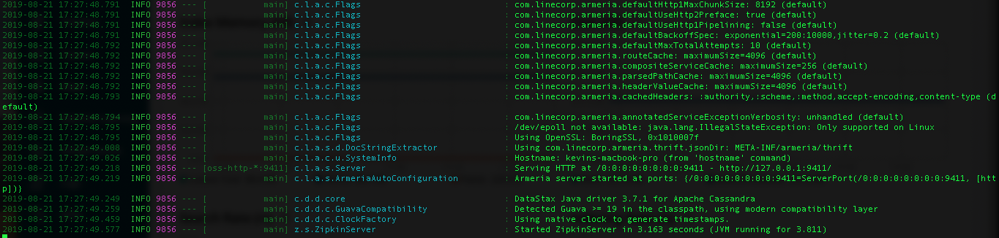
- 透果以下兩種方式測試資料是否被 Elasticsearch 儲存成功
```
# http://gordianknot:9200/_cat/indices
# 索引名稱「zipkin...」開頭的列表就說明索引已被建立
# 訪問這過索引名稱，例如：http://gordianknot:9200/zipkin:span-2019-08-21/_search
```
索引名稱確認方式一
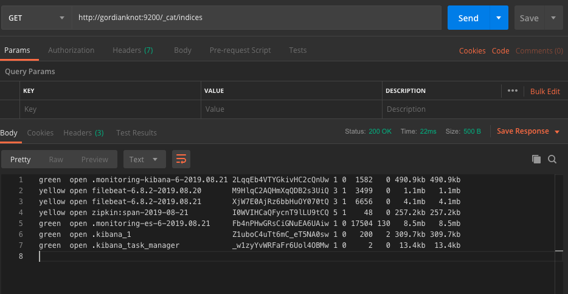
索引名稱確認方式二
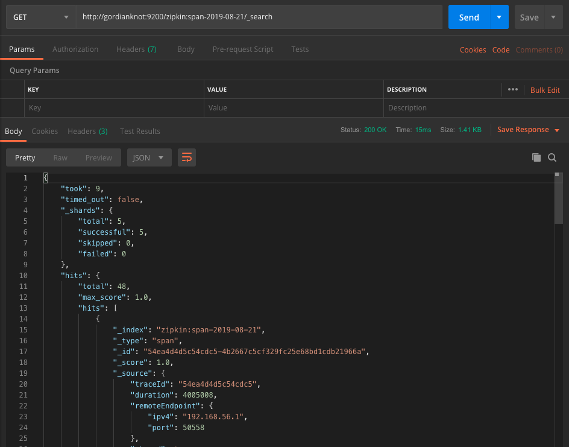
訪問 Kibana 發現調用鏈資料已被 Elasticsearch 收集
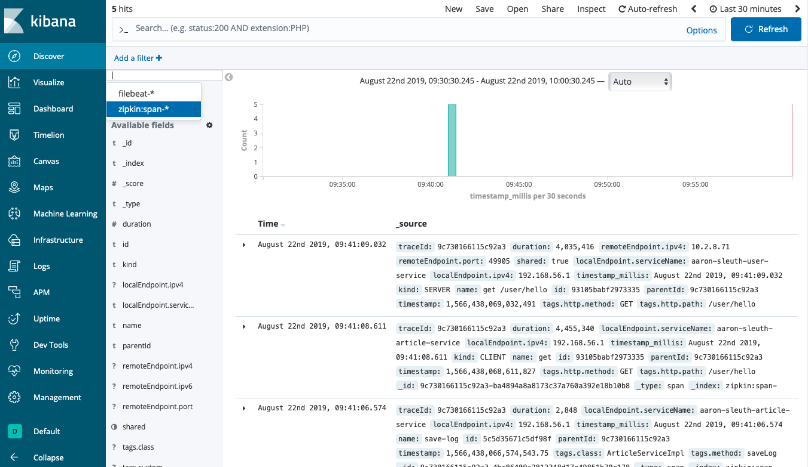

### 維運
