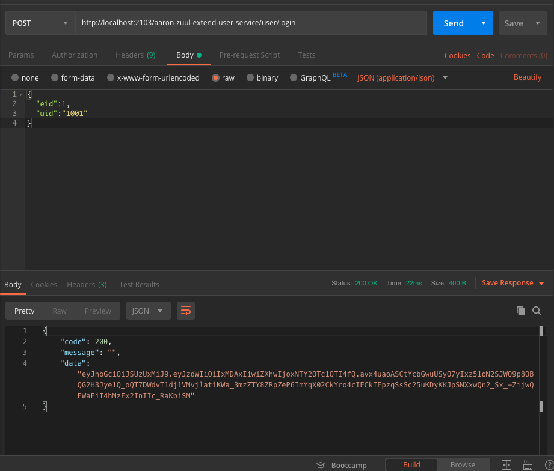

# Zuul：API Gateway 擴展
##### 本篇為 「Zuul 應用進階篇」如對 Zull 尚未有初步了解，可先參考「Zuul 基礎應用」連結請以下路徑： [Zuul 基礎應用](../zuul)


## 參數
- Spring boot：2.0.6.RELEASE
- Spring cloud：Finchley.SR2
- Java：8
- 專案
    - aaron-zuul-extend：API Gateway
        - Main：App
        - Group id：com.aaron
        - Artifact id：aaron-zuul-extend
        - Version：0.0.1-SNAPSHOT
    - aaron-zuul-extend-article-service：客戶端
        - Main：App
        - Group id：com.aaron
        - Artifact id：aaron-zuul-extend-article-service
        - Version：0.0.1-SNAPSHOT
    - aaron-zuul-extend-user-service：服務端
        - Main：App
        - Group id：com.aaron
        - Artifact id：aaron-zuul-extend-user-service
        - Version：0.0.1-SNAPSHOT
- 服務依賴
    - Redis
        - [安裝 Redis](../server/Redis)
    - Apollo  
        - [安裝 Apollo](../server/Apollo)
    - aaron-eureka-server

## aaron-zuul-extend：API Gateway

##### 用戶認證
- 用戶的認證通常在專案裡面，當拆分成微服務後，一個業務操作會涉及多個服務，因此可將用戶認證轉移至 API Gateway 上實現。

##### 灰度發布
- 又名金絲雀發布；是指在黑與白之間，疼夠平滑度過的一種發布方式。在其上可以進行 A/B testing，即讓一部份用戶能夠繼續使用產品特性 A，一部分用戶開始試用產品特性 B，若無問題，則逐步擴大範圍。灰度發布可以保證整體系統的穩定，在開始灰度時就可以發現、調整問題，以保證其影響度。

### 開發

##### 用戶認證（動態管理不需要攔截的 API 請求）
- BasicConf.java Apollo 配置類定義
```
/**
 * 動態管理不需要攔截的 API 請求
 * 必非所有的 API 都需要認證，比如登錄接口。這時可動態添加 API 白名單的功能，凡是在此此白名單當中就不需要認證。
 * 搭配 Apollo 配置管理中心
 * @author Aaron
 */
@Data
@Configuration
public class BasicConf {
 	/** API接口白名單，多個用逗號分隔
 	 *  如不需要認證接口時，直接在 Apollo 配置中心修配置資訊即可即時生效
 	 */
 	@Value("${apiWhiteStr:/aaron-zuul-extend-user-service/user/login}")
 	private String apiWhiteStr;
}
```
- AuthFilter.java 認證過濾器
```
/**
 * 認證過濾器
 * @author aaron
 **/
public class AuthFilter extends ZuulFilter {

    // 注入 BasicConf 配置
	@Autowired
    private BasicConf basicConf;

    public AuthFilter() {
        super();
    }

    @Override
    public boolean shouldFilter() {
        return true;
    }

    @Override
    public String filterType() {
        return "pre";
    }

    @Override
    public int filterOrder() {
        return 1;
    }

    // 執行判斷邏輯
    @Override
    public Object run() {
        RequestContext ctx = RequestContext.getCurrentContext();
        String token = ctx.getRequest().getHeader("Authorization");
        JWTUtils jwtUtils = JWTUtils.getInstance();
        String apis = basicConf.getApiWhiteStr();
        
        //白名單，放過；將配置的白名單轉為 List，然後判斷當前請求的 URI 是否在白名單中，存在則放過
        List<String> whileApis = Arrays.asList(apis.split(","));
        String uri = ctx.getRequest().getRequestURI();
        if (whileApis.contains(uri)) {
        	System.err.println(uri + " 在白名單");
            return null;
        }
        
        // path uri 處理
        for (String wapi : whileApis) {
            if (wapi.contains("{") && wapi.contains("}")) {
                if (wapi.split("/").length == uri.split("/").length) {
                    String reg = wapi.replaceAll("\\{.*}", ".*{1,}");
                    System.err.println(reg);
                    Pattern r = Pattern.compile(reg);
                    Matcher m = r.matcher(uri);
                    if (m.find()) {
                        return null;
                    }
                }
            }
        }
        return null;
    }
}
```
- FilterConfig.java 啟用認證過濾器
```
@Configuration
public class FilterConfig {

	// 啟用認證過濾器
	@Bean
	public AuthFilter authFilter() {
		return new AuthFilter();
	}
}   
```
##### 路由之前的認證
###### 當用戶調用用戶服務中的登錄接口，登入成功之後就能拿到 Token，在請求其他的接口時帶上 Token，就可以在 Zuul 的 Filter 中對這個 Token 進行認證
- AuthFilter.java 攔截請求邏輯
```
   /**
         * 驗證 TOKEN
         * 路由之前的認證，攔截請求邏輯 
         * 當用戶登錄成功之後就能拿到 Token，在請求其他的接口時帶上 Token，就可以在 Zuul 的 Filter 中對 Token 進行認證
         * 攔截請求邏輯：
         * 1.從請求頭中獲得 Token，如果沒有就攔截並給出友善的提示。
         * 2.有 Token 則驗證 Token 合法性，合法在放行，不合法就攔截並給出友善提示。 
         */
        if (!StringUtils.hasText(token)) {
            ctx.setSendZuulResponse(false);
            // 設置 isSuccess=false 告知下面的 Filter 不需要執行
            ctx.set("isSuccess", false);
            ResponseData data = ResponseData.fail("非法請求【缺少Authorization信息】", ResponseCode.NO_AUTH_CODE.getCode());
            ctx.setResponseBody(JsonUtils.toJson(data));
            ctx.getResponse().setContentType("application/json; charset=utf-8");
            return null;
        }

        JWTUtils.JWTResult jwt = jwtUtils.checkToken(token);
        if (!jwt.isStatus()) {
            ctx.setSendZuulResponse(false);
            ctx.set("isSuccess", false);
            ResponseData data = ResponseData.fail(jwt.getMsg(), jwt.getCode());
            ctx.setResponseBody(JsonUtils.toJson(data));
            ctx.getResponse().setContentType("application/json; charset=utf-8");
            return null;
        }
        
        System.err.println("用戶ID"+jwt.getUid());
       
        /** 
         * 向下游微服務中傳遞認證以後的資訊
         * 傳統的單體項目都是使用 Session 來存儲登錄後的用戶資訊，如此將導致系統集群化後的用戶資訊都有存取上的問題。
         * 為了提高併發性能，方便快速擴容，服務都設計為無狀態，不須對每個服務都進行用戶是否登錄判斷
         * 微服務的解決方案：
         * 1.統一在 API Gateway 中認證即可
         * 2.API Gateway 認證之後用戶的資訊傳遞給下方的服務就是一個解決辦法
         */
        ctx.addZuulRequestHeader("uid", jwt.getUid());
        return null;
    }
```
##### 向下游微服務中傳遞之後的用戶資訊
- AuthFilter.java Zuul 傳遞參數到後端服務
```
        ctx.addZuulRequestHeader("uid", jwt.getUid());
```

##### 單節點限流
###### 從應用的角度來說單節點限流就夠用了，如果我們的應用有3個節點，總共能扛住9000個併發，那麼單節點最大能扛住的量就是3000個，只要單節點扛著就沒有太大問題了
- pom.xml
```
       # 大部分的 Spring Cloud 均有依賴 Guava；如果在專案中未依賴，請添加以下代碼
		<dependency>
		    <groupId>com.google.guava</groupId>
	        <artifactId>guava</artifactId>
	        <version>19.0</version>
		</dependency
```
- LimitFilter.java 限流過濾器
```
/**
 * 限流過濾器
 *
 * @author aaron
 * @create 2019-08-26
 **/
public class LimitFilter extends ZuulFilter {
    private Logger log = LoggerFactory.getLogger(LimitFilter.class);
    public static volatile RateLimiter rateLimiter = RateLimiter.create(100);
   
    @Autowired
    @Qualifier("longRedisTemplate")
    private RedisTemplate<String, Long> redisTemplate;
    @Autowired
    private BasicConf basicConf;
   
    public LimitFilter() {
        super();
    }
    @Override
    public boolean shouldFilter() {
        return true;
    }
    @Override
    public String filterType() {
        return "pre";
    }
    @Override
    public int filterOrder() {
        return 0;
    }
    
    // 總體限流；單節點限流
    @Override
    public Object run(){ 
    	rateLimiter.acquire();
    	return null;
    }
}
```
- FilterConfig.java 配置限流過濾器
```
	@Bean
	public LimitFilter limitFilter() {
		return new LimitFilter();
	}
```
- BasicConf.java
```
@Data
@Configuration
public class BasicConf {
 	// 單節點限流 Apollo 配置
 	@Value("${limitRate:10}")
 	private double limitRate;
}
```

- .java 限流 Apollo 配置更新回調
```
@Data
@Configuration
public class BasicConf {
 	
 	// 單節點限流 Apollo 配置
 	@Value("${limitRate:10}")
 	private double limitRate;
 	
 	@ApolloConfig
 	private Config config;
 	
 	@ApolloConfigChangeListener
 	public void onChange(ConfigChangeEvent changeEvent) {
 		// limitRate 
 		if (changeEvent.isChanged("limitRate")) {
 			// 更 新 RateLimiter 單節點限流
 			System.err.println("limitRate\t" + config.getDoubleProperty("limitRate", 10.0));
 			LimitFilter.rateLimiter = RateLimiter.create(config.getDoubleProperty("limitRate", 10.0));
 		}
 	}
```

##### 集群限流
###### 透過 Redis 來實現；透過以秒來對併發進行限制，比如整個集群中每秒只能訪問1000次。利用計數器來判斷，Redis 的 Key 為當前秒的 timestamp，Value 就是訪問次數的累加，當次數超出了我們限制的範圍內，直接拒絕即可。
- pom.xml
```
       <!-- Redis Maven 依賴  -->
		<dependency>
			<groupId>org.springframework.boot</groupId>
			<artifactId>spring-boot-starter-data-redis</artifactId>
		</dependency>
```
- application.properties
```
spring.redis.database=1
spring.redis.host=gordianknot
spring.redis.port=6379
spring.redis.password=999999
spring.redis.jedis.pool.max-idle=60
spring.redis.jedis.pool.min-idle=30
spring.redis.jedis.pool.max-active=200
spring.redis.jedis.pool.max-wait=60000ms
spring.redis.timeout=5000ms
```

- RedisConfig.java RedisTemplate 配置
```
// RedisTemplate 配置
@Configuration
public class RedisConfig {

    @Bean(name = "longRedisTemplate")
    public RedisTemplate<String, Long> redisTemplate(RedisConnectionFactory jedisConnectionFactory) {
        RedisTemplate<String, Long> template = new RedisTemplate<String, Long>();
        template.setConnectionFactory(jedisConnectionFactory);
        template.setKeySerializer(new StringRedisSerializer());
        template.setHashValueSerializer(new GenericToStringSerializer< Long >( Long.class ) );
        template.setValueSerializer(new GenericToStringSerializer< Long >( Long.class ) );
        return template;
    }
}
```
- BasicConf.java 集群限流 Apollo 配置
```
...
@Data
@Configuration
public class BasicConf {
   	// 集群限流 Apollo 配置
 	@Value("${api.clusterLimitRate:10}")
 	private int clusterLimitRate;
}    
...
```
- LimitFilter.java 集群限流邏輯
```
public class LimitFilter extends ZuulFilter {
    private Logger log = LoggerFactory.getLogger(LimitFilter.class);
    public static volatile RateLimiter rateLimiter = RateLimiter.create(100.0);
   
    @Autowired
    @Qualifier("longRedisTemplate")
    private RedisTemplate<String, Long> redisTemplate;
    @Autowired
    private BasicConf basicConf;
   
    public LimitFilter() {
        super();
    }
    @Override
    public boolean shouldFilter() {
        return true;
    }
    @Override
    public String filterType() {
        return "pre";
    }
    @Override
    public int filterOrder() {
        return 0;
    }
    // 集群限流，透過 Redis 管理
    @Override
    public Object run() {
        RequestContext ctx = RequestContext.getCurrentContext();
        Long currentSecond = System.currentTimeMillis() / 1000;
        String key = "fsh-api-rate-limit-" + currentSecond;
        try {
            if (!redisTemplate.hasKey(key)) {
                redisTemplate.opsForValue().set(key, 0L, 100, TimeUnit.SECONDS);
            }
            // 當集群中當前秒的併發量達到了設定的值，不進行處理，注意集群中的網關所在服務器時間必須同步
            if (redisTemplate.opsForValue().increment(key, 1) > basicConf.getClusterLimitRate()) {
                ctx.setSendZuulResponse(false);
                ctx.set("isSuccess", false);
                ResponseData data = ResponseData.fail("當前負載太高，請稍後重試", ResponseCode.LIMIT_ERROR_CODE.getCode());
                ctx.setResponseBody(JsonUtils.toJson(data));
                ctx.getResponse().setContentType("application/json; charset=utf-8");
                return null;
            }
        } catch (Exception e) {
           log.error("集群限流異常", e);
            /**
             *  Redis 掛掉等異常處理，可以繼續單節點限流
             *  單節點限流
             */
            rateLimiter.acquire();
        }
        return null;
    }
}
```
##### 具體服務限流
- DownGradeFilter.java 獲取路由服務 ID
```
        RequestContext ctx = RequestContext.getCurrentContext();
        Object serviceId = ctx.get("serviceId");
```

##### 服務降級
###### 當訪問量劇增，服務出現問題時，需要做一些處置，比如服務降級。服務降級就是將某些服務停掉或是不進行業務處理，釋放資源維持主要服務的功能。
- BasicConf.java 降級 Apollo 配置
```
@Data
@Configuration
public class BasicConf {
 	// 降級 Apollo 配置；降級的服務 ID，多個用逗號分隔
 	@Value("${downGradeServiceStr:default}")
 	private String downGradeServiceStr;
}
```
- DownGradeFilter.java 降級過濾器
```
/**
 * 服務降級過濾器
 * @author aaron
 **/
public class DownGradeFilter extends ZuulFilter {

    @Autowired
    private BasicConf basicConf;

    public DownGradeFilter() {
        super();
    }

    @Override
    public boolean shouldFilter() {
        RequestContext ctx = RequestContext.getCurrentContext();
        Object success = ctx.get("isSuccess");
        return success == null ? true : Boolean.parseBoolean(success.toString());
    }

    @Override
    public String filterType() {
        return "route";
    }

    @Override
    public int filterOrder() {
        return 4;
    }

    /**
     * 主要邏輯：
     * 1.通過 RequestContext 獲取即將路由的服務 ID，透過配置資訊獲取降級的服務資訊。
     * 2.如果當前路由的服務在其中，就直接拒絕，返回對應得資訊讓客戶端做對應的處理。
     * 3.當需要降級的時候，直接在 Apollo 配置中心修改配置就可以馬上生效。
     * 4.當然配置也可改為自動化，比如監控某些指標，如流量、負載，當達到某一定的指標後就自動觸發降級。
     */
    @Override
    public Object run() {
        RequestContext ctx = RequestContext.getCurrentContext();
        Object serviceId = ctx.get("serviceId");
        if (serviceId != null && basicConf != null) {
            List<String> serviceIds = Arrays.asList(basicConf.getDownGradeServiceStr().split(","));
            if (serviceIds.contains(serviceId.toString())) {
                ctx.setSendZuulResponse(false);
                ctx.set("isSuccess", false);
                ResponseData data = ResponseData.fail("服務降級中", ResponseCode.DOWNGRADE.getCode());
                ctx.setResponseBody(JsonUtils.toJson(data));
                ctx.getResponse().setContentType("application/json; charset=utf-8");
                return null;
            }
        }
        return null;
    }
}
```
##### 灰度發布（根據用戶做灰度發布）
###### 灰度發布只是在系統需要發布新功能時才會用到，並且需要輪流切換。首先將 A 機器上的服務變成灰度發布的狀態，隔離所有請求，然後重新發布，驗證好了之後重新發布另外機器上的服務。
###### 需要搭配 Apollo 配置中心來管理需要進行灰度發布的服務訊息以及用戶信息，這樣才可以做到輪流切換。
- BasicConf.java 灰度發布 Apollo 配置
```
@Data
@Configuration
public class BasicConf {
 	// 灰度發布 Apollo 配置；根據用戶做灰度發布
 	@Value("${grayPushServers:default}")
 	private String grayPushServers;

    @Value("${grayPushUsers:default}")
 	private String grayPushUsers;
}
```
- GrayPushFilter.java 灰度發布過濾器
```
/**
 * 灰度發布過濾器
 * @author aaron
 * @create 2019/8/26
 **/
public class GrayPushFilter extends ZuulFilter {
    @Autowired
    private BasicConf basicConf;
    public GrayPushFilter() {
        super();
    }
    @Override
    public boolean shouldFilter() {
        RequestContext ctx = RequestContext.getCurrentContext();
        Object success = ctx.get("isSuccess");
        return success == null ? true : Boolean.parseBoolean(success.toString());
    }
    @Override
    public String filterType() {
        return "route";
    }
    @Override
    public int filterOrder() {
        return 6;
    }
   
    @Override
    public Object run() {
        RequestContext ctx = RequestContext.getCurrentContext();
        // AuthFilter驗證成功之後設置的用戶編號
        String loginUserId = ctx.getZuulRequestHeaders().get("uid");
        RibbonFilterContextHolder.getCurrentContext().add("userId", loginUserId);
        // 灰度發佈的服務資訊
        RibbonFilterContextHolder.getCurrentContext().add("servers",basicConf.getGrayPushServers());
        // 灰度發佈的用戶ID資訊
        RibbonFilterContextHolder.getCurrentContext().add("userIds", basicConf.getGrayPushUsers());
        return null;
    }
}
```
- GrayPushRule.java 移除已經設置成灰度發布的服務
```
...
    // 移除已經設置成灰度發布的服務
    private List<Server> removeServer(List<Server> allServers, String servers) {
        List<Server> newServers = new ArrayList<Server>();
        List<String> grayServers = Arrays.asList(servers.split(","));
        for (Server server : allServers) {
//            String hostPort = server.getHostPort();
        	  String appName = StringUtils.lowerCase(server.getMetaInfo().getAppName());        	  
            // if (!grayServers.contains(hostPort)) {
            if (!grayServers.contains(appName)) {	
                newServers.add(server);
            }
        }
        return newServers;
    }
...
```
- GrayPushRule.java 具體用戶選擇灰度服務的邏輯
```
...
 // 選擇可用的服務
    public Server choose(ILoadBalancer lb, Object key) {
        if (lb == null) {
            log.warn("no load balancer");
            return null;
        } else {
            /**
             * 具體用戶選擇灰度服務的邏輯
             * 當前有灰度的用戶和灰度的服務配置信息，並且灰度的服務在所有服務中則返回該灰度服務給用戶
             */
            String curUserId = RibbonFilterContextHolder.getCurrentContext().get("userId");
            String userIds = RibbonFilterContextHolder.getCurrentContext().get("userIds");
            String servers = RibbonFilterContextHolder.getCurrentContext().get("servers");
            System.err.println(Thread.currentThread().getName()+"\t"+ servers + "\t登入\t"+ curUserId + "\tApollo\t"+ userIds);
                
            // 符合灰度發布使用資格
            if (StringUtils.isNotBlank(servers)) {
            	List<String> grayServers = Arrays.asList(servers.split(","));
                 if (StringUtils.isNotBlank(userIds) && StringUtils.isNotBlank(curUserId)) {
                     String[] uids = userIds.split(",");
                     if (Arrays.asList(uids).contains(curUserId)) {
                         List<Server> allServers = lb.getAllServers();
                         for (Server server : allServers) {             	 
                             // if (grayServers.contains(server.getHostPort())) {
                        	 // Eureka 服務名預設為大寫，透過工具類變為小寫；規範服務名皆以小寫命名
                             if (grayServers.contains(StringUtils.lowerCase(server.getMetaInfo().getAppName()))) {
                            	 System.err.println("灰度發布服務為\t" + servers + "\t登入\t"+ curUserId + "\tApollo\t"+ userIds);
                                 return server;
                             }
                         }
                     }
                 }
 			}
...
```

- application.properties
```
# 自定義負載均衡策略（根據用戶做灰度發布）
# zuul-extend-article-service 為服務名稱 
aaron-zuul-extend-article-service.ribbon.NFLoadBalancerRuleClassName=com.aaron.zuul_demo.rule.GrayPushRule
```

### 配置
- application.properties
```
spring.application.name=aaron-zuul-extend
server.port=2103
```

### 測試

##### 單節點限流
###### 確認 limitRate 參數為100，若不是修改程式或配置中心 limitRate 的參數值
###### 透過 ab 測試單節點接口性能
`$ ab -n 1000 -c 30 http://localhost:2103/aaron-zuul-extend-user-service/user/login`
###### limitRate 參數為 100；共耗時  9.540s

###### 至 Apollo 配置中心 http://localhost:8070 將 limitRate 參數調整為 10；熱部署配置，參數值動態生效


###### 透過 ab 測試單節點接口性能
`$ ab -n 1000 -c 30 http://localhost:2103/aaron-zuul-extend-user-service/user/login`
###### limitRate 參數為 10；共耗時  98.905s


##### 集群限流
###### 確認 api.clusterLimitRate 參數為10
`$ ab -n 1000 -c 30 http://localhost:2103/aaron-zuul-extend-user-service/user/login`
###### api.clusterLimitRate 參數為 10（平均每2筆一次失敗）


###### 至 Apollo 配置中心 http://localhost:8070 將 api.clusterLimitRate 參數調整為 1000
`$ ab -n 1000 -c 30 http://localhost:2103/aaron-zuul-extend-user-service/user/login` 
###### api.clusterLimitRate 參數為 1000（失敗大幅減少）


##### 服務降級
###### 至 Apollo 配置中心，配置服務資訊 http://localhost:8070，設置 downGradeServiceStr：aaron-zuul-extend-user-service


##### 調用降級的服務 http://localhost:2103/aaron-zuul-extend-user-service/user/login


##### 灰度發布（根據用戶做灰度發布）
###### 至 Apollo 配置中心，配置服務資訊及用戶資訊（可訪問的用戶 ID） http://localhost:8070，設置 grayPushServers：aaron-zuul-extend-article-service 及 grayPushUsers：1001


##### 調用灰度發布服務
`GET http://localhost:2103/aaron-zuul-extend-article-service/article/callHello`
###### 修改設置 grayPushUsers：1002


###### 再次調用調用灰度發布服務，變為不合法使用者


### 維運

## aaron-zuul-extend-article-service：客戶端

### 開發

##### 向下游微服務中傳遞之後的用戶資訊

- ArticleController.java 接收 Zuul 傳遞過來的參數
```
@GetMapping("/article/callHello")
	public String callHello() {
	    /**
	     * 接收 Zuul 傳遞過來的參數
	     * 具體方式可以通過 request 物件獲得傳遞過來的用戶資訊
	     */
		System.err.println("用户ID:" + request.getHeader("uid"));
	    return userRemoteClient.hello();
	}
```

##### 內部服務間的用戶資訊傳遞
- HttpHeaderParamFilter.java 自定義過濾器傳遞參數
```
/**
 * 接收 Zuul 過來的用戶資訊
 * @author aaron
 * 內部服務間的用戶資訊傳遞（除了接口以外的另一種方式）
 * 當 A 服務調用 B 服務時，就需要透過框架層面將用戶的資訊傳遞到 B 服務當中
 * 以上機制可透過以下的封裝的方式來實現
 */
public class HttpHeaderParamFilter implements Filter {
	
	@Override
	public void init(FilterConfig filterConfig) throws ServletException {
		
	}
	@Override
	public void doFilter(ServletRequest request, ServletResponse response, FilterChain chain)
			throws IOException, ServletException {
		HttpServletRequest httpRequest = (HttpServletRequest) request;
		HttpServletResponse httpResponse = (HttpServletResponse) response;
		httpResponse.setCharacterEncoding("UTF-8");
		httpResponse.setContentType("application/json; charset=utf-8");
		String uid = httpRequest.getHeader("uid");
		RibbonFilterContextHolder.getCurrentContext().add("uid", uid);
		chain.doFilter(httpRequest, response);
	}

	@Override
	public void destroy() {

	}
}
```
- FeignBasicAuthRequestInterceptor.java Feign 攔截器設置參數到請求頭中
```
/**
 * 傳遞用戶資訊到被調用的服務
 * Feign 攔截器設置參數到請求頭中
 * @author aaron
 */
public class FeignBasicAuthRequestInterceptor implements RequestInterceptor {
	public FeignBasicAuthRequestInterceptor() {

	}

	@Override
	public void apply(RequestTemplate template) {
		Map<String, String> attributes = RibbonFilterContextHolder.getCurrentContext().getAttributes();
		for (String key : attributes.keySet()) {
			String value = attributes.get(key);
			template.header(key, value);
		}
	}
}
```
- BeanConfig.java 註冊傳遞參數過濾器
```
	// 註冊傳遞參數過濾器
	@Bean
	public FilterRegistrationBean<HttpHeaderParamFilter> filterRegistrationBean() {
		FilterRegistrationBean<HttpHeaderParamFilter> registrationBean = new FilterRegistrationBean<HttpHeaderParamFilter>();
		HttpHeaderParamFilter httpHeaderParamFilter = new HttpHeaderParamFilter();
		registrationBean.setFilter(httpHeaderParamFilter);
		List<String> urlPatterns = new ArrayList<String>(1);
		urlPatterns.add("/*");
		registrationBean.setUrlPatterns(urlPatterns);
		return registrationBean;
	}
```

##### 具體接口限流
- ApiRateLimit.java 自定義限速註解
```
/**
 * 對 API 進行訪問速度限制 
 * 限制的速度值在 Apollo 配置中通過 key 關聯
 * @author aaron
 */
@Target(ElementType.METHOD)
@Retention(RetentionPolicy.RUNTIME)
@Documented
public @interface ApiRateLimit {
 	/**
 	* Apollo 配置中的 key
 	* @return
 	*/
 	String confKey();
}
```
- InitApiLimitRateListener.java 啟動時初始化限速 API 資料
```
/**
 * 初始化需要進行併發限制的 API
 * @author aaron
 */
@Component
public class InitApiLimitRateListener implements ApplicationContextAware {

	public void setApplicationContext(ApplicationContext ctx) throws BeansException {
		Environment environment = ctx.getEnvironment();
		String defaultLimit = environment.getProperty("open.api.defaultLimit");
		Object rate = defaultLimit == null ? 100 : defaultLimit; 
		ApiLimitAspect.semaphoreMap.put("open.api.defaultLimit", new Semaphore(Integer.parseInt(rate.toString())));
		Map<String, Object> beanMap = ctx.getBeansWithAnnotation(RestController.class);
		Set<String> keys = beanMap.keySet();
		for (String key : keys) {
			Class<?> clz = beanMap.get(key).getClass();
			String fullName = beanMap.get(key).getClass().getName();
			if (fullName.contains("EnhancerBySpringCGLIB") || fullName.contains("$$")) {
				fullName = fullName.substring(0, fullName.indexOf("$$"));
				try {
					clz = Class.forName(fullName);
				} catch (ClassNotFoundException e) {
					throw new RuntimeException(e);
				}
			}
			Method[] methods = clz.getMethods();
			for (Method method : methods) {
				if (method.isAnnotationPresent(ApiRateLimit.class)) {
					String confKey = method.getAnnotation(ApiRateLimit.class).confKey();
					if (environment.getProperty(confKey) != null) {
						int limit = Integer.parseInt(environment.getProperty(confKey));
						ApiLimitAspect.semaphoreMap.put(confKey, new Semaphore(limit));
					}
				}
			}
		}
	}
}
```
- ApiLimitAspect.java 限流切面
```
/**
 * 限流切面
 * 具体 API 併發控制 
 * @author aaron
 */
@Aspect
@Order(value = Ordered.HIGHEST_PRECEDENCE)
public class ApiLimitAspect {
	public static Map<String, Semaphore> semaphoreMap = new ConcurrentHashMap<String, Semaphore>();
    // 指為 aaron-zuul-extend-article-service
	@Around("execution(* com.aaron.eureka_client.controller.*.*(..))")
	public Object around(ProceedingJoinPoint joinPoint) {
		Object result = null;
		Semaphore semap = null;
		Class<?> clazz = joinPoint.getTarget().getClass();
		String key = getRateLimitKey(clazz, joinPoint.getSignature().getName());
		if (key != null) {
			System.err.print("使用 apilimit\t" + key);
			semap = semaphoreMap.get(key);
		} else {
			System.err.print("使用 apilimit\t" + "open.api.defaultLimit");
			semap = semaphoreMap.get("open.api.defaultLimit");
		}
		try {
			semap.acquire();
			result = joinPoint.proceed();
		} catch (Throwable e) {
			throw new RuntimeException(e);
		} finally {
			semap.release();
		}
		return result;
	}

	private String getRateLimitKey(Class<?> clazz, String methodName) {
		for (Method method : clazz.getDeclaredMethods()) {
			if (method.getName().equals(methodName)) {

				if (method.isAnnotationPresent(ApiRateLimit.class)) {
					String key = method.getAnnotation(ApiRateLimit.class).confKey();
					return key;
				}
			}
		}
		return null;
	}
}
```
- BeanConfig.java 限流切面配置
```
@Configuration
public class BeanConfig {
	
	// 註冊傳遞參數過濾器
	@Bean
	public FilterRegistrationBean<HttpHeaderParamFilter> filterRegistrationBean() {
		FilterRegistrationBean<HttpHeaderParamFilter> registrationBean = new FilterRegistrationBean<HttpHeaderParamFilter>();
		HttpHeaderParamFilter httpHeaderParamFilter = new HttpHeaderParamFilter();
		registrationBean.setFilter(httpHeaderParamFilter);
		List<String> urlPatterns = new ArrayList<String>(1);
		urlPatterns.add("/*");
		registrationBean.setUrlPatterns(urlPatterns);
		return registrationBean;
	}

	@Bean
	public FeignBasicAuthRequestInterceptor basicAuthRequestInterceptor() {
		return new FeignBasicAuthRequestInterceptor();
	}
	
	@Bean
	public ApiLimitAspect apiLimitAspect() {
		return new ApiLimitAspect();
	}
}
```
- ArticleController.java 限流註解使用
```
	/** 
	 * 如如未配置過 Key：open.api.callHello 
	 * 1.使用前需先至 Apollo 配置中心設置（http://localhost:8070）設定 改組 Key：Value 
	 * 2.open.api.callHello：10
	 * 3.然後重啟此應用服務
	 * @return
	 */
	@ApiRateLimit(confKey = "open.api.callHello")
	@GetMapping("/article/callHello")
	public String callHello() {
	    /**
	     * 接收 Zuul 傳遞過來的參數
	     * 具體方式可以通過 request 物件獲得傳遞過來的用戶資訊
	     */
		System.err.println("用户ID:" + request.getHeader("uid"));
	    return userRemoteClient.hello();
	}
```

### 配置
- application.properties
```
spring.application.name=aaron-zuul-extend-article-service
server.port=8082
```

### 測試
##### 具體接口限流
###### 確認 open.api.callHello 參數為10，重啟 aaron-zuul-extend-article-service
###### 進行 ab test
`$ ab -n 1000 -c 30 http://localhost:2103/aaron-zuul-extend-article-service/article/callHello`
###### 至 Apollo 配置中心 http://localhost:8070 將 open.api.callHello 參數調整為 100，重啟 aaron-zuul-extend-article-service
###### 進行 ab test
`$ ab -n 1000 -c 30 http://localhost:2103/aaron-zuul-extend-article-service/article/callHello`


### 維運

## aaron-zuul-extend-user-service：服務端

### 開發

##### 建立認證用戶服務
- EnterpriseProductUserController.java 用戶登錄接口
```
    /**
     * 用戶登錄
     * @param query
     * @return
     */
    @ApiOperation(value = " 用戶登錄 ", notes = " 企業用戶認證接口，參數為必填欄 ")
    @PostMapping("/login")
    public ResponseData login(@RequestBody LoginParam param) {
        if (param == null || param.getEid() == null || StringUtils.isBlank(param.getUid())) {
            return ResponseData.failByParam("eid和uid不能為空");
        }
        return ResponseData.ok(enterpriseProductUserService.login(param.getEid(), param.getUid()));
    }
}
```
- EnterpriseProductUserServiceImpl.java 認證邏輯
```
@Service
public class EnterpriseProductUserServiceImpl implements EnterpriseProductUserService {

	/**
	 * 判斷是否成功登錄，成功則用 JWT 將用戶的 ID 加密返回一組 Token；在此為模擬，實務上需要從資料庫取得資料。
	 * 認證邏輯
	 */
    @Override
    public String login(Long eid, String uid) {
        JWTUtils jwtUtils = JWTUtils.getInstance();
        if (eid.equals(1L) && uid.equals("1001")) {
            return jwtUtils.getToken(uid);
        }
        return null
    }
}
```

### 配置
- pom.xml
```
		<!-- 專案中集成 Swagger；Swagger Starter Maven 依賴 -->
		<dependency>
			<groupId>com.spring4all</groupId>
			<artifactId>swagger-spring-boot-starter</artifactId>
			<version>1.7.1.RELEASE</version>
		</dependency>
```
- application.properties
```
spring.application.name=aaron-zuul-extend-user-service
server.port=8083
```

### 測試

##### 用戶認證（動態管理不需要攔截的 API 請求）
- 白名單測試、取得 Token：從服務端調用
###### 調用服務前 Postman Headers Key/Value 需設為 Content-Type/application/json
###### Body 內容
```
{
  "eid":1,
  "uid":"1001"
}
```
###### 調用認證服務
`POST http://localhost:2103/aaron-zuul-extend-user-service/user/login`
###### 回覆結果


- 透過取得的 Token 調用服務：透過 aron-zuul-extend-user-service 服務端調用
###### 調用服務前 Postman Headers Key：Value 需設為 Authorization：Token值
`GET http://localhost:2103/aaron-zuul-extend-user-service/user/hello`


- 透過取得的 Token 調用服務：透過 aaron-zuul-extend-article-service 客戶端調用
###### 調用服務前 Postman Headers Key：Value 需設為 Authorization：Token值
`GET http://localhost:2103/aaron-zuul-extend-article-service/article/callHello`
###### 調用結果


### 維運

