# Zuul：基於服務端的負載均衡器。提供路由、監控、彈性、安全等方面的服務框架
###### Zuul 是什麼？
- zuul 是 Netflix 開源的一個 API Gateway 服務器，本質上是一個 Web servlet 應用。
- Zuul 在雲平台上提供動態路由，監控，彈性，安全等邊緣服務的框架。Zuul 相當於是設備和 Netflix 流應用的 Web 網站後端所有請求的前門。
###### 功能諸如，管理大量的 API 接口、與客戶端對接、適配協議、安全認證、轉發路由、限制流量、監控日誌、防止爬蟲、進行灰度發布等。
Zuul 微服務
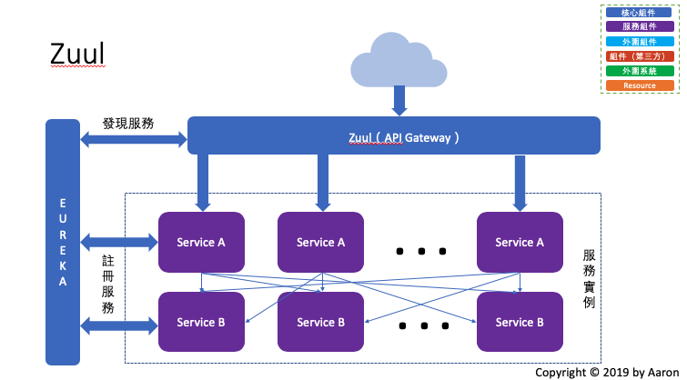
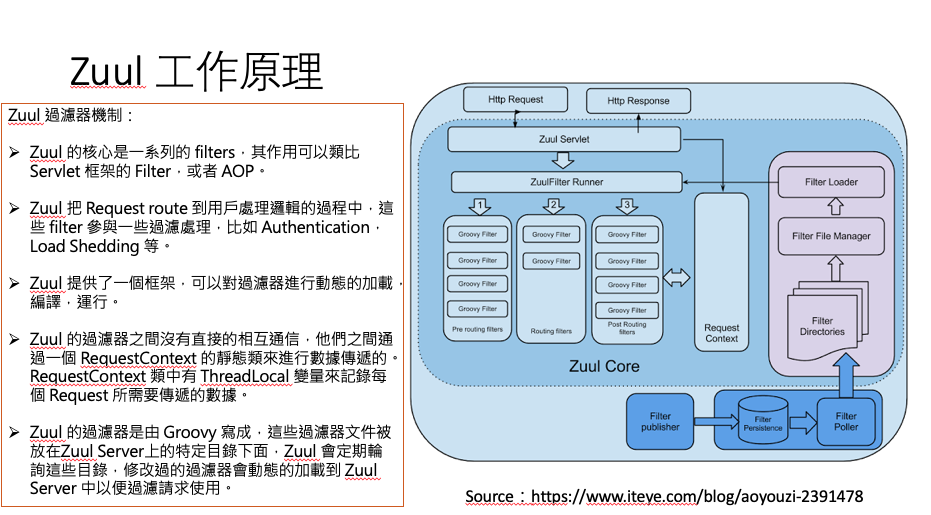
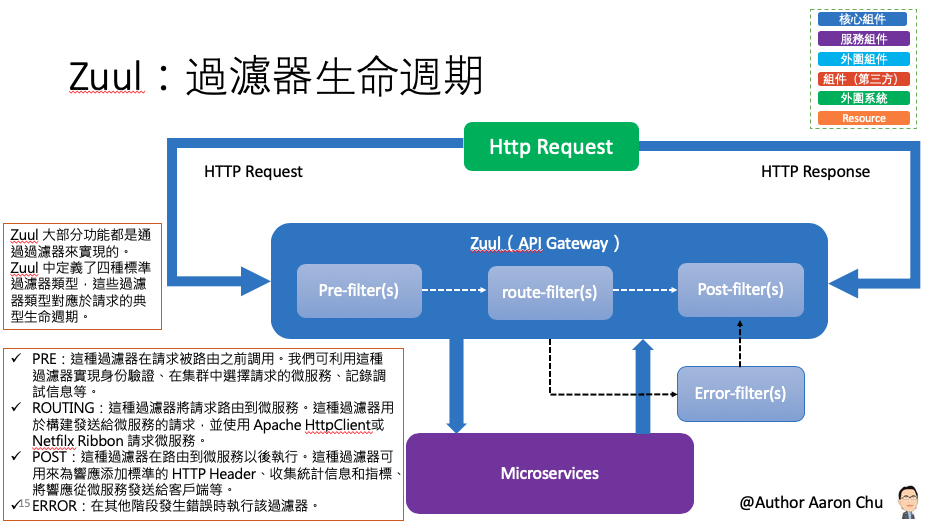


- Spring Cloud Zuul 路由是微服務架構的不可或缺的一部分，提供動態路由，監控，彈性，安全等的邊緣服務。Zuul是Netflix 出品的一個基於 JVM 路由和服務端的負載均衡器。Zuul 能夠與 Eureka、Ribbon、Hystrix 等組件合併使用。

###### Zuul 的核心是過濾器，通過這些過濾器就可以擴展很多功能，比如：
- 動態路由：動態將客戶端的請求路由到後端的不同服務，做一些邏輯處理。
- 請求監控：可以對整個系統的請求進行監控，紀錄詳細的請求響應日誌，可以實時統計出當前系統的訪問量以及監控狀態。
- 認證授權
- 壓力測試：通過 Zuul 可以動態地將請求轉發到後端服務集群；亦可辨識測試流量還是真實流量，從而做特殊處理。
- 灰度發布：確保整體系統穩定度。

## 參數
- Spring boot：2.0.6.RELEASE
- Spring cloud：Finchley.SR2
- Java：8
- 專案
    - aaron-zuul-demo：使用 Zuul 建構微服務網關
        - Main：App
        - Group id：com.aaron
        - Artifact id：aaron-zuul-demo
        - Version：0.0.1-SNAPSHOT
    - aaron-zuul-file-demo：文件上傳
        - Main：App
        - Group id：com.aaron
        - Artifact id：aaron-zuul-file-demo
        - Version：0.0.1-SNAPSHOT
- 服務依賴
    - aaron-eureka-server
    - aaron-eureka-client-user-service

## aaron-zuul-demo：使用 Zuul 建構微服務網關

###### 過濾器 4種 Type
- Pre：請求在路由之前被調用。適用於身份認證的場景，認證通過後在繼續下面的流程
- Route：在路由請求時被調用。適用於灰度發布唱景，在將要路由的時間加以增加自定義的邏輯。
- Post：在 Route 和 Error 過濾器之後被調用。這種過濾去請求路由到達到具體的服務之後執行。適用於添加響應頭，紀錄響應日誌等應用場景。
- Error：處理請求發生錯誤時調用。在執行過程中發送錯誤時會進入 error 過濾器，可以用來統一紀錄錯誤訊息。
###### 回退機制
- Zull 默認整合 Hystrix，當後端服務異常時可以為 Zuul 添加回退功能，返回默認的數據給客戶端。

### 開發
###### Zuul 路由配置
- 默認規則舉例：
    - API 網關地址：http://localhost:2103
    - 用戶服務名稱：sample-zuul-service
    - 用戶登陸接口：/user/login
那麼通過 Zuul 訪問登錄接口的規則為 `http://localhost:2103/sample-zuul-service/user/login`
- 指定具體服務路由
- application.properties
```
# 指定具體路由服務：為每一個服務都配置一個路由轉發規則
zuul.routes.aaron-auth-user-service.path=/api-house/**
zuul.routes.aaron-zuul-demo.url=forward:/local
```
- 指定路由前綴
```
# 路由前綴：於 API 前配置一個統一的前綴
zuul.prefix=/rest
```
- 本地跳轉
```
# 本地跳轉：Zuul 的 API 路由提供本地跳轉功能，通過 forward 就可以實現
zuul.routes.aaron-zuul-demo.path=/api/**
zuul.routes.aaron-zuul-demo.url=forward:/local
```

###### 使用過濾器
- IpFilter.java
```
public class IpFilter extends ZuulFilter {
    // IP黑名單列表
    private List<String> blackIpList = Arrays.asList("127.0.0.1");
    public IpFilter() {
        super();
    }
    
    // 是否執行過濾器，true 為執行，false 為不執行；可以利用配置中心來實現，達到動態的開啟和關閉過濾器
    @Override     
    public boolean shouldFilter() {
        return true;
    }
    
    // 過濾器類型，可選 pre、route、post、error
    @Override
    public String filterType() {
        return "pre";
    }
    
    // 過濾器執行優先順序；優先級數值越小，優先級越高
    @Override
    public int filterOrder() {
        return 1;
    }
```
###### 過濾器攔截請求    
- IpFilter.java
```
    // 過濾器攔截請求業務邏輯
    @Override
    public Object run() {
   RequestContext ctx = RequestContext.getCurrentContext();
	// forward:/local 的路由，ctx.setSendZuulResponse(false) 對 forward 無產生作用 
       ctx.setSendZuulResponse(false);
    /* 用來攔截本地轉發請求，當配置了 當 ctx.setSendZuulResponse(false) 對 forward:/local 是不起作用，
     * 因此需設定 ctx.set("sendForwardFilter.ran", true) 才行；
     * 透過 getRequest 的 set 賦予 Key/Value 
     */
    ctx.set("sendForwardFilter.ran", true); 
    ctx.setResponseBody("返回資訊");
    return null;
   }
}
```
###### 過濾器禁止本地轉發
- IpFilter.java
```
     // 禁止本地轉發；在多個過濾器時，只要前一個過濾器設置，後面過濾器可以依循，決定是否需要執行
    @Override
    public boolean shouldFilter() {
        RequestContext ctx = RequestContext.getCurrentContext();
        Object success = ctx.get("isSuccess");
        return success = null ? ture : Boolean.parseBoolean(success.toString());
    }
```
###### 過濾器中異常處理
- ErrorFilter.java
```
# 過濾器中異常處理
ublic class ErrorFilter extends ZuulFilter {

	private Logger log = LoggerFactory.getLogger(ErrorFilter.class);

	@Override
	public String filterType() {
		return "error";
	}

	@Override
	public int filterOrder() {
		return 100;
	}

	@Override
	public boolean shouldFilter() {
        // return 為 false 時，則此過濾器不再執行。
		return true;
	}

	@Override
	public Object run() {
		RequestContext ctx = RequestContext.getCurrentContext();
		Throwable throwable = ctx.getThrowable();
		log.error("Filter Erroe : {}", throwable.getCause().getMessage());
		return null;
	}

}
```
 
- application.properties
```
# 通過配置禁用過濾器；格式為 zuul.過濾器類別名稱，過濾氣類型.disable=true
# zuul.IpFilter.pre.disable=true
```
###### 過濾器中異常錯誤資訊返回統一格式制定
- ErrorHandlerController.java
```
@RestController
public class ErrorHandlerController implements ErrorController {

	@Autowired
	private ErrorAttributes errorAttributes;

	@Override
	public String getErrorPath() {
		return "/error";
	}

	@RequestMapping("/error")
	public ResponseData error(HttpServletRequest request) {
		Map<String, Object> errorAttributes = getErrorAttributes(request);
		String message = (String) errorAttributes.get("message");
		String trace = (String) errorAttributes.get("trace");
		if (StringUtils.isNotBlank(trace)) {
			message += String.format(" and trace %s", trace);
		}
		return ResponseData.fail(message, ResponseCode.SERVER_ERROR_CODE.getCode());
	}

	private Map<String, Object> getErrorAttributes(HttpServletRequest request) {
		return errorAttributes.getErrorAttributes(new ServletWebRequest(request), true);
	}

}
```

###### Zuul 容錯機制：當某個服務不可用時，可切換到其他可用的服務上，這時就需要有容錯機制。
- pom.xml
```
       # Zuu 中開啟容錯機制需要依賴 spring-retry
		<dependency>
			<groupId>org.springframework.retry</groupId>
			<artifactId>spring-retry</artifactId>
		</dependency>
```
- application.properties
```
# Zuul 容錯機制
zuul.retryable=true
ribbon.ConnectTimeout=1000
ribbon.ReadTimeout=1000
ribbon.MaxAutoRetries=1
ribbon.MaxAutoRetriesNextServer=3
ribbon.OkToRetryOnAllOperations=true
ribbon.retryableStatusCodes=500,404,502
```

###### Zuul 回退機制：Zuul 默認整合 Hystrix，當後端服務異常時看以為 Zuul 添加回退功能，返回默認的資料給客戶端。
- ServiceConsumerFallbackProvider.java
```
@Component
public class ServiceConsumerFallbackProvider implements FallbackProvider {
	
	private Logger log = LoggerFactory.getLogger(ServiceConsumerFallbackProvider.class);

	
	@Override
	public String getRoute() {
	    // 返回 * 表示對所有服務進行回退操作，如果只想對某個服務進行回退，則需要在返回上填寫回退的服務名稱（此名稱為 Eureka 的名稱）
		return "*";
	}

	@Override
	public ClientHttpResponse fallbackResponse(String route, Throwable cause) {
		return new ClientHttpResponse() {
			
			// 返回響應的狀態碼
			@Override
			public HttpStatus getStatusCode() throws IOException {
				return HttpStatus.OK;
			}

			@Override
			public int getRawStatusCode() throws IOException {
				return this.getStatusCode().value();
			}

			// 返回響應狀態碼對應的內容資料
			@Override
			public String getStatusText() throws IOException {
				return this.getStatusCode().getReasonPhrase();
			}

			@Override
			public void close() {

			}

			@Override
			public InputStream getBody() throws IOException {
				if (cause != null) {
					log.error("", cause.getCause());
				}
				ResponseData data = ResponseData.fail(route+"服務內部錯誤", ResponseCode.SERVER_ERROR_CODE.getCode());
				return new ByteArrayInputStream(JsonUtils.toJson(data).getBytes());
			}

			@Override
			public HttpHeaders getHeaders() {
				HttpHeaders headers = new HttpHeaders();
				MediaType mt = new MediaType("application", "json", Charset.forName("UTF-8"));
				headers.setContentType(mt);
				return headers;
			}
		};
	}
}
```

###### 啟用路由監控資訊及所有過濾器資訊（需結合 actuator）
- application.properties
```
# 當 @EnableZuulProxy 與 Spring Boot Actuator 配合使用時，Zuul 會暴露一個路由管理端點 /routes；借助這個端點，可以方便、直觀查看以及管理 Zuul 的路由。
# 路由監控資訊端點：/routes
# 過濾器資訊端點：/filters
management.endpoints.web.exposure.include=*
```

###### Zuul 自帶的 Debug 功能
```
public class DebugRequestFilter extends ZuulFilter {

	@Override
	public String filterType() {
		return "post";
	}

	// 數字越小，優先級越高
	@Override
	public int filterOrder() {
		return 1;
	}

	@Override
	public boolean shouldFilter() {
    // 當 return 為 false 時，則此過濾器不再執行。
		return true;
	}

	@Override
	public Object run() {
		HttpServletRequest req = (HttpServletRequest) RequestContext.getCurrentContext().getRequest();
		System.err.println("REQUEST:: " + req.getScheme() + " " + req.getRemoteAddr() + ":" + req.getRemotePort());
		StringBuilder params = new StringBuilder("?");
		// 獲取URL參數
		Enumeration<String> names = req.getParameterNames();
		if (req.getMethod().equals("GET")) {
			while (names.hasMoreElements()) {
				String name = (String) names.nextElement();
				params.append(name);
				params.append("=");
				params.append(req.getParameter(name));
				params.append("&");
			}
		}
		if (params.length() > 0) {
			params.delete(params.length() - 1, params.length());
		}
		System.err.println(
				"REQUEST:: > " + req.getMethod() + " " + req.getRequestURI() + params + " " + req.getProtocol());
		Enumeration<String> headers = req.getHeaderNames();
		while (headers.hasMoreElements()) {
			String name = (String) headers.nextElement();
			String value = req.getHeader(name);
			System.err.println("REQUEST:: > " + name + ":" + value);
		}
		final RequestContext ctx = RequestContext.getCurrentContext();
		// 獲取請求體參數
		if (!ctx.isChunkedRequestBody()) {
			ServletInputStream inp = null;
			try {
				inp = ctx.getRequest().getInputStream();
				String body = null;
				if (inp != null) {
					body = IOUtils.toString(inp);
					System.err.println("REQUEST:: > " + body);
				}
			} catch (IOException e) {
				e.printStackTrace();
			}
		}

		List<Pair<String, String>> headerList = RequestContext.getCurrentContext().getOriginResponseHeaders();
		for (Pair<String, String> pair : headerList) {
			System.err.println("RESPONSE HEADER:: > " + pair.second());
		}
		// 第一種，獲取響應結果
		/*
		 * try { Object zuulResponse =
		 * RequestContext.getCurrentContext().get("zuulResponse"); if (zuulResponse !=
		 * null) { RibbonHttpResponse resp = (RibbonHttpResponse) zuulResponse; String
		 * body = IOUtils.toString(resp.getBody()); System.err.println("RESPONSE:: > " +
		 * body); resp.close();
		 * RequestContext.getCurrentContext().setResponseBody(body); } } catch
		 * (IOException e) { e.printStackTrace(); }
		 */

		// 第二種，獲取響應結果
		InputStream stream = RequestContext.getCurrentContext().getResponseDataStream();
		try {
			if (stream != null) {
				String body = IOUtils.toString(stream);
				System.err.println("RESPONSE:: > " + body);
				RequestContext.getCurrentContext().setResponseBody(body);
			}

		} catch (IOException e) {
			e.printStackTrace();
		}
		return null;
	}
}
```
- application.properties
```
zuul.include-debug-header=true
zuul.debug.request=true
zuul.debug.parameter=zdebug
```

### 配置
- pom.xml
```
        # Zuul 配置
		<dependency>
			<groupId>org.springframework.cloud</groupId>
			<artifactId>spring-cloud-starter-netflix-zuul</artifactId>
		</dependency>
        # 集成 Eureka
		<dependency>
			<groupId>org.springframework.cloud</groupId>
			<artifactId>spring-cloud-starter-netflix-eureka-client</artifactId>
		</dependency> 
```
- application.properties
```
spring.application.name=aaron-zuul-demo
server.port=2103
```

### 測試
###### 測試路由轉發 `http://localhost:2103/google`
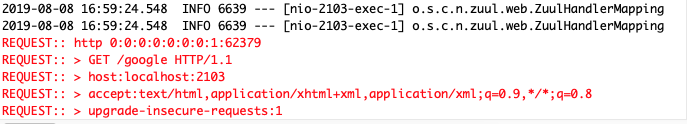
###### 指定具體服務路由 `http://localhost:2103/api-house/user/hello`
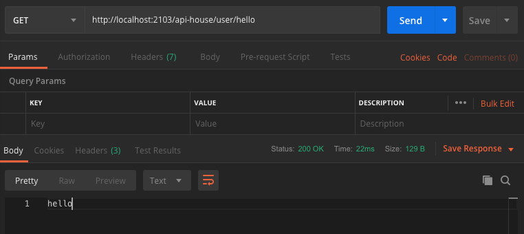
###### 指定路由前綴 `http://localhost:2103/rest/api-house/user/hello`
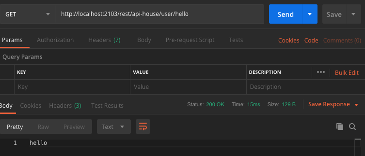
###### 本地跳轉 `http://localhost:2103/rest/api/aaron`
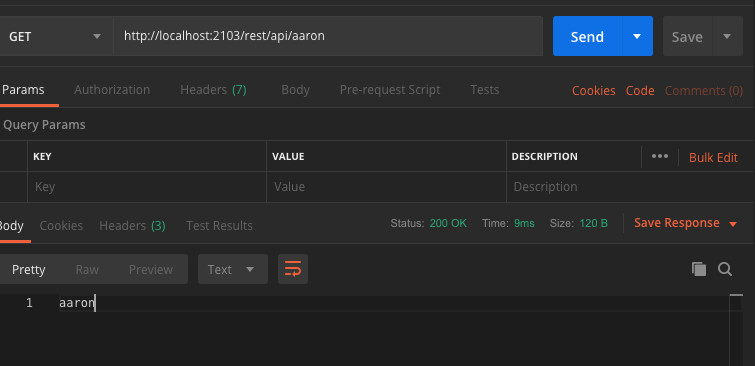
###### 測試過濾器異常處理 `http://localhost:2103/rest/api-house/user/hello`
    - IpFilter.java   
```
  // 增加 System.err.println(2/0)，以模擬 java.lang.ArithmeticException: by zero exceptio
  @Override
    public Object run() {
    	System.err.println(2/0);
        ....
     }        
```
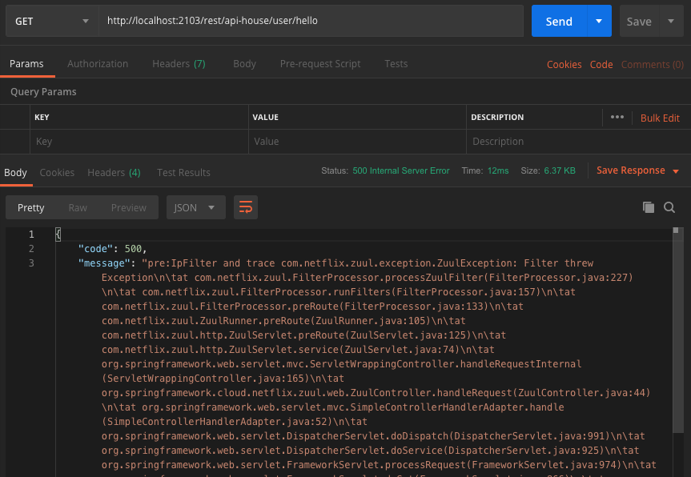
###### Zuul 容錯機制 `http://localhost:2103/rest/api-house/user/hello`
```
# 分別啟動兩個 aaron-eureka-client-user-service；port 為 8083、8084
# 默認 Ribbon 的轉發規則為是輪詢
```
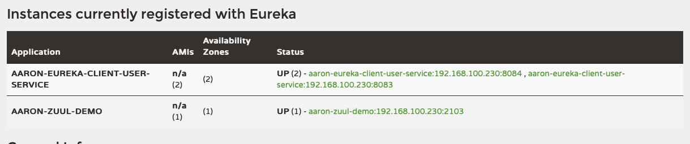
```
# 然後停掉其中一個 aaron-eureka-client-user-service 服務
# 至 application.properties 設置 zuul.retryable=false
# 重新啟動 aaron-zuul-demo 後，停掉一個 aaron-eureka-client-user-service，然後執行兩次則肯定有一次的調用是被轉發到停掉的服務上去，並且返回錯誤訊息。
```
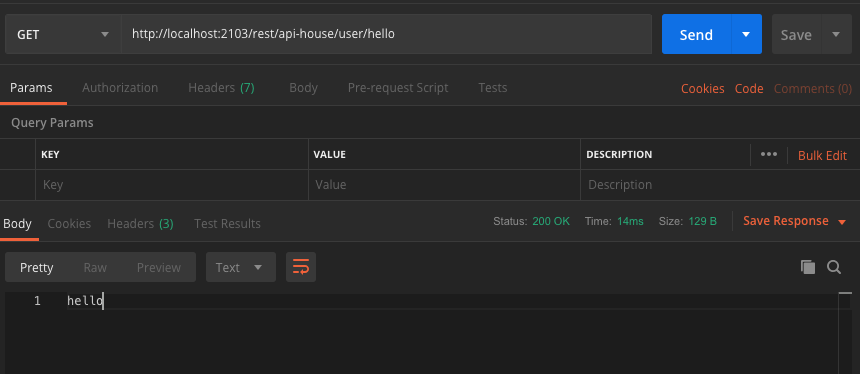
```
# 設置 zuul.retryable=false 後，重新啟動 aaron-zuul-demo
# 停掉一個 aaron-eureka-client-user-service，然後執行兩次，然這個時候則不會返回異常訊息，因為 Ribbon 會根據重試配置進行重試，當請求不可用時，會將請求重發到可用的服務上去。
```
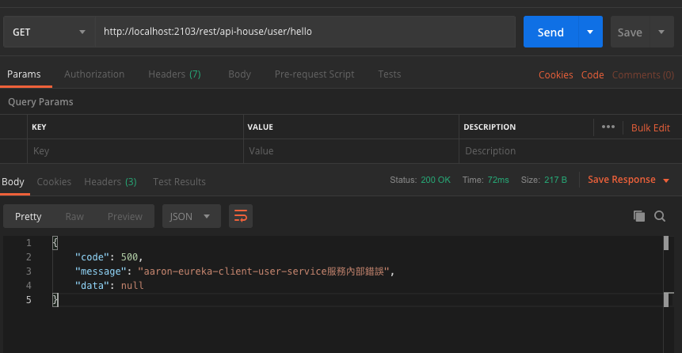

###### Zuul 回退機制 `http://localhost:2103/rest/api-house/user/hello`
```
# 停止 aaron-eureka-client-user-service 所有服務
```
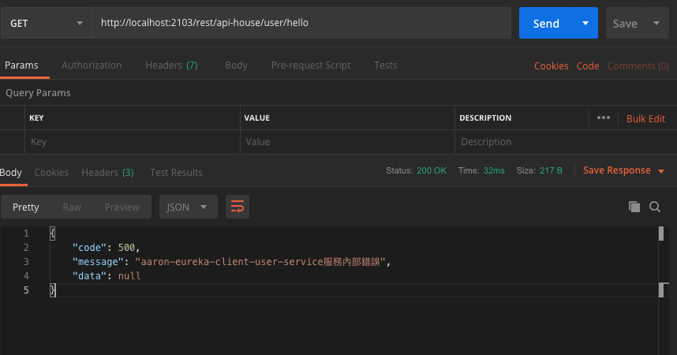

###### 啟用路由監控資訊及所有過濾器資訊（需結合 actuator）
`http://localhost:2103/actuator/routes`
```
# 路由監控資訊端點：/routes
{
    "/rest/google/**": "http://www.google.com",
    "/rest/api-house/**": "aaron-eureka-client-user-service",
    "/rest/api/**": "forward:/local"
}
```

`http://localhost:2103/actuator/filters`
```
# 過濾器資訊端點：/filters
{
    "error": [
        {
            "class": "org.springframework.cloud.netflix.zuul.filters.post.SendErrorFilter",
            "order": 0,
            "disabled": false,
            "static": true
        },
        {
            "class": "com.aaron.zuul_demo.filter.ErrorFilter",
            "order": 100,
            "disabled": false,
            "static": true
        }
    ],
    "post": [
        {
            "class": "com.aaron.zuul_demo.filter.DebugRequestFilter",
            "order": 1,
            "disabled": false,
            "static": true
        },
        {
            "class": "org.springframework.cloud.netflix.zuul.filters.post.SendResponseFilter",
            "order": 1000,
            "disabled": false,
            "static": true
        }
    ],
    "pre": [
        {
            "class": "org.springframework.cloud.netflix.zuul.filters.pre.Servlet30WrapperFilter",
            "order": -2,
            "disabled": false,
            "static": true
        },
        {
            "class": "org.springframework.cloud.netflix.zuul.filters.pre.ServletDetectionFilter",
            "order": -3,
            "disabled": false,
            "static": true
        },
        {
            "class": "org.springframework.cloud.netflix.zuul.filters.pre.PreDecorationFilter",
            "order": 5,
            "disabled": false,
            "static": true
        },
        {
            "class": "org.springframework.cloud.netflix.zuul.filters.pre.DebugFilter",
            "order": 1,
            "disabled": false,
            "static": true
        },
        {
            "class": "org.springframework.cloud.netflix.zuul.filters.pre.FormBodyWrapperFilter",
            "order": -1,
            "disabled": false,
            "static": true
        },
        {
            "class": "com.aaron.zuul_demo.filter.IpFilter",
            "order": 1,
            "disabled": false,
            "static": true
        }
    ],
    "route": [
        {
            "class": "org.springframework.cloud.netflix.zuul.filters.route.SimpleHostRoutingFilter",
            "order": 100,
            "disabled": false,
            "static": true
        },
        {
            "class": "org.springframework.cloud.netflix.zuul.filters.route.RibbonRoutingFilter",
            "order": 10,
            "disabled": false,
            "static": true
        },
        {
            "class": "org.springframework.cloud.netflix.zuul.filters.route.SendForwardFilter",
            "order": 500,
            "disabled": false,
            "static": true
        }
    ]
}
```

### 維運
- 服務接口 `http://localhost:2103/local/{id}`


## aaron-zuul-file-demo：文件上傳

### 開發
###### 文件上傳
- FileController.java
```
@RestController
public class FileController {

	@PostMapping("/file/upload")
	public String fileUpload(@RequestParam(value = "file") MultipartFile file) throws IOException {
		byte[] bytes = file.getBytes();
		File fileToSave = new File(file.getOriginalFilename());
		FileCopyUtils.copy(bytes, fileToSave);
		return fileToSave.getAbsolutePath();
	}
	
}
```
- application.properties
```
# 如果文件大小超過 1M 則要重新配置 Zuul 和上傳的服務都要加上配置
spring.servlet.multipart.max-file-size=1000Mb
spring.servlet.multipart.max-request-size=1000Mb
```

### 配置
- application.properties
```
spring.application.name=aaron-zuul-file-demo
server.port=2104
```

### 測試

###### 文件上傳 `http://localhost:2104/file/upload`
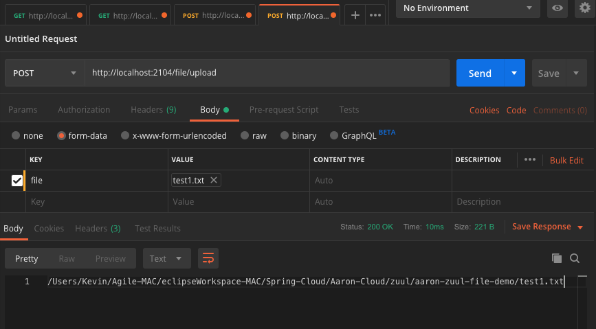

### 維運
- 服務接口 `POST http://localhost:2104/file/upload`